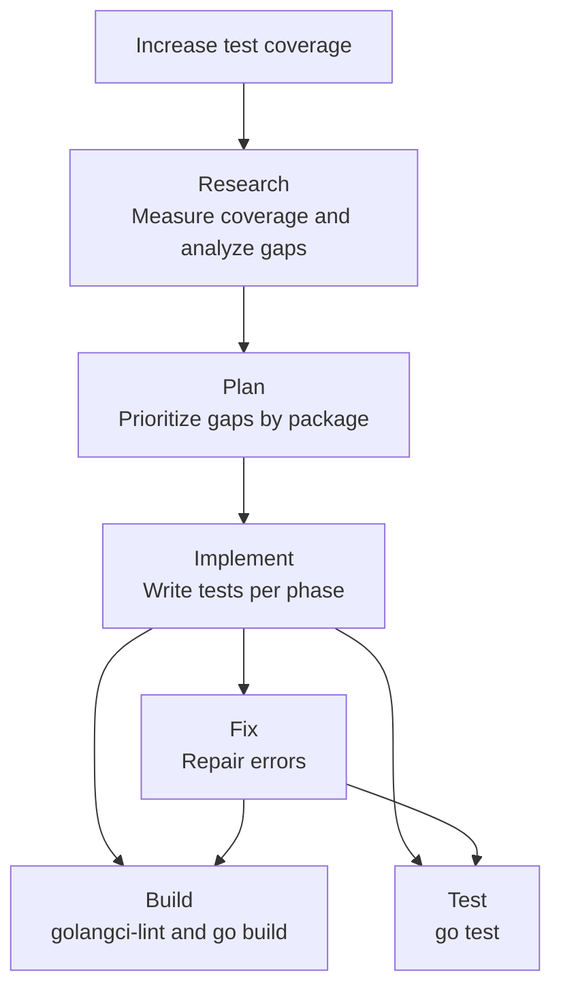

# Increase Test Coverage

## Primary Directive

Systematically increase Go test coverage to **100% per touched package**, preexisting code included, using a structured Research → Plan → Implement pipeline; every function that stays below 100% is named in the report with its reason. Generate comprehensive, buildable, passing tests that follow project conventions and use proper mocks for external dependencies.

All tests must:

- Compile and pass on the first run
- Use existing test helpers and patterns found in the codebase
- Mock external dependencies (GitLab API) via `httptest`
- Follow table-driven test patterns with `t.Run()` subtests
- Cover happy paths, edge cases, and error scenarios
- **Include documentation (doc comment) explaining what each test validates and why**
- **Be verified against false passes** (assertions that never fail)
- Be written in English per project language policy

## Execution Context

This skill is designed for the `Test Expert` agent or any agent tasked with increasing test coverage. It operates on Go codebases that use the standard `testing` package and `net/http/httptest`; this project has no `testify` dependency, so assertions are plain `t.Errorf` / `t.Fatalf`.

## Pipeline Overview



---

## Phase 1: Research

Thoroughly analyze the codebase and measure current coverage before writing any tests.

### Step 1: Measure Baseline Coverage

Run coverage analysis for the entire project:

```bash
go test -coverprofile=coverage.out ./...
go tool cover -func=coverage.out
```

Record the **per-package** and **per-function** coverage percentages. This is the baseline.

### Step 2: Generate HTML Coverage Report (Optional)

```bash
go tool cover -html=coverage.out -o coverage.html
```

Review the HTML report to visually identify uncovered code blocks.

### Step 3: Identify Coverage Gaps

For each package, analyze:

1. **Uncovered functions** — Functions with 0% coverage (highest priority)
2. **Partially covered functions** — Functions below 100% (error paths, edge cases, defensive branches)
3. **Untested branches** — Conditional logic where only one branch is covered
4. **Error handling paths** — `if err != nil` blocks that are never tested
5. **Edge cases** — Boundary conditions, nil inputs, empty slices, zero values

### Step 4: Discover Existing Test Patterns

Before writing any test, analyze the codebase for conventions:

| Convention | Where to Look |
|------------|---------------|
| Test helpers | `internal/testutil/helpers.go` — `testutil.NewTestClient()`, `testutil.RespondJSON()`, `testutil.RespondJSONWithPagination()`, `testutil.AssertRequestPath()`, `testutil.ForbiddenHandler()` |
| Mock patterns | How `httptest.NewServer` + `http.HandlerFunc` are used to mock GitLab API |
| Assertion style | Stdlib `t.Errorf`/`t.Fatalf` only (no `testify`) |
| Test naming | Pattern: `TestFunctionName_Scenario_ExpectedResult`; a `_test.go` is named after the module it tests (`make check-test-file-names`) |
| Table-driven tests | Look for `tests := []struct{}` or `cases := map[string]struct{}` patterns |
| File placement | Tests in same package (white-box) or `_test` package (black-box) |
| Pagination helpers | `testutil.PaginationHeaders` struct and `testutil.RespondJSONWithPagination()` |

### Step 5: Document Research Findings

Create a coverage analysis summary containing:

- Current overall coverage percentage
- Per-package coverage breakdown
- List of uncovered/partially covered functions ranked by priority
- Existing test patterns and helpers available
- Dependencies that need mocking (GitLab API endpoints)

---

## Phase 2: Plan

Create a phased implementation plan that prioritizes maximum coverage impact.

### Step 1: Prioritize Packages

Rank packages by coverage gap impact:

| Priority | Criteria |
|----------|----------|
| P0 — Critical | Core business logic with 0% coverage, `main()` included |
| P1 — High | Tool handlers, resource handlers below 80% |
| P2 — Medium | Helper functions, config loading below 100%: error paths and edge cases |
| P3 — Last | The remaining defensive branches: real inputs where one exists, seams where none does |

### Step 2: Group into Phases

Divide work into **2-5 phases**, each targeting a specific package or functional area:

```text
Phase 1: [package] — Current: X% → Target: 100%
  - TestFunctionA_HappyPath
  - TestFunctionA_ErrorCase
  - TestFunctionA_EdgeCase_EmptyInput
  ...

Phase 2: [package] — Current: X% → Target: 100%
  ...
```

### Step 3: Define Test Cases per Function

For each uncovered function, specify:

1. **Happy path** — Valid inputs producing expected outputs
2. **Error cases** — Invalid inputs, API failures (4xx, 5xx), network errors
3. **Edge cases** — Empty strings, zero values, nil pointers, large inputs
4. **Context cancellation** — Cancelled or timed-out contexts
5. **Pagination** — Multiple pages, empty results, single page

### Step 4: Identify Required Mocks

For each test, document:

- Which GitLab API endpoint needs mocking (method + path)
- Expected request body validation (if any)
- Response status code and JSON payload
- Pagination headers (if applicable)

### Step 5: Plan Structure

Present the plan to the user for confirmation before implementation. The plan should include:

- Phase breakdown with package targets
- Estimated number of new test functions per phase
- Expected coverage increase per phase
- New test helpers needed (if any)
- Total estimated coverage after all phases

---

## Phase 3: Implement

Execute the plan phase by phase, validating after each phase.

### Step 1: Implement One Phase at a Time

For each phase:

1. **Read source code** — Understand the function signatures, logic branches, and dependencies
2. **Write test file** — Create or extend `*_test.go` files following existing patterns
3. **Use existing helpers** — Reuse `testutil.NewTestClient()`, `testutil.RespondJSON()`, `testutil.RespondJSONWithPagination()`
4. **Create new helpers if needed** — Add to `internal/testutil` when several packages need them, otherwise keep them unexported in the package's own test file

### Step 2: Test Writing Patterns

#### Table-Driven Tests (Preferred)

```go
func TestFunctionName_Scenarios(t *testing.T) {
    tests := []struct {
        name       string
        input      InputType
        mockStatus int
        mockBody   string
        wantErr    bool
        want       OutputType
    }{
        {
            name:       "happy path",
            input:      InputType{Field: "value"},
            mockStatus: http.StatusOK,
            mockBody:   `{"id": 1, "name": "test"}`,
            want:       OutputType{ID: 1, Name: "test"},
        },
        {
            name:       "not found",
            input:      InputType{Field: "missing"},
            mockStatus: http.StatusNotFound,
            mockBody:   `{"message": "404 Not found"}`,
            wantErr:    true,
        },
        {
            name:       "empty input",
            input:      InputType{},
            mockStatus: http.StatusBadRequest,
            mockBody:   `{"error": "field required"}`,
            wantErr:    true,
        },
    }

    for _, tt := range tests {
        t.Run(tt.name, func(t *testing.T) {
            client := testutil.NewTestClient(t, http.HandlerFunc(func(w http.ResponseWriter, r *http.Request) {
                testutil.RespondJSON(w, tt.mockStatus, tt.mockBody)
            }))

            got, err := functionUnderTest(context.Background(), client, tt.input)
            if (err != nil) != tt.wantErr {
                t.Fatalf("error = %v, wantErr %v", err, tt.wantErr)
            }
            if !tt.wantErr && got != tt.want {
                t.Errorf("got %+v, want %+v", got, tt.want)
            }
        })
    }
}
```

#### Request Validation Mocks

When testing POST/PUT operations, validate the request:

```go
client := testutil.NewTestClient(t, http.HandlerFunc(func(w http.ResponseWriter, r *http.Request) {
    if r.Method != http.MethodPost {
        t.Errorf("method = %s, want POST", r.Method)
        http.Error(w, "unexpected method", http.StatusBadRequest)
        return
    }
    if r.URL.Path != "/api/v4/projects/42/issues" {
        t.Errorf("path = %s, want /api/v4/projects/42/issues", r.URL.Path)
        http.Error(w, "unexpected path", http.StatusBadRequest)
        return
    }
    testutil.RespondJSON(w, http.StatusCreated, `{...}`)
}))
```

#### Pagination Tests

```go
client := testutil.NewTestClient(t, http.HandlerFunc(func(w http.ResponseWriter, r *http.Request) {
    testutil.RespondJSONWithPagination(w, http.StatusOK, `[...]`, testutil.PaginationHeaders{
        Page:       "1",
        PerPage:    "20",
        Total:      "50",
        TotalPages: "3",
        NextPage:   "2",
    })
}))
```

#### Context Cancellation Tests

```go
func TestFunction_ContextCancelled(t *testing.T) {
    client := testutil.NewTestClient(t, http.HandlerFunc(func(w http.ResponseWriter, r *http.Request) {
        testutil.RespondJSON(w, http.StatusOK, `{}`)
    }))

    ctx, cancel := context.WithCancel(context.Background())
    cancel()

    _, err := functionUnderTest(ctx, client, input)
    if err == nil {
        t.Fatal("expected error for cancelled context, got nil")
    }
}
```

### Step 3: Validate After Each Phase

After writing tests for a phase:

1. **Compile**: `go build ./...`
2. **Static analysis**: `make golangci-lint`
3. **Run tests**: `go test -v ./internal/[package]/...`
4. **Measure coverage**: `go test -coverprofile=coverage.out ./internal/[package]/...`
5. **Check coverage**: `go tool cover -func=coverage.out | grep [package]`

If tests fail:

- Fix compilation errors immediately
- Adjust mock responses to match actual API behavior
- Verify test expectations match function implementation

### Step 4: Track Progress

After each phase, update progress:

```text
Package             Before    After     Target    Status
internal/tools      72%       100%      100%      ✅ Done
internal/gitlab     65%       —         100%      🔄 In Progress
internal/config     80%       —         100%      ⏳ Pending
internal/resources  70%       —         100%      ⏳ Pending
internal/prompts    68%       —         100%      ⏳ Pending
```

### Step 5: Final Validation

After all phases complete:

1. Run full test suite: `go test -race -coverprofile=coverage.out ./...`
2. Generate final coverage report: `go tool cover -func=coverage.out`
3. Verify every touched package is at 100%, or name each function below it with its reason
4. Run quality checks: `make golangci-lint`, `make check-test-subtests`, `make check-test-goroutines`, `make check-test-file-names`
5. Refresh `docs/development/testing/testing.md`: `go run ./cmd/gen_testing_docs/`
6. Verify the generated testing reference: `go run ./cmd/gen_testing_docs/ --check`
7. Lint the generated testing reference: `npx markdownlint-cli2 docs/development/testing/testing.md`
8. Clean up any temporary files

---

## Test Quality Standards

### What to Test

| Category | Examples |
|----------|----------|
| Happy path | Valid inputs → expected output |
| Error responses | 400, 401, 403, 404, 422, 500 from GitLab API |
| Empty results | Empty arrays, null fields, missing optional fields |
| Input validation | Required fields missing, invalid IDs, empty strings |
| Pagination | First page, last page, single page, many pages |
| Context | Cancelled context, timed-out context |
| Edge cases | Very long strings, special characters, unicode, zero values |

### What NOT to Test

- Third-party library internals (GitLab client SDK, MCP SDK)
- Trivial getters/setters with no logic
- Generated code (JSON schema tags, struct definitions)
- The Go standard library itself

### Test Quality Checklist

- [ ] Tests are independent — no shared mutable state between tests
- [ ] Tests are deterministic — same result every run
- [ ] Test names describe behavior: `TestFunction_Scenario_ExpectedResult`
- [ ] Each test has clear Arrange-Act-Assert sections
- [ ] Mock responses match real GitLab API response formats
- [ ] Error messages include context: `"functionName() expected error, got nil"`
- [ ] `t.Helper()` is called in all test helper functions
- [ ] `t.Cleanup()` is used for resource cleanup
- [ ] No hardcoded sleep or timing dependencies
- [ ] Tests run fast (< 1 second per test function)

---

## Coverage Targets

The house rule: a package touched by a change is driven to **100% statement coverage**, preexisting code included. Every function that stays below 100% is named in the report with the reason, and "defensive branch" is not a reason until a seam has been tried.

| Scope | Target |
|-------|--------|
| Every package the change touches | 100% |
| The repository as a whole (the CI gate) | 90% minimum; a floor, never the goal |

### Reaching the last branches

- **Real inputs first.** A crafted fixture, a specific declaration shape, a file that does not parse, a broken symlink: prefer any of these over a seam.
- **Seams for what a real input cannot reach.** A package-level function variable defaulting to the standard-library call, overridden in the test and restored with `t.Cleanup`:

  ```go
  var (
      walkDir      = filepath.WalkDir
      formatSource = format.Source
      writeFile    = os.WriteFile
  )
  ```

  Established in `cmd/godoc_tool/docgo.go` and `cmd/gen_stats/main.go`. Each seam carries a short doc comment naming the branch it exists for. Wrap a helper rather than aliasing `os.WriteFile` directly when gosec's taint analysis would otherwise re-home a finding onto a test file.
- **Tests run as root.** Permission bits make nothing fail. A read that must fail even for root uses a broken symlink (`os.Symlink` to a missing target); a write that must fail goes through a seam.
- **`main()` is covered, not exempt.** Extract `runMain(args []string, stdout, stderr io.Writer) int`, make `main()` the one line `osExit(runMain(os.Args, os.Stdout, os.Stderr))` with `var osExit = os.Exit`, and assert every exit code and message. Replace `os.Args` in the test so the flag set parses no test flags.
- **Never lift the number by other means.** No weakened assertions, no `//nolint`, no coverage pragmas, no branches deleted to make the figure. A provably dead branch is removed as a code change with its own justification, or made reachable by extracting it into a function a test can call directly.

## Case Completeness: Conditions and Mutants

Statement coverage says a line ran. It does not say a decision was taken both ways, and it does not say a test would notice the decision changing. Measured on this repository: `cmd/gen_stats` at 100% statement coverage still had ten conditions that were only ever true or only ever false, and five mutants no test reached. Go's own coverage cannot see either, because a compound `if a && b` is one block to it. Three steps close the gap, and a changed package passes all three before the work is done.

### 1. Derive the cases before writing them

For every decision in the changed code, write the case table first, then the tests that fill it:

- **A simple condition** (`if n > 0`): one case true, one false, and for a comparison the boundary itself and both neighbours (`0`, `1`, `-1`).
- **A compound condition** (`a && b`, `a || b`, `!a`, and their nestings): the MC/DC minimal set, N+1 cases for N conditions, each condition flipping the outcome on its own while the others hold. For `a && b`: (T,T) is the true case, (F,T) and (T,F) each falsify it through one condition. For `a || b`: (F,F) is the false case, (T,F) and (F,T) each satisfy it through one condition. Longer chains compose the same way, and short-circuit order decides which operand is even evaluated.
- **Every `if err != nil`**: one case where the error happens, driven by a real failure (a fixture that does not parse, a broken symlink, a refused connection, a cancelled context) or by a seam.
- **Every `switch` and type switch**: one case per arm and one for the default, including an arm no real input reaches, which is extracted into a function a test can call directly.
- **Loops**: zero iterations, one, several; and each `continue`, `break` and early `return` inside.
- **Inputs**: empty, whitespace, the boundary length, unicode, the maximum, nil and the zero value; first, middle, last and empty pages; the context cancelled before and during the call.

### 2. Measure the conditions with gobco

[gobco](https://github.com/rillig/gobco) instruments every boolean condition, `&&`, `||` and `!` operands included, and reports the ones never evaluated both ways:

```bash
make coverage-conditions PKG=./cmd/gen_stats
# Condition coverage: 156/166
# main.go:177:7: condition "lines > s.LargestTestLines" was 9 times true but never false
# main.go:355:17: condition "isE2E" was 29 times false but never true
```

Every reported line is a missing case from the table in step 1. The target is nothing reported. A condition that genuinely cannot take the other value is dead code: remove it as a code change, or extract it so a test can reach it; do not leave it as an accepted exception. gobco does not report a function never called at all (statement coverage does) and does not instrument `select`.

### 3. Prove the cases with mutation testing

A case can execute a decision and still not check it. [gremlins](https://github.com/go-gremlins/gremlins) rewrites one operator at a time (`>` to `>=`, `==` to `!=`, `&&` to `||`, `+` to `-`, `-x` to `x`, `i++` to `i--`) and reruns the tests; a mutant that survives is a decision no assertion pins:

```bash
make coverage-mutants PKG=./cmd/gen_stats
# Killed: 108, Lived: 0, Not covered: 12
# Test efficacy: 100.00%   Mutator coverage: 90.00%
```

The gate on a changed package is **Lived: 0 and Not covered: 0**. A lived mutant is fixed by strengthening the assertion that should have caught it, never by excluding the mutant. The not-covered mutants sit on the same lines gobco reports, so step 2 usually clears them. The target turns on `INVERT_LOGICAL` (`&&` to `||`, off by gremlins' default), which is the operator that proves each operand of a compound condition matters on its own; `GREMLINS_FLAGS` passes anything else, such as `-S l` to print only the lived mutants or `-E` to exclude generated files.

Both tools run through `go run` with the version pinned in the Makefile; `go install github.com/rillig/gobco@v1.3.4` and `go install github.com/go-gremlins/gremlins/cmd/gremlins@v0.6.0` keep them on the path for repeated use. Neither runs in CI: they are the last two steps of the coverage work on a package, and their results go in the pull request beside the coverage figure.

---

## Troubleshooting

### Tests don't compile

- Check import paths match the module path in `go.mod`
- Verify test file is in the correct package (same as source file)
- Ensure mock response JSON matches expected struct field names
- Run `make golangci-lint` for quick diagnostics

### Tests fail unexpectedly

- Print actual vs expected values with `%+v` formatting
- Check mock handler serves the correct URL path and method
- Verify GitLab API response format (field names are snake_case in JSON)
- Check if function under test modifies input struct

### Coverage doesn't increase

- Ensure test exercises the uncovered code path (check HTML report)
- Look for unreachable code or dead branches
- Some error paths require specific mock setups (e.g., network errors)
- Test both `if` and `else` branches of conditionals

### Race conditions detected

- Use `go test -race ./...` to detect data races
- Ensure tests don't share mutable state
- Use `t.Parallel()` carefully — only when tests are truly independent
- Check that test helpers don't store state across calls

## Assertions off the test goroutine (MANDATORY)

Never call `t.Fatal`/`t.Fatalf`/`t.FailNow` inside an `httptest` handler, a
`go` statement, an errgroup task, or an MCP tool handler — it kills only that
goroutine and truncates the response. Follow the six-rule contract in
`.github/instructions/test-goroutines.instructions.md` (t.Errorf + response +
return, or record with atomics and assert on the test goroutine). Verify with
`make check-test-goroutines`.

## Case loops and file names (gated in CI)

- Every case table runs under `t.Run`: a range over a slice or map literal that
  asserts must open one subtest per case, named by the `name` field, the string
  element, or the map key. `go run ./cmd/audit_test_subtests/ -fix` rewrites the
  unambiguous shapes; `// sequential: <reason>` on the line above a loop declares
  dependent steps rather than cases. `make check-test-subtests` gates it.
- A `_test.go` file exists only under the name of a module it tests
  (`branches.go` has `branches_test.go`, `merge_requests.go` has
  `merge_requests_test.go`); `make check-test-file-names` gates it.
- Refresh the generated testing reference when done: `go run ./cmd/gen_testing_docs/`,
  then `go run ./cmd/gen_testing_docs/ --check`.
