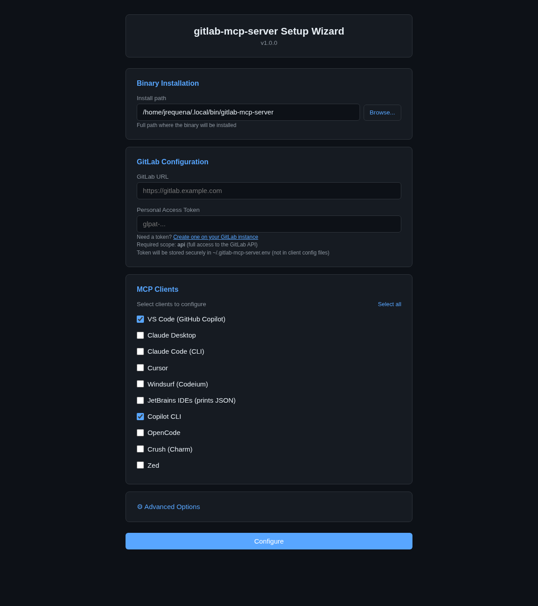

# Gitlab MCP

A **Model Context Protocol (MCP) server** that exposes GitLab operations as MCP tools, resources, and prompts for AI assistants. Written in Go — single static binary per platform.

## Table of Contents

- [Gitlab MCP](#gitlab-mcp)
  - [Table of Contents](#table-of-contents)
  - [Highlights](#highlights)
  - [Quick Start](#quick-start)
    - [1. Download](#1-download)
    - [2. Run the Setup Wizard](#2-run-the-setup-wizard)
      - [Windows](#windows)
      - [Linux](#linux)
      - [macOS](#macos)
  - [What Can You Do With It?](#what-can-you-do-with-it)
  - [Tool Modes](#tool-modes)
    - [Individual Tools (1004 tools)](#individual-tools-1004-tools)
    - [Meta-Tools (40 base / 59 enterprise)](#meta-tools-40-base--59-enterprise)
  - [Project Structure](#project-structure)
  - [Documentation](#documentation)
  - [Tech Stack](#tech-stack)
  - [Building from Source](#building-from-source)
  - [Docker](#docker)
    - [Quick Start](#quick-start-1)
    - [Docker Compose](#docker-compose)
    - [Configuration](#configuration)
    - [Health Check](#health-check)

## Highlights

- **1004 MCP tools** — complete GitLab REST API v4 coverage across 162 domain sub-packages: projects, branches, tags, releases, merge requests, issues, pipelines, jobs, groups, users, wikis, environments, deployments, packages, container registry, runners, feature flags, CI/CD variables, templates, admin settings, access tokens, deploy keys, and more
- **40 meta-tools** (59 with `GITLAB_ENTERPRISE=true`) — domain-grouped dispatchers that reduce token overhead for LLMs (optional, enabled by default). 19 additional enterprise meta-tools available for Premium/Ultimate features
- **11 sampling tools** — LLM-assisted code review, issue analysis, pipeline failure diagnosis, security review, release notes, milestone reports, and more via MCP sampling capability
- **4 elicitation tools** — interactive creation wizards (issue, MR, release, project) with step-by-step user prompts
- **24 MCP resources** — read-only data: user, groups, group members, group projects, projects, issues, pipelines, members, labels, milestones, branches, MRs, releases, tags, workspace roots, and 5 workflow best-practice guides
- **38 MCP prompts** — AI-optimized: code review, pipeline status, risk assessment, release notes, standup, workload, user stats, team management, cross-project dashboards, analytics, milestones, audit
- **6 MCP capabilities** — logging, completions, roots, progress, sampling, elicitation
- **43 tool icons** — SVG data-URI icons on all tools, resources, and prompts for visual identification in MCP clients
- **Pagination** on all list endpoints with metadata (total items, pages, next/prev)
- **Transports**: stdio (default for desktop AI) and HTTP (Streamable HTTP for remote clients)
- **Cross-platform**: Windows, Linux & macOS, amd64 & arm64
- **Self-hosted GitLab** with self-signed TLS certificate support

## Quick Start

### 1. Download

Download the latest binary for your platform from [Releases](../../releases):

| Platform              | Binary                            |
| --------------------- | --------------------------------- |
| Linux amd64           | `gitlab-mcp-server-linux-amd64`       |
| Linux arm64           | `gitlab-mcp-server-linux-arm64`       |
| Windows amd64         | `gitlab-mcp-server-windows-amd64.exe` |
| Windows arm64         | `gitlab-mcp-server-windows-arm64.exe` |
| macOS Intel (amd64)   | `gitlab-mcp-server-darwin-amd64`      |
| macOS Apple Silicon   | `gitlab-mcp-server-darwin-arm64`      |

Make it executable on Linux/macOS:

```bash
chmod +x gitlab-mcp-server-linux-amd64
```

### 2. Run the Setup Wizard

The binary includes a built-in **Setup Wizard** that configures everything: GitLab connection, token, and MCP client config files — all in one step.

#### Windows

**Double-click** the `.exe` file. The wizard opens automatically in your browser.

Or from a terminal:

```powershell
.\gitlab-mcp-server-windows-amd64.exe --setup
```

#### Linux

```bash
./gitlab-mcp-server-linux-amd64 --setup
```

#### macOS

```bash
./gitlab-mcp-server-darwin-arm64 --setup
```

The wizard auto-detects the best UI available:

1. **Web UI** (default) — opens in your browser with a visual form
2. **Terminal UI** — interactive Bubble Tea interface (if browser is unavailable)
3. **Plain CLI** — text prompts (universal fallback)

You can force a specific mode:

```bash
gitlab-mcp-server --setup -setup-mode web   # Browser-based UI
gitlab-mcp-server --setup -setup-mode tui   # Terminal UI
gitlab-mcp-server --setup -setup-mode cli   # Plain text prompts
```

<p align="center">
  
</p>


The wizard supports **10 MCP clients**: VS Code (GitHub Copilot), Claude Desktop, Claude Code, Cursor, Windsurf, JetBrains IDEs, Copilot CLI, OpenCode, Crush, and Zed.

After setup, open your AI client and try: _"List my GitLab projects"_

> **Manual configuration**: If you prefer to configure clients manually, see [Configuration](docs/configuration.md#mcp-client-configuration-manual) for JSON examples per client.

## What Can You Do With It?

Once connected, just talk to your AI assistant in natural language. Here are some things you can try in your first 5 minutes:

**Explore your projects:**

> "List my GitLab projects"
> "Show me the branches in project my-app"
> "What's in the README of project 42?"

**Work with merge requests:**

> "Show me open merge requests in my-app"
> "Create a merge request from feature-login to main"
> "Review merge request !15 — is it safe to merge?"

**Track issues and pipelines:**

> "List open issues assigned to me"
> "What's the pipeline status for project 42?"
> "Why did the last pipeline fail?"

**Generate reports:**

> "Generate release notes from v1.0 to v2.0"
> "Give me a daily standup summary"
> "Assess the risk of merge request !23"

The server handles the translation from your natural language to GitLab API calls. You do not need to know project IDs, API endpoints, or JSON syntax — the AI assistant figures that out for you.

See [Usage Examples](docs/examples/usage-examples.md) for more scenarios.

## Tool Modes

gitlab-mcp-server supports two tool registration modes, controlled by the `META_TOOLS` environment variable:

### Individual Tools (1004 tools)

Set `META_TOOLS=false` to register all 1004 tools as separate MCP endpoints across 162 domain sub-packages. Each GitLab operation has its own tool with a dedicated name.

### Meta-Tools (40 base / 59 enterprise)

Set `META_TOOLS=true` (or omit — default) to register 40 domain meta-tools (or 59 with `GITLAB_ENTERPRISE=true`). Each meta-tool groups related operations under a single tool with an `action` parameter. This reduces the number of tools the LLM must evaluate, lowering token usage while preserving full functionality.

| Meta-Tool                    | Domain                                                       |
| ---------------------------- | ------------------------------------------------------------ |
| `gitlab_project`             | Projects, uploads, hooks, badges, boards, import/export, pages |
| `gitlab_branch`              | Branches, protected branches                                 |
| `gitlab_tag`                 | Tags, protected tags                                         |
| `gitlab_release`             | Releases, release links                                      |
| `gitlab_merge_request`       | MR CRUD, approvals, context-commits                          |
| `gitlab_mr_review`           | MR notes, discussions, drafts, changes                       |
| `gitlab_repository`          | Repository tree/compare, commit discussions, files            |
| `gitlab_group`               | Groups, members, labels, milestones, boards, uploads          |
| `gitlab_issue`               | Issues, notes, discussions, links, statistics, emoji, events  |
| `gitlab_pipeline`            | Pipelines, pipeline triggers                                 |
| `gitlab_job`                 | Jobs, job token scope                                        |
| `gitlab_user`                | Users, events, notifications, keys, namespaces               |
| `gitlab_wiki`                | Project/group wikis                                          |
| `gitlab_environment`         | Environments, protected envs, freeze periods                 |
| `gitlab_deployment`          | Deployments                                                  |
| `gitlab_pipeline_schedule`   | Pipeline schedules, schedule variables                       |
| `gitlab_ci_variable`         | CI/CD variables (project, group, instance)                   |
| `gitlab_template`            | CI/CD, Dockerfile, gitignore templates                       |
| `gitlab_admin`               | Server settings, broadcasts, error tracking, terraform, etc. |
| `gitlab_access`              | Access tokens, deploy tokens, deploy keys, invites           |
| `gitlab_package`             | Packages, container registry                                 |
| `gitlab_snippet`             | Snippets, snippet discussions                                |
| `gitlab_feature_flags`       | Feature flags, feature flag user lists                       |
| `gitlab_search`              | Global, project, group search                                |
| `gitlab_runner`              | Runners, runner management                                   |
| `gitlab_summarize_issue`     | LLM-powered issue summarization (sampling)                   |
| `gitlab_analyze_mr_changes`  | LLM-powered MR analysis (sampling)                           |
| `gitlab_generate_release_notes` | LLM-powered release notes generation (sampling)           |
| `gitlab_analyze_pipeline_failure` | LLM-powered pipeline failure analysis (sampling)        |
| `gitlab_summarize_mr_review` | LLM-powered MR review summarization (sampling)              |
| `gitlab_generate_milestone_report` | LLM-powered milestone report generation (sampling)    |
| `gitlab_analyze_ci_configuration` | LLM-powered CI configuration analysis (sampling)       |
| `gitlab_analyze_issue_scope` | LLM-powered issue scope analysis (sampling)                  |
| `gitlab_review_mr_security`  | LLM-powered MR security review (sampling)                    |
| `gitlab_find_technical_debt` | LLM-powered technical debt detection (sampling)              |
| `gitlab_analyze_deployment_history` | LLM-powered deployment history analysis (sampling)  |

> **Full reference**: See [docs/meta-tools.md](docs/meta-tools.md) for action lists and examples.

## Project Structure

```text
gitlab-mcp-server/
+-- cmd/server/              # Entry point (main.go)
+-- internal/
|   +-- config/              # Environment variable configuration
|   +-- gitlab/              # GitLab API client wrapper
|   +-- serverpool/          # HTTP mode: bounded LRU pool of per-token MCP servers
|   +-- toolutil/            # Shared tool utilities (errors, pagination, markdown, logging)
|   +-- testutil/            # Shared test helpers (NewTestClient, RespondJSON)
|   +-- tools/               # MCP tool handlers (1004 tools / 40-59 meta-tools)
|   +-- resources/           # MCP resource handlers (24 resources)
|   +-- prompts/             # MCP prompt handlers (38 prompts)
|   +-- completions/         # Autocomplete for prompts and resource URIs
|   +-- logging/             # Structured MCP session logging
|   +-- roots/               # Client workspace root tracking
|   +-- progress/            # Progress notification tracking
|   +-- sampling/            # LLM-assisted analysis via MCP sampling
|   +-- elicitation/         # Interactive user input via MCP elicitation
+-- test/e2e/                # End-to-end integration tests
+-- docs/                    # Documentation
+-- Makefile                 # Build automation
+-- .gitlab-ci.yml           # CI/CD pipeline
```

## Documentation

| Document                                           | Description                                               |
| -------------------------------------------------- | --------------------------------------------------------- |
| [Architecture](docs/architecture.md)               | System architecture, component design, and data flow      |
| [Configuration](docs/configuration.md)             | Environment variables, transport modes, TLS, client setup |
| [Tools Reference](docs/tools/README.md)            | All 1004 individual tools with input/output schemas       |
| [Meta-Tools Reference](docs/meta-tools.md)         | 40/59 domain meta-tools with action dispatching           |
| [Tools (per domain)](docs/tools/README.md)         | Detailed docs per meta-tool + sampling/elicitation tools  |
| [Resources Reference](docs/resources-reference.md) | All 24 resources with URI templates                       |
| [Prompts Reference](docs/prompts-reference.md)     | All 38 prompts with arguments and output format           |
| [Capabilities](docs/capabilities.md)               | 6 MCP capabilities: logging, completions, roots, etc.     |
| [Auto-Update](docs/auto-update.md)                 | Self-update mechanism, modes, MCP tools, release format   |
| [Security](docs/security.md)                       | Security model, token scopes, input validation            |
| [Usage Examples](docs/examples/usage-examples.md)  | Real-world MCP usage scenarios                            |
| [Development Guide](docs/development/development.md) | Building, testing, CI/CD, adding tools, contributing      |
| [ADRs](docs/adr/)                                  | Architectural Decision Records                            |

## Tech Stack

| Component     | Technology                                      |
| ------------- | ----------------------------------------------- |
| Language      | Go 1.26+                                        |
| MCP SDK       | `github.com/modelcontextprotocol/go-sdk` v1.5.0 |
| GitLab Client | `gitlab.com/gitlab-org/api/client-go/v2` v2.17.0   |
| Transport     | stdio (default), HTTP (Streamable HTTP)         |
| CI/CD         | GitLab CI with lint  test  build pipeline       |

## Building from Source

If you prefer to compile from source instead of using pre-built binaries:

```bash
git clone <repository-url>
cd gitlab-mcp-server
make build
```

See the [Development Guide](docs/development/development.md) for full build instructions, cross-compilation targets, and contributing guidelines.

## Docker

### Quick Start

Pull and run the pre-built image from the GitLab Container Registry — **no source code required**:

```bash
# Pull the latest image
docker pull ghcr.io/jmrplens/gitlab-mcp-server:latest

# Run in HTTP mode
docker run -d --name gitlab-mcp-server -p 8080:8080 \
  -e GITLAB_URL=https://gitlab.example.com \
  -e GITLAB_SKIP_TLS_VERIFY=true \
  ghcr.io/jmrplens/gitlab-mcp-server:latest
```

Each client authenticates by sending its own `GITLAB_TOKEN` via the `PRIVATE-TOKEN` header or `Authorization: Bearer` header.

### Docker Compose

Download `docker-compose.yml` from this repository and create a `.env` file (see `.env.example`):

```bash
cp .env.example .env
# Edit .env with your values

docker compose up -d
```

The Compose file uses the pre-built image by default. No build step needed.

### Configuration

| Environment Variable       | Default | Description                                             |
| -------------------------- | ------- | ------------------------------------------------------- |
| `GITLAB_URL`               | —       | GitLab instance URL (**required**)                      |
| `GITLAB_SKIP_TLS_VERIFY`   | `false` | Skip TLS certificate verification for self-signed certs |
| `META_TOOLS`               | `true`  | Enable meta-tools for tool discovery                    |
| `GITLAB_ENTERPRISE`        | `false` | Enable Enterprise/Premium meta-tools                    |
| `GITLAB_READ_ONLY`         | `false` | Expose only read-only tools                             |

### Health Check

The container exposes a health endpoint at `GET /health`:

```json
{"status": "ok", "version": "1.8.0", "commit": "abc1234"}
```

Docker Compose healthcheck is pre-configured. For custom setups:

```bash
curl -f http://localhost:8080/health
```

> For building the Docker image from source, publishing to the registry, and development workflows, see the [Development Guide](docs/development/development.md#docker).
