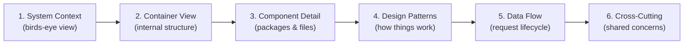
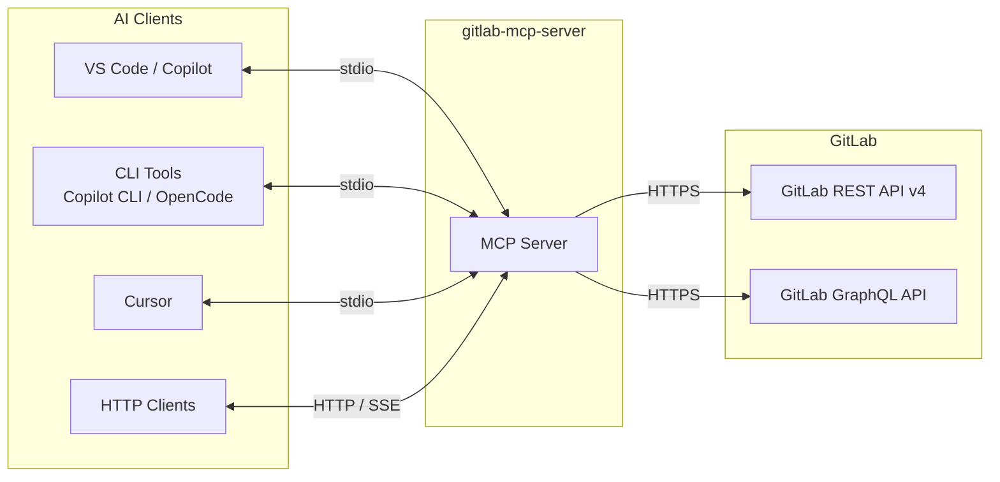
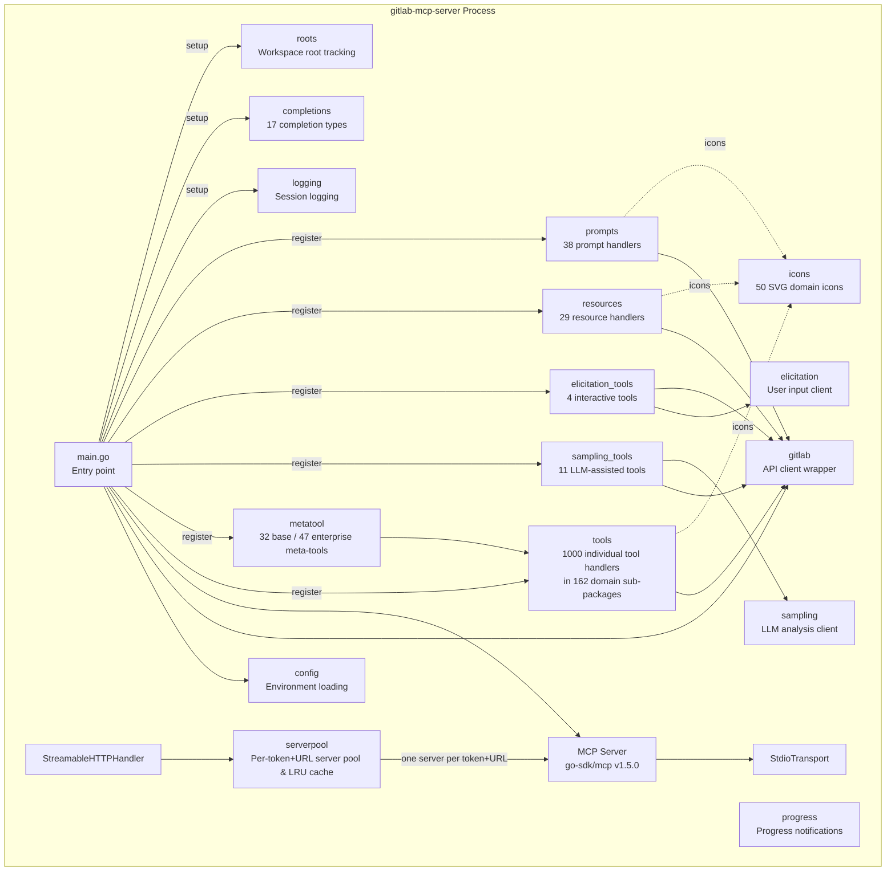
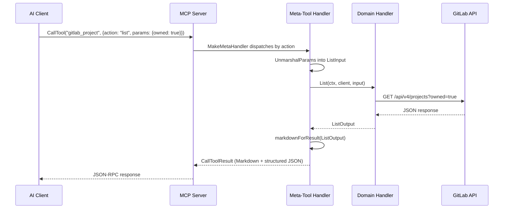
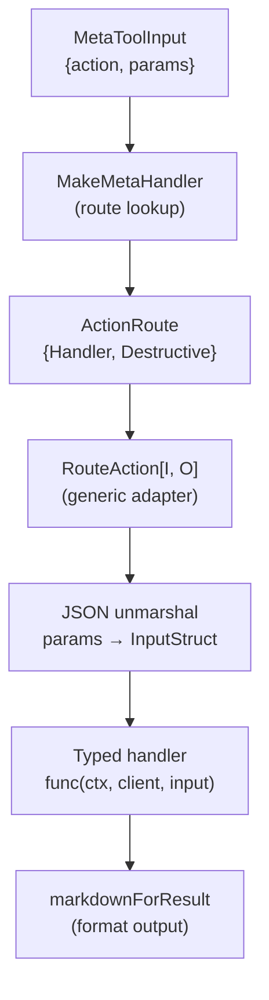
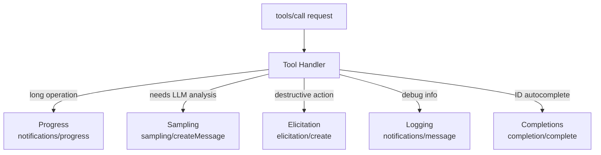
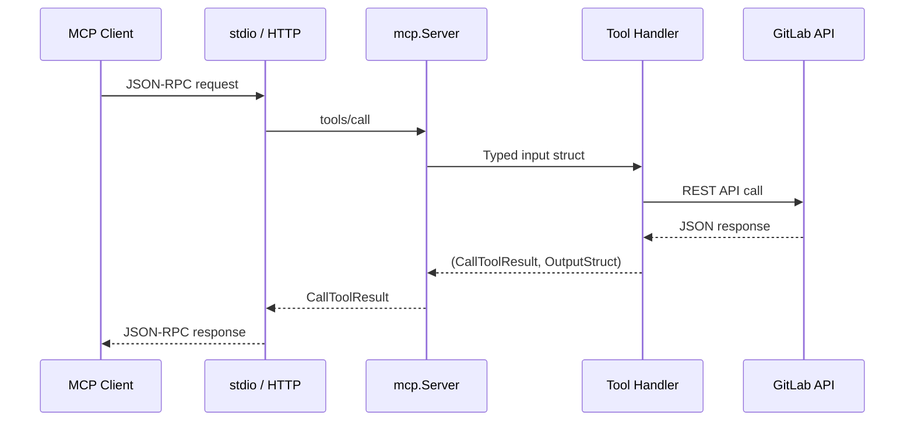
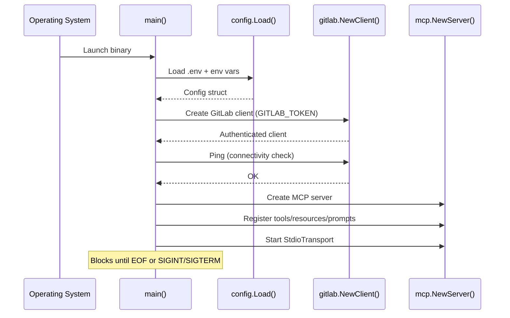
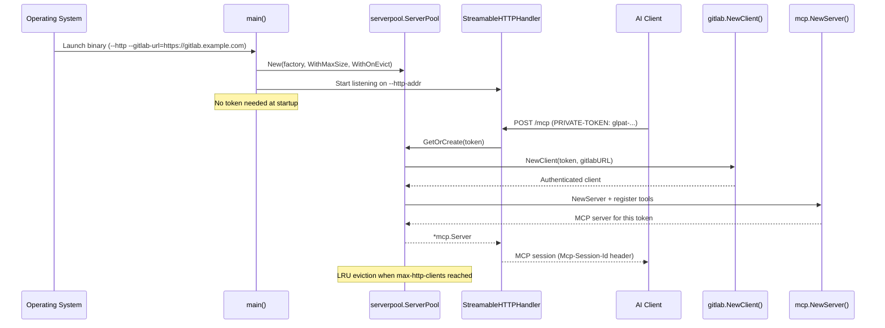

# Architecture Overview

This document describes the system architecture of gitlab-mcp-server, a Model Context Protocol (MCP) server that bridges AI assistants to the GitLab REST API v4.

> **Diataxis type**: Explanation
> **Audience**: 👤🔧 All users
> **Prerequisites**: Familiarity with Go, REST APIs, and basic MCP concepts
> 📖 **User documentation**: See the [Architecture](https://jmrplens.github.io/gitlab-mcp-server/architecture/) on the documentation site for a user-friendly version.

---

## How to Read This Architecture

This document follows the [C4 Model](https://c4model.com/) for software architecture documentation, progressing from high-level context to detailed component design:

1. **System Context** — What the system does and what it connects to
2. **Container View** — Major runtime components inside the process
3. **Component Detail** — Individual packages, their responsibilities, and public APIs
4. **Design Patterns** — Recurring patterns and their rationale
5. **Data Flow** — Request lifecycle and startup sequence
6. **Cross-Cutting Concerns** — Error handling, logging, pagination, security



## System Context



AI clients communicate with gitlab-mcp-server using the MCP protocol over stdio or HTTP. The server translates MCP requests into GitLab API calls (REST for ~155 domains, GraphQL for 7 domains) and returns structured responses. See [GraphQL Integration](graphql.md) for details on which domains use GraphQL and why.

## Container View



## Component Detail

### Entry Point (`cmd/server`)

The `main()` function supports two runtime modes:

**Stdio mode** (default):

1. Parses CLI flags (`--http` is absent)
2. Loads configuration from environment variables via `config.Load()`
3. Creates an authenticated GitLab client via `gitlabclient.NewClient()`
4. Validates GitLab connectivity with `client.Ping()`
5. Creates a single MCP server via `mcp.NewServer()`
6. Registers tools, resources, and prompts
7. Starts `StdioTransport` and blocks until EOF or SIGINT/SIGTERM

**HTTP mode** (`--http` flag):

1. Parses CLI flags (`--http`, `--gitlab-url`, `--http-addr`, `--max-http-clients`, `--session-timeout`, `--trusted-proxy-header`, etc.)
2. Creates a `serverpool.ServerPool` with a factory function
3. On each request, extracts the token and GitLab URL from headers, calls `pool.GetOrCreate(token, gitlabURL)` to get or create a per-token+URL MCP server
4. The pool factory creates a GitLab client + MCP server + registers all tools for that token and GitLab instance
5. LRU eviction closes the oldest session when `--max-http-clients` is reached
6. Starts `StreamableHTTPHandler` and blocks until SIGINT/SIGTERM

### Configuration (`internal/config`)

Loads settings from environment variables with optional `.env` file support (via `godotenv`). Used by **stdio mode** to validate that required variables (`GITLAB_URL`, `GITLAB_TOKEN`) are present. HTTP mode uses CLI flags instead (see Transport Selection).

| Variable                 | Required | Default | Description                                          |
| ------------------------ | -------- | ------- | ---------------------------------------------------- |
| `GITLAB_URL`             | Stdio    | —       | GitLab instance base URL                             |
| `GITLAB_TOKEN`           | Stdio    | —       | Personal Access Token with `api` scope               |
| `GITLAB_SKIP_TLS_VERIFY` | No       | `false` | Skip TLS certificate verification                    |
| `META_TOOLS`             | No       | `true`  | Use meta-tools instead of individual tools            |
| `ISSUE_REPORTS`          | No       | `false` | Auto-generate GitLab issues on tool errors            |
| `YOLO_MODE`              | No       | `false` | Skip destructive action confirmations                |
| `UPLOAD_MAX_FILE_SIZE`   | No       | `2GB`   | Maximum allowed upload file size                     |

### GitLab Client (`internal/gitlab`)

Thin wrapper around the official `gitlab.com/gitlab-org/api/client-go/v2` library. Handles:

- Authentication via Personal Access Token
- TLS configuration (skip verification for self-signed certificates)
- Connectivity validation (`Ping()` calls the GitLab version endpoint)
- Exposes the underlying `*gl.Client` via `GL()` for tool handlers

### Tools (`internal/tools`)

The largest package — contains 1000 MCP tool implementations organized across 162 domain sub-packages under `internal/tools/`. Each sub-package owns its types, handlers, Markdown formatters, and registration functions.

**Orchestration files** in `internal/tools/`:

| File               | Purpose                                                       |
| ------------------ | ------------------------------------------------------------- |
| `register.go`      | `RegisterAll()` — delegates to sub-package `RegisterTools()`  |
| `register_meta.go` | `RegisterAllMeta()` — 24 inline + 3 delegated + 1 standalone + 4 interactive (+ 15 enterprise inline) |
| `metatool.go`      | Re-exports from `toolutil`: `makeMetaHandler`, `addMetaTool`, `addReadOnlyMetaTool`   |
| `markdown.go`      | `markdownForResult` dispatcher — type-switch over all outputs |
| `pagination.go`    | Shared pagination type aliases                                |
| `errors.go`        | Error helpers (`wrapErr`, `handleGitLabError`)                |
| `logging.go`       | `logToolCall` helper                                          |

**Domain sub-packages** (162 total, grouped by category):

| Category          | Sub-packages                                                                                    |
| ----------------- | ----------------------------------------------------------------------------------------------- |
| Project lifecycle | `projects`, `members`, `uploads`, `labels`, `milestones`                                        |
| Source control    | `branches`, `tags`, `commits`, `files`, `repository`                                            |
| Merge requests    | `mergerequests`, `mrnotes`, `mrdiscussions`, `mrchanges`, `mrapprovals`, `mrdraftnotes`         |
| Issues            | `issues`, `issuenotes`, `issuelinks`                                                            |
| CI/CD             | `pipelines`, `pipelineschedules`, `jobs`, `cilint`, `civariables`, `runners`                    |
| Releases          | `releases`, `releaselinks`                                                                      |
| Groups            | `groups`                                                                                        |
| Search & users    | `search`, `users`, `todos`                                                                      |
| Infrastructure    | `environments`, `deployments`, `packages`, `wikis`, `health`                                    |
| LLM capabilities  | `samplingtools`, `elicitationtools`                                                             |
| Extended domains  | `snippets`, `snippetdiscussions`, `securefiles`, `terraformstates`, `resourcegroups`, etc.      |

### Shared Tool Utilities (`internal/toolutil`)

Infrastructure shared by all tool sub-packages:

| File               | Purpose                                                        |
| ------------------ | -------------------------------------------------------------- |
| `metatool.go`      | `MetaToolInput`, `ActionRoute`, `ActionMap`, `MakeMetaHandler`, `DeriveAnnotations`, `Route`, `DestructiveRoute` |
| `annotations.go`   | Tool annotations (`ReadAnnotations`, `DeleteAnnotations`) and content annotations (`ContentList`, `ContentDetail`, `ContentMutate`) |
| `hints.go`         | Next-step hints: `WriteHints`, `ExtractHints`, `HintPreserveLinks` |
| `addtool.go`       | `AddTool` wrapper — suppresses structuredContent for individual tools |
| `markdown.go`      | `ToolResultWithMarkdown`, `FormatPagination`, emoji helpers    |
| `errors.go`        | `ToolError`, `DetailedError`, `ErrorResultMarkdown`            |
| `confirm.go`       | `ConfirmDestructiveAction`, `IsYOLOMode`                       |
| `output.go`        | `SuccessResult`, `ErrorResult` — standard output helpers       |
| `text.go`          | `NormalizeText`, `EscapeMdTableCell`, `WrapGFMBody`            |
| `pagination.go`    | `PaginationInput`, `PaginationOutput` shared types             |
| `logging.go`       | `LogToolCallAll` structured logging helper                     |
| `diff.go`          | Diff formatting utilities                                      |
| `doc.go`           | Package documentation                                          |
| `fileutils.go`     | File operation helpers (upload size validation, SHA-256)       |
| `issue_report.go`  | Auto-generate GitLab issue reports on tool errors              |
| `string_or_int.go` | Flexible JSON unmarshalling for string-or-int fields           |
| `time_helpers.go`  | Time formatting and parsing utilities                          |

### Server Pool (`internal/serverpool`)

Manages a bounded pool of per-token+URL MCP server instances in HTTP mode. Each unique combination of GitLab Personal Access Token and GitLab instance URL gets its own isolated MCP server and GitLab client.

| File         | Purpose                                                          |
| ------------ | ---------------------------------------------------------------- |
| `pool.go`    | `ServerPool` with LRU eviction, `GetOrCreate()`, `Close()`      |
| `token.go`   | `ExtractToken()` — reads token from `PRIVATE-TOKEN` or `Authorization: Bearer` headers. `ExtractGitLabURL()` — reads GitLab URL from `GITLAB-URL` header with fallback to default |
| `doc.go`     | Package documentation                                            |

Key characteristics:

- **Bounded size** — `--max-http-clients` limits the pool (default: 100)
- **LRU eviction** — least recently used entry is closed when pool is full
- **SHA-256 session key** — `SHA-256(token + "\x00" + gitlabURL)` for safe map keys and logging
- **Thread-safe** — `sync.RWMutex` with double-check locking
- **Clean shutdown** — `Close()` stops all servers and releases resources

See [HTTP Server Mode](http-server-mode.md) for architecture diagrams and [Resource Consumption](resource-consumption.md) for capacity planning.

### Test Utilities (`internal/testutil`)

Shared helpers for unit testing with httptest mocks:

- `NewTestClient()` — creates a mock GitLab client pointing to httptest server
- `RespondJSON()` — responds with JSON body
- `RespondJSONWithPagination()` — responds with pagination headers

### Meta-Tool Dispatcher (`internal/tools/metatool.go`)

The meta-tool pattern groups related tools under a single MCP endpoint with an `action` parameter. 28 domain meta-tools are registered (21 inline handlers in `register_meta.go` + 3 always-registered + 2 delegated to sub-packages + 1 sampling meta-tool + 1 standalone tool), plus 4 standalone interactive elicitation tools — 32 base tools total. With `GITLAB_ENTERPRISE=true`, 15 additional enterprise inline meta-tools bring the total to 47.



### Resources (`internal/resources`)

24 read-only MCP resources accessed by URI templates. Resources provide contextual data without modifying state:

| Resource        | URI                                         | Description                        |
| --------------- | ------------------------------------------- | ---------------------------------- |
| Current User    | `gitlab://user/current`                     | Authenticated user profile         |
| Groups          | `gitlab://groups`                           | Accessible groups list             |
| Workspace Roots | `gitlab://workspace/roots`                  | Client workspace root directories  |
| Group           | `gitlab://group/{id}`                       | Group details by ID                |
| Group Members   | `gitlab://group/{id}/members`               | Group members with access levels   |
| Group Projects  | `gitlab://group/{id}/projects`              | Projects within a group            |
| Project         | `gitlab://project/{id}`                     | Project metadata                   |
| Members         | `gitlab://project/{id}/members`             | Project members with access levels |
| Issues          | `gitlab://project/{id}/issues`              | Open issues for a project          |
| Issue           | `gitlab://project/{id}/issue/{iid}`         | Specific issue details             |
| Latest Pipeline | `gitlab://project/{id}/pipelines/latest`    | Most recent pipeline               |
| Pipeline        | `gitlab://project/{id}/pipeline/{pid}`      | Specific pipeline details          |
| Pipeline Jobs   | `gitlab://project/{id}/pipeline/{pid}/jobs` | Jobs for a pipeline                |
| Labels          | `gitlab://project/{id}/labels`              | Project labels                     |
| Milestones      | `gitlab://project/{id}/milestones`          | Project milestones                 |
| Merge Request   | `gitlab://project/{id}/mr/{iid}`            | MR details by IID                  |
| Branches        | `gitlab://project/{id}/branches`            | All branches                       |
| Releases        | `gitlab://project/{id}/releases`            | Project releases                   |
| Tags            | `gitlab://project/{id}/tags`                | Repository tags                    |
| Git Workflow Guide | `gitlab://guides/git-workflow`           | Branching and commit best practices |
| MR Hygiene Guide | `gitlab://guides/merge-request-hygiene`    | MR sizing and review workflow      |
| Conventional Commits Guide | `gitlab://guides/conventional-commits` | Commit message conventions     |
| Code Review Guide | `gitlab://guides/code-review`             | Code review checklist              |
| Pipeline Troubleshooting Guide | `gitlab://guides/pipeline-troubleshooting` | CI/CD debugging guide     |

### Prompts (`internal/prompts`)

38 AI-optimized prompts (12 core + 4 cross-project + 4 team + 5 project-reports + 4 analytics + 4 milestone-label + 5 audit) that fetch GitLab data and format it as structured context for LLMs:

| Prompt                      | Description                                 |
| --------------------------- | ------------------------------------------- |
| `summarize_mr_changes`      | Changed files summary for an MR             |
| `review_mr`                 | Structured code review outline with diffs   |
| `summarize_pipeline_status` | Pipeline status with failed job details     |
| `suggest_mr_reviewers`      | Reviewer suggestions based on changed files |
| `generate_release_notes`    | Release notes from merged MRs between refs  |
| `summarize_open_mrs`        | Open MR overview with staleness tracking    |
| `project_health_check`      | Pipeline + MRs + branches health report     |
| `compare_branches`          | Commit and file diff between two refs       |
| `daily_standup`             | Standup summary from recent activity        |
| `mr_risk_assessment`        | Risk scoring based on MR complexity         |
| `user_workload`             | User activity and workload analysis         |
| `user_stats`                | Contribution statistics for a user          |

## Capabilities

6 MCP capabilities extend the server beyond basic tool/resource/prompt handling:

| Capability    | Package                | MCP Spec                | Description                                           |
| ------------- | ---------------------- | ----------------------- | ----------------------------------------------------- |
| Logging       | `internal/logging`     | Server → Client utility | Structured session logging (debug/info/warning/error) |
| Completions   | `internal/completions` | Server → Client utility | Autocomplete for 17 argument types plus resource URIs |
| Roots         | `internal/roots`       | Client → Server         | Workspace root tracking with git heuristics           |
| Progress      | `internal/progress`    | Bidirectional utility   | Progress notifications for multi-step operations      |
| Sampling      | `internal/sampling`    | Client → Server (LLM)  | LLM-assisted analysis with credential sanitization    |
| Elicitation   | `internal/elicitation` | Client → Server (User)  | Interactive user prompts and confirmation dialogs     |

See [Capabilities Overview](capabilities/README.md) for detailed documentation.

---

## Design Patterns

### Pattern 1: Handler Function Signature

Every tool handler follows a consistent function signature:

```go
func Create(ctx context.Context, client *gitlabclient.Client, input CreateInput) (Output, error)
```

This pattern provides:

- **Cancellation** via `context.Context`
- **Dependency injection** — the GitLab client is passed in, testable with `httptest` mocks
- **Type safety** — input/output structs are automatically validated via JSON Schema

### Pattern 2: Meta-Tool Dispatcher

The meta-tool pattern applies the **Strategy pattern** — a single endpoint dispatches to different handler functions based on the `action` parameter:

```go
routes := toolutil.ActionMap{
    "create": toolutil.RouteAction(client, Create),
    "get":    toolutil.RouteAction(client, Get),
    "list":   toolutil.RouteAction(client, List),
    "delete": toolutil.DestructiveVoidAction(client, Delete),
}
```

The `ActionRoute` type pairs each handler with a `Destructive bool` field. `DeriveAnnotations(routes)` auto-computes tool-level annotations from route metadata:



### Pattern 3: Destructive Action Confirmation

Destructive operations use `ConfirmDestructiveAction()` which implements a 4-step confirmation flow:

1. **YOLO_MODE/AUTOPILOT** — if enabled via env var, skip confirmation
2. **Explicit confirm param** — if `confirm: true` in params, proceed
3. **MCP elicitation** — ask the user for confirmation interactively
4. **Fallback** — if elicitation unsupported, proceed (backward compatible)

### Pattern 4: Dual Response Format

All tool handlers return a typed output struct. The registration pattern returns both:

1. **Markdown text** — human-readable, displayed in chat interfaces via `ToolResultWithMarkdown()`
2. **Structured JSON** — machine-readable, serialized by the SDK from the typed output struct

```go
return toolutil.ToolResultWithMarkdown(FormatOutputMarkdown(out)), out, nil
```

### Pattern 5: Capability Interaction



## Data Flow

### Tool Invocation



### Startup Sequence — Stdio Mode



### Startup Sequence — HTTP Mode



## Key Design Decisions

| Decision                       | Rationale                                             | ADR                                                    |
| ------------------------------ | ----------------------------------------------------- | ------------------------------------------------------ |
| Go with official MCP SDK       | Type safety, single binary, cross-compilation         | —                                                      |
| Official GitLab client library | Maintained by GitLab, complete API coverage           | —                                                      |
| Modular tools sub-packages     | Domain isolation, independent testing, clean imports  | [ADR-0004](adr/adr-0004-modular-tools-subpackages.md)  |
| Meta-tool consolidation (32/47) | Reduce tool count for LLM token efficiency; enterprise tier adds 15 tools | [ADR-0005](adr/adr-0005-meta-tool-consolidation.md)    |
| Struct-based I/O               | Type safety + automatic JSON Schema generation        | Go SDK convention                                      |
| Dual response format           | JSON for LLM tool-chaining + Markdown for display     | See [Output Format](output-format.md)               |
| Content annotations            | Audience targeting + priority for display optimization | See [Output Format](output-format.md)               |
| `next_steps` JSON enrichment   | Hints in structuredContent for JSON-only clients       | See [Output Format](output-format.md)               |
| Tool annotations               | readOnlyHint, destructiveHint for client safety hints | MCP spec compliance                                    |
| YOLO_MODE for automation       | Skip confirmations in CI/scripted environments        | —                                                      |

## Cross-Cutting Concerns

### Error Handling

Tool handlers follow a consistent pattern:

- GitLab API errors are wrapped with operation context: `fmt.Errorf("operation: %w", err)`
- `ToolError` struct provides structured errors with HTTP status codes
- `DetailedError` provides domain/action/message/details with Markdown rendering
- `WrapErrWithStatusHint()` combines HTTP status check and hint in a single call for status-specific error paths
- Errors propagate to the MCP client as `CallToolResult` with `isError: true`
- `ErrorResultMarkdown()` builds human-readable error responses
- `NotFoundResult()` intercepts 404 errors in get handlers, returning actionable hints instead of opaque errors

### Logging

Structured JSON logs via `log/slog` to stderr:

- **INFO**: Tool calls with duration, startup events, connectivity checks
- **ERROR**: Tool failures with duration and error details
- Logs go to stderr to avoid interfering with stdio transport on stdout

### Pagination

All list endpoints support pagination via `PaginationInput` (page, per_page) and return `PaginationOutput` (total_items, total_pages, next_page, prev_page, has_more) extracted from GitLab response headers. The `has_more` boolean allows LLMs to decide pagination without comparing page numbers.

### Security

- Secrets loaded from environment variables, never hardcoded
- TLS verification enabled by default; skip only via explicit configuration
- `context.Context` propagated for cancellation and timeouts
- Tool annotations declare destructive operations for client-side safety
- Destructive action confirmation via elicitation or YOLO_MODE env var

---

## New Contributor Quick Start

1. **Read [MCP Concepts](https://modelcontextprotocol.io/specification/)** — understand the protocol
2. **Read `cmd/server/main.go`** — entry point shows how everything connects
3. **Study one sub-package** (e.g., `internal/tools/branches/`) — understand the handler pattern
4. **Look at `internal/tools/register_meta.go`** — see how handlers become meta-tools
5. **Run the tests** — `go test ./internal/... -count=1`
6. **Try adding a tool** — follow the sub-package pattern

### Key files to understand the architecture

| File                                   | What it teaches you                    |
| -------------------------------------- | -------------------------------------- |
| `cmd/server/main.go`                   | How all components wire together       |
| `internal/toolutil/metatool.go`        | The meta-tool dispatcher pattern       |
| `internal/tools/register_meta.go`      | How tools become meta-tools            |
| `internal/tools/branches/branches.go`  | A complete tool handler example        |
| `internal/toolutil/errors.go`          | Error handling patterns                |
| `internal/tools/markdown.go`           | Response formatting conventions        |
| `internal/completions/completions.go`  | Capability implementation pattern      |

---

## Further Reading

### Internal Documentation

- [HTTP Server Mode](http-server-mode.md) — multi-client HTTP architecture and session lifecycle
- [Resource Consumption](resource-consumption.md) — memory, CPU, and capacity planning
- [Configuration](configuration.md) — environment variables, CLI flags, and setup
- [Development](development/development.md) — building, testing, and contributing
- [Capabilities](capabilities.md) — all 6 capabilities in detail
- [Tools Overview](tools/README.md) — tool registration modes and inventory

### External References

- [MCP Specification (2025-11-25)](https://modelcontextprotocol.io/specification/2025-11-25/) — protocol spec
- [MCP Go SDK (pkg.go.dev)](https://pkg.go.dev/github.com/modelcontextprotocol/go-sdk) — SDK API reference
- [MCP Go SDK Repository](https://github.com/modelcontextprotocol/go-sdk) — source and examples
- [GitLab REST API v4](https://docs.gitlab.com/ee/api/rest/) — API documentation
- [GitLab GraphQL API](https://docs.gitlab.com/ee/api/graphql/) — GraphQL API documentation
- [GraphQL Integration](graphql.md) — project GraphQL patterns and utilities
- [GitLab Go Client (pkg.go.dev)](https://pkg.go.dev/gitlab.com/gitlab-org/api/client-go/v2) — client API reference
- [GitLab Go Client Repository](https://gitlab.com/gitlab-org/api/client-go) — source
- [C4 Model](https://c4model.com/) — architecture documentation model
