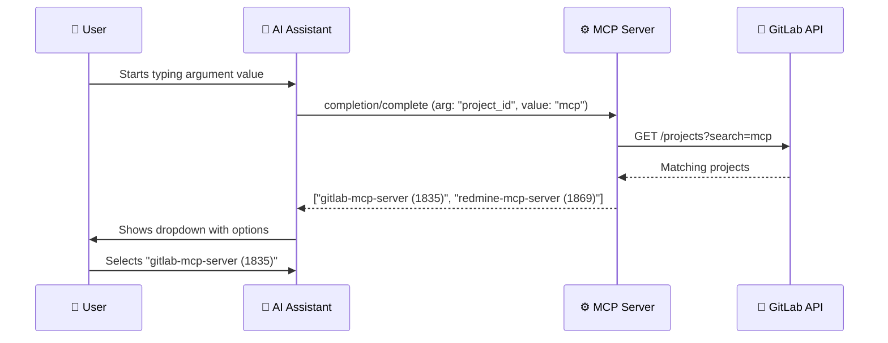

# Completions

> **Diátaxis type**: Reference
> **Package**: [`internal/completions/`](../../internal/completions/completions.go)
> **Direction**: Client → Server
> **MCP method**: `completion/complete`
> **Audience**: 👤🔧 All users

<!-- -->

> 💡 **In plain terms:** When you start typing a project name, branch, or milestone, the server suggests matches in real time — like autocomplete in a search bar. You pick from the list instead of remembering exact IDs.

## Table of Contents

- [What Problem Do Completions Solve?](#what-problem-do-completions-solve)
- [How It Works](#how-it-works)
- [API](#api)
  - [Handler](#handler)
  - [Dispatch Flow](#dispatch-flow)
- [Supported Argument Types](#supported-argument-types)
  - [Global Completers](#global-completers)
  - [Per-Project Completers](#per-project-completers)
- [Configuration](#configuration)
- [Security](#security)
- [Real-World Examples](#real-world-examples)
- [How Completions Improve AI Accuracy](#how-completions-improve-ai-accuracy)
- [Frequently Asked Questions](#frequently-asked-questions)
- [References](#references)

## What Problem Do Completions Solve?

MCP tools often require identifiers — project IDs, branch names, milestone titles, merge request IIDs. Without assistance, the AI (or user) must know these exact values upfront or make extra API calls to discover them.

Completions provide **real-time autocomplete suggestions** as arguments are being entered. Type a few characters and the server queries GitLab for matches.

```text
Without completions:
  User: "Create issue in project..." → What's the ID? → Must call list_projects first → Extra round-trip

With completions:
  User types: "my-pro" → Server suggests: "my-project (42)", "my-prototype (88)" → Direct selection
```

This transforms a multi-step lookup into a **single, interactive selection** — reducing errors and making the MCP tools significantly more usable.

## How It Works



Each completion request triggers **at most one GitLab API call**. Results are returned immediately — there is no caching, ensuring data is always fresh. If the API call fails, the server returns an empty result (never an error), so the client flow is never blocked.

## API

### Handler

```go
handler := completions.NewHandler(client)
// Registered during server construction:
&mcp.ServerOptions{
    CompletionHandler: handler.Complete,
}
```

### Dispatch Flow

1. Client sends `completion/complete` with a reference type and argument name
2. Handler checks `ref.Type` (`ref/prompt` or `ref/resource`)
3. Dispatches to the appropriate completer based on `argument.Name`
4. Completer queries GitLab API with the user's partial input
5. Returns up to 10 matching suggestions

The server supports completions for both **prompt arguments** (used in MCP prompts) and **resource URI parameters** (used in MCP resource templates).

## Supported Argument Types

The server supports **17 argument types** across prompts and resources.

### Global Completers

These completers search across the entire GitLab instance. They do not require a project context.

| Argument | Query Method | Example Input → Suggestions |
| -------- | ------------ | --------------------------- |
| `project_id` | Search projects by path or name | `mcp` → `gitlab-mcp-server (1835)`, `redmine-mcp-server (1869)` |
| `group_id` | Search groups by name | `sw` → `sw-area (229)` |
| `username` | Search GitLab users | `jreq` → `jmrplens` |

### Per-Project Completers

These completers require a `project_id` context, which is extracted from previously resolved arguments in the same request.

| Argument | Query Method | Example Input → Suggestions |
| -------- | ------------ | --------------------------- |
| `branch`, `source_branch`, `target_branch` | List branches matching prefix | `feat` → `feature/login`, `feature/signup` |
| `from`, `to`, `ref` | Branches + tags matching prefix | `v1` → `v1.0.0`, `v1.1.7`, `v1-branch` |
| `tag` | List tags matching prefix | `v1.1` → `v1.1.5`, `v1.1.6`, `v1.1.7` |
| `mr_iid` | List open MRs, filter by IID prefix | `1` → `15: feat: sampling...`, `14: fix: TLS...` |
| `issue_iid` | List open issues, filter by IID | `3` → `33: Bug report...` |
| `pipeline_id` | Recent pipelines, filter by ID prefix | `415` → `41557 (success)`, `41556 (canceled)` |
| `sha` | Recent commits, filter by SHA prefix | `ddc` → `ddcc2f13...` |
| `label` | Project labels matching prefix | `type` → `type::bug`, `type::enhancement` |
| `milestone_id` | Milestones matching title | `v1` → `v1.0.0`, `v1.1.0` |
| `job_id` | Jobs in a pipeline, filter by ID | `10` → `100: build`, `101: test` |

The `job_id` completer is special — it requires both `project_id` and `pipeline_id` to be resolved first.

## Configuration

| Setting | Value | Notes |
| ------- | ----- | ----- |
| Max results | 10 per request | Hardcoded per MCP spec recommendation |
| Error handling | Graceful | Returns empty results on API errors |
| Caching | None | Queries GitLab API in real-time for freshness |

## Security

- **Graceful degradation** — API errors during completion return empty results. The client is never blocked or shown error details from completions.
- **No credential leakage** — queries use project/group IDs internally. Completion results show human-readable names.
- **Rate awareness** — each completion triggers at most one GitLab API call per argument type.

## Real-World Examples

### Completing a Project ID for a Prompt

When using a prompt that requires a `project_id` argument:

```text
Prompt: "Summarize project health"
Argument: project_id = "pe-mc" (user types partial)
```

The server searches GitLab for projects matching "pe-mc" and returns:

```json
{
  "completion": {
    "values": ["1835: gitlab-mcp-server", "1869: redmine-mcp-server"],
    "hasMore": false
  }
}
```

The client shows a dropdown and the user selects the right project without needing to remember the ID.

### Completing Branch Names for Release Notes

When generating release notes, the `from` and `to` arguments need Git refs:

```text
Tool: gitlab_generate_release_notes
Argument: from = "v1.1" (user types partial)
```

The server returns both branches and tags matching the prefix:

```json
{
  "completion": {
    "values": ["v1.1.5", "v1.1.6", "v1.1.7"],
    "hasMore": false
  }
}
```

### Completing an MR IID

When reviewing a merge request, the `mr_iid` argument shows open MRs:

```text
Tool: gitlab_analyze_mr_changes
Argument: mr_iid = "1" (user types partial)
```

The server lists open MRs with titles so the user can identify the right one:

```json
{
  "completion": {
    "values": ["15: feat: sampling tools modularization (merged)", "14: fix: TLS verification (merged)"],
    "hasMore": false
  }
}
```

## How Completions Improve AI Accuracy

Completions are not just a user-facing convenience — they also help the **AI itself** select correct parameters. When the AI is composing a tool call and needs to fill in a `branch` argument, completions provide the actual branch names from GitLab rather than forcing the AI to guess or hallucinate.

| Without Completions | With Completions |
| ------------------- | ---------------- |
| AI guesses `main` (may not exist) | AI receives `develop` (actual default branch) |
| AI uses wrong MR IID from memory | AI gets list of actual open MRs |
| AI invents a tag name | AI selects from real tags |

This is especially valuable for **per-project context** — branch names, labels, and milestones vary across projects and cannot be guessed reliably.

## Frequently Asked Questions

### Are completions always available?

Completions are available whenever the MCP server is running. However, the client must support and use the `completion/complete` method. Not all clients trigger completions automatically.

### Why is there no caching?

Freshness is more important than speed for completions. GitLab data changes frequently — branches are created and deleted, issues are opened and closed. A stale cache could suggest non-existent branches, which is worse than a slightly slower API call.

### What happens if I have thousands of branches?

The server returns at most 10 results per request. The user types more characters to narrow the results. This keeps the response fast and the dropdown manageable.

### Do completions work for resource URIs too?

Yes. The server supports completions for resource URI template parameters (`project_id`, `group_id`, `mr_iid`, `issue_iid`). This enables clients to autocomplete when browsing MCP resources.

## References

- [MCP Specification — Completions](https://modelcontextprotocol.io/specification/2025-11-25/server/utilities/completion)
- [MCP Go SDK — CompletionHandler](https://pkg.go.dev/github.com/modelcontextprotocol/go-sdk/mcp#ServerOptions)
- [MCP Protocol Guide — Completions](../mcp-protocol/14-completions.md)
