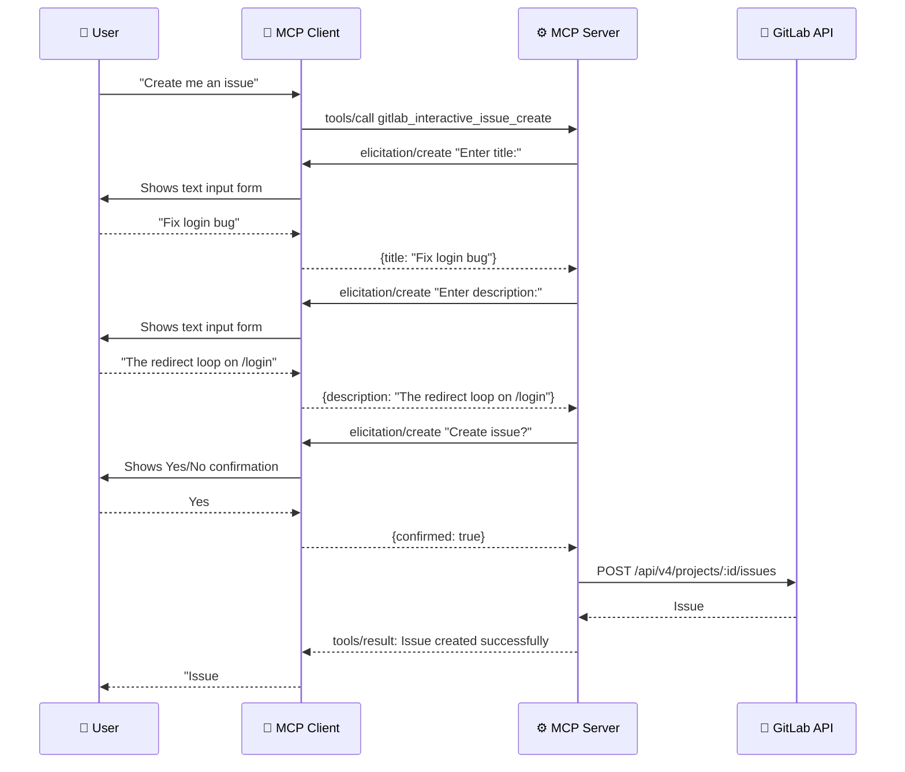

# Elicitation

> **Diátaxis type**: Reference
> **Package**: [`internal/elicitation/`](../../internal/elicitation/elicitation.go)
> **Direction**: Server → Client
> **MCP method**: `elicitation/create`
> **Audience**: 👤🔧 All users

<!-- -->

> 💡 **In plain terms:** Instead of the AI asking you multiple chat questions before creating something, the server shows you a step-by-step form — like a wizard — where you fill in fields one at a time, and the server creates the issue, MR, or release when you are done.

## Table of Contents

- [What Problem Does Elicitation Solve?](#what-problem-does-elicitation-solve)
- [How It Works](#how-it-works)
- [API](#api)
  - [Client](#client)
  - [Methods](#methods)
  - [Error Types](#error-types)
- [Security](#security)
- [Elicitation-Powered Tools](#elicitation-powered-tools)
- [Real-World Scenarios](#real-world-scenarios)
- [Elicitation vs Parameterized Tools](#elicitation-vs-parameterized-tools)
- [Graceful Degradation](#graceful-degradation)
- [Frequently Asked Questions](#frequently-asked-questions)
- [References](#references)

## What Problem Does Elicitation Solve?

Standard MCP tools require the AI to provide **all parameters upfront** in a single tool call. For complex resources like merge requests — where fields depend on earlier choices and missing data leads to errors — the AI must either guess at values or ask the user multiple questions in chat before calling the tool.

**Elicitation** introduces a different paradigm: the server can pause execution and **ask the user directly** for input through structured forms. This enables wizard-style, step-by-step creation flows where each step can depend on the previous answer.

```text
Without elicitation:
  AI: "What's the source branch?" → User: "feature/login"
  AI: "Target branch?" → User: "main"
  AI: "Title?" → User: "Fix login bug"
  AI: "Description?" → User: "Fixes the redirect issue"
  AI: calls gitlab_create_merge_request with all parameters at once

With elicitation:
  AI: calls gitlab_interactive_mr_create
  Server → User: "Enter source branch:" → User types "feature/login"
  Server → User: "Enter target branch:" → User types "main"
  Server → User: "Enter title:" → User types "Fix login bug"
  Server → User: "Squash commits?" → User clicks Yes
  Server → User: "Create MR?" → User clicks Yes
  Server creates the MR
```

The key difference: elicitation moves the conversation from **AI-mediated chat** to **direct server-to-user interaction**. The user sees structured forms instead of chat messages, and the server validates each input in real time.

## How It Works



Each step in the flow is a separate `elicitation/create` request from the server. The client renders an appropriate UI element (text input, dropdown, confirmation dialog) based on the elicitation type and JSON Schema.

### Four Phases of an Elicitation Flow

1. **Capability check** — the tool verifies the client supports elicitation via `IsSupported()`
2. **Data gathering** — the server sends sequential prompts for required and optional fields
3. **Confirmation** — the server asks the user to confirm before executing the action
4. **Execution** — on confirmation, the server calls the GitLab API and returns the result

The user can **decline** at the confirmation step or **cancel** at any step, aborting the entire flow cleanly.

## API

### Client

The `Client` is a **zero-value-safe** value type, following the same pattern as `sampling.Client` and `progress.Tracker`. No initialization is needed — a zero-value `Client` simply reports unsupported.

```go
elicitClient := elicitation.FromRequest(req)
if !elicitClient.IsSupported() {
    return ..., elicitation.ErrElicitationNotSupported
}
```

### Methods

| Method | Signature | Purpose |
| ------ | --------- | ------- |
| `FromRequest(req)` | `(*mcp.CallToolRequest) Client` | Create client from tool request |
| `IsSupported()` | `() bool` | Check if client has elicitation capability |
| `IsURLSupported()` | `() bool` | Check if client supports URL mode elicitation |
| `Confirm(ctx, message)` | `(...) (bool, error)` | Ask a yes/no question |
| `PromptText(ctx, message, field)` | `(...) (string, error)` | Request free-form text input |
| `PromptNumber(ctx, message, field, min, max)` | `(...) (float64, error)` | Request numeric input with bounds |
| `SelectOne(ctx, message, options)` | `(...) (string, error)` | Single-choice selection from a list |
| `SelectOneInt(ctx, message, options)` | `(...) (int, error)` | Single-choice selection from an integer list |
| `SelectMulti(ctx, message, options, min, max)` | `(...) ([]string, error)` | Multi-choice selection with cardinality bounds |
| `GatherData(ctx, message, schema)` | `(...) (map[string]any, error)` | Request structured data via JSON Schema |
| `ElicitURL(ctx, gitlabBaseURL, targetURL, msg)` | `(...) error` | Open a GitLab URL in the client (URL mode) |

**Method selection guide:**

- Use `Confirm` for boolean decisions (yes/no, enable/disable)
- Use `PromptText` for open-ended text input (titles, descriptions, branch names)
- Use `PromptNumber` for numeric input with optional min/max bounds (e.g., priority levels)
- Use `SelectOne` when the user must choose from a fixed set (visibility: public/private/internal)
- Use `SelectOneInt` when choosing from integer options (e.g., IDs, counts)
- Use `SelectMulti` when the user can pick multiple options (labels, assignees)
- Use `GatherData` for complex multi-field input in a single form (rarely used due to UX preference for sequential prompts)
- Use `ElicitURL` to open a GitLab page in the client (requires URL mode support)

### Error Types

| Error | Meaning | Tool Handler Action |
| ----- | ------- | ------------------- |
| `ErrElicitationNotSupported` | Client does not support elicitation | Return informational message explaining the requirement |
| `ErrURLElicitationNotSupported` | Client does not support URL mode elicitation | Fall back to text-based workflow |
| `ErrDeclined` | User declined the elicitation request | Return cancellation message |
| `ErrCancelled` | User cancelled the elicitation flow | Return cancellation message |

## Security

### Input Validation

- **JSON Schema validation** — all `GatherData()` responses are validated against the schema before returning to the tool handler.
- **Option validation** — `SelectOne()` re-validates that the selected option is in the allowed set, providing defense in depth.
- **Numeric validation** — `SelectOneInt()` rejects NaN, Infinity, and non-integer floats (e.g., `2.5`) as defense in depth against malformed client responses. `PromptNumber()` rejects NaN values.
- **SSRF prevention** — `ElicitURL()` validates target URLs against the GitLab base URL using hostname and port comparisons separately, preventing bypasses via port mismatch (e.g., `gitlab.example.com:8080` vs `gitlab.example.com`).
- **Caller responsibility** — the elicitation package delivers validated data to the tool handler. The handler is responsible for sanitizing input before using it in GitLab API calls (e.g., preventing injection in issue titles or descriptions).

### Error Handling

- **Declined** — if the user declines, `ErrDeclined` is returned. The tool handler catches this and returns a cancellation message.
- **Cancelled** — if the user cancels mid-flow, `ErrCancelled` is returned. The tool handler catches this and returns a cancellation message.
- **Unsupported** — if the client doesn't support elicitation, `ErrElicitationNotSupported` is returned. The registration handler returns an informational error to the user.

### Human-in-the-Loop Guarantee

Every elicitation tool includes a final `Confirm` step before executing any write operation on GitLab. This ensures the user always sees a summary and explicitly approves before data is created or modified. The user can cancel at any point without side effects.

## Elicitation-Powered Tools

### `gitlab_interactive_issue_create`

| Step | Method | Field | Required |
| ---: | ------ | ----- | :------: |
| 1 | `PromptText` | Title | Yes |
| 2 | `PromptText` | Description | No |
| 3 | `PromptText` | Labels (comma-separated) | No |
| 4 | `Confirm` | Confidential? | — |
| 5 | `Confirm` | Create issue? | — |

### `gitlab_interactive_mr_create`

| Step | Method | Field | Required |
| ---: | ------ | ----- | :------: |
| 1 | `PromptText` | Source branch | Yes |
| 2 | `PromptText` | Target branch | Yes |
| 3 | `PromptText` | Title | Yes |
| 4 | `PromptText` | Description | No |
| 5 | `PromptText` | Labels (comma-separated) | No |
| 6 | `Confirm` | Squash commits? | — |
| 7 | `Confirm` | Remove source branch? | — |
| 8 | `Confirm` | Create MR? | — |

### `gitlab_interactive_release_create`

| Step | Method | Field | Required |
| ---: | ------ | ----- | :------: |
| 1 | `PromptText` | Tag name | Yes |
| 2 | `PromptText` | Release name | Yes |
| 3 | `PromptText` | Description | No |
| 4 | `Confirm` | Create release? | — |

### `gitlab_interactive_project_create`

| Step | Method | Field | Required |
| ---: | ------ | ----- | :------: |
| 1 | `PromptText` | Project name | Yes |
| 2 | `PromptText` | Description | No |
| 3 | `SelectOne` | Visibility (public/private/internal) | Yes |
| 4 | `Confirm` | Initialize with README? | — |
| 5 | `PromptText` | Default branch name | No |
| 6 | `Confirm` | Create project? | — |

## Real-World Scenarios

### Scenario 1: First-Time Contributor Creates an Issue

A user new to the project says "Create an issue about a bug I found." Instead of asking multiple chat questions, the AI calls `gitlab_interactive_issue_create`:

1. The server prompts for a title — the user types "Layout breaks on mobile Safari"
2. The server prompts for a description — the user provides detailed reproduction steps
3. The server asks about labels — the user enters "bug,frontend"
4. The server asks if it's confidential — the user clicks No
5. The server shows a summary and asks to confirm — the user clicks Yes
6. The issue is created with all fields properly formatted

This is more reliable than chat-based collection because each field is explicitly requested, validated, and confirmed.

### Scenario 2: Release Manager Creates a Release

A release manager says "Create a release for v2.1.0." The AI calls `gitlab_interactive_release_create`:

1. Tag name: "v2.1.0" (validated as valid tag format)
2. Release name: "Version 2.1.0 — Performance Improvements"
3. Description: the manager pastes the changelog
4. Confirmation: "Create release v2.1.0?" → Yes

The entire flow happens in structured form fields rather than back-and-forth chat, reducing the risk of misformatted inputs.

## Elicitation vs Parameterized Tools

| Aspect | Parameterized Tool | Elicitation Tool |
| ------ | ------------------ | ---------------- |
| **Input method** | AI provides all parameters at once | Server prompts user step by step |
| **User interaction** | Indirect (through AI chat) | Direct (structured forms) |
| **Validation** | At tool execution time | At each step, before proceeding |
| **Cancellation** | Not possible mid-execution | User can cancel at any step |
| **Best for** | Automation, scripting, batch operations | Interactive creation, first-time users |
| **AI context needed** | AI must know all parameters upfront | AI only needs to decide which tool to call |

Both types coexist in this server. The regular `gitlab_create_issue` tool accepts all parameters at once (better for automation), while `gitlab_interactive_issue_create` guides the user through each field (better for interactive use).

## Graceful Degradation

When the client does not support elicitation:

1. `elicitation.FromRequest(req)` returns an inactive `Client`
2. `client.IsSupported()` returns `false`
3. Tool returns `elicitation.ErrElicitationNotSupported`
4. Registration handler catches the error and returns an informational result explaining the requirement

The user can then fall back to using the regular parameterized tool (e.g., `gitlab_create_issue` instead of `gitlab_interactive_issue_create`).

## Frequently Asked Questions

### Can elicitation tools modify data without my confirmation?

No. Every elicitation tool includes a final `Confirm` step before executing any write operation. If you decline, no data is created or modified.

### What happens if I cancel mid-flow?

The flow is aborted cleanly. No partial data is sent to GitLab. The server returns a cancellation message and no resources are created.

### Why not just use chat for collecting input?

Chat-based collection relies on the AI correctly parsing free-form responses. Elicitation uses structured forms with explicit field types, validation, and a clear confirmation step. This reduces errors and gives the user direct control over each input.

### Which MCP clients support elicitation?

Support varies by client. As of 2025, VS Code Copilot Chat does not yet support elicitation. CLI tools (Copilot CLI, OpenCode) may have limited support. When unsupported, the server gracefully degrades and suggests using the parameterized tool alternative.

### Can I add a new interactive tool?

Yes. Create a handler in the `elicitationtools` package that uses the `elicitation.Client` methods. Follow the pattern of existing tools: capability check → sequential prompts → confirmation → API call. Register the tool in the sub-package's `register.go`.

## References

- [MCP Specification — Elicitation](https://modelcontextprotocol.io/specification/2025-11-25/client/elicitation)
- [MCP Go SDK — Elicit](https://pkg.go.dev/github.com/modelcontextprotocol/go-sdk/mcp#ServerSession.Elicit)
- [MCP Protocol Guide — Elicitation](../mcp-protocol/08-elicitation.md)
- [Capability Tools Reference](../tools/capabilities.md) — tool parameter tables and annotations
