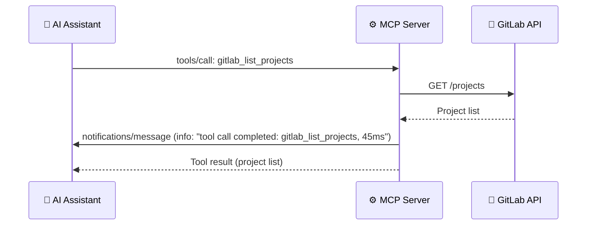

# Logging

> **Diátaxis type**: Reference
> **Package**: [`internal/logging/`](../../internal/logging/logging.go)
> **Direction**: Server → Client
> **MCP notification**: `notifications/message`
> **Audience**: 👤🔧 All users

<!-- -->

> 💡 **In plain terms:** The server sends diagnostic messages to your AI client so you can see what is happening behind the scenes — which tools are being called, how long they take, and whether anything went wrong.

## Table of Contents

- [What Problem Does Logging Solve?](#what-problem-does-logging-solve)
- [How It Works](#how-it-works)
- [API](#api)
  - [SessionLogger](#sessionlogger)
  - [Log Levels](#log-levels)
  - [Structured Tool Logging](#structured-tool-logging)
  - [Data Formatting](#data-formatting)
- [Configuration](#configuration)
- [Security](#security)
- [Usage in Tools](#usage-in-tools)
- [MCP Logging vs stderr](#mcp-logging-vs-stderr)
- [Real-World Examples](#real-world-examples)
- [Frequently Asked Questions](#frequently-asked-questions)
- [References](#references)

## What Problem Does Logging Solve?

When an MCP server processes hundreds of tool calls, you need visibility into what is happening. Which tools are being called? How long do they take? Are there errors?

The server produces two streams of diagnostic information: **stderr logs** (local, always available) and **MCP protocol logs** (sent to the client via the protocol). MCP logging sends structured messages directly to your AI client, so you can see server activity without needing terminal access.

```text
Without MCP logging:
  Tool fails → AI reports generic error → You check server stderr manually → Slow diagnosis

With MCP logging:
  Tool fails → Client receives structured error log → AI can report tool name, duration, error → Fast diagnosis
```

Every tool call in gitlab-mcp-server is automatically logged with its name, execution time, and success/failure status. No manual instrumentation needed — the registration pattern handles it.

## How It Works



The log notification arrives **before** the tool result, giving the client real-time visibility into the server's operation. On error, the notification includes the error message and marks the status as `"error"`.

## API

### SessionLogger

The `SessionLogger` type wraps a `*mcp.ServerSession` and provides convenience methods for sending log messages. All methods are **nil-safe** — calling any method on a nil `SessionLogger` is a silent no-op, so tool handlers never need conditional logic.

```go
// Create from a tool request (most common)
logger := logging.FromToolRequest(req)

// Or from an explicit session
logger := logging.NewSessionLogger(session)
```

### Log Levels

| Method | MCP Level | Use Case |
| ------ | --------- | -------- |
| `Debug(ctx, message, data)` | `debug` | Detailed diagnostic information |
| `Info(ctx, message, data)` | `info` | Normal operational events |
| `Warning(ctx, message, data)` | `warning` | Potential issues that don't block operation |
| `Error(ctx, message, data)` | `error` | Failed operations |

MCP follows [RFC 5424 syslog severity levels](https://datatracker.ietf.org/doc/html/rfc5424). The server uses the four most common levels. Additional levels (`emergency`, `alert`, `critical`, `notice`) are defined by the protocol but not used by this server.

### Structured Tool Logging

```go
logger.LogToolCall(ctx, "gitlab_list_projects", startTime, err)
```

Sends a structured payload to the client:

```json
{
  "tool": "gitlab_list_projects",
  "duration": "45ms",
  "status": "ok",
  "message": "tool call completed: gitlab_list_projects"
}
```

On error, the payload includes `"status": "error"` and the error message.

### Data Formatting

The `data` parameter in log methods controls the structure of the payload sent to the client:

| Input | Result |
| ----- | ------ |
| `nil` | The message string becomes the payload |
| `map[string]any` | Message is added as a `"message"` key in the map |
| Anything else | Wrapped in `{"message": "...", "data": ...}` |

## Configuration

| Setting | Value | Notes |
| ------- | ----- | ----- |
| Logger name | `gitlab-mcp-server` | Constant, identifies the server in client logs |
| Transport | MCP protocol notification | `notifications/message` |
| Error handling | Silent | Failed sends logged to stderr at debug level |

## Security

- **Never include secrets** in log data — tokens, passwords, credentials, or structs that contain them. The `data` parameter is sent as-is to the MCP client over the protocol. This is enforced by documentation and code review, not runtime filtering.
- **Nil-safe** — all methods can be called on nil receivers without panicking. This prevents crashes when the session is unavailable.
- **Error isolation** — if sending a log message fails, the error is logged to stderr at debug level. Tool execution is never interrupted by logging failures.

## Usage in Tools

All tools automatically benefit from logging via the `toolutil.LogToolCallAll()` helper, which is called in every tool handler's registration:

```go
mcp.AddTool(server, &mcp.Tool{Name: "gitlab_list_projects", ...},
    func(ctx context.Context, req *mcp.CallToolRequest, input ListInput) (...) {
        start := time.Now()
        out, err := List(ctx, client, input)
        toolutil.LogToolCallAll(ctx, req, "gitlab_list_projects", start, err)
        // ...
    })
```

This means **every single tool call** (all 1005 tools) generates a structured log entry with the tool name, execution duration, and success or failure status — with zero manual instrumentation per tool.

## MCP Logging vs stderr

The server produces two log streams. Understanding when to use each helps diagnose issues effectively.

| Aspect | MCP Protocol Logging | stderr (slog) |
| ------ | -------------------- | ------------- |
| **Transport** | MCP `notifications/message` | stderr stream |
| **Audience** | AI client and user | Server operator |
| **Availability** | Only when MCP session is active | Always available |
| **Structured data** | JSON payload with tool/duration/status | Text log lines |
| **Typical use** | Tool call results, warnings for the user | Startup, shutdown, config issues |
| **Security concern** | Data sent to client — never include secrets | Local only — less sensitive |

In practice, both are always active. MCP logging provides the AI with operational context, while stderr provides the operator with detailed diagnostics (including debug-level messages from failed MCP log sends).

## Real-World Examples

### Monitoring Tool Performance

When the AI calls `gitlab_list_projects` and the GitLab API is slow, the client receives:

```json
{
  "tool": "gitlab_list_projects",
  "duration": "3200ms",
  "status": "ok",
  "message": "tool call completed: gitlab_list_projects"
}
```

The 3200ms duration signals a performance issue — possibly network latency or a large result set.

### Diagnosing API Errors

When a tool fails because the GitLab token lacks permissions:

```json
{
  "tool": "gitlab_delete_project",
  "duration": "120ms",
  "status": "error",
  "error": "projectDelete: access denied — your token lacks the required permissions",
  "message": "tool call failed: gitlab_delete_project"
}
```

The AI can use this structured data to provide a meaningful error explanation to the user.

## Frequently Asked Questions

### Is logging always active?

Yes. MCP logging is enabled by default and cannot be disabled. Every tool call automatically generates a log entry. Clients can set a minimum log level via `logging/setLevel` to filter which messages they receive.

### Can logging slow down tool execution?

No. Log sends are non-blocking. If a send fails, the error is captured at debug level in stderr and the tool continues normally.

### Where do I see the logs?

It depends on your MCP client. VS Code shows them in an output channel. CLI tools (Copilot CLI, OpenCode) may display them in terminal output. For stdio transport, the logs are sent as JSON-RPC notifications alongside tool results.

## References

- [MCP Specification — Logging](https://modelcontextprotocol.io/specification/2025-11-25/server/utilities/logging)
- [MCP Go SDK — ServerSession.Log](https://pkg.go.dev/github.com/modelcontextprotocol/go-sdk/mcp#ServerSession.Log)
