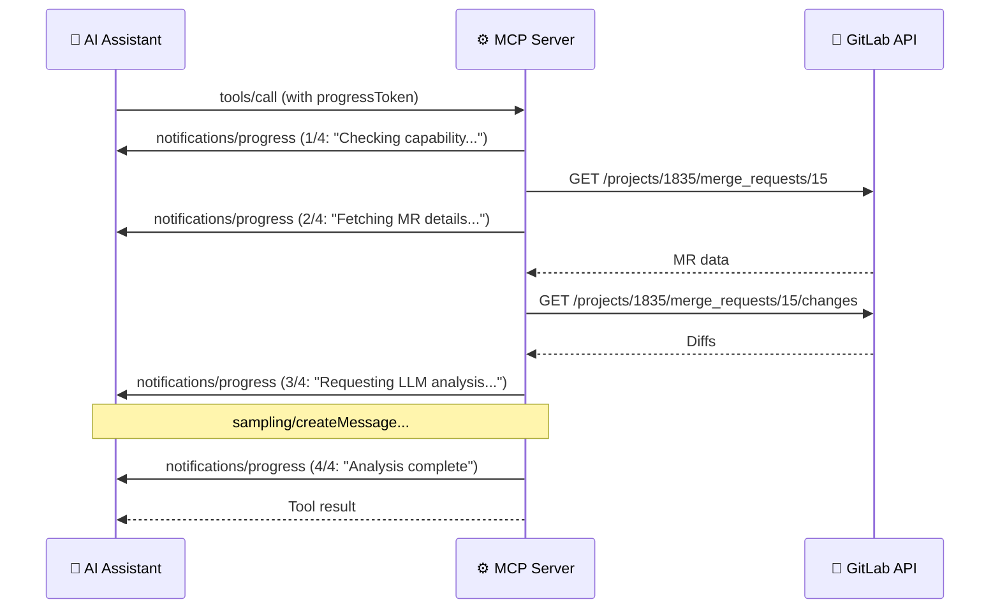

# Progress Notifications

> **Diátaxis type**: Reference
> **Package**: [`internal/progress/`](../../internal/progress/progress.go)
> **Direction**: Server → Client
> **MCP notification**: `notifications/progress`
> **Audience**: 👤🔧 All users

<!-- -->

> 💡 **In plain terms:** When an operation takes a few seconds (like analyzing a merge request), you see step-by-step progress updates so you know it is working and not frozen.

## Table of Contents

- [What Problem Does Progress Solve?](#what-problem-does-progress-solve)
- [How It Works](#how-it-works)
- [API](#api)
  - [Creating a Tracker](#creating-a-tracker)
  - [Methods](#methods)
  - [Step-Based Progress](#step-based-progress)
- [Configuration](#configuration)
- [Security](#security)
- [Tools Using Progress](#tools-using-progress)
- [Real-World Examples](#real-world-examples)
- [Design Principles](#design-principles)
- [Frequently Asked Questions](#frequently-asked-questions)
- [References](#references)

## What Problem Does Progress Solve?

Some MCP tools take several seconds to complete — sampling tools fetch GitLab data and wait for LLM analysis, elicitation tools collect multi-step user input. During this time, the user sees nothing. Are they still running? Did they hang?

Progress notifications solve this by sending **real-time step-by-step status updates** to the client. Instead of silence, the user sees:

```text
Step 1/4: Checking sampling capability...
Step 2/4: Fetching MR details and diffs...
Step 3/4: Requesting LLM analysis...
Step 4/4: Analysis complete
```

This transforms a "is it frozen?" experience into transparent, predictable behavior.

## How It Works



The client provides a **progress token** in the tool call request. The server uses this token to send progress notifications back to the correct request. If no token is provided, the `Tracker` becomes inactive and all progress calls are silently skipped — no errors, no overhead.

## API

### Creating a Tracker

```go
tracker := progress.FromRequest(req)
```

Returns a `Tracker` bound to the request's session and progress token. If the request has no token, the tracker is inactive — all method calls become harmless no-ops.

### Methods

| Method | Signature | Purpose |
| ------ | --------- | ------- |
| `IsActive()` | `() bool` | Check if tracker can send notifications |
| `Update(ctx, progress, total, message)` | `(context.Context, float64, float64, string)` | Send progress with explicit float values |
| `Step(ctx, step, total, message)` | `(context.Context, int, int, string)` | Convenience: report 1-based step of N |

### Step-Based Progress

The most common pattern in tool handlers:

```go
tracker := progress.FromRequest(req)
tracker.Step(ctx, 1, 4, "Checking sampling capability...")
// ... work ...
tracker.Step(ctx, 2, 4, "Fetching MR details...")
// ... work ...
tracker.Step(ctx, 3, 4, "Requesting LLM analysis...")
// ... work ...
tracker.Step(ctx, 4, 4, "Analysis complete")
```

`Step(ctx, 1, 4, msg)` sends `progress=0, total=4` to the client. The MCP protocol uses **0-based progress** with a total count, so the `Step` method translates from 1-based step numbers (more natural for the developer) to 0-based progress values (required by the protocol).

## Configuration

| Setting | Value | Notes |
| ------- | ----- | ----- |
| Token source | `CallToolRequest.Params.GetProgressToken()` | Provided by the MCP client |
| Error handling | Silent | Failed notifications logged at debug level |
| Context awareness | Yes | Returns early if context is canceled |

## Security

- **Opaque token handling** — progress tokens are forwarded as-is to the MCP protocol layer. They are never logged above debug level and never included in error messages.
- **No-op on inactive** — an inactive tracker (no token or no session) makes all method calls no-ops. Tool handlers never need conditional logic.
- **Error isolation** — a failed progress notification never aborts the tool operation. The tool continues and returns its result regardless of notification failures.

## Tools Using Progress

| Tool | Steps | What Each Step Reports |
| ---- | ----: | ---------------------- |
| `gitlab_analyze_mr_changes` | 4 | Check capability → Fetch MR → Fetch diffs → LLM analysis |
| `gitlab_summarize_issue` | 4 | Check capability → Fetch issue → Fetch notes → LLM summary |
| `gitlab_generate_release_notes` | 5 | Check capability → Compare refs → Fetch MRs → LLM notes → Done |
| `gitlab_analyze_pipeline_failure` | 5 | Check capability → Fetch pipeline → Fetch jobs/traces → LLM analysis → Done |
| `gitlab_interactive_issue_create` | 4 | Collect details → Optional fields → Confirm → Create |
| `gitlab_interactive_mr_create` | 4 | Collect details → Options → Confirm → Create |
| `gitlab_interactive_release_create` | 3 | Collect details → Confirm → Create |
| `gitlab_interactive_project_create` | 4 | Collect details → Options → Confirm → Create |

Progress is most valuable for **sampling tools** (which make multiple GitLab API calls and then wait for LLM analysis) and **elicitation tools** (which require multiple rounds of user interaction).

## Real-World Examples

### Sampling Tool with Progress

When you ask the AI to analyze a merge request:

```text
You:  "Analyze MR !15 in gitlab-mcp-server"
```

The client shows:

```text
[1/4] Checking sampling capability...
[2/4] Fetching merge request details and diffs...
[3/4] Requesting LLM analysis...          ← This step can take several seconds
[4/4] Analysis complete
```

Without progress, you would see nothing for 5–10 seconds while the server fetches data and waits for the LLM. With progress, each step provides feedback.

### Elicitation Tool with Progress

When creating an issue interactively:

```text
You:  "Create an issue in onboarding-tasks interactively"
```

The client shows:

```text
[1/4] Collecting issue details...          ← User sees title/description prompts
[2/4] Gathering optional fields...         ← Labels, confidentiality
[3/4] Confirming creation...               ← User approves
[4/4] Creating issue in GitLab...          ← API call
```

## Design Principles

The `Tracker` type follows three design principles that make it safe and easy to use in every tool handler:

### Zero-Value Safety

The `Tracker` is a value type whose zero value is a valid inactive tracker. You never need to check for nil — calling `Step` on an inactive tracker is a no-op.

```go
tracker := progress.FromRequest(req) // May be inactive — that's fine
tracker.Step(ctx, 1, 3, "Working...")  // No-op if inactive
```

### No-Impact on Tool Execution

A failed progress notification never affects the tool's result. If the client disconnects or the notification fails, the error is logged at debug level and the tool continues normally.

### Minimal API Surface

Only three methods: `IsActive()`, `Update()`, and `Step()`. The `Step` convenience method handles the 1-based to 0-based conversion, which is the pattern used in all tool handlers.

## Frequently Asked Questions

### Does every tool show progress?

No. Only tools with multi-step operations use progress: the 11 sampling tools and 4 elicitation tools. Simple tools (e.g., `gitlab_list_branches`) complete too quickly within a single API call to benefit from progress.

### What if my MCP client doesn't send a progress token?

The `Tracker` becomes inactive and all `Step` calls are no-ops. The tool works identically — just without progress feedback. No errors are produced.

### Can I use progress in my own tools?

Yes. Call `progress.FromRequest(req)` at the start of your handler and use `tracker.Step()` between significant operations. The infrastructure handles everything else.

## References

- [MCP Specification — Progress](https://modelcontextprotocol.io/specification/2025-11-25/server/utilities/progress)
- [MCP Go SDK — NotifyProgress](https://pkg.go.dev/github.com/modelcontextprotocol/go-sdk/mcp#ServerSession.NotifyProgress)
- [MCP Protocol Guide — Notifications & Progress](../mcp-protocol/13-notifications-and-progress.md)
