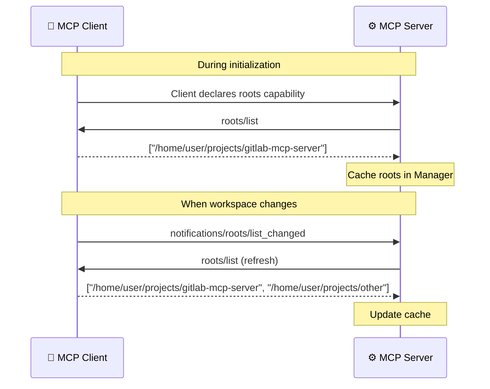

# Roots

> **Diátaxis type**: Reference
> **Package**: [`internal/roots/`](../../internal/roots/roots.go)
> **Direction**: Client → Server
> **MCP method**: `roots/list`
> **Audience**: 👤🔧 All users

<!-- -->

> 💡 **In plain terms:** Your editor tells the server which project you have open, so the server can figure out the GitLab project automatically — you do not have to specify a project ID every time.

## Table of Contents

- [What Problem Do Roots Solve?](#what-problem-do-roots-solve)
- [How It Works](#how-it-works)
- [API](#api)
  - [Manager](#manager)
  - [Methods](#methods)
  - [Git Detection Heuristics](#git-detection-heuristics)
- [Configuration](#configuration)
- [Security](#security)
- [Current Status and Usage](#current-status-and-usage)
- [How Roots Fit in the MCP Architecture](#how-roots-fit-in-the-mcp-architecture)
- [Frequently Asked Questions](#frequently-asked-questions)
- [References](#references)

## What Problem Do Roots Solve?

When you open a project in your editor, the editor knows which directory you are working in. But the MCP server does not — it only sees tool calls and arguments. Without workspace context, every tool call must include explicit project IDs.

**Roots** bridge this gap. The MCP client declares its workspace directories and files to the server. The server can then use this information to **automatically detect** which GitLab project the user is working on, eliminating the need to specify `project_id` in every single command.

```text
Without roots:
  User: "List branches" → Error: project_id required → User: "List branches in project 1835"

With roots (future):
  User: "List branches" → Server detects project from workspace → Returns branches for gitlab-mcp-server
```

## How It Works



The client provides workspace roots as `file://` URIs. The server caches them per session and can re-query when the client sends a `roots/list_changed` notification (e.g., the user opens another folder in their editor).

## API

### Manager

The `Manager` type provides thread-safe root caching and lookup:

```go
manager := roots.NewManager()

// Registered during server construction:
&mcp.ServerOptions{
    RootsListChangedHandler: manager.Refresh,
}
```

### Methods

| Method | Signature | Purpose |
| ------ | --------- | ------- |
| `NewManager()` | `() *Manager` | Create an empty root manager |
| `Refresh(ctx, session)` | `(context.Context, *mcp.ServerSession) error` | Query client and cache current roots |
| `GetRoots()` | `() []*mcp.Root` | Return a copy of cached roots |
| `FindGitRoot()` | `() (string, bool)` | Scan cached roots for a Git repository |
| `HasRoot(uri)` | `(string) bool` | Check if a specific URI is in the cache |
| `ListClientRoots(ctx, session)` | `(context.Context, *mcp.ServerSession) ([]*mcp.Root, error)` | Query roots without caching |

### Git Detection Heuristics

`FindGitRoot()` searches cached roots for paths that indicate a Git repository:

- URI path ends with `/.git`
- Path contains `/repos/`, `/repositories/`, or `/git/` segments
- Parses `file://` URI scheme for local paths

This enables auto-detection of the GitLab project from the user's opened workspace directory.

## Configuration

| Setting | Value | Notes |
| ------- | ----- | ----- |
| Thread safety | `sync.RWMutex` | All operations are goroutine-safe |
| Cache invalidation | On `roots/list_changed` notification | Client notifies server of changes |
| URI scheme | `file://` | Standard scheme for local paths |

## Security

- **Thread-safe** — all operations are guarded by `sync.RWMutex` for concurrent access, critical for HTTP mode with multiple clients.
- **Graceful degradation** — returns `nil` with no error if the client doesn't support roots. Never blocks tool execution.
- **URI validation** — parses URIs before returning them to callers, preventing malformed paths.
- **Copy semantics** — `GetRoots()` returns a copy of the cached slice, preventing callers from mutating internal state.

## Current Status and Usage

The roots infrastructure is **fully implemented** and operational. The `Manager` caches workspace roots and provides lookup helpers.

### Active Consumers

| Consumer | How It Uses Roots |
| -------- | ----------------- |
| **`gitlab://workspace/roots` resource** | Exposes cached roots as an MCP resource so LLMs can read workspace directories |
| **`gitlab_discover_project` tool** | LLMs read `.git/config` from root directories to discover `project_id` automatically |

The **project discovery workflow** chains these components: LLM fetches `gitlab://workspace/roots` → reads `.git/config` from each root → calls `gitlab_discover_project` with the remote URL → obtains `project_id` for all subsequent operations.

### Future Features

| Feature | How Roots Enables It |
| ------- | -------------------- |
| **Workspace-relative file paths** | Resolve file references in tool arguments relative to workspace roots |
| **Multi-project awareness** | Support workspaces with multiple Git repositories (monorepos, polyrepos) |
| **Contextual completions** | Prioritize completions from the detected project over global search |

## How Roots Fit in the MCP Architecture

Roots is a **client-side capability** — unlike sampling and elicitation (where the server initiates requests to the client), roots works in the opposite direction: the client provides data and the server consumes it.

```text
Client capabilities (client provides → server consumes):
  ├─ Roots        → workspace directory information
  ├─ Sampling     → LLM access for analysis
  └─ Elicitation  → user input forms

Server capabilities (server provides → client consumes):
  ├─ Logging      → structured log messages
  ├─ Progress     → step-by-step status updates
  └─ Completions  → argument autocomplete suggestions
```

Roots is the simplest client capability — it provides static data (directory paths) rather than interactive features. But it unlocks some of the most impactful UX improvements: automatic project detection eliminates the single most common parameter in every tool call.

## Frequently Asked Questions

### If no tools use roots yet, why is it implemented?

The infrastructure is in place so that future features can be built without requiring protocol-level changes. When auto-detect project is implemented, it only needs to consume data from the already-populated `Manager` cache.

### Does my MCP client need to support roots?

No. If the client lacks roots support, the `Manager` cache is simply empty and all operations return nil/false. No tools break because of a missing roots capability — it is purely additive.

### Can roots expose sensitive file paths?

Roots contain workspace directory paths from the user's editor. These are local paths (e.g., `/home/user/projects/...`) and are only cached in memory. They are not sent to GitLab or logged above debug level.

### How often is the cache refreshed?

The cache is refreshed when the client sends a `roots/list_changed` notification (typically when the user opens or closes a folder in their editor). The server can also explicitly call `Refresh()` at any time.

## References

- [MCP Specification — Roots](https://modelcontextprotocol.io/specification/2025-11-25/client/roots)
- [MCP Go SDK — ListRoots](https://pkg.go.dev/github.com/modelcontextprotocol/go-sdk/mcp#ServerSession.ListRoots)
