# Architecture Overview

This document describes the system architecture of gitlab-mcp-server, a Model Context Protocol (MCP) server that bridges AI assistants to the GitLab REST API v4 and GraphQL API.

> **Diátaxis type**: Explanation
> **Audience**: 👤🔧 All users
> **Prerequisites**: Familiarity with Go, REST APIs, and basic MCP concepts
> 📖 **User documentation**: See the [Architecture](https://jmrp.io/docs/gitlab-mcp-server/architecture/) on the documentation site for a user-friendly version.

---

## How to Read This Architecture

This document follows the [C4 Model](https://c4model.com/) for software architecture documentation, progressing from high-level context to detailed component design:

1. **System Context** — What the system does and what it connects to
2. **Container View** — Major runtime components inside the process
3. **Component Detail** — Individual packages, their responsibilities, and public APIs
4. **Design Patterns** — Recurring patterns and their rationale
5. **Data Flow** — Request lifecycle and startup sequence
6. **Cross-Cutting Concerns** — Error handling, logging, pagination, security

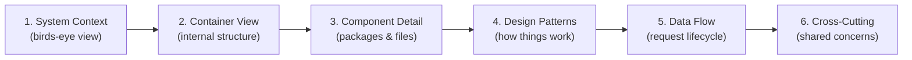

## System Context

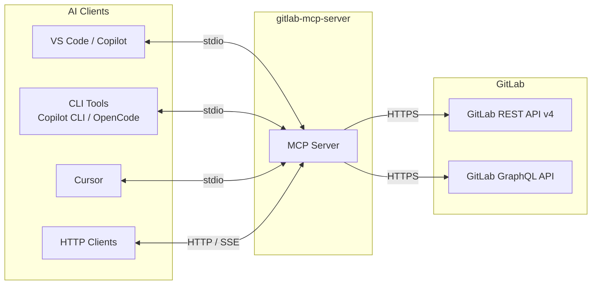

AI clients communicate with gitlab-mcp-server using the MCP protocol over stdio or HTTP. The server translates MCP requests into GitLab API calls (primarily REST v4, with GraphQL for domains where REST is deprecated, unavailable, or less efficient) and returns structured responses. See [GraphQL Integration](graphql.md) for details on which domains use GraphQL and why.

## Container View

```mermaid
graph TD
    subgraph "gitlab-mcp-server Process"
        MAIN[main.go<br/>Entry point]
        CFG[config<br/>Environment loading]
        GL[gitlab<br/>API client wrapper]
        SPECS[domain ActionSpecs<br/>177 internal/tools packages<br/>(168 with action_specs.go)]
        CATALOG[action catalog<br/>canonical ActionRoute registry]
        STANDALONE[standalone surface specs<br/>project discovery + interactive flows]
        IND[individual projection<br/>854 Free/CE / 1007 Premium / 1073 Ultimate / 1079 GitLab.com Ultimate tools]
        META[meta projection<br/>32 base / 38 Premium / 49 Ultimate / 50 GitLab.com Ultimate tools]
        DYN[dynamic projection<br/>2 visible find / execute tools]
        ELIC[elicitation support<br/>4 interactive actions]
        RES[resources<br/>45 resource handlers]
        PROMPTS[prompts<br/>37 prompt handlers]
        COMP[completions<br/>17 completion types]
        PROG[progress<br/>Progress notifications]
        ELICIT[elicitation<br/>User input client]
        ICN[icons<br/>50 domain icons + brand mark]
        SRV[MCP Server<br/>go-sdk/mcp v1.7.0]
        STDIO[StdioTransport]
        HTTP[StreamableHTTPHandler]
        POOL[serverpool<br/>Per-token+URL server pool & LRU cache]
    end

    MAIN --> CFG
    MAIN --> GL
    MAIN --> SRV
    SRV --> STDIO
    HTTP --> POOL
    POOL -->|one server per token+URL| SRV
    SPECS --> CATALOG
    CATALOG --> IND
    CATALOG --> META
    CATALOG --> DYN
    STANDALONE --> ELIC
    STANDALONE -.->|dynamic route injection| DYN
    IND --> GL
    META --> GL
    DYN --> GL
    ELIC --> GL
    ELIC --> ELICIT
    RES --> GL
    PROMPTS --> GL
    MAIN -->|builds| CATALOG
    MAIN -->|selects| IND
    MAIN -->|selects| META
    MAIN -->|selects| DYN
    MAIN -->|registers standalone| STANDALONE
    MAIN -->|register| RES
    MAIN -->|register| PROMPTS
    CATALOG -.->|icons| ICN
    RES -.->|icons| ICN
    PROMPTS -.->|icons| ICN
    MAIN -->|setup| COMP
```

## Component Detail

### Entry Point (`cmd/server`)

The `main()` function supports two runtime modes:

**Stdio mode** (default):

1. Parses CLI flags (`--http` is absent)
2. Loads configuration from environment variables via `config.Load()`
3. Creates an authenticated GitLab client via `gitlabclient.NewClient()`
4. Validates GitLab connectivity with `client.Initialize()`, a direct probe of the version endpoint
5. Creates a single MCP server via `mcp.NewServer()`
6. Connects the `StdioTransport` first, then registers tools, resources, and prompts behind a readiness gate, so `initialize` is answered while the catalog is still being built
7. Blocks until EOF or SIGINT/SIGTERM

**HTTP mode** (`--http` flag):

1. Parses CLI flags (`--http`, `--gitlab-url`, `--http-addr`, `--max-http-clients`, `--session-timeout`, `--http-idle-timeout`, `--trusted-proxy-header`, `--trusted-proxies`, etc.)
2. Creates a `serverpool.ServerPool` with a factory function
3. On each request, extracts the token and GitLab URL from headers, calls `pool.GetOrCreate(token, gitlabURL)` to get or create a per-token+URL MCP server
4. The pool factory creates a GitLab client + MCP server + registers all tools for that token and GitLab instance
5. LRU eviction closes the oldest session when `--max-http-clients` is reached
6. Starts `StreamableHTTPHandler` and blocks until SIGINT/SIGTERM

### Configuration (`internal/config`)

Loads settings from environment variables, falling back to the file `GITLAB_MCP_ENV_FILE` names and then to `~/.gitlab-mcp-server.env` (via `godotenv`); a `.env` in the working directory is deliberately not among them. Used by **stdio mode** to validate that `GITLAB_TOKEN` is present and to default `GITLAB_URL` to `https://gitlab.com` when omitted. HTTP mode uses CLI flags instead (see Transport Selection).

| Variable                          | Required | Default              | Description                                                                                                    |
| --------------------------------- | -------- | -------------------- | -------------------------------------------------------------------------------------------------------------- |
| `GITLAB_URL`                      | No       | `https://gitlab.com` | GitLab instance base URL                                                                                       |
| `GITLAB_TOKEN`                    | Stdio    | —                    | Personal Access Token with `api` scope                                                                         |
| `GITLAB_SKIP_TLS_VERIFY`          | No       | `false`              | Skip TLS certificate verification                                                                              |
| `GITLAB_MCP_TOOL_SURFACE`         | No       | `dynamic`            | Canonical tool catalog selector (`dynamic`, `meta`, `individual`)                                              |
| `GITLAB_MCP_META_TOOLS`           | No       | —                    | Deprecated compatibility selector mapped to `GITLAB_MCP_TOOL_SURFACE` when `GITLAB_MCP_TOOL_SURFACE` is absent |
| `YOLO_MODE`                       | No       | `false`              | Skip destructive action confirmations                                                                          |
| `GITLAB_MCP_UPLOAD_MAX_FILE_SIZE` | No       | `2GB`                | Maximum allowed upload file size                                                                               |

### GitLab Client (`internal/gitlab`)

Thin wrapper around the official `gitlab.com/gitlab-org/api/client-go/v2` library. Handles:

- Authentication via Personal Access Token
- TLS configuration (skip verification for self-signed certificates)
- Connectivity validation (`Initialize()` at startup and `Ping()` both call the GitLab version endpoint)
- Exposes the underlying `*gl.Client` via `GL()` for tool handlers

### Tools (`internal/tools`)

The largest package family — contains 1073 self-managed Ultimate MCP tool implementations (854 on Free/CE, 1007 on Premium), plus 6 GitLab.com-only Orbit handlers for 1079 total in the GitLab.com Ultimate catalog, organized across 177 packages under `internal/tools/`. Each sub-package owns its types, handlers, Markdown formatters, and ActionSpecs; root surface registration is catalog-backed. Tool-surface counts come from `go run ./cmd/audit_metrics/`; package counts can be verified with `go list ./internal/tools/...`.

For the detailed relationship between individual tools, meta-tools, dynamic mode, and the canonical action catalog, see [Tool Surfaces And Canonical Action Core](../development/tool-surfaces-and-action-core.md).

**Orchestration files** in `internal/tools/`:

| File                | Purpose                                                                                                                                                                                |
| ------------------- | -------------------------------------------------------------------------------------------------------------------------------------------------------------------------------------- |
| `register.go`       | `RegisterAll()` — builds the canonical catalog and registers the individual tool projection                                                                                            |
| `register_meta.go`  | `RegisterAllMeta()` — builds the canonical catalog and registers visible meta-tool groups plus approved standalone surfaces                                                            |
| `action_catalog.go` | `BuildActionCatalog()` — builds the canonical action catalog shared by meta-tools, dynamic tools, the tool manifest, audits, and generators                                            |
| `meta_catalog.go`   | `RegisterMetaCatalog()` — registers visible meta-tools from the canonical action catalog                                                                                               |
| `actioncatalog/`    | Canonical catalog data model, deterministic ordering, action lookup, adapters, and filters                                                                                             |
| `meta_tool.go`      | Type aliases onto `toolutil` (`MetaToolInput`, `ActionRoute`, `ActionMap`), the `route`/`routeAction` adapters, and the process-wide meta parameter schema mode (`SetMetaParamSchema`) |
| `markdown.go`       | Thin `markdownForResult` delegator to the type-based Markdown registry                                                                                                                 |
| `catalog_filter.go` | `FilterActionCatalog()`: applies exclusions, token scopes, read-only and safe mode to a catalog and records what each removed                                                          |
| `scope_filter.go`   | `MetaToolScopes` and the PAT scope filters for registered tools and catalogs                                                                                                           |
| `safe_mode.go`      | Safe-mode preview wrappers for the individual surface                                                                                                                                  |

**Representative `internal/tools` package groups** (177 packages total):

| Category          | Representative packages                                                                    |
| ----------------- | ------------------------------------------------------------------------------------------ |
| Project lifecycle | `projects`, `members`, `uploads`, `labels`, `milestones`                                   |
| Source control    | `branches`, `tags`, `commits`, `files`, `repository`                                       |
| Merge requests    | `mergerequests`, `mrnotes`, `mrdiscussions`, `mrchanges`, `mrapprovals`, `mrdraftnotes`    |
| Issues            | `issues`, `issuenotes`, `issuelinks`                                                       |
| CI/CD             | `pipelines`, `pipelineschedules`, `jobs`, `cilint`, `civariables`, `runners`               |
| Releases          | `releases`, `releaselinks`                                                                 |
| Groups            | `groups`                                                                                   |
| Search & users    | `search`, `users`, `todos`                                                                 |
| Infrastructure    | `environments`, `deployments`, `packages`, `wikis`, `health`                               |
| Interactive       | `elicitationtools`                                                                         |
| Extended domains  | `snippets`, `snippetdiscussions`, `securefiles`, `terraformstates`, `resourcegroups`, etc. |

### Shared Tool Utilities (`internal/toolutil`)

Infrastructure shared by all tool sub-packages:

| File               | Purpose                                                                                                                             |
| ------------------ | ----------------------------------------------------------------------------------------------------------------------------------- |
| `action_spec.go`   | `ActionSpec`, compatibility policy, individual projection metadata, and schema/result policy fields                                 |
| `meta_tool.go`     | `MetaToolInput`, `ActionRoute`, `MakeMetaHandler`, `DeriveAnnotations`, `Route`, `DestructiveRoute`                                 |
| `annotations.go`   | Tool annotations (`ReadAnnotations`, `DeleteAnnotations`) and content annotations (`ContentList`, `ContentDetail`, `ContentMutate`) |
| `hints.go`         | Next-step hints: `WriteHints`, `ExtractHints`, `HintPreserveLinks`                                                                  |
| `surface_tool.go`  | Registers an `ActionSpec` as a standalone visible tool (`SurfaceToolRegisterOptions`)                                               |
| `markdown.go`      | `ToolResultWithMarkdown`, `FormatPagination`, emoji helpers                                                                         |
| `errors.go`        | `ToolError`, `DetailedError`, `ErrorResultMarkdown`                                                                                 |
| `confirm.go`       | `ConfirmDestructiveAction`, `IsYOLOMode`                                                                                            |
| `output.go`        | `SuccessResult`, `ErrorResult` — standard output helpers                                                                            |
| `text.go`          | `NormalizeText`, `EscapeMdTableCell`, `WrapGFMBody`                                                                                 |
| `pagination.go`    | `PaginationInput`, `PaginationOutput` shared types                                                                                  |
| `logging.go`       | `LogToolCallAll` structured logging helper                                                                                          |
| `diff.go`          | Diff formatting utilities                                                                                                           |
| `doc.go`           | Package documentation                                                                                                               |
| `file_utils.go`    | File operation helpers (upload size validation, SHA-256, directory allow-lists)                                                     |
| `rate_limit.go`    | Token-bucket limiter shared by `tools/call`, `resources/read`, `resources/subscribe`, `subscriptions/listen` and `prompts/get`      |
| `string_or_int.go` | Flexible JSON unmarshalling for string-or-int fields                                                                                |
| `time_helpers.go`  | Time formatting and parsing utilities                                                                                               |

### Server Pool (`internal/serverpool`)

Manages a bounded pool of per-token+URL MCP server instances in HTTP mode. Each unique combination of GitLab Personal Access Token and GitLab instance URL gets its own isolated MCP server, GitLab client, and server configuration snapshot. The snapshot combines global process policy with detected token scopes and CE/EE edition for that specific entry.

| File            | Purpose                                                                                                                                                                                                                      |
| --------------- | ---------------------------------------------------------------------------------------------------------------------------------------------------------------------------------------------------------------------------- |
| `pool.go`       | `ServerPool` with LRU eviction, `GetOrCreate()`, `GetOrCreateWithScopes()`, `Close()`; narrows an entry to read-only when its token cannot write                                                                             |
| `token.go`      | `ExtractToken()` reads the token from `PRIVATE-TOKEN` or `Authorization: Bearer` headers; `ResolveRequestOptionsFor()` resolves `GITLAB-URL` against the published instances and records ignored config-like request headers |
| `rate_limit.go` | `AuthRateLimiter`: the per-address authentication failure budget                                                                                                                                                             |
| `doc.go`        | Package documentation                                                                                                                                                                                                        |

Key characteristics:

- **Bounded size** — `--max-http-clients` limits the pool (default: 100)
- **LRU eviction** — least recently used entry is closed when pool is full
- **SHA-256 session key** — `SHA-256(token + "\x00" + gitlabURL)` for safe map keys and logging
- **Thread-safe** — `sync.RWMutex` with double-check locking
- **Clean shutdown** — `Close()` stops all servers and releases resources

See [HTTP Server Mode](../guides/http-server-mode.md) for architecture diagrams and [Resource Consumption](resource-consumption.md) for capacity planning.

### Test Utilities (`internal/testutil`)

Shared helpers for unit testing with httptest mocks:

- `NewTestClient()` — creates a mock GitLab client pointing to httptest server
- `RespondJSON()` — responds with JSON body
- `RespondJSONWithPagination()` — responds with pagination headers

### Meta-Tool Dispatcher (`internal/tools/meta_tool.go`)

The meta-tool pattern groups related tools under a single MCP endpoint with an `action` parameter. 28 catalog-backed meta-tools are registered, plus 4 standalone interactive elicitation tools — 32 base GitLab/interactive tools total. Premium adds 6 inline meta-tools (38) and Ultimate 11 more, bringing the self-managed total to 49; GitLab.com also registers `gitlab_orbit` on Premium and Ultimate, bringing the GitLab.com Ultimate catalog to 50. The `gitlab_server` update helper is registered separately for server maintenance actions and is not included in these GitLab action catalog counts. Stdio mode enables the Enterprise/Premium catalog with `GITLAB_TIER=premium` or `GITLAB_TIER=ultimate`, while HTTP mode can force the tier with `--tier` or detect it per token+URL pool entry from the instance license (fallback `free`).

Visible meta-tools are registered from the same canonical action catalog used by dynamic mode. The catalog is built from route definitions and carries each action's handler, input schema, output schema, destructive classification, read-only status, icons, and Markdown formatter. This keeps meta-tool execution, dynamic execution, the `gitlab://tools` manifest, generated `llms*.txt` files, and audit commands aligned without duplicating action metadata.

Orbit is projected through the same catalog as every other domain. In meta mode it appears as the `gitlab_orbit` meta-tool with six actions; in individual mode it appears as six `gitlab_orbit_*` tools; in dynamic mode its actions are discoverable as `orbit.status`, `orbit.schema`, `orbit.tools`, `orbit.dsl`, `orbit.query`, and `orbit.graph_status` through `gitlab_find_action`/`gitlab_execute_action`.

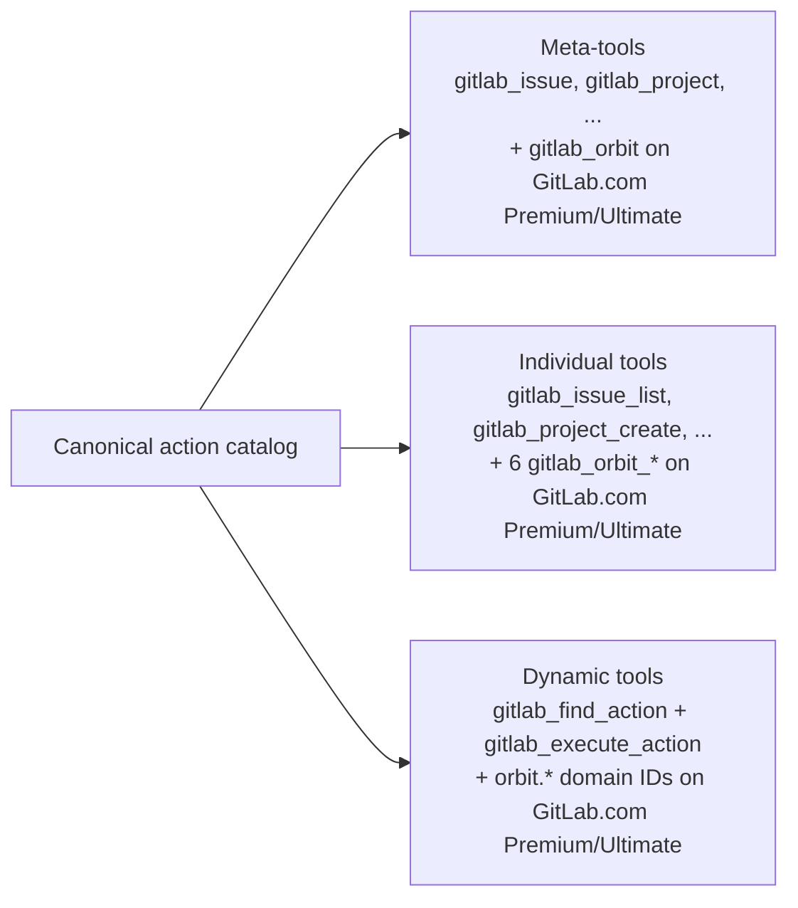

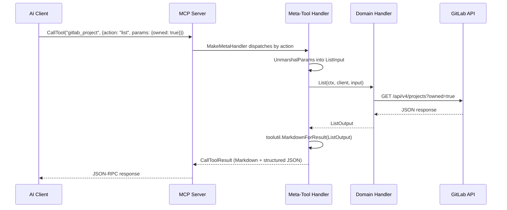

### Dynamic Toolset (`internal/tools/dynamic`)

The dynamic toolset is a progressive-disclosure layer over the canonical action catalog. Instead of exposing all domain
meta-tools in `tools/list`, it exposes only `gitlab_find_action` and `gitlab_execute_action`.
The current default is dynamic find/execute, while meta-tools remain available as the consolidated domain-dispatcher alternative.

For developer guidance on shared catalog ownership, standalone dynamic actions, and registration rules, see [Tool Surfaces And Canonical Action Core](../development/tool-surfaces-and-action-core.md).

Startup builds the canonical action catalog from the same route definitions used by meta-tools, then adds standalone
actions such as project discovery for dynamic mode. This preserves existing typed schemas, route classification, markdown formatters,
read-only filtering, safe-mode behavior, destructive confirmation, and GitLab API handlers.

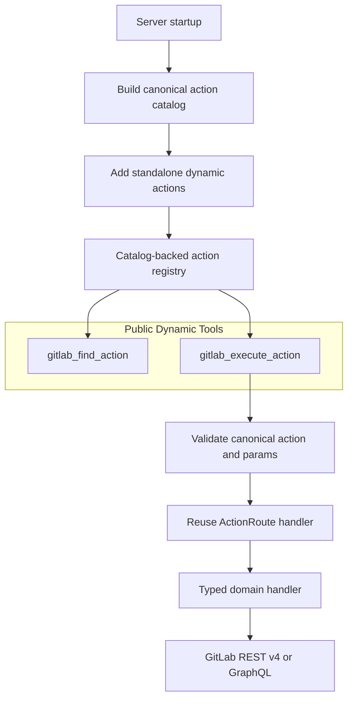

Runtime use follows a find, execute sequence:

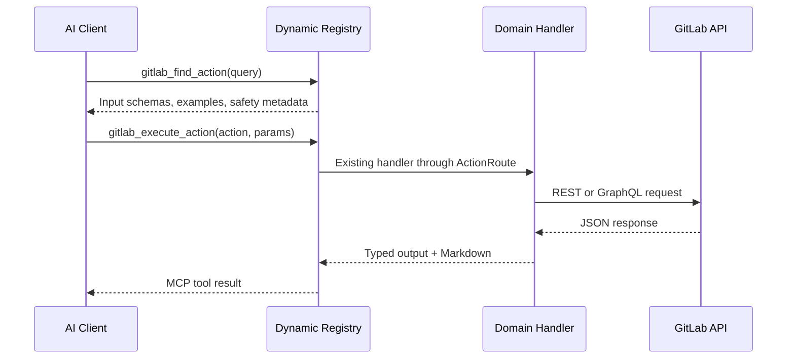

See [Dynamic Toolset](dynamic-tools.md) for configuration, examples, safety behavior, and troubleshooting.

### Resources (`internal/resources`)

45 read-only MCP resources in the default dynamic/full surface, accessed by URI templates. Resources provide contextual data without modifying state:

| Resource                       | URI                                                                | Description                         |
| ------------------------------ | ------------------------------------------------------------------ | ----------------------------------- |
| Current User                   | `gitlab://user/current`                                            | Authenticated user profile          |
| Groups                         | `gitlab://groups`                                                  | Accessible groups list              |
| Tool Manifest                  | `gitlab://tools`                                                   | Active surface tool/action manifest |
| Tool Detail                    | `gitlab://tools/{id}`                                              | Call shape and input schema by ID   |
| Group                          | `gitlab://group/{group_id}`                                        | Group details by ID                 |
| Group Members                  | `gitlab://group/{group_id}/members`                                | Group members with access levels    |
| Group Projects                 | `gitlab://group/{group_id}/projects`                               | Projects within a group             |
| Project                        | `gitlab://project/{project_id}`                                    | Project metadata                    |
| Members                        | `gitlab://project/{project_id}/members`                            | Project members with access levels  |
| Issues                         | `gitlab://project/{project_id}/issues`                             | Open issues for a project           |
| Issue                          | `gitlab://project/{project_id}/issue/{issue_iid}`                  | Specific issue details              |
| Latest Pipeline                | `gitlab://project/{project_id}/pipelines/latest`                   | Most recent pipeline                |
| Pipeline                       | `gitlab://project/{project_id}/pipeline/{pipeline_id}`             | Specific pipeline details           |
| Pipeline Jobs                  | `gitlab://project/{project_id}/pipeline/{pipeline_id}/jobs`        | Jobs for a pipeline                 |
| Labels                         | `gitlab://project/{project_id}/labels`                             | Project labels                      |
| Milestones                     | `gitlab://project/{project_id}/milestones`                         | Project milestones                  |
| Merge Request                  | `gitlab://project/{project_id}/mr/{merge_request_iid}`             | MR details by IID                   |
| Branches                       | `gitlab://project/{project_id}/branches`                           | All branches                        |
| Branch                         | `gitlab://project/{project_id}/branch/{branch}`                    | Single branch by name               |
| Releases                       | `gitlab://project/{project_id}/releases`                           | Project releases                    |
| Release                        | `gitlab://project/{project_id}/release/{tag_name}`                 | Single release by tag               |
| Tags                           | `gitlab://project/{project_id}/tags`                               | Repository tags                     |
| Tag                            | `gitlab://project/{project_id}/tag/{tag_name}`                     | Single repository tag               |
| Commit                         | `gitlab://project/{project_id}/commit/{sha}`                       | Single commit by SHA                |
| File Blob                      | `gitlab://project/{project_id}/file/{ref}/{+path}`                 | File contents at ref                |
| Wiki Page                      | `gitlab://project/{project_id}/wiki/{slug}`                        | Wiki page by slug                   |
| Label                          | `gitlab://project/{project_id}/label/{label_id}`                   | Single project label                |
| Milestone                      | `gitlab://project/{project_id}/milestone/{milestone_iid}`          | Single project milestone            |
| Board                          | `gitlab://project/{project_id}/board/{board_id}`                   | Single issue board                  |
| Deployment                     | `gitlab://project/{project_id}/deployment/{deployment_id}`         | Single deployment                   |
| Environment                    | `gitlab://project/{project_id}/environment/{environment_id}`       | Single environment                  |
| Job                            | `gitlab://project/{project_id}/job/{job_id}`                       | Single CI/CD job                    |
| Feature Flag                   | `gitlab://project/{project_id}/feature_flag/{name}`                | Single feature flag                 |
| Deploy Key                     | `gitlab://project/{project_id}/deploy_key/{deploy_key_id}`         | Single deploy key                   |
| Project Snippet                | `gitlab://project/{project_id}/snippet/{snippet_id}`               | Single project snippet              |
| MR Notes                       | `gitlab://project/{project_id}/mr/{merge_request_iid}/notes`       | Notes on a merge request            |
| MR Discussions                 | `gitlab://project/{project_id}/mr/{merge_request_iid}/discussions` | Discussion threads on a MR          |
| Group Label                    | `gitlab://group/{group_id}/label/{label_id}`                       | Single group label                  |
| Group Milestone                | `gitlab://group/{group_id}/milestone/{milestone_iid}`              | Single group milestone              |
| Snippet                        | `gitlab://snippet/{snippet_id}`                                    | Personal snippet                    |
| Git Workflow Guide             | `gitlab://guides/git-workflow`                                     | Branching and commit best practices |
| MR Hygiene Guide               | `gitlab://guides/merge-request-hygiene`                            | MR sizing and review workflow       |
| Conventional Commits Guide     | `gitlab://guides/conventional-commits`                             | Commit message conventions          |
| Code Review Guide              | `gitlab://guides/code-review`                                      | Code review checklist               |
| Pipeline Troubleshooting Guide | `gitlab://guides/pipeline-troubleshooting`                         | CI/CD debugging guide               |

### Prompts (`internal/prompts`)

37 AI-optimized prompts (12 core + 4 cross-project + 4 team + 5 project-reports + 4 analytics + 4 milestone-label + 2 git-workflow + 2 audit) that fetch GitLab data and format it as structured context for LLMs:

| Prompt                      | Description                                 |
| --------------------------- | ------------------------------------------- |
| `summarize_mr_changes`      | Changed files summary for an MR             |
| `review_mr`                 | Structured code review outline with diffs   |
| `summarize_pipeline_status` | Pipeline status with failed job details     |
| `suggest_mr_reviewers`      | Reviewer suggestions based on changed files |
| `generate_release_notes`    | Release notes from merged MRs between refs  |
| `summarize_open_mrs`        | Open MR overview with staleness tracking    |
| `project_health_check`      | Pipeline + MRs + branches health report     |
| `compare_branches`          | Commit and file diff between two refs       |
| `daily_standup`             | Standup summary from recent activity        |
| `mr_risk_assessment`        | Risk scoring based on MR complexity         |
| `team_member_workload`      | Workload summary for one team member        |
| `user_stats`                | Contribution statistics for a user          |

## Capabilities

4 MCP capabilities extend the server beyond basic tool/resource/prompt handling:

| Capability    | Package                  | MCP Spec                | Description                                                                            |
| ------------- | ------------------------ | ----------------------- | -------------------------------------------------------------------------------------- |
| Completions   | `internal/completions`   | Server → Client utility | Autocomplete for 17 argument types plus resource URIs                                  |
| Progress      | `internal/progress`      | Bidirectional utility   | Progress notifications for multi-step operations                                       |
| Elicitation   | `internal/elicitation`   | Client → Server (User)  | Interactive user prompts and confirmation dialogs                                      |
| Subscriptions | `internal/subscriptions` | Client → Server         | `resources/updated` notifications for 26 resource kinds, honored by polling (ADR-0015) |

See [Capabilities Overview](../reference/capabilities/README.md) for detailed documentation.

---

## Design Patterns

### Pattern 1: Handler Function Signature

Every tool handler follows a consistent function signature:

```go
func Create(ctx context.Context, client *gitlabclient.Client, input CreateInput) (Output, error)
```

This pattern provides:

- **Cancellation** via `context.Context`
- **Dependency injection** — the GitLab client is passed in, testable with `httptest` mocks
- **Type safety** — input/output structs are automatically validated via JSON Schema

### Pattern 2: Meta-Tool Dispatcher

The meta-tool pattern applies the **Strategy pattern** — a single endpoint dispatches to different handler functions based on the `action` parameter:

```go
spec := toolutil.NewActionSpec("create", toolutil.RouteAction(client, Create), toolutil.ActionSpecOptions{
    OwnerPackage: "projects",
    IndividualTool: toolutil.IndividualToolSpec{Name: "gitlab_project_create"},
})
```

The `ActionSpec` wraps an `ActionRoute`, so handler schemas, destructive classification, aliases, usage hints, result policies, and individual projection metadata travel through the same catalog entry. Meta-tools still dispatch through `MakeMetaHandler`, but their route maps are projected from the canonical catalog:

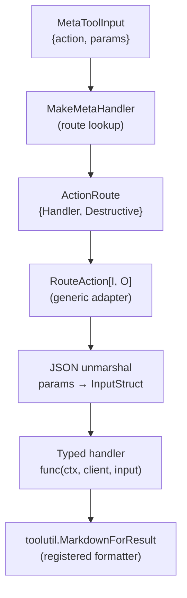

### Pattern 3: Destructive Action Confirmation

Destructive operations use `ConfirmDestructiveAction()` which implements a 4-step confirmation flow:

1. **YOLO_MODE/AUTOPILOT** — if enabled via env var, skip confirmation
2. **Explicit confirm param** — if `confirm: true` in params, proceed
3. **MCP elicitation** — ask the user for confirmation interactively
4. **Fail closed** — if the client cannot prompt, return an error result asking to re-send with `confirm: true`

### Pattern 4: Dual Response Format

All tool handlers return a typed output struct. The registration pattern returns both:

1. **Markdown text** — human-readable, displayed in chat interfaces via `ToolResultWithMarkdown()`
2. **Structured JSON** — machine-readable, serialized by the SDK from the typed output struct

```go
return toolutil.ToolResultWithMarkdown(FormatOutputMarkdown(out)), out, nil
```

### Pattern 5: Capability Interaction

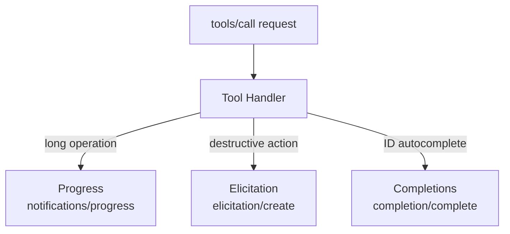

## Data Flow

### Tool Invocation

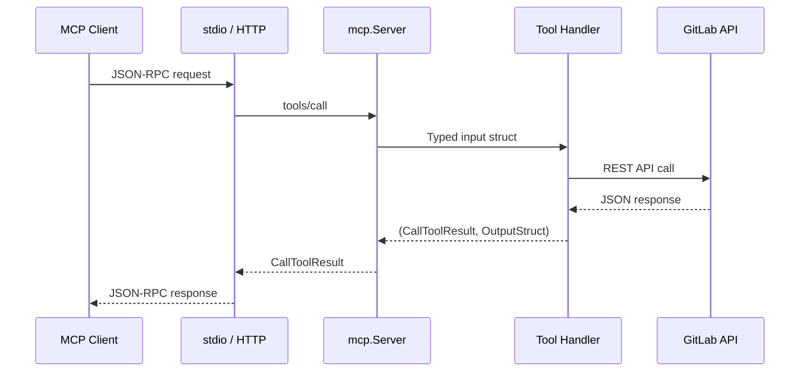

### Startup Sequence — Stdio Mode

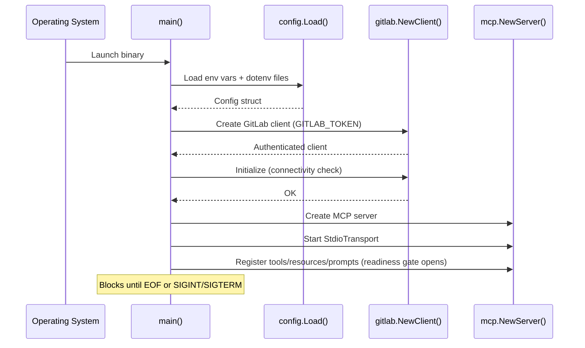

### Startup Sequence — HTTP Mode

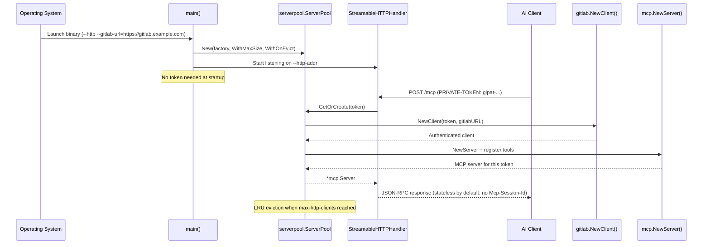

## Key Design Decisions

| Decision                              | Rationale                                                                                                                                                      | ADR                                                                  |
| ------------------------------------- | -------------------------------------------------------------------------------------------------------------------------------------------------------------- | -------------------------------------------------------------------- |
| Go with official MCP SDK              | Type safety, single binary, cross-compilation                                                                                                                  | —                                                                    |
| Official GitLab client library        | Maintained by GitLab, complete API coverage                                                                                                                    | —                                                                    |
| Modular tools sub-packages            | Domain isolation, independent testing, clean imports                                                                                                           | [ADR-0004](../development/adr/adr-0004-modular-tools-subpackages.md) |
| Meta-tool consolidation (32/38/49/50) | Reduce tool count for LLM token efficiency; Premium adds 6 and Ultimate 11 more self-managed meta-tools, and GitLab.com adds the experimental Orbit one on top | [ADR-0005](../development/adr/adr-0005-meta-tool-consolidation.md)   |
| Struct-based I/O                      | Type safety + automatic JSON Schema generation                                                                                                                 | Go SDK convention                                                    |
| Dual response format                  | JSON for LLM tool-chaining + Markdown for display                                                                                                              | See [Output Format](../reference/output-format.md)                   |
| Content annotations                   | Audience targeting + priority for display optimization                                                                                                         | See [Output Format](../reference/output-format.md)                   |
| `next_steps` JSON enrichment          | Hints in structuredContent for JSON-only clients                                                                                                               | See [Output Format](../reference/output-format.md)                   |
| Tool annotations                      | readOnlyHint, destructiveHint for client safety hints                                                                                                          | MCP spec compliance                                                  |
| YOLO_MODE for automation              | Skip confirmations in CI/scripted environments                                                                                                                 | —                                                                    |

## Cross-Cutting Concerns

### Error Handling

Tool handlers follow a consistent pattern:

- GitLab API errors are wrapped with operation context: `fmt.Errorf("operation: %w", err)`
- `ToolError` struct provides structured errors with HTTP status codes
- `DetailedError` provides domain/action/message/details with Markdown rendering
- `WrapErrWithStatusHint()` combines HTTP status check and hint in a single call for status-specific error paths
- Errors propagate to the MCP client as `CallToolResult` with `isError: true`
- `ErrorResultMarkdown()` builds human-readable error responses
- `NotFoundResult()` intercepts 404 errors in get handlers, returning actionable hints instead of opaque errors

### Logging

Structured JSON logs via `log/slog` to stderr:

- **INFO**: Tool calls with duration, startup events, connectivity checks
- **ERROR**: Tool failures with duration and error details
- Logs go to stderr to avoid interfering with stdio transport on stdout

### Pagination

Every list **tool** supports pagination via `PaginationInput` (page, per_page) and returns `PaginationOutput` (total_items, total_pages, next_page, prev_page, has_more) extracted from GitLab response headers. The `has_more` boolean allows LLMs to decide pagination without comparing page numbers.

Collection **resources** are a different case, and the difference is in the protocol rather than in this server. `resources/read` has no continuation mechanism: the specification scopes pagination to the list operations (`resources/list`, `resources/templates/list`, `tools/list`, `prompts/list`) and defines neither a cursor nor a partial-result shape for a read. So a collection resource returns one page of up to 100 items and discloses the rest through `_meta`, under the reverse-DNS key `io.github.jmrplens/pageInfo` (`returned`, `total`, `complete`). A consumer that needs the whole collection uses the tool surface, which paginates properly.

### Security

- Secrets loaded from environment variables, never hardcoded
- TLS verification enabled by default; skip only via explicit configuration
- `context.Context` propagated for cancellation and timeouts
- Tool annotations declare destructive operations for client-side safety
- Destructive action confirmation via elicitation or YOLO_MODE env var

---

## New Contributor Quick Start

1. **Read [MCP Concepts](https://modelcontextprotocol.io/specification/)** — understand the protocol
2. **Read `cmd/server/main.go`** — entry point shows how everything connects
3. **Study one sub-package** (e.g., `internal/tools/branches/`) — understand the handler pattern
4. **Look at `internal/tools/register_meta.go`** — see how handlers become meta-tools
5. **Run the tests** — `go test ./internal/... -count=1`
6. **Try adding a tool** — follow the sub-package pattern

### Key files to understand the architecture

| File                                  | What it teaches you               |
| ------------------------------------- | --------------------------------- |
| `cmd/server/main.go`                  | How all components wire together  |
| `internal/toolutil/meta_tool.go`      | The meta-tool dispatcher pattern  |
| `internal/tools/register_meta.go`     | How tools become meta-tools       |
| `internal/tools/branches/branches.go` | A complete tool handler example   |
| `internal/toolutil/errors.go`         | Error handling patterns           |
| `internal/tools/markdown.go`          | Response formatting conventions   |
| `internal/completions/completions.go` | Capability implementation pattern |

---

## Further Reading

### Internal Documentation

- [HTTP Server Mode](../guides/http-server-mode.md) — multi-client HTTP architecture and session lifecycle
- [Resource Consumption](resource-consumption.md) — memory, CPU, and capacity planning
- [Configuration](../reference/configuration.md) — environment variables, CLI flags, and setup
- [Development](../development/development.md) — building, testing, and contributing
- [Capabilities](../reference/capabilities/README.md) — all 4 capabilities in detail
- [Tools Overview](../reference/tools/README.md) — tool registration modes and inventory

### External References

- [MCP Specification (2025-11-25)](https://modelcontextprotocol.io/specification/2025-11-25/) — protocol spec
- [MCP Go SDK (pkg.go.dev)](https://pkg.go.dev/github.com/modelcontextprotocol/go-sdk) — SDK API reference
- [MCP Go SDK Repository](https://github.com/modelcontextprotocol/go-sdk) — source and examples
- [GitLab REST API v4](https://docs.gitlab.com/ee/api/rest/) — API documentation
- [GitLab GraphQL API](https://docs.gitlab.com/ee/api/graphql/) — GraphQL API documentation
- [GraphQL Integration](graphql.md) — project GraphQL patterns and utilities
- [GitLab Go Client (pkg.go.dev)](https://pkg.go.dev/gitlab.com/gitlab-org/api/client-go/v2) — client API reference
- [GitLab Go Client Repository](https://gitlab.com/gitlab-org/api/client-go) — source
- [C4 Model](https://c4model.com/) — architecture documentation model
