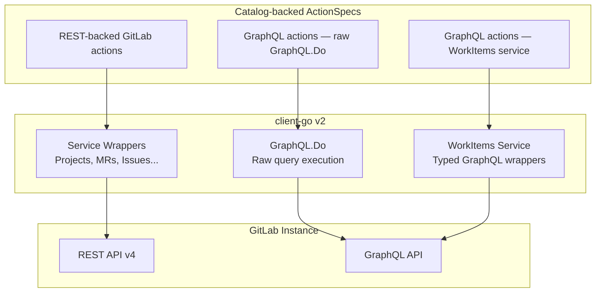

# GraphQL Integration

> **Diátaxis type**: Explanation
> **Audience**: 🔧 Developers, contributors
> **Prerequisites**: Familiarity with Go, GraphQL basics, and the project architecture

---

## Overview

gitlab-mcp-server uses two API strategies to communicate with GitLab:

1. **REST API v4** — the primary approach, used by the majority of tools via the [client-go](https://pkg.go.dev/gitlab.com/gitlab-org/api/client-go/v2) service wrappers
2. **GraphQL API** — used for domains where REST endpoints are deprecated, unavailable, or significantly less efficient

This document explains when and how the GraphQL integration is used, the patterns involved, and the architectural rationale behind the design.

## When REST vs GraphQL

| Use REST when                                | Use GraphQL when                                              |
| -------------------------------------------- | ------------------------------------------------------------- |
| client-go has a typed service wrapper        | No REST endpoint exists (e.g. CI/CD Catalog, Branch Rules)    |
| The domain is well-served by REST            | The REST endpoint is deprecated (e.g. vulnerability findings) |
| Single-resource CRUD operations              | Multiple related resources need to be fetched in one request  |
| The feature is available on all GitLab tiers | The feature is GraphQL-only (e.g. CI/CD Catalog)              |

### Domains using GraphQL

| Domain                     | Package                              | Reason                                                                                                                                       |
| -------------------------- | ------------------------------------ | -------------------------------------------------------------------------------------------------------------------------------------------- |
| Epics (6 tools)            | `internal/tools/epics/`              | REST API deprecated since GitLab 17.0 (removal 19.0); migrated to Work Items GraphQL API via client-go `WorkItems` service                   |
| Epic Notes (5 tools)       | `internal/tools/epicnotes/`          | REST API deprecated since GitLab 17.0 (removal 19.0); raw GraphQL against the Work Items notes widget, GID resolved by `epicworkitems`       |
| Epic Discussions (6 tools) | `internal/tools/epicdiscussions/`    | REST API deprecated since GitLab 17.0 (removal 19.0); raw GraphQL against the Work Items discussions widget, GID resolved by `epicworkitems` |
| Epic Issues (4 tools)      | `internal/tools/epicissues/`         | REST API deprecated since GitLab 17.0 (removal 19.0); raw GraphQL against the Work Items hierarchy widget, GID resolved by `epicworkitems`   |
| Work Items (13 tools)      | `internal/tools/workitems/`          | Work items and saved views are GraphQL-only; typed client-go `WorkItems` service                                                             |
| Vulnerabilities            | `internal/tools/vulnerabilities/`    | GraphQL provides richer query/mutation capabilities than REST                                                                                |
| Security Attributes        | `internal/tools/securityattributes/` | GraphQL-only namespace classification feature; raw `GraphQL.Do()` queries and mutations                                                      |
| Security Categories        | `internal/tools/securitycategories/` | GraphQL-only namespace classification feature; raw `GraphQL.Do()` queries and mutations                                                      |
| Security Findings          | `internal/tools/securityfindings/`   | REST endpoint deprecated; GraphQL `Pipeline.securityReportFindings` is the replacement                                                       |
| CI/CD Catalog              | `internal/tools/cicatalog/`          | GraphQL-only feature — no REST API exists                                                                                                    |
| Branch Rules               | `internal/tools/branchrules/`        | GraphQL-only aggregated view of branch protections, approval rules, and status checks                                                        |
| Custom Emoji               | `internal/tools/customemoji/`        | GraphQL-only — no REST API for custom emoji management                                                                                       |

## Architecture



## The Two GraphQL Patterns

### Pattern 1: Raw `GraphQL.Do()` for tool handlers

Used by domain sub-packages (`vulnerabilities`, `securityfindings`, `securityattributes`, `securitycategories`, `cicatalog`, `branchrules`, `customemoji`, and the epic widgets in `epicnotes`, `epicdiscussions` and `epicissues`) that implement complete tool handlers with GraphQL queries. The `epicworkitems` helper package (`ResolveEpicGID`, `ResolveWorkItemGID`) turns a group path and IID into the global ID those widget mutations need.

```go
// Define the query as a Go constant. Every cursor variable the tool's input can
// send is declared here, and $first is nullable because a backward request
// sends $last instead.
const queryListVulnerabilities = `
query($projectPath: ID!, $first: Int, $after: String, $last: Int, $before: String) {
  project(fullPath: $projectPath) {
    vulnerabilities(first: $first, after: $after, last: $last, before: $before) {
      nodes { id title severity state }
      pageInfo { hasNextPage hasPreviousPage endCursor startCursor }
    }
  }
}
`

// Response struct must include Data envelope wrapper
var resp struct {
    Data struct {
        Project struct {
            Vulnerabilities struct {
                Nodes    []gqlVulnerabilityNode     `json:"nodes"`
                PageInfo toolutil.GraphQLRawPageInfo `json:"pageInfo"`
            } `json:"vulnerabilities"`
        } `json:"project"`
    } `json:"data"`
}

// Build the cursor variables against the document about to run. Naming it here
// is what stops a page request carrying a variable the operation never declared.
vars, err := input.Variables(queryListVulnerabilities)
if err != nil {
    return ListOutput{}, fmt.Errorf("list_vulnerabilities: %w", err)
}
vars["projectPath"] = input.ProjectPath

// Execute — note the two return values (response pointer, error)
_, err = client.GL().GraphQL.Do(gl.GraphQLQuery{
    Query:     queryListVulnerabilities,
    Variables: vars,
}, &resp, gl.WithContext(ctx))
```

### Pattern 2: client-go `WorkItems` service wrappers

Used by the `epics` package after migrating from the deprecated Epics REST API, and by `workitems`. The client-go `WorkItems` service provides typed Go methods that execute GraphQL queries internally, so tool handlers don't write raw GraphQL. Every method is addressed by namespace path and IID; client-go resolves the global ID itself.

```go
// List epics — client-go builds and executes the GraphQL query internally
items, _, err := client.GL().WorkItems.ListWorkItems(input.FullPath, &gl.ListWorkItemsOptions{
    First: &defaultFirst,
    Types: []string{"EPIC"},
    State: gl.Ptr(input.State),
}, gl.WithContext(ctx))

// Get a single epic by IID
item, _, err := client.GL().WorkItems.GetWorkItem(input.FullPath, input.IID, gl.WithContext(ctx))

// Create an epic (WorkItemTypeEpic = "gid://gitlab/WorkItems::Type/8")
item, _, err := client.GL().WorkItems.CreateWorkItem(input.FullPath, gl.WorkItemTypeEpic, &gl.CreateWorkItemOptions{
    Title: input.Title,
}, gl.WithContext(ctx))

// Update and delete take the same path + IID pair
item, _, err := client.GL().WorkItems.UpdateWorkItem(input.FullPath, input.IID, &gl.UpdateWorkItemOptions{
    Title: gl.Ptr(newTitle),
}, gl.WithContext(ctx))
_, err = client.GL().WorkItems.DeleteWorkItem(input.FullPath, input.IID, gl.WithContext(ctx))
```

**When to use this pattern**: When client-go provides typed service wrappers for the GraphQL domain (currently: WorkItems). This is preferred over raw `GraphQL.Do()` because it avoids hand-written query strings and response structs.

**Where a GID is still needed**: the epic notes, discussions and issue-link mutations are raw GraphQL against work item widgets, and those mutations take a GitLab Global ID (a string like `"gid://gitlab/WorkItem/101"`) rather than a path and IID. `epicworkitems.ResolveEpicGID` and `ResolveWorkItemGID` do that lookup once so the three sub-packages share it.

## Key Design Decisions

### Data envelope wrapper

The client-go `GraphQL.Do()` method decodes the full JSON response (including the `{"data": ...}` wrapper) into the provided struct. Response structs **must** include a `Data` field:

```go
// CORRECT — includes Data wrapper
var resp struct {
    Data struct {
        Project struct { ... } `json:"project"`
    } `json:"data"`
}

// WRONG — client-go does NOT strip the data envelope
var resp struct {
    Project struct { ... } `json:"project"`
}
```

### Two return values from `GraphQL.Do()`

The method returns `(*Response, error)`. When you only need the error:

```go
_, err := client.GL().GraphQL.Do(query, &resp, gl.WithContext(ctx))
```

### GitLab Global IDs (GIDs)

GraphQL uses GIDs in the format `gid://gitlab/Type/NumericID`. The `toolutil` package provides helpers:

```go
gid := toolutil.FormatGID("Vulnerability", 42)
// → "gid://gitlab/Vulnerability/42"

typeName, id, err := toolutil.ParseGID("gid://gitlab/Vulnerability/42")
// → "Vulnerability", 42, nil
```

### Cursor-based pagination

GraphQL uses cursor-based pagination instead of REST's page/per_page model. Two input structs carry it, and which one a domain embeds says what its connection can do.

`toolutil.GraphQLPaginationInput` is the forward-only shape and the default choice:

| Parameter | Description                                     |
| --------- | ----------------------------------------------- |
| `first`   | Number of items to return (default 20, max 100) |
| `after`   | Forward pagination cursor                       |

`toolutil.GraphQLCursorPaginationInput` embeds it and adds the backward pair, for the connections GitLab lets a caller walk in both directions:

| Parameter | Description                                                                 |
| --------- | --------------------------------------------------------------------------- |
| `last`    | Number of items to return from the end of the range (backward pagination)   |
| `before`  | Backward pagination cursor, taken from a previous response's `start_cursor` |

Forward only is the default because backward pagination is a property of the GitLab field, not of the helper. `Project.branchRules` and the work item notes widget's `discussions` both answer `before` and `last` with `argumentNotAccepted`. What they do with the backward half of `pageInfo` differs, and the difference matters: `branchRules` reports no previous page and no `start_cursor`, while `discussions` is keyset-paginated and reports both from its second page on. Embedding the bidirectional struct over a field like that would break forward pagination too, since a validation error rejects the whole document.

A forward-only tool therefore reports `toolutil.GraphQLForwardPaginationOutput`, which carries `has_next_page` and `end_cursor` and nothing else. Passing the whole of `pageInfo` on would hand a model a `start_cursor` and no parameter that could spend it, which reads as a capability the tool withdrew rather than as the dead end it is.

Both `Variables()` methods take the operation they are about to run, and refuse a document that cannot carry every variable the input can send. That signature is the guard for a defect this repository shipped for months: a variable an operation does not declare is discarded by GitLab rather than rejected, so eight tools advertised `last` and `before`, dropped them on the floor, and answered every backward request with the first page and no error.

The refusal covers three ways a document can fail to carry a variable, because a declaration on its own proves nothing:

| The document                          | Why it is refused                                                                             |
| ------------------------------------- | --------------------------------------------------------------------------------------------- |
| does not declare the variable         | GitLab discards it, and the caller is answered with somebody else's page                      |
| declares it non-null with no default  | the input omits it on some requests, and GitLab rejects the whole operation when it is absent |
| declares it and passes it to no field | as silent as never declaring it, on any document with more than one connection                |

The guard binds a document to a variable map, not to the request that is sent, so it reaches the call sites that ask for the map and no further. A domain whose query lives in client-go calls `Resolve()` instead and takes the direction rule without the document check, since the SDK owns the document: `achievements`, `workitems` and `workitemsavedviews` are the three.

`GraphQLCursorPaginationInput` sends exactly one of `first` and `last`. The cursor picks the direction and the count only sizes the page, so `before` with no `last` still pages backwards at the default size, and `before` with `first` uses that number as the backward page size. Naming both counts is refused rather than reinterpreted, because GitLab's keyset connections answer the pair with `Can only provide either first or last, not both` and the array-backed ones silently intersect them.

`PageInfoToOutput()` normalizes the camelCase API response to snake\_case output.

### GraphQL mutation error handling

GraphQL mutations return both transport-level errors and application-level errors in the response body:

```go
var resp struct {
    Data struct {
        VulnerabilityDismiss struct {
            Vulnerability gqlVulnerabilityNode `json:"vulnerability"`
            Errors        []string             `json:"errors"`
        } `json:"vulnerabilityDismiss"`
    } `json:"data"`
}

_, err := client.GL().GraphQL.Do(query, &resp, gl.WithContext(ctx))
if err != nil {
    return ..., toolutil.WrapErr("dismiss_vulnerability", err)
}
if len(resp.Data.VulnerabilityDismiss.Errors) > 0 {
    return ..., toolutil.GraphQLMutationError("dismiss_vulnerability",
        resp.Data.VulnerabilityDismiss.Errors)
}
```

## Shared Utilities

The `internal/toolutil/graphql.go` module provides shared GraphQL infrastructure:

| Type/Function                      | Purpose                                                                                                             |
| ---------------------------------- | ------------------------------------------------------------------------------------------------------------------- |
| `GraphQLPaginationInput`           | Forward-only pagination input; `Variables(document)` refuses a document that cannot carry every variable it sends   |
| `GraphQLCursorPaginationInput`     | Adds `last`/`before` for connections GitLab paginates in both directions, checked against the document the same way |
| `GraphQLPaginationOutput`          | Normalized pagination output for tool responses                                                                     |
| `GraphQLForwardPaginationOutput`   | The same, without the previous-page half, for a forward-only connection                                             |
| `GraphQLRawPageInfo`               | Raw camelCase page info from API responses                                                                          |
| `PageInfoToOutput()`               | Converts raw page info to output format                                                                             |
| `PageInfoToForwardOutput()`        | Converts raw page info, dropping the previous-page half                                                             |
| `FormatGraphQLPagination()`        | Renders pagination as Markdown summary                                                                              |
| `FormatGraphQLForwardPagination()` | Renders it without naming a previous page                                                                           |
| `FormatGID()`                      | Builds a GitLab GID string                                                                                          |
| `ParseGID()`                       | Extracts type and ID from a GID string                                                                              |
| `MergeVariables()`                 | Merges multiple variable maps                                                                                       |
| `GraphQLTopLevelError()`           | Wraps the top-level `errors` array of a GraphQL response                                                            |
| `GraphQLMutationError()`           | Wraps a mutation payload's `errors` array as one error                                                              |

## Testing GraphQL Tools

GraphQL tools are tested using `httptest` mocking at the `/api/graphql` endpoint. The `testutil` package provides:

- `testutil.GraphQLHandler(map[string]http.HandlerFunc)` — routes GraphQL requests by matching query strings
- `testutil.RespondGraphQL(w, status, dataJSON)` — wraps response in `{"data": ...}` envelope

The mock no longer answers what GitLab would refuse: every document sent through a `testutil.NewTestClient` client is validated against the pinned GitLab schema first. See [The pinned schema](#the-pinned-schema) below.

```go
client := testutil.NewTestClient(t, testutil.GraphQLHandler(
    map[string]http.HandlerFunc{
        "vulnerabilities": func(w http.ResponseWriter, r *http.Request) {
            testutil.RespondGraphQL(w, http.StatusOK, `{
                "project": {
                    "vulnerabilities": {
                        "nodes": [...],
                        "pageInfo": {"hasNextPage": false}
                    }
                }
            }`)
        },
    },
))
```

## The pinned schema

A mock stands in for GitLab, so it has to refuse what GitLab refuses. Ours did not. Every GraphQL test answers the request from an `httptest` handler that returns whatever the test wrote, so a passing test proved that our handler agreed with our own fixture and said nothing about whether the document was one any instance would accept. Four registered tools shipped documents `https://gitlab.com/api/graphql` rejects outright, with every test green, and the same blindness let eight domains advertise a backward pagination that no operation declared.

GitLab is the only party that refuses a document, and no unit test may reach it, so the schema comes into the repository instead. `internal/graphqlschema` embeds a GitLab schema as SDL, alongside a `source.json` recording the instance it came from, the version that instance reported, and the day it answered. `cmd/gen_graphql_schema` produces both from a live introspection; `make check-graphql-schema` gates the committed pair.

The SDL is committed as text, close to a megabyte of it, rather than compressed. A re-pin is the one moment somebody needs to read what GitLab changed, and a gzip blob renders as `Bin 0 -> 155364 bytes`, cannot be merged when two branches re-pin, and cannot be grepped by anyone verifying a repair. Compression does not even save history: git zlib-compresses and deltas a text blob and can do neither to a gzip stream, so two revisions of the compressed form cost about twice the pack of two revisions of the text. Nothing weighs the other way, because the schema never reaches a released binary; `cmd/server` does not depend on `internal/graphqlschema` at all, only the test helpers and the two commands do.

Two things read it, and they judge different halves of the same question.

### The test transport

`internal/testutil.NewTestClient` wraps the mock every domain test already passes it. For a POST to `/api/graphql` it reads the body and validates both the document and the variables against the pinned schema before the mock answers:

- the **document** half catches a field that does not exist, an argument the field does not accept, a selection set that is missing or forbidden, and a variable used where its declared type does not fit;
- the **variables** half catches a variable the request sends that the operation never declares, which is invisible to the document half and is exactly the shape of the backward-pagination defect, and a value that does not fit the type it was declared as;
- an **enum value in the wrong case** is refused too, and that check is ours rather than the validator's. `gqlparser` compares an enum value with `strings.EqualFold`, so it accepts `critical` for `VulnerabilitySeverity`, while GitLab answers `Expected "critical" to be one of: INFO, UNKNOWN, LOW, MEDIUM, HIGH, CRITICAL` and executes nothing. `Validate` therefore walks the variables against their declared types itself, through list elements and input-object members, and reports every enum position whose value differs from a schema value only in case. It matters because every enum this server sends is uppercased somewhere by a `strings.ToUpper` that a refactor could turn into `strings.ToLower`, and nothing else in the repository would notice.

A refusal is reported with `t.Errorf`, naming the operation and its root field, every reason, and the pin that judged it, so a reader can tell a wrong document from a stale pin. The request then proceeds so the test's own assertions still run and still report. It never calls `t.Fatal`: this runs on the httptest server's goroutine, where an abort would terminate the wrong goroutine.

Every GraphQL test the repository already had became a document validator at no cost to the tests themselves. `testutil.AllowInvalidGraphQL(t)` exempts a test that sends a malformed document on purpose, and belongs nowhere else: a document the pinned schema refuses is a document GitLab refuses. Declare it on the test that calls `NewTestClient`, not on a subtest under one: the exemption is keyed by the name of the test the validation reports against, which is the test the client belongs to.

### The static audit

A document no test drives still ships, so the transport alone is not enough. `make check-graphql-documents` (`cmd/audit_graphql_documents`) reads every raw document out of the source and validates it against the same schema. It loads the program with `go/packages` rather than matching text, because several documents are assembled by concatenating a shared fragment constant and only the type checker knows what the assembled value is. Documents that live in `.graphql` files are read straight off disk beside them, because a `go:embed` variable is not a constant and folds to nothing.

It cannot check variables: a document read out of the source has no request behind it.

It reads `./internal/...`, which holds every document this repository writes, and does not read client-go, which builds another 42 of its own for the achievements, work item, security attribute and terraform state services among others. Those reach GitLab through this server too, and the only thing judging them is the test transport, on whichever ones a test happens to drive. The audit's count is this repository's documents, not the server's whole GraphQL surface.

### What the pin cannot see, and what closes the gap

The schema is a snapshot, and GitLab narrows fields in place. `securityReportFindings` used to accept a `confidence` argument; `Project.vulnerabilities.severity` used to be typed `[String!]`. Both were valid when they were written. A document these gates accept is one the pinned instance accepted on the day `source.json` records, which is a far stronger statement than the mocks used to make and still not the same as one a live instance accepts today.

Three ways of aging are handled, and one is deliberately not.

**The pin is held to what it claims to be.** `make check-graphql-schema` no longer only asks whether the bytes parse. It refuses a record naming an instance other than `https://gitlab.com/api/graphql`, one carrying fewer than 4000 types (a truncated introspection, or a Community Edition instance, which has none of the Ultimate types the vulnerability and security finding documents select), one with no recorded GitLab version (what an introspection without `GITLAB_TOKEN` produces), and one older than 180 days. Until that existed, a re-pin from a self-managed instance passed every gate in the repository in silence, and the guarantee the whole gate rests on could be swapped out by one flag.

**Staleness is a gate, not a note in a file.** 180 days is about six GitLab releases: long enough not to interrupt unrelated work often, short enough that a narrowing surfaces within a release cycle or two. Re-pin with `make gen-graphql-schema`, with `GITLAB_TOKEN` set to a gitlab.com credential so the version is recorded.

**A narrowing can be caught on the day it happens.** `make check-graphql-documents-live` fetches today's schema from gitlab.com into a temporary directory and judges every document against that instead of the pin, which is the one check that reports a field GitLab removed since the pin was taken. It needs the network, so it is not a CI gate; it runs beside the other live suites under `make test-e2e-gitlab-com`.

**The floor is gitlab.com on the pinned day.** gitlab.com runs a pre-release ahead of every self-managed instance, in both directions: comparing the two today, 7 types, 44 fields and 17 arguments exist on a current self-managed instance and are already gone from gitlab.com, `Analytics.finishedPipelines` among them. A document that works everywhere except gitlab.com would therefore fail this gate with no way to declare why, and no exemption mechanism exists because no document needs one: all 38 validate against a self-managed instance as well. If one ever does, the fix is a declared exemption in the shape `cmd/audit_1to1` already uses, not a suppression.

Four limits are inherent to validating at this layer rather than at GitLab's, and none is currently reachable by a shipped document. A fractional number passes where `Int` is declared, because JSON has already made every number a float64 by the time the value is seen. A custom scalar accepts anything, so a malformed global id passes as a `VulnerabilityID`. No depth or complexity limit is enforced, so a query GitLab would refuse as too expensive is accepted. And the SDL carries no deprecation marks, so the gate reports a document that is already broken and never one that is about to be; four fields the server selects are flagged experimental on gitlab.com today, and surfacing that is worth doing when the pin is next regenerated with a credential.

One more thing nothing here judges: the **response**. These gates read the request. A decoder tag that no longer matches a field the document selects is invisible to both halves and to the test, since the fixture is written to match the decoder. That is the symmetric half of the same problem and is tracked with issue 568 rather than solved here.

## References

- [GitLab GraphQL API Reference](https://docs.gitlab.com/ee/api/graphql/reference/)
- [GitLab GraphQL Explorer](https://docs.gitlab.com/ee/api/graphql/#interactive-graphql-explorer)
- [client-go GraphQL.Do()](https://pkg.go.dev/gitlab.com/gitlab-org/api/client-go/v2#GraphQL.Do)
- [ADR-0006: Raw GraphQL.Do() for Uncovered Domains](../development/adr/adr-0006-raw-graphql-for-uncovered-domains.md)
