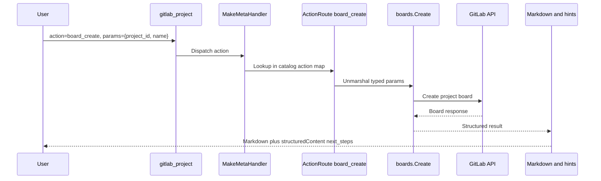

# Meta-Tools Reference

Meta-tools group related GitLab operations under a single MCP tool with an `action` parameter. Instead of 854 (Free/CE) to 1073 (self-managed Ultimate) individual tools, or 1079 on GitLab.com Ultimate, **32 base meta-tools** (38 on Premium, 49 on self-managed Ultimate, 50 on GitLab.com Ultimate) provide the same functionality while reducing token overhead for LLMs.

> **Diátaxis type**: Reference
> **Audience**: 👤🔧 All users
> **Prerequisites**: Understanding of MCP protocol and tool concepts

In meta-tool mode (`GITLAB_MCP_TOOL_SURFACE=meta`), the server registers **32 base GitLab/interactive tools**: 28 catalog-backed meta-tools plus 4 interactive elicitation tools. Premium registers 6 additional inline meta-tools for **38 tools**, Ultimate 11 more for **49 tools** on self-managed GitLab, and GitLab.com adds the experimental `gitlab_orbit` meta-tool on Premium and Ultimate, for **50 tools** on GitLab.com Ultimate. The default tool surface is now dynamic find/execute; set `GITLAB_MCP_TOOL_SURFACE=meta` when you want this consolidated domain dispatcher catalog.

The `gitlab_server` meta-tool (actions `status` and `health_check`) is registered separately for server diagnostics and is not included in the 32/49/50 GitLab action catalog counts.

Stdio mode enables the Enterprise/Premium catalog with `GITLAB_TIER=premium` or `GITLAB_TIER=ultimate`. HTTP mode can force the tier with `--tier`, and otherwise detects it per token+URL pool entry from the instance license (fallback `free`).

`gitlab_orbit` is additionally gated to `https://gitlab.com`.

> **See also**: [Tools Reference](../reference/tools/README.md) | [Configuration](../reference/configuration.md) | [ADR-0005](../development/adr/adr-0005-meta-tool-consolidation.md)
> 📖 **User documentation**: See the [Meta-tools](https://jmrp.io/docs/gitlab-mcp-server/tools/meta-tools/) on the documentation site for a user-friendly version.

## How Meta-Tools Work

Each meta-tool accepts a common input format:

```json
{
  "action": "list",
  "params": {
    "project_id": "42",
    "owned": true
  }
}
```

The dispatcher routes the request to the underlying handler based on the `action` value. The `params` object contains the same parameters as the equivalent individual tool.

## Configuration

Meta-tools are available as an explicit tool surface. New configurations should use the canonical selector:

```env
GITLAB_MCP_TOOL_SURFACE=meta
```

The legacy boolean selector remains supported for one compatibility window, but new configuration should not use it:

```env
GITLAB_MCP_META_TOOLS=true
```

To switch from meta-tools to individual tools, use the explicit selector:

```env
GITLAB_MCP_TOOL_SURFACE=individual
```

The old `GITLAB_MCP_META_TOOLS=false` spelling still maps to `GITLAB_MCP_TOOL_SURFACE=individual` when `GITLAB_MCP_TOOL_SURFACE` is absent.

```env
GITLAB_MCP_META_TOOLS=false
```

To return to the default dynamic surface, unset `GITLAB_MCP_TOOL_SURFACE` (or set `GITLAB_MCP_TOOL_SURFACE=dynamic`).

Meta-tools remain available because they are the most broadly compatible consolidated surface.

| Mode              |                                                                       Tool Count | Best For                                                                         |
| ----------------- | -------------------------------------------------------------------------------: | -------------------------------------------------------------------------------- |
| Dynamic (default) |                                2 (`gitlab_find_action`, `gitlab_execute_action`) | Any client; lowest startup context, every action reachable by `domain.action` ID |
| Meta-tools        |                   32 Free/CE / 38 Premium / 49 Ultimate / 50 GitLab.com Ultimate | LLM clients that need the complete GitLab surface with a compact tool list       |
| Individual tools  | 854 Free/CE / 1007 Premium / 1073 Ultimate / 1079 GitLab.com Ultimate with Orbit | Clients that benefit from one MCP tool per GitLab operation                      |

---

## Meta-Tool Inventory

Action counts are the Free/CE catalog as served by the binary (read them from the `gitlab://tools` manifest). Premium and Ultimate add actions to several groups: on Ultimate `gitlab_project` has 143, `gitlab_group` 157, `gitlab_issue` 71, `gitlab_merge_request` 58, `gitlab_environment` 23, `gitlab_runner` 34 and `gitlab_storage_move` 18.

### Core Inline Meta-Tools (17)

| #   | Tool Name              | Actions | Domain                                                                                                                                                                                   |
| --- | ---------------------- | ------- | ---------------------------------------------------------------------------------------------------------------------------------------------------------------------------------------- |
| 1   | `gitlab_project`       | 123     | Projects, uploads, hooks, badges, boards, import/export, statistics, pages                                                                                                               |
| 2   | `gitlab_branch`        | 11      | Branches, protected branches, branch rules                                                                                                                                               |
| 3   | `gitlab_tag`           | 9       | Tags, protected tags                                                                                                                                                                     |
| 4   | `gitlab_release`       | 12      | Releases, release links                                                                                                                                                                  |
| 5   | `gitlab_merge_request` | 46      | MR CRUD, approvals, context-commits, MR emoji, MR resource events                                                                                                                        |
| 6   | `gitlab_mr_review`     | 23      | MR notes, discussions, drafts, changes                                                                                                                                                   |
| 7   | `gitlab_repository`    | 41      | Repository tree/compare, commit discussions, files, submodules, markdown                                                                                                                 |
| 8   | `gitlab_group`         | 75      | Groups, members, labels, milestones, boards, uploads, import/export, epic discussions                                                                                                    |
| 9   | `gitlab_issue`         | 66      | Issues, notes, discussions, links, statistics, issue emoji, issue resource events                                                                                                        |
| 10  | `gitlab_pipeline`      | 33      | Pipelines, pipeline triggers, pipeline schedules, wait                                                                                                                                   |
| 11  | `gitlab_job`           | 25      | Jobs, job token scope, wait                                                                                                                                                              |
| 12  | `gitlab_user`          | 76      | Users, events, notifications, keys, namespaces, avatar, todos                                                                                                                            |
| 13  | `gitlab_wiki`          | 6       | Project/group wikis                                                                                                                                                                      |
| 14  | `gitlab_environment`   | 18      | Environments, protected envs, freeze periods, deployments                                                                                                                                |
| 15  | `gitlab_ci_variable`   | 15      | CI/CD variables (project, group, instance)                                                                                                                                               |
| 16  | `gitlab_template`      | 12      | CI/CD, Dockerfile, gitignore templates                                                                                                                                                   |
| 17  | `gitlab_admin`         | 92      | Server settings, broadcast messages, features, license, system hooks, error tracking, alert management, secure files, terraform states, cluster agents, dependency proxy, import service |

### Consolidated Inline Meta-Tools (4)

| #   | Tool Name              | Actions | Sources                                                             |
| --- | ---------------------- | ------- | ------------------------------------------------------------------- |
| 18  | `gitlab_access`        | 48      | Access tokens, deploy tokens, deploy keys, access requests, invites |
| 19  | `gitlab_package`       | 29      | Packages, container registry                                        |
| 20  | `gitlab_snippet`       | 34      | Snippets, snippet discussions, snippet emoji                        |
| 21  | `gitlab_feature_flags` | 10      | Feature flags, feature flag user lists                              |

### Always-Registered Meta-Tools (4)

| #   | Tool Name               | Actions | Source                                                      |
| --- | ----------------------- | ------- | ----------------------------------------------------------- |
| 22  | `gitlab_model_registry` | 1       | ML model registry package download                          |
| 23  | `gitlab_ci_catalog`     | 2       | CI/CD Catalog resource discovery (GraphQL)                  |
| 24  | `gitlab_custom_emoji`   | 3       | Group-level custom emoji management (GraphQL)               |
| 25  | `gitlab_storage_move`   | 12      | Project and snippet repository storage moves (`admin_mode`) |

### Delegated Meta-Tools (2)

| #   | Tool Name       | Actions | Source                                         |
| --- | --------------- | ------- | ---------------------------------------------- |
| 26  | `gitlab_search` | 10      | Global, project, group search                  |
| 27  | `gitlab_runner` | 19      | Runners, runner management, runner controllers |

### Standalone Tools (1)

| #   | Tool Name                 | Actions | Source                                      |
| --- | ------------------------- | ------- | ------------------------------------------- |
| 28  | `gitlab_discover_project` | 1       | Git remote URL to GitLab project resolution |

### Interactive Elicitation Tools (4)

| #   | Tool Name                           | Actions                                                               | Domain/Source |
| --- | ----------------------------------- | --------------------------------------------------------------------- | ------------- |
| 29  | `gitlab_interactive_issue_create`   | Guided prompts for issue fields with final confirmation               | GitLab        |
| 30  | `gitlab_interactive_mr_create`      | Guided prompts for branch, title, metadata, and confirmation          | GitLab        |
| 31  | `gitlab_interactive_project_create` | Guided prompts for name, visibility, initialization, and confirmation | GitLab        |
| 32  | `gitlab_interactive_release_create` | Guided prompts for tag, name, notes, and confirmation                 | GitLab        |

### Premium and Ultimate Meta-Tools (17)

Registered when the resolved tier is Premium or Ultimate. Six arrive with Premium:

| Tool Name                | Actions | Source                                   |
| ------------------------ | ------- | ---------------------------------------- |
| `gitlab_audit_event`     | 6       | Instance, group and project audit events |
| `gitlab_enterprise_user` | 4       | Enterprise users (`admin_mode`)          |
| `gitlab_geo`             | 8       | Geo nodes and sites (`admin_mode`)       |
| `gitlab_group_scim`      | 4       | Group SCIM identities                    |
| `gitlab_merge_train`     | 4       | Merge trains                             |
| `gitlab_project_alias`   | 4       | Project aliases (`admin_mode`)           |

Eleven more arrive with Ultimate:

| Tool Name                      | Actions | Source                                  |
| ------------------------------ | ------- | --------------------------------------- |
| `gitlab_attestation`           | 2       | Artifact attestations                   |
| `gitlab_compliance_policy`     | 2       | Compliance policies                     |
| `gitlab_dependency`            | 4       | Dependency list and Dependency Firewall |
| `gitlab_dora_metrics`          | 2       | DORA metrics                            |
| `gitlab_external_status_check` | 8       | External status checks                  |
| `gitlab_member_role`           | 6       | Custom member roles                     |
| `gitlab_security_attribute`    | 5       | Security attributes (GraphQL)           |
| `gitlab_security_category`     | 3       | Security categories (GraphQL)           |
| `gitlab_security_finding`      | 1       | Pipeline security findings (GraphQL)    |
| `gitlab_security_scan_profile` | 3       | Security scan profiles                  |
| `gitlab_vulnerability`         | 8       | Vulnerabilities (GraphQL)               |

### GitLab.com Premium and Ultimate Meta-Tools (1)

| #   | Tool Name      | Actions | Source                                                                                                          |
| --- | -------------- | ------- | --------------------------------------------------------------------------------------------------------------- |
| 50  | `gitlab_orbit` | 6       | Experimental GitLab.com Orbit Knowledge Graph API (`status`, `schema`, `tools`, `dsl`, `query`, `graph_status`) |

---

## Architecture

### Consolidation Decision

ADR-0005 records the historical consolidation from many standalone meta-tools to the current domain-oriented taxonomy. The stable architecture described here is the current contract: broad visible domain tools, Premium and Ultimate gating for the tiered groups, and GitLab.com-only gating for `gitlab_orbit`.

The consolidated surface reduces:

- Token usage in `tools/list` MCP responses
- LLM selection confusion when choosing among similar tools
- Client rendering overhead for tool palettes

### Implementation Pattern

Meta-tools are registered from the canonical action catalog built by `internal/tools.BuildActionCatalog()`.
`RegisterAllMeta()` registers visible domain dispatchers from that catalog.
Developers define action metadata through `ActionSpec` and `CatalogGroupSpec`; meta-tools use that metadata for parameter schemas, output schemas, destructive flags, aliases, usage hints, individual projection policy, and result formatting.

All meta-tools use the shared infrastructure in `internal/toolutil/meta_tool.go`:

- `ActionSpec` — canonical action metadata, including the typed route, ownership, aliases, tags, usage hints, projection policy, result policies, and compatibility policy
- `CatalogGroupSpec` (in `internal/tools/actioncatalog`) — visible meta-tool group metadata and the ordered action set used to build the catalog
- `ActionRoute` — pairs a handler with metadata-driven classification. Typed routes carry both `InputSchema` and `OutputSchema` so each action can expose exact params and result contracts
- `Route(fn)` / `DestructiveRoute(fn)` — legacy constructors for already-adapted handlers
- `DeriveAnnotations(routes)` — auto-derives tool-level annotations from route metadata: if any route is destructive → `MetaAnnotations`, otherwise → `NonDestructiveMetaAnnotations`
- `MakeMetaHandler()` — creates action-dispatch handlers from route maps; successful results automatically enrich `structuredContent` with `next_steps` hints extracted from Markdown, while `isError` results omit structured content
- `MetaToolInput` — common input struct with `action` and `params` fields
- `MetaAnnotations` — shared annotations (destructiveHint: true) for meta-tools with destructive actions
- `ReadOnlyMetaAnnotations` — for meta-tools with only read operations (e.g., `gitlab_template`, `gitlab_search`)
- `NonDestructiveMetaAnnotations` — for meta-tools without destructive actions (e.g., `gitlab_user`)
- `RouteAction()` / `RouteVoidAction()` / `DestructiveAction()` / `DestructiveVoidAction()` — composite wrappers that combine handler adaptation, route classification, and input/output schema capture
- `RouteActionWithRequest()` / `DestructiveActionWithRequest()` / `DestructiveVoidActionWithRequest()` — request-aware variants for handlers that need the incoming MCP request; they preserve the same input/output schema capture and route classification as their non-request counterparts

### How Actions Are Routed



### Response Enrichment

Successful meta-tool responses include a `next_steps` array in the JSON `structuredContent`. This is critical for IDEs like VS Code that only read JSON:

```json
{
  "branches": [...],
  "pagination": { "page": 1, "total_pages": 2, "has_more": true },
  "next_steps": [
    "When presenting these results, always include the clickable [text](url) links",
    "Get details of a specific branch",
    "Create a new branch from any ref"
  ]
}
```

The enrichment is automatic — `MakeMetaHandler` calls `enrichWithHints()` which parses the Markdown "💡 Next steps" section and merges the hints into the JSON output. If a route returns `isError: true`, `MakeMetaHandler` returns the actionable Markdown error without `structuredContent`, matching the MCP rule that successful structured results must conform to the declared `OutputSchema`.

See [Output Format](../reference/output-format.md) for the complete response format specification.

---

## Usage Examples

### List projects

```json
{
  "tool": "gitlab_project",
  "arguments": {
    "action": "list",
    "params": { "owned": true, "per_page": 10 }
  }
}
```

### Create an issue

```json
{
  "tool": "gitlab_issue",
  "arguments": {
    "action": "create",
    "params": {
      "project_id": "my-group/my-project",
      "title": "Fix login bug",
      "labels": "bug,critical"
    }
  }
}
```

### Search code

```json
{
  "tool": "gitlab_search",
  "arguments": {
    "action": "code",
    "params": {
      "query": "func RegisterTools"
    }
  }
}
```

### Delete a branch (with confirmation)

```json
{
  "tool": "gitlab_branch",
  "arguments": {
    "action": "delete",
    "params": {
      "project_id": "42",
      "branch_name": "feature/old-branch"
    }
  }
}
```

If the MCP client supports elicitation, the server will ask for user confirmation before executing destructive actions. If the client cannot prompt (no elicitation capability), the call fails closed with an error asking to re-send with `"confirm": true`. Set `YOLO_MODE=true` or `AUTOPILOT=true` to skip confirmation.

---

## Discovering the params shape

Meta-tools advertise a deliberately compact input schema by default (`GITLAB_MCP_META_PARAM_SCHEMA=opaque`): the LLM sees the `action` enum and an opaque `params` object. To discover the exact `params` shape for a chosen action, two mechanisms are available:

1. **MCP Resource** (recommended with `GITLAB_MCP_CAPABILITY_SURFACE=full`) — read the per-action call shape and JSON Schema:

   ```text
   gitlab://tools/{tool}.{action}
   ```

   For example, `gitlab://tools/gitlab_merge_request.create` returns the call shape and JSON Schema for the `create` action's `params`. The `gitlab://tools` manifest enumerates every visible meta-tool action in the active server configuration.

   The manifest resource returns a JSON object with the URI template, visible tools, and action entries for the current server configuration (abridged; every entry also carries `title`, `description`, `detail_uri`, `destructive`, `read_only` and typed `required_params`). `visible_tool_count` is one more than the 32 tools listed above because `gitlab_server`, which sits outside the catalog counts, has actions of its own and so appears in the manifest:

   ```json
   {
     "surface": "meta",
     "uri_template": "gitlab://tools/{id}",
     "visible_tool_count": 33,
     "entry_count": 858,
     "visible_tools": [
       { "name": "gitlab_merge_request", "title": "Merge Request", "detail_uri": "gitlab://tools/gitlab_merge_request", "read_only": false, "destructive": true }
     ],
     "entries": [
       {
         "id": "gitlab_merge_request.create",
         "kind": "meta_action",
         "tool": "gitlab_merge_request",
         "action": "create",
         "domain": "merge_request",
         "detail_uri": "gitlab://tools/gitlab_merge_request.create",
         "required_params": [{ "name": "project_id", "type": "string" }, { "name": "source_branch", "type": "string" }, { "name": "target_branch", "type": "string" }, { "name": "title", "type": "string" }]
       }
     ]
   }
   ```

   After choosing a tool/action pair, read the concrete detail resource for that action. For example:

   ```json
   {
     "method": "resources/read",
     "params": {
       "uri": "gitlab://tools/gitlab_merge_request.create"
     }
   }
   ```

   The response content includes the JSON Schema for the `params` object and the common meta-tool envelope expected for the final tool call:

   ```json
   {
     "action": "create",
     "params": {
       "project_id": "42",
       "source_branch": "feature/docs",
       "target_branch": "main",
       "title": "Update documentation"
     }
   }
   ```

  These resources remain available for meta-tools when `GITLAB_MCP_CAPABILITY_SURFACE=minimal` is enabled, while optional GitLab data resources, prompts, and workflow guides are omitted. Dynamic surfaces can use `gitlab_find_action` for inline schemas in minimal mode; meta-tool callers can keep `GITLAB_MCP_META_PARAM_SCHEMA=opaque` and read `gitlab://tools/{id}` for exact params.

1. **Embed schemas in the tool description** — set `GITLAB_MCP_META_PARAM_SCHEMA=full` (or the lighter `compact` mode) at startup. The meta-tool's `inputSchema` then exposes a `oneOf` discriminating on `action`, with the per-action params shape inlined. Current audit metrics show `full` is 11.9x larger than `opaque`, and `compact` is 6.5x larger, so keep `opaque` unless your MCP client cannot read resources. See [Environment Variables](../reference/env.md) for size/cost trade-offs.

The dispatch behaviour is identical across modes — only the schema sent to the LLM changes.
