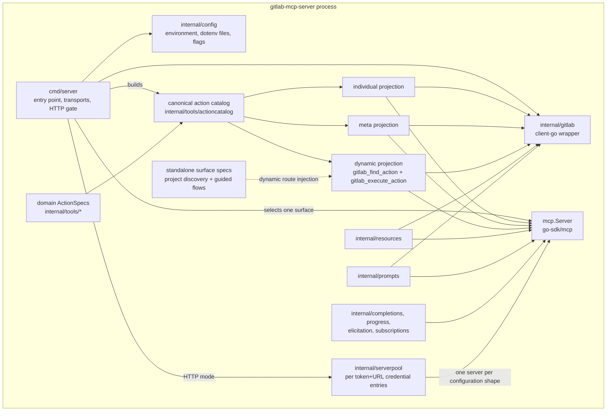
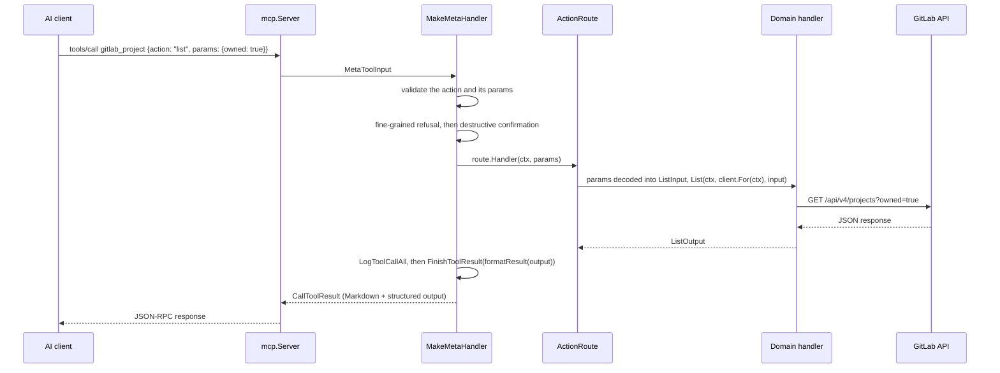
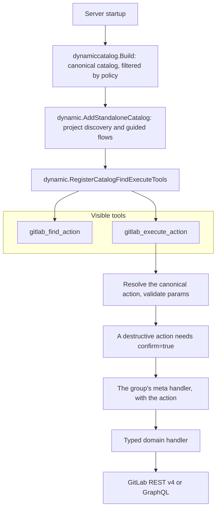
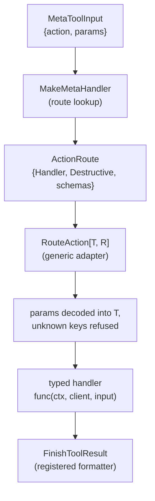
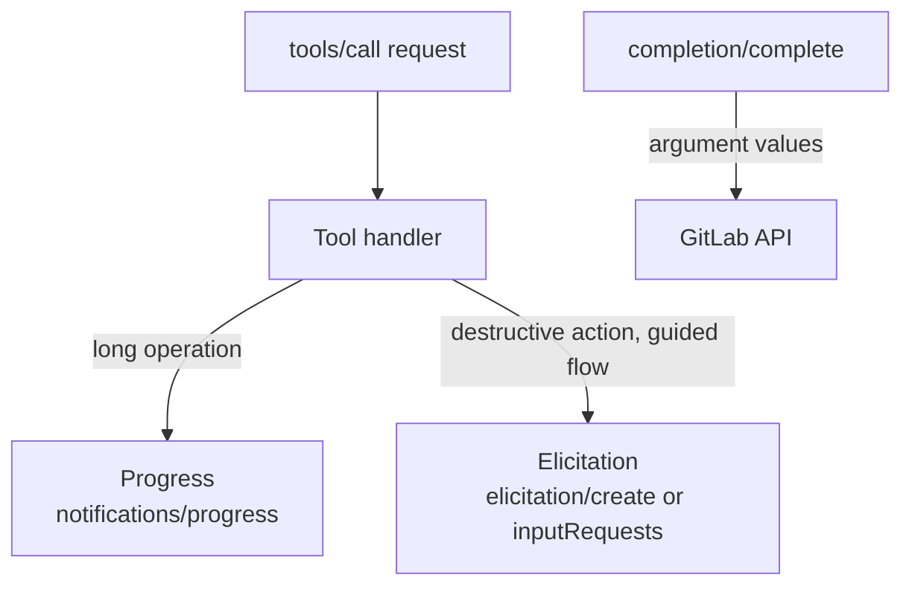
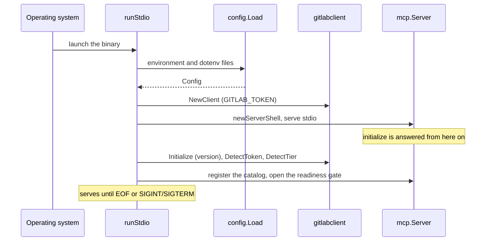
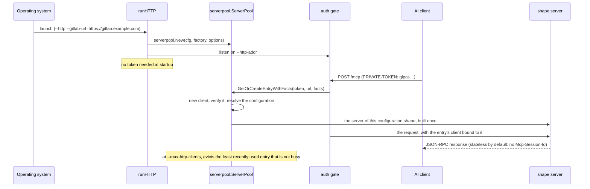

# Internal Architecture

**How the process is put together**: the packages, what each one owns, the
path a call takes through them, and the patterns every tool package follows.

> **Diátaxis type**: Explanation · **Audience**: 🛠️ Contributors & maintainers

The [Architecture](https://jmrp.io/docs/gitlab-mcp-server/architecture/) page
on the documentation site describes the server from the outside: transports,
surfaces, what a result carries. This page is the inside. Three pages go
deeper on one part each: [Tool Surfaces & Canonical Action
Core](tool-surfaces-and-action-core.md) for how the catalog is built and
projected, [Resource Hot Spots](resource-hot-spots.md) for what a pooled
credential costs, and [Error Handling](error-handling.md) for how a failure is
turned into something a model can act on. The directory layout is in the
[Development Guide](development.md#project-structure).

---

## The process at a glance



`go.mod` pins the two libraries everything else is written against:
`github.com/modelcontextprotocol/go-sdk` for the protocol and
`gitlab.com/gitlab-org/api/client-go/v3` for GitLab.

## Entry point (`cmd/server`)

`main()` parses the flags and dispatches to one of two transports through
`runWithContext`.

**Stdio** (`runStdio`, the default):

1. Loads configuration with `config.Load()`: environment variables, then the
   file `GITLAB_MCP_ENV_FILE` names, then `~/.gitlab-mcp-server.env`.
2. Creates the GitLab client with `gitlabclient.NewClient`.
3. Creates the server with `newServerShell`, which declares the capabilities
   and builds the `mcp.Server`, and starts serving stdio at once, so
   `initialize` is answered while the rest is still being built.
4. On a goroutine of its own, `prepareStdioCatalog` asks GitLab for its
   version (`client.Initialize`), reads the token's kind and scopes
   (`gitlabclient.DetectToken`), refuses every catalog method if the token is
   below the `read_api` minimum, resolves the tier (`client.DetectTier`, unless
   `GITLAB_MCP_TIER` pins it), narrows the surface by the token's scopes,
   registers the tool catalog (`serverShell.register`), and opens the readiness
   gate. Until the gate opens, catalog methods wait behind it.
5. Serves until stdin closes or the process receives SIGINT or SIGTERM.

**HTTP** (`runHTTP`, with `--http`, or `--transport auto` when stdin is
`/dev/null`):

1. Overlays the environment variables onto the flags that were not passed
   (`config.LoadHTTPEnvOverlay`), canonicalizes the published instances
   (`--gitlab-url`) and refuses a deployment that names none without
   `--allow-any-gitlab-url`, resolves the surface and the tier, and validates
   every bound.
2. Builds the credential pool in `cmd/server/shape.go` with
   `serverpool.New(cfg, factory, options...)`. The factory does not build a
   server per credential: it asks the registry of configuration shapes for the
   server of the entry's shape, which is built and registered once and shared
   by every credential of that shape (ADR-0020).
3. On each request the gate in `cmd/server/auth_gate.go` reads the token
   (`serverpool.ExtractToken`) and the instance (`serverpool.ResolveRequestOptionsFor`
   against the published list), then gets or creates the credential's entry
   (`GetOrCreateEntryWithFacts`). The entry carries the GitLab client, the
   configuration resolved for it, the user, the rate-limit bucket and an opaque
   owner token, and its client is bound to the request so the shared server's
   handlers reach GitLab as that caller.
4. When `--max-http-clients` is reached, eviction drops the least recently
   used entry that is not serving a subscription, and falls back to the least
   recently used of all only when every entry is busy.
5. Serves until SIGINT or SIGTERM, keeping the listener open for
   `--drain-delay` first when it is set.

The invariants of this path (which middleware binds the credential, why the
carrier wraps the SDK handler inside the gate, what the Host guard decides)
are listed in [CLAUDE.md](../../CLAUDE.md) under "OAuth admission, per-action
write gating, and HTTP routing", and the decisions behind them in
[ADR-0018](adr/adr-0018-authorization-admits-per-action-gating.md) and
[ADR-0020](adr/adr-0020-one-server-per-configuration-shape.md).

## Configuration (`internal/config`)

`config.Load()` reads environment variables, falling back to the file
`GITLAB_MCP_ENV_FILE` names and then to `~/.gitlab-mcp-server.env` (through
`godotenv`); a `.env` in the working directory is deliberately not among them.
It is what stdio mode uses: it requires `GITLAB_TOKEN` and defaults
`GITLAB_URL` to `https://gitlab.com`. HTTP mode is configured by its flags,
with the environment read for the flags that were not passed
(`internal/config/http_overlay.go`). Every variable, flag and default is on the
site's [environment reference](https://jmrp.io/docs/gitlab-mcp-server/reference/environment/)
and [CLI reference](https://jmrp.io/docs/gitlab-mcp-server/reference/cli/).

## GitLab client (`internal/gitlab`)

A wrapper around `gitlab.com/gitlab-org/api/client-go/v3`, imported as
`gitlabclient` everywhere else. It handles:

- authentication with the configured token, and TLS (verification can be
  skipped for a self-signed certificate);
- connectivity: `Initialize()` at startup and `Ping()` both call the GitLab
  version endpoint;
- the underlying `*gl.Client` for handlers, through `GL()`;
- the per-request credential: `For(ctx)` returns the client bound to the
  request, which is how a handler on a server shared by several credentials
  reaches GitLab as the caller. The typed route constructors call it for every
  handler.

## Tools (`internal/tools`)

The largest package family: 180 sub-packages under `internal/tools/`, 149 of
them with an `action_specs.go`. `go list ./internal/tools/...` lists 181, the
180 plus the root package. Each sub-package owns its types, handlers, Markdown
formatters and `ActionSpecs`; registration is catalog-backed and lives in the
root package. Current tool and action counts per tier and surface come from
`go run ./cmd/audit_metrics/`; `make gen-site-stats` runs it with
`-site-stats` to write the figures the site reads, `site/src/data/stats.json`.

**Orchestration files** in `internal/tools/`:

| File                           | Purpose                                                                                                                                                                                |
| ------------------------------ | -------------------------------------------------------------------------------------------------------------------------------------------------------------------------------------- |
| `action_specs.go`              | `CollectActionSpecs`: the deterministic collector of the domain `ActionSpec` builders, with Enterprise and GitLab.com gating                                                           |
| `action_specs_manifest_gen.go` | Generated list of the source-defined builders (`make gen-action-catalog-manifest`)                                                                                                     |
| `action_catalog.go`            | `BuildActionCatalog`: the canonical catalog shared by the three surfaces, the tool manifest, the audits and the generators; prunes schema fields by tier                               |
| `catalog_group_metadata.go`    | Per-group descriptions, read-only status, surface kind, capability requirements, icons and result formatters                                                                           |
| `register.go`                  | `RegisterAll`: builds the catalog and registers the individual projection, then the standalone tools                                                                                   |
| `individual_catalog.go`        | `RegisterIndividualCatalogTools`: one visible tool per catalog action                                                                                                                  |
| `meta_catalog.go`              | `RegisterMetaCatalog`: one visible meta-tool per catalog group                                                                                                                         |
| `register_meta.go`             | `RegisterMetaStandaloneTools`: registers the standalone utility tools (`gitlab_discover_project` and the four `gitlab_interactive_*` flows) beside a catalog that carries none of them |
| `register_mcp_meta.go`         | `BuildMCPActionGroup`: the `gitlab_server` group, added to a catalog built with `ActionCatalogOptions.IncludeMCP`                                                                      |
| `surface_tools.go`             | `StandaloneSurfaceToolSpecs`, `RegisterSurfaceTools` and the `--exclude-tools` rule for the standalone tools                                                                           |
| `shared_catalog.go`            | The process-wide shared catalogs (`SharedMetaCatalog`, `SharedIndividualCatalog`) and their keys                                                                                       |
| `catalog_filter.go`            | `FilterActionCatalog`: exclusions, token scopes, read-only and safe mode applied to a catalog, recording what each removed                                                             |
| `scope_filter.go`              | `MetaToolScopes` and `FilterScopeFilteredCatalog`, the PAT scope filter applied to the catalog before registration                                                                     |
| `safe_mode.go`                 | Safe-mode preview wrappers and the read-only removal of registered tools                                                                                                               |
| `catalog_identity.go`          | Tells instrumentation which canonical action a `tools/call` invokes, on whichever surface the process registered                                                                       |
| `meta_tool.go`                 | The meta parameter-schema mode (`SetMetaParamSchema`) and the route adapters                                                                                                           |
| `markdown.go`                  | Thin delegator to the type-based Markdown registry (`toolutil.MarkdownForResult`)                                                                                                      |

Sub-packages that are not GitLab domains: `actioncatalog` (the catalog data
model, deterministic ordering, lookup and filters), `actioncompat` (historical
action and parameter aliases), `actiongrants` (the generated fine-grained
table), `dynamic` (the find and execute surface), `dynamiccatalog` (the dynamic
catalog assembled the way the server assembles it), `surfaces` (the standalone
tool specs) and `toolvisibility` (the pass over the tools registered outside
the catalog, and a fine-grained session's narrowing).

**Representative domain packages:**

| Category          | Packages                                                                                   |
| ----------------- | ------------------------------------------------------------------------------------------ |
| Project lifecycle | `projects`, `members`, `uploads`, `labels`, `milestones`                                   |
| Source control    | `branches`, `tags`, `commits`, `files`, `repository`                                       |
| Merge requests    | `mergerequests`, `mrnotes`, `mrdiscussions`, `mrchanges`, `mrapprovals`, `mrdraftnotes`    |
| Issues            | `issues`, `issuenotes`, `issuelinks`                                                       |
| CI/CD             | `pipelines`, `pipelineschedules`, `jobs`, `cilint`, `civariables`, `runners`               |
| Releases          | `releases`, `releaselinks`                                                                 |
| Groups            | `groups`                                                                                   |
| Search and users  | `search`, `users`, `todos`                                                                 |
| Infrastructure    | `environments`, `deployments`, `packages`, `wikis`, `health`                               |
| Interactive       | `elicitationtools`, `projectdiscovery`                                                     |
| Extended domains  | `snippets`, `snippetdiscussions`, `securefiles`, `terraformstates`, `resourcegroups`, etc. |

## Shared tool utilities (`internal/toolutil`)

The infrastructure every tool package imports. `internal/toolutil` imports no
domain package.

| File               | Purpose                                                                                                                                                                                                                                      |
| ------------------ | -------------------------------------------------------------------------------------------------------------------------------------------------------------------------------------------------------------------------------------------- |
| `action_spec.go`   | `ActionSpec`, `ActionSpecOptions`, `NewActionSpec` and its read, create, update and delete variants, compatibility policy, individual projection metadata                                                                                    |
| `meta_tool.go`     | `MetaToolInput`, `ActionRoute`, `ActionMap`, the typed route constructors, `MakeMetaHandler`, `DeriveAnnotations`, and the decoding of `params` into a typed input                                                                           |
| `annotations.go`   | Tool annotations (`ReadAnnotations`, `CreateAnnotations`, `UpdateAnnotations`, `DeleteAnnotations` and the three meta variants) and content annotations (`ContentUser`, `ContentAssistant`, `ContentList`, `ContentDetail`, `ContentMutate`) |
| `md_registry.go`   | The Markdown registry (`RegisterMarkdown` and its variants, `MarkdownForResult`), `FinishToolResult` and `AnnotationsForContentKind`                                                                                                         |
| `markdown.go`      | `ToolResultWithMarkdown`, `ToolResultAnnotated`, list headings and footers, the pagination line, `HintAction`, table helpers                                                                                                                 |
| `card.go`          | `Card`, the one Markdown shape for one GitLab object ([The card](markdown-card.md))                                                                                                                                                          |
| `hints.go`         | Next-step hints: `WriteHints`, `ExtractHints`, `HintableOutput`, `HintSetter`                                                                                                                                                                |
| `text.go`          | `NormalizeText`, `EscapeMdTableCell`, `EscapeMdHeading`, `MdTitleLink`, `WrapGFMBody`                                                                                                                                                        |
| `errors.go`        | `WrapErr` and its variants, `ClassifyError`, `IsHTTPStatus`, `IsPermissionRefusal`, `ExtractGitLabMessage`, `ErrRequiredInt64`, `ErrRequiredString`                                                                                          |
| `not_found.go`     | `NotFoundResult`, `ActionRoute.WrapNotFound`, `ParamText`                                                                                                                                                                                    |
| `confirm.go`       | `ConfirmDestructiveAction`, `ConfirmAction`, `CancelledResult`, `ExplicitConfirmFromRequest`, `IsYOLOMode`                                                                                                                                   |
| `output.go`        | `SuccessResult`, `ErrorResult`, `ErrorResultAnnotated`                                                                                                                                                                                       |
| `pagination.go`    | `PaginationInput`, `KeysetPaginationInput`, `PaginationOutput`, `ApplyListOptions`, `PaginationFromResponse`, `AdjustPagination`                                                                                                             |
| `logging.go`       | `LogToolCallAll`, `LogToolRefusal`                                                                                                                                                                                                           |
| `diff.go`          | `DiffOutput` and the conversion of client-go diffs                                                                                                                                                                                           |
| `file_utils.go`    | The upload size limit, the directory allow-lists, canonical local paths, SHA-256, `ProgressReader`                                                                                                                                           |
| `rate_limit.go`    | The per-credential token-bucket `RateLimiter` and the middleware that charges it (`AttachRateLimit`), and the argument size and JSON depth limits (`AttachArgumentLimits`)                                                                   |
| `surface_tool.go`  | `RegisterSurfaceToolFromSpec`: registers an `ActionSpec` as a standalone visible tool                                                                                                                                                        |
| `icons.go`         | The icon set ([Capabilities and Icons](capabilities.md#icons))                                                                                                                                                                               |
| `string_or_int.go` | `StringOrInt`, for fields a model sends as either                                                                                                                                                                                            |
| `time_helpers.go`  | `ParseOptionalTime`, `FormatTime` and its variants                                                                                                                                                                                           |

## Server pool (`internal/serverpool`)

A bounded pool of per-credential entries in HTTP mode, keyed by
`SHA-256(token + "\x00" + gitlabURL)`. An `Entry` holds a GitLab client, the
configuration resolved for the credential (the process policy combined with
the token's detected scopes and the instance's edition), the user it belongs
to, and an opaque owner token minted from `crypto/rand.Text`. The MCP server
an entry is served by is shared with every other entry of the same
configuration shape, so `Entry` rather than `*mcp.Server` is what identifies a
credential: the insert and evict callbacks, the session-ownership check and
the notification filter all key on `Entry.Owner()`.

| File                       | Purpose                                                                                                                                            |
| -------------------------- | -------------------------------------------------------------------------------------------------------------------------------------------------- |
| `pool.go`                  | `ServerPool`, `New` and its options, `Entry`, `GetOrCreateEntry` and `GetOrCreateEntryWithFacts`, idle eviction and periodic revalidation, `Close` |
| `token.go`                 | `ExtractToken` reads `PRIVATE-TOKEN` or `Authorization: Bearer`; `ResolveRequestOptionsFor` resolves `GITLAB-URL` against the published instances  |
| `rate_limit.go`            | `AuthRateLimiter`: the per-address authentication failure budget                                                                                   |
| `distinct_token_budget.go` | `DistinctTokenBudget`: the per-address budget of distinct refused credentials, with its escalating block                                           |
| `doc.go`                   | Package documentation                                                                                                                              |

Both eviction paths ask `WithInUse` whether an entry is busy: the idle sweep
skips a busy entry outright, and size pressure prefers an entry that is not
busy and takes a busy one only when every entry is. An evicted credential is
told: its watchers stop and its open listen streams are completed. What one
entry costs, and what the shared server saves, is measured in
[Resource Hot Spots](resource-hot-spots.md).

## How a meta-tool call is dispatched



The meta route maps are projected from the canonical catalog, which carries
each action's handler, input and output schema, destructive classification,
read-only status, icons and formatter, so meta execution, dynamic execution,
the `gitlab://tools` manifest, the generated `llms*.txt` files and the audits
cannot disagree about an action. Orbit is projected the same way: one
`gitlab_orbit` meta-tool with six actions, six `gitlab_orbit_*` individual
tools, or the six `orbit.*` IDs on the dynamic surface, served on GitLab.com
at Premium and Ultimate only.

## How a dynamic call is dispatched



The catalog is filtered before the registry is built (tier, GitLab.com-only
routing, read-only mode, safe mode, excluded tools and token scopes), so find
can only advertise and execute can only run what this server can route. How
find ranks is in [Dynamic Search Ranker](dynamic-search-ranker.md).

## Resources and prompts: where each lives

| File                                    | What it registers                                                           |
| --------------------------------------- | --------------------------------------------------------------------------- |
| `internal/resources/resources.go`       | The GitLab data resources and resource templates                            |
| `internal/resources/tool_manifest.go`   | `gitlab://tools` and `gitlab://tools/{id}`, the surface-aware tool manifest |
| `internal/resources/workflow_guides.go` | The five `gitlab://guides/*` workflow guides                                |
| `internal/resources/registrar.go`       | The registration helpers the files above use                                |
| `internal/resources/exclusion.go`       | How `--exclude-tools` narrows the resources                                 |

| File                                         | Prompts                                         |
| -------------------------------------------- | ----------------------------------------------- |
| `internal/prompts/prompts.go`                | 12 core prompts                                 |
| `internal/prompts/prompt_cross_project.go`   | 4 cross-project prompts                         |
| `internal/prompts/prompt_team.go`            | 4 team management prompts                       |
| `internal/prompts/prompt_project_reports.go` | 5 project report prompts                        |
| `internal/prompts/prompt_analytics.go`       | 4 analytics prompts (incl. `weekly_team_recap`) |
| `internal/prompts/prompt_milestone_label.go` | 4 milestone and label prompts                   |
| `internal/prompts/prompt_git_workflow.go`    | 2 Git workflow quality prompts                  |
| `internal/prompts/prompt_audit.go`           | 2 project audit prompts                         |

The inventories themselves, with every URI, argument and output, are on the
site under [Resources & Prompts](https://jmrp.io/docs/gitlab-mcp-server/tools/resources-prompts/).
They are written by hand, so a change to a resource or a prompt changes that
page and its Spanish twin in the same change.

## Capabilities

| Capability    | Package                  | Role                                                                        |
| ------------- | ------------------------ | --------------------------------------------------------------------------- |
| Completions   | `internal/completions`   | `completion/complete` for 18 argument names and the resource URI parameters |
| Progress      | `internal/progress`      | `notifications/progress` for multi-step operations                          |
| Elicitation   | `internal/elicitation`   | Interactive prompts and confirmations, over both wire mechanisms            |
| Subscriptions | `internal/subscriptions` | `resources/updated` for 26 resource kinds, honored by polling (ADR-0015)    |

How a handler uses each, and how the capabilities are declared, is in
[Capabilities and Icons](capabilities.md).

---

## Design patterns

### Handler signature

Every domain handler has the same shape:

```go
func Create(ctx context.Context, client *gitlabclient.Client, input CreateInput) (Output, error)
```

- **Cancellation** through `context.Context`. Every client-go call passes
  `gl.WithContext(ctx)`, which `make check-sdk-context` enforces.
- **Dependency injection**: the client is passed in, so a test hands it one
  pointing at an `httptest` server (`testutil.NewTestClient`).
- **Type safety**: the input and output structs are what the JSON Schemas are
  generated from.

### One action, one `ActionSpec`

A handler becomes an action through a typed route constructor wrapped in an
`ActionSpec`:

```go
spec := toolutil.NewActionSpec("create", toolutil.RouteAction(client, Create), toolutil.ActionSpecOptions{
    OwnerPackage:   "branches",
    IndividualTool: toolutil.IndividualToolSpec{Name: "gitlab_branch_create"},
})
```

The spec carries the route with its schemas and destructive classification,
plus aliases, usage hints, related actions, result policies and the individual
projection, and all three surfaces are projected from it. The authoring
pattern is in [Tool Surfaces & Canonical Action
Core](tool-surfaces-and-action-core.md#actionspec-authoring-pattern).



### Destructive action confirmation

`toolutil.ConfirmDestructiveAction` decides whether a destructive action runs,
in this order:

1. `GITLAB_MCP_YOLO_MODE`, or `AUTOPILOT` when it is not set, is truthy: run.
2. The call carries `confirm: true`: run.
3. The client supports elicitation: ask the user.
4. Otherwise fail closed: an error result asking the caller to re-send with
   `confirm: true` once the user has approved.

The meta and individual dispatchers apply it. The dynamic surface's
`gitlab_execute_action` has a gate of its own in front of that flow, in
`Registry.Execute`: it refuses a destructive action unless the call carries a
top-level `confirm=true` or `toolutil.IsYOLOMode()` holds, so the YOLO switch
means the same thing there as on the other two surfaces and elicitation is the
one step the dynamic surface never takes
([#1166](https://github.com/jmrplens/gitlab-mcp-server/issues/1166)). The gate
runs after the fine-grained refusal and the parameter check, and read-only and
safe mode are settled before it: the first removes the action from the
catalog, the second clears its destructive flag and answers with a preview.
The call then enters the meta handler, whose own `ConfirmDestructiveAction`
lets it through on the same switch or the same `confirm`.

What the surface tells a model about that step reads the same switch. The
`x_confirmation` marker of a destructive action's schema, in the results of
`gitlab_find_action` (`dynamicInputSchema`) and in `gitlab://tools/{id}`
(`enrichDynamicSchema` in `internal/resources`), sends the model to the user
for approval before `confirm=true` only while the gate asks for it, and says
the confirmation is skipped once the switch holds; an approval nobody gives
would stall the unattended run the switch exists for. Both take that text from
`toolutil.DynamicConfirmationDescription`, its one home, so the wording is
changed there and the two cannot drift apart. Both schemas are derived
once per process with the switch in the transform name, so a schema derived in
one state is never served in the other. The two tool descriptions in
`tools/list` keep saying a destructive action requires `confirm=true`: they
are constants, the committed manifests are generated from a listing and must
not depend on a variable the generating machine happens to export, and
`confirm=true` still works with the switch on.

### Dual response

A handler returns a typed output; the dispatcher turns it into both halves of
the result:

1. **Markdown**, from the formatter registered for the output's type
   (`toolutil.RegisterMarkdown[T]` in the package's `markdown.go`).
2. **Structured JSON**, the typed output itself, which the SDK serializes and
   validates against the declared output schema.

`toolutil.FinishToolResult` is the one tail every dispatcher applies, on every
surface: it falls back to the JSON rendering when the formatter returned
nothing, returns an error result as it is with no structured output, annotates
every text block with the action's declared content kind
(`AnnotationsForContentKind(route.ContentKind)`, which is `ContentAssistant`
for an action that declares none), sets the next-step hints the Markdown
carries on the output when its type implements `HintSetter`, and embeds the
canonical resource last.

### Output schemas per action

Each action route carries the output schema of its own result, captured from
the typed route constructors (`RouteAction[T, R]`, `DestructiveAction[T, R]`,
`RouteActionWithRequest[T, R]`, `DestructiveActionWithRequest[T, R]`) and the
void ones (`RouteVoidAction[T]`, `DestructiveVoidAction[T]`,
`DestructiveVoidActionWithRequest[T]`). The untyped `Route()` and
`DestructiveRoute()` capture none. Generated schemas are cached by
`reflect.Type`. Where a model reads them depends on the surface: the
individual tool's `outputSchema`, the "Action Output Schemas" section of each
meta-tool in `llms-full.txt` and `llms-full-meta-tools.txt`, or the
`output_schema` that `gitlab_find_action` returns.
`go run ./cmd/audit_surface_quality/ -view=output` reports a route without one
(category `route-output-schema`).

### Embedded resources per action

An action whose entity has a `gitlab://` resource declares it on its spec:
`ActionSpec.EmbeddedResourcePolicy` (`none`, `optional` or `always`, the
`toolutil.ActionSpecEmbedded*` constants) and `ActionSpec.EmbeddedResource`,
the URI template written with the action's own parameter names, for instance
`gitlab://project/{project_id}/issue/{issue_iid}`. Every declaration today goes
through `ActionSpec.WithEmbeddedResource(template)`, which sets the policy to
`always`. The spec validator (`validateEmbeddedResource` in
`internal/toolutil/embed_template.go`) refuses a template with no policy that
embeds, an `always` policy with no template, a template that is not a
`gitlab://` URI, and a template naming a parameter the action does not accept.
`FinishToolResult` embeds the block last, on a successful result only, through
`EmbedCanonicalResource`: it expands the template from the call's parameters
with the documented aliases resolved, the way the handler read them, and embeds
nothing when a variable is missing or embedding is off
(`GITLAB_MCP_EMBEDDED_RESOURCES`, `--embedded-resources` in HTTP mode). `TestEmbeddedResource_EveryGetThatHasAResourceDeclaresIt` in
`internal/tools/individual_catalog_test.go` pins the list, 22 actions today, so
a new get action with a resource cannot ship without declaring it.

### Capability interaction



---

## Data flow

### Startup, stdio



### Startup and first request, HTTP



## Cross-cutting concerns

### Logging

Structured JSON through `log/slog` to stderr, so stdout carries nothing but
JSON-RPC on stdio. `toolutil.LogToolCallAll` writes one record per tool call
with its duration, the caller when one is known, and whether the call failed,
reading `IsError` off the result so a not-found answered as a result is counted
as a failure; `toolutil.LogToolRefusal` records a call the server declined.

### Pagination

A list tool over an offset-paginated GitLab route takes `PaginationInput`
(`page`, `per_page`) and returns `PaginationOutput` (`page`, `per_page`,
`total_items`, `total_pages`, `next_page`, `prev_page`, `has_more`), filled
from GitLab's response headers by `toolutil.PaginationFromResponse`; a list
that hands a model a collection and no way to ask for the rest is what the
1:1 audit's R-PAGE dimension reports (`go run ./cmd/audit_1to1/ -scope=paths`).
Collection resources are a different case,
because `resources/read` has no continuation mechanism: the specification
scopes pagination to the list operations. A collection resource therefore
returns one page of up to 100 items and says how complete it is in `_meta`,
under `io.github.jmrplens/pageInfo` (`returned`, `total` when GitLab sent it,
`complete`). A consumer that needs the whole collection uses the tool surface.

## Smoke-validating stateless HTTP

`make validate-http-stateless` builds the binary, and
`make validate-http-stateless-docker` the image, and both run
`scripts/validate-http-stateless.sh` against it with `--stateless
--json-response`, reading `GITLAB_URL` and `GITLAB_TOKEN` from the environment
or from `.env`. The script waits for `/health`, then checks that a `tools/list`
POST answers `application/json` with no `Mcp-Session-Id` and lists
`gitlab_find_action`, that a `gitlab_find_action` call returns matches, and
that a `GET` on the endpoint answers `405`. In docker mode the instance URL has
to be reachable from inside the container (for the Docker e2e GitLab,
`http://host.docker.internal:8929`). It needs a real GitLab and a token, so
nothing in CI runs it.

## New contributor quick start

1. Read the [MCP specification](https://modelcontextprotocol.io/specification/)
   for the protocol.
2. Read `cmd/server/main.go`, where everything is wired together.
3. Study one domain package, such as `internal/tools/branches/`: its handlers,
   its `action_specs.go`, its `markdown.go` and its tests.
4. Read `internal/tools/meta_catalog.go` and `internal/toolutil/meta_tool.go`
   to see how a catalog group becomes a meta-tool and how a call is dispatched.
5. Run the tests: `go test ./internal/... -count=1`.
6. Add a tool by following [Adding a New Tool](development.md#adding-a-new-tool).

| File                                  | What it teaches                            |
| ------------------------------------- | ------------------------------------------ |
| `cmd/server/main.go`                  | How all components wire together           |
| `internal/tools/action_catalog.go`    | How the canonical catalog is built         |
| `internal/toolutil/meta_tool.go`      | Routes, constructors and the dispatcher    |
| `internal/tools/meta_catalog.go`      | How catalog groups become meta-tools       |
| `internal/tools/branches/branches.go` | A complete tool handler                    |
| `internal/toolutil/errors.go`         | Error handling patterns                    |
| `internal/toolutil/md_registry.go`    | Response formatting and `FinishToolResult` |
| `internal/completions/completions.go` | A capability implementation                |
