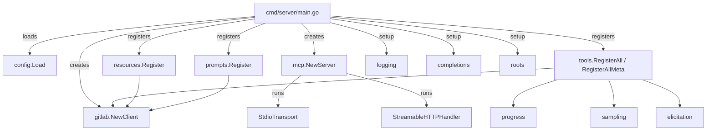

# Development Guide

> **Diataxis type**: How-to
> **Audience**: 🔧 Developers, contributors
> **Prerequisites**: Go 1.26+, GitLab instance with PAT, Git, Make

---

## Prerequisites

- **Go 1.26+** ([download](https://go.dev/dl/))
- **GitLab instance** with Personal Access Token (`api` scope)
- **Git** for version control
- **Make** for build automation (optional but recommended)

## Project Structure

```text
gitlab-mcp-server/
├── cmd/
│   ├── server/                  # MCP server entry point
│   │   ├── main.go              # Signal handling, transport selection
│   │   └── main_test.go         # Server startup and HTTP handler tests
│   ├── add_docs/                # AST tool: adds godoc comments to undocumented symbols
│   ├── audit_output/            # Audits MCP tool output quality (schema, annotations, descriptions)
│   ├── audit_test_names/        # Audits test function naming convention compliance
│   ├── audit_tools/             # Audits MCP tool metadata violations (naming, annotations)
│   ├── audit_metrics/           # Audits MCP tool annotation metrics and statistics
│   ├── find_dupes/              # Finds duplicated string literals missing constants
│   └── gen_llms/                # Generates llms.txt and llms-full.txt from tool metadata
├── internal/
│   ├── config/                  # Environment variable loading and validation
│   ├── gitlab/                  # GitLab API client wrapper with TLS support
│   ├── logging/                 # Structured MCP session logging
│   ├── completions/             # Autocomplete handler for 17 argument types
│   ├── roots/                   # Client workspace root tracking
│   ├── progress/                # Progress notification tracker
│   ├── sampling/                # LLM-assisted analysis client with security
│   ├── elicitation/             # Interactive user input client
│   ├── toolutil/                # Shared tool utilities (errors, pagination, markdown, logging)
│   ├── testutil/                # Shared test helpers (NewTestClient, RespondJSON)
│   ├── tools/                   # Tool orchestration layer + 162 domain sub-packages
│   │   ├── register.go          # RegisterAll() — delegates to sub-package RegisterTools()
│   │   ├── register_meta.go     # RegisterAllMeta() — 24 inline + 3 delegated + 1 standalone + 4 interactive = 32 meta-tools (47 with GITLAB_ENTERPRISE=true)
│   │   ├── metatool.go          # Local helpers addMetaTool/addReadOnlyMetaTool wrapping toolutil.DeriveAnnotations + route wrappers
│   │   ├── markdown.go          # markdownForResult dispatcher — type-switch over all outputs
│   │   ├── branches/            # Branch management tools (example sub-package)
│   │   ├── issues/              # Issue CRUD tools
│   │   ├── mergerequests/       # MR lifecycle tools
│   │   └── ...                  # 162 domain sub-packages total
│   ├── resources/               # 44 MCP resource handlers
│   └── prompts/                 # 38 MCP prompt handlers (12 core + 26 extended)
├── test/e2e/                    # End-to-end integration tests (suite/ + infra)
├── docs/                        # Documentation (this directory)
├── plan/                        # Implementation plans
├── VERSION                      # Single source of truth for project version
├── Makefile                     # Build automation
└── .env                         # Local secrets (gitignored)
```

## Architecture



1. **Config** loads settings from `.env` + environment variables
2. **GitLab Client** wraps the official `gitlab.com/gitlab-org/api/client-go/v2`
3. **Tools** register handlers via `mcp.AddTool()` with typed input/output structs
4. **Meta-tools** optionally group 1006 base tools into 32 domain meta-tools (47 with GITLAB_ENTERPRISE=true) (via ADR-0005)
5. **Resources** register read-only data via `AddResource()` / `AddResourceTemplate()`
6. **Prompts** register AI-optimized interactions via `AddPrompt()`
7. **Capabilities** provide logging, completions, roots, progress, sampling, and elicitation
8. **Server** runs over stdio (default) or HTTP (`--http`)

See [Architecture Overview](architecture.md) for detailed diagrams and component descriptions.

## Version Management

The project version is defined in the `VERSION` file at the repository root.

```text
VERSION           # Contains e.g. "1.1.7" — no "v" prefix, no trailing newline
  ├─ Makefile     # Reads VERSION → passes via -ldflags to go build
  ├─ .gitlab-ci   # Reads VERSION → prefers CI_COMMIT_TAG if set
  └─ binary       # Receives version at build time via -X main.version
```

```bash
make version                          # Print version from VERSION file
./dist/gitlab-mcp-server.exe --version    # Print from compiled binary
```

## Building

### Local build

```bash
make build
# Output: dist/gitlab-mcp-server.exe (Windows) or dist/gitlab-mcp-server (Linux)
```

Manual build:

```bash
go build -ldflags="-X main.version=$(cat VERSION) -X main.commit=$(git rev-parse --short HEAD)" -o dist/gitlab-mcp-server ./cmd/server
```

### Cross-compilation

```bash
make build-all
# Produces: linux-amd64, linux-arm64, windows-amd64, windows-arm64
```

### Docker

#### Build image from source

```bash
make docker-build

# Or with explicit version
docker build \
  --build-arg VERSION=$(cat VERSION) \
  --build-arg COMMIT=$(git rev-parse --short HEAD) \
  -t gitlab-mcp-server .
```

#### Run locally

```bash
make docker-run GITLAB_URL=https://gitlab.example.com
```

#### Development with live builds

Use the build override to compile from source inside Docker Compose instead of pulling the pre-built image:

```bash
docker compose -f docker-compose.yml -f docker-compose.build.yml up -d
```

#### Publish to Container Registry

Publish via Makefile or manually:

```bash
# Via Makefile
make docker-push

# Or manually
docker login ghcr.io -u "$GITHUB_USER" --password-stdin <<< "$GITHUB_TOKEN"
docker push ghcr.io/jmrplens/gitlab-mcp-server:1.7.1
docker push ghcr.io/jmrplens/gitlab-mcp-server:latest
```

## Testing

### Unit Tests

Unit tests live alongside the code in each sub-package. They use `net/http/httptest` to simulate GitLab API responses — **no real GitLab instance needed**.

```bash
make test            # Standard tests with coverage
make test-race       # Tests with race detector
go test ./internal/... -count=1      # Run all unit tests (~124 packages)
go test ./internal/tools/branches/ -count=1 -v  # Run one domain verbose
go test ./internal/tools/ -run TestBranch -count=1    # Run specific tests
```

#### Test pattern (sub-package style)

Each sub-package has its own `*_test.go` with table-driven tests:

```go
// internal/tools/branches/branches_test.go

func TestCreate_Success(t *testing.T) {
    client, mux := testutil.NewTestClient(t)
    mux.HandleFunc("/api/v4/projects/1/repository/branches", func(w http.ResponseWriter, r *http.Request) {
        testutil.RespondJSON(w, http.StatusOK, `{"name":"feature-x","commit":{"id":"abc123"}}`)
    })

    out, err := Create(context.Background(), client, CreateInput{
        ProjectID: "1",
        Branch:    "feature-x",
        Ref:       "main",
    })
    if err != nil {
        t.Fatalf("unexpected error: %v", err)
    }
    if out.Name != "feature-x" {
        t.Errorf("Name = %q, want %q", out.Name, "feature-x")
    }
}
```

#### Shared helpers (`internal/testutil/`)

| Helper                                  | Purpose                                      |
| --------------------------------------- | -------------------------------------------- |
| `testutil.NewTestClient(t)`             | Creates mock GitLab client + httptest mux     |
| `testutil.RespondJSON(w, code, body)`   | Writes JSON response with status code         |
| `testutil.RespondJSONWithPagination()`  | Writes JSON response with pagination headers  |

### End-to-End Tests

E2E tests run against a real GitLab instance via in-memory MCP transport (build tag `e2e`):

```bash
make test-e2e
# or: go test -v -tags e2e -timeout 300s ./test/e2e/suite/

# Compile-only check (no GitLab instance needed)
go test -tags e2e -c -o NUL ./test/e2e/suite/       # Windows
go test -tags e2e -c -o /dev/null ./test/e2e/suite/  # Linux
```

#### Docker Mode (Ephemeral GitLab)

Run the full E2E suite against an ephemeral GitLab CE container. Requires Docker and ~4 GB RAM. This mode also enables pipeline/job tests that need a CI runner.

```bash
make test-e2e-docker
```

This single command handles the full lifecycle: start GitLab CE container, wait for readiness, create test user/token, register CI runner, run tests, and tear down.

For manual step-by-step execution, see [E2E Docker Mode](testing.md#docker-mode) in the testing guide.

#### E2E Prerequisites

```env
GITLAB_URL=https://gitlab.example.com
GITLAB_TOKEN=glpat-your-token
GITLAB_SKIP_TLS_VERIFY=true
```

#### E2E Test Structure

| File                                 | Description                                                        |
| ------------------------------------ | ------------------------------------------------------------------ |
| `test/e2e/suite/setup_test.go`       | Shared state, MCP server setup, helpers, drainSidekiq              |
| `test/e2e/suite/fixture_test.go`     | Self-contained GitLab resource builders                             |
| `test/e2e/suite/*_test.go`           | 91 domain-specific test files (individual + meta)                   |

## MCP Inspector

The [MCP Inspector](https://modelcontextprotocol.io/docs/tools/inspector) provides a web UI for interactively testing MCP tools, resources, and prompts against a running server.

```bash
make inspector       # Compile fresh binary to /tmp, launch Inspector via stdio
make inspector-stop  # Stop Inspector processes and clean up temp binary
```

This compiles the server to a temporary binary (`/tmp/gitlab-mcp-server-inspector`), reads credentials from `.env`, and launches the Inspector at `http://127.0.0.1:6274/`. The temporary binary is automatically cleaned up on exit.

**Prerequisites**: Node.js >= 22, `.env` file with `GITLAB_URL` and `GITLAB_TOKEN`.

## Linting & Formatting

```bash
make lint    # go vet ./...
make fmt     # gofmt -s -w .
```

## Error Handling in Tool Handlers

All error wrapping functions live in `internal/toolutil/errors.go`. Choose the right function based on this decision tree:

```text
Is the operation read-only (list, get, search)?
  └─ YES → WrapErr(op, err)
  └─ NO (mutating: create, update, delete) →
       Do you know a specific corrective action for a likely status code?
         └─ YES → Does the hint apply to a single HTTP status code?
              └─ YES → WrapErrWithStatusHint(op, err, code, hint)
              └─ NO  → Check status with IsHTTPStatus(), then WrapErrWithHint(op, err, hint)
         └─ NO  → WrapErrWithMessage(op, err)
```

### Quick reference

| Function | When to use | Includes GitLab detail | Includes hint |
| --- | --- | --- | --- |
| `WrapErr` | Read-only operations | No | No |
| `WrapErrWithMessage` | Mutating operations (default) | Yes | No |
| `WrapErrWithHint` | Specific error with known fix | Yes | Yes |
| `WrapErrWithStatusHint` | Status-specific hint (combines `IsHTTPStatus` + `WrapErrWithHint`) | Yes | Yes (for matching status) |

### Pattern: Status-specific hints

```go
if toolutil.IsHTTPStatus(err, 409) {
    return Output{}, toolutil.WrapErrWithHint("labelCreate", err,
        "label with this name already exists — use gitlab_label_update to modify it")
}
return Output{}, toolutil.WrapErrWithMessage("labelCreate", err)
```

### Pattern: Single-status hint (shorthand)

```go
// Equivalent to the above but in a single call — returns WrapErrWithMessage for non-409 errors
return Output{}, toolutil.WrapErrWithStatusHint("labelCreate", err, 409,
    "label with this name already exists — use gitlab_label_update to modify it")
```

### Helpers

- `IsHTTPStatus(err, code)` — checks if the error chain contains a `gl.ErrorResponse` with the given HTTP status
- `ContainsAny(err, substrs...)` — checks if `err.Error()` contains any of the given substrings
- `ExtractGitLabMessage(err)` — extracts the specific message from `gl.ErrorResponse.Message`

See [Error Handling](../error-handling.md) for the full architecture.

## Adding a New Tool

With the modular sub-package architecture (ADR-0004):

1. **Create sub-package**: `internal/tools/{domain}/`
2. **Create handler file**: `{domain}.go` with typed input/output structs (no domain prefix — package provides namespace)
3. **Create test file**: `{domain}_test.go` with table-driven tests using `testutil.NewTestClient`
4. **Create register file**: `register.go` with `RegisterTools(server, client)` and optionally `RegisterMeta(server, client)`
5. **Create markdown formatters**: `Format*Markdown()` functions in the sub-package
6. **Wire in orchestration**:
   - Add to `internal/tools/register.go` (call `{domain}.RegisterTools()`)
   - Add to `internal/tools/register_meta.go` (call `{domain}.RegisterMeta()`)
   - Add markdown dispatch in `internal/tools/markdown.go`
7. **Update documentation**: `docs/tools/{domain}.md` and `docs/tools/README.md`

### Example: Adding a tools sub-package

```go
// internal/tools/branches/branches.go

package branches

type CreateInput struct {
    ProjectID string `json:"project_id" jsonschema:"Project ID or URL-encoded path"`
    Branch    string `json:"branch"     jsonschema:"Branch name to create"`
    Ref       string `json:"ref"        jsonschema:"Source branch or commit SHA"`
}

type Output struct {
    Name   string `json:"name"`
    Commit string `json:"commit"`
    WebURL string `json:"web_url"`
}

func Create(ctx context.Context, client *gitlabclient.Client, input CreateInput) (Output, error) {
    if err := ctx.Err(); err != nil {
        return Output{}, err
    }
    // GitLab API call...
    return Output{}, nil
}
```

```go
// internal/tools/branches/register.go

package branches

func RegisterTools(server *mcp.Server, client *gitlabclient.Client) {
    mcp.AddTool(server, &mcp.Tool{
        Name:        "gitlab_create_branch",
        Description: "Create a new branch in a GitLab project.",
        Annotations: toolutil.CreateAnnotations,
    }, func(ctx context.Context, req *mcp.CallToolRequest, input CreateInput) (*mcp.CallToolResult, Output, error) {
        start := time.Now()
        out, err := Create(ctx, client, input)
        toolutil.LogToolCallAll(ctx, req, "gitlab_create_branch", start, err)
        return toolutil.ToolResultWithMarkdown(FormatOutputMarkdown(out)), out, err
    })
}
```

## Environment Setup

### Local development

1. Clone the repository
2. Create `.env` with your GitLab credentials
3. Run `go mod download`
4. Build: `make build`
5. Run: `dist/gitlab-mcp-server`

### IDE setup (VS Code)

Install the Go extension and add to `.vscode/mcp.json`:

```json
{
  "servers": {
    "gitlab-dev": {
      "type": "stdio",
      "command": "${workspaceFolder}/dist/gitlab-mcp-server.exe",
      "env": {
        "GITLAB_URL": "https://your-gitlab",
        "GITLAB_TOKEN": "glpat-your-token",
        "GITLAB_SKIP_TLS_VERIFY": "true",
        "META_TOOLS": "true"
      }
    }
  }
}
```

## Git Workflow

- **Conventional commits**: `feat:`, `fix:`, `docs:`, `test:`, `refactor:`, `chore:`
- **Feature branches**: `feature/tool-name`, `fix/description`
- **Main branch**: Protected, merge via pull requests

## Dependencies

| Dependency                               | Version | Purpose                          |
| ---------------------------------------- | ------- | -------------------------------- |
| `github.com/modelcontextprotocol/go-sdk` | v1.5.0  | MCP server framework             |
| `gitlab.com/gitlab-org/api/client-go/v2`  | v2.20.1  | Official GitLab REST API client  |
| `github.com/joho/godotenv`               | v1.5.1  | .env file loading for dev        |

## External References

| Resource | URL |
| --- | --- |
| MCP Specification (2025-11-25) | <https://modelcontextprotocol.io/specification/2025-11-25/> |
| MCP Go SDK (pkg.go.dev) | <https://pkg.go.dev/github.com/modelcontextprotocol/go-sdk> |
| MCP Go SDK Repository | <https://github.com/modelcontextprotocol/go-sdk> |
| GitLab REST API v4 | <https://docs.gitlab.com/ee/api/rest/> |
| GitLab Go Client (pkg.go.dev) | <https://pkg.go.dev/gitlab.com/gitlab-org/api/client-go/v2> |
| GitLab Go Client Repository | <https://gitlab.com/gitlab-org/api/client-go> |
