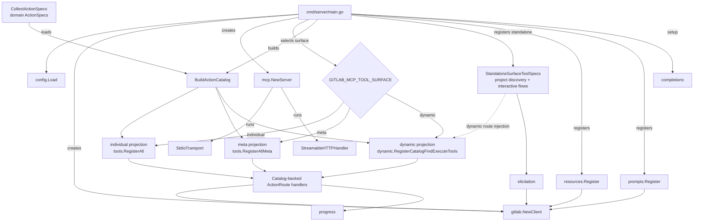
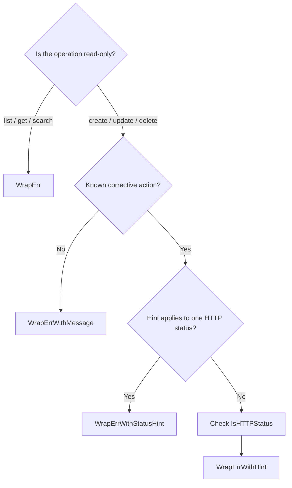

# Development Guide

> **Diátaxis type**: How-to
> **Audience**: 🔧 Developers, contributors
> **Prerequisites**: Go 1.27+, Node.js 24.18+, GitLab instance with PAT, Git, Make

---

## Prerequisites

- **Go 1.27+** ([download](https://go.dev/dl/))
- **Node.js 24.18+ with Corepack** for the documentation site and MCP Inspector. The site uses `pnpm@11.25.0` (the `packageManager` field in `site/package.json` is authoritative); keep pnpm configuration in `site/pnpm-workspace.yaml` rather than the `pnpm` field in `package.json`.
- **GitLab instance** with Personal Access Token (`api` scope)
- **Git** for version control
- **Make** for build automation (optional but recommended)

## Project Structure

> See [cmd-utilities.md](cmd-utilities.md) for the full CLI reference of every `cmd/` binary (flags, usage, Make targets).

```text
gitlab-mcp-server/
├── cmd/
│   ├── server/                  # MCP server entry point
│   │   ├── main.go              # Signal handling, transport selection
│   │   └── main_test.go         # Server startup and HTTP handler tests
│   ├── audit_1to1/              # Consolidated 1:1 SDK↔API parity audit (-scope structs|actions|metadata|enums|sdk)
│   ├── audit_catalog_first/     # ActionSpec catalog coverage inventory
│   ├── audit_discovery_completeness/ # Discovery metadata audit with cluster-aware severity (META-001)
│   ├── audit_doc_coverage/      # docs/reference/tools/*.md vs catalog coverage gaps (DOC-002)
│   ├── audit_doc_tool_names/    # Every gitlab_* name the docs mention is a registered tool
│   ├── audit_dynamic_aliases/   # Dynamic alias collision governance
│   ├── audit_e2e_gaps/          # Catalog actions the e2e suite never exercises
│   ├── audit_edition_tier/      # Doc-grounded Free/Premium/Ultimate tier audit
│   ├── audit_gateway_chars/     # Served text carries no character a gateway validator rejects
│   ├── audit_install_buttons/   # One-click install buttons decode to one configuration per command
│   ├── audit_metrics/           # MCP tool/resource/prompt metrics summary (+ -site-stats)
│   ├── audit_readonly_graphql/  # No ReadOnly action can reach a GraphQL mutation
│   ├── audit_string_dupes/      # Finds duplicated string literals missing constants
│   ├── audit_supply_chain/      # Release-configuration invariants (pinned actions, locked release jobs, ...)
│   ├── audit_surface_quality/   # Surface quality audit (-view metadata|output|all)
│   ├── audit_test_goroutines/   # testing.T aborts made off the test goroutine
│   ├── audit_test_names/        # Test function naming compliance (+ -check-files for test-file names)
│   ├── audit_test_subtests/     # Case loops that assert without a t.Run subtest (+ -fix)
│   ├── audit_tokens/            # Token overhead audit (+ --compare-schemas sizing spike, -footprint)
│   ├── bench_resources/         # Measures what the server costs to run; draws the published charts
│   ├── eval_mcp_surfaces/       # Model-facing MCP surface evaluation harness
│   ├── format_md_tables/        # Normalizes Markdown pipe tables
│   ├── gen_action_catalog_manifest/ # Generates ActionSpec manifest
│   ├── gen_brand/               # Emits every vector brand asset from one parametric geometry
│   ├── gen_docker_tools/        # Generates Docker MCP Registry tools.json
│   ├── gen_icon_webp/           # Light/dark WebP icon fallbacks (maintainer-only)
│   ├── gen_lhm_manifest/        # Generates the LobeHub manifest capability arrays
│   ├── gen_llms/                # Generates llms.txt and llms-full.txt
│   ├── gen_stats/               # Regenerates README stats section
│   ├── gen_testing_docs/        # Regenerates testing.md managed sections
│   ├── godoc_tool/              # Go doc auditor + fixer (audit/fix subcommands)
│   └── internal/                # Shared helpers for the commands above (apidocs, auditshared, docgen, mcpsurface)
├── internal/
│   ├── config/                  # Environment variable loading and validation
│   ├── gitlab/                  # GitLab API client wrapper with TLS support
│   ├── completions/             # Autocomplete handler for 18 argument names
│   ├── progress/                # Progress notification tracker
│   ├── elicitation/             # Interactive user input client
│   ├── toolutil/                # Shared tool utilities (errors, pagination, markdown, logging)
│   ├── testutil/                # Shared test helpers (NewTestClient, RespondJSON)
│   ├── tools/                   # Tool orchestration layer + 178 packages under internal/tools/... (168 with action_specs.go)
│   │   ├── register.go          # RegisterAll() — catalog-backed individual tool projection
│   │   ├── register_meta.go     # RegisterAllMeta() — catalog-backed meta-tool groups and standalone surfaces
│   │   ├── meta_tool.go          # Local helpers addMetaTool/addReadOnlyMetaTool wrapping toolutil.DeriveAnnotations + route wrappers
│   │   ├── markdown.go          # markdownForResult delegator to toolutil.MarkdownForResult
│   │   ├── branches/            # Branch management tools (example sub-package)
│   │   ├── issues/              # Issue CRUD tools
│   │   ├── mergerequests/       # MR lifecycle tools
│   │   └── ...                  # 178 packages under internal/tools/... in total
│   ├── resources/               # 45 MCP resource handlers
│   └── prompts/                 # 37 MCP prompt handlers
├── test/e2e/                    # End-to-end integration tests (suite/ + infra)
├── docs/                        # Documentation (this directory)
├── plan/                        # Implementation plans
├── VERSION                      # Single source of truth for project version
├── Makefile                     # Build automation
└── .env                         # Local secrets (gitignored)
```

Meta-tool counts are additive: 32 base tools, 17 Enterprise/Premium-specific meta-tools for 49 on self-managed GitLab, plus the GitLab.com-only Orbit meta-tool for 50 when Orbit is available.

## Architecture


```mermaid
graph TD
    MAIN[cmd/server/main.go] -->|loads| CFG[config.Load]
    MAIN -->|creates| GL[gitlab.NewClient]
    MAIN -->|creates| SRV[mcp.NewServer]
    MAIN -->|selects surface| SURFACE{GITLAB_MCP_TOOL_SURFACE}
    SPECS[CollectActionSpecs<br/>domain ActionSpecs] --> CATALOG[BuildActionCatalog]
    MAIN -->|builds| CATALOG
    CATALOG --> IND[individual projection<br/>tools.RegisterAll]
    CATALOG --> META[meta projection<br/>tools.RegisterAllMeta]
    CATALOG --> DYN[dynamic projection<br/>dynamic.RegisterCatalogFindExecuteTools]
    STANDALONE[StandaloneSurfaceToolSpecs<br/>project discovery + interactive flows] -.->|dynamic route injection| DYN
    SURFACE -->|individual| IND
    SURFACE -->|meta| META
    SURFACE -->|dynamic| DYN
    IND --> PROJECTION[Catalog-backed ActionRoute handlers]
    META --> PROJECTION
    DYN --> PROJECTION
    MAIN -->|registers standalone| STANDALONE
    MAIN -->|registers| RES[resources.Register]
    MAIN -->|registers| PROMPTS[prompts.Register]
    MAIN -->|setup| COMP[completions]
    SRV -->|runs| STDIO[StdioTransport]
    SRV -->|runs| HTTP[StreamableHTTPHandler]
    PROJECTION --> GL
    PROJECTION --> PROG[progress]
    STANDALONE --> ELIC[elicitation]
    ELIC --> GL
    RES --> GL
    PROMPTS --> GL
```

1. **Config** loads settings from environment variables, then `GITLAB_MCP_ENV_FILE`, then `~/.gitlab-mcp-server.env`; the repository's own `.env` is for the Makefile targets, not for the server
2. **GitLab Client** wraps the official `gitlab.com/gitlab-org/api/client-go/v2`
3. **Tools** are projected from domain-local `ActionSpecs` through the canonical action catalog
4. **Meta-tools** group catalog actions into 32 base tools (49 on self-managed Enterprise/Premium, 50 on GitLab.com Enterprise/Premium with Orbit) (via ADR-0005)
5. **Resources** register read-only data via `AddResource()` / `AddResourceTemplate()`
6. **Prompts** register AI-optimized interactions via `AddPrompt()`
7. **Capabilities** provide completions, progress, elicitation, and resource subscriptions
8. **Server** runs over stdio (default) or HTTP (`--http`, or `--transport auto`, which serves HTTP only when stdin is `/dev/null`)

See [Architecture Overview](../concepts/architecture.md) for detailed diagrams and component descriptions.

## Version Management

The project version is defined in the `VERSION` file at the repository root.

**Major-version policy**: the server's major tracks the major of
`gitlab.com/gitlab-org/api/client-go`, the GitLab API client it is built on.
When client-go releases v3 (which drops its deprecated fields), this project
moves to v3 in the same dependency bump — that release also removes the
deprecated compatibility fields kept during the v2 cycle (e.g. the flat
copies in the dual-shape group Datadog output). All other dependency updates
ship as minor or patch releases.

```text
VERSION                  # Contains e.g. "2.7.5" — no "v" prefix, no trailing newline
  ├─ Makefile            # Reads VERSION → passes via -ldflags to go build
  ├─ release.yml         # Holds the tag (or the rehearsal input) to VERSION before anything is built
  ├─ .goreleaser.yml     # Stamps {{.Version}} from the tag (or VERSION on a snapshot) via -X main.version
  └─ binary              # Receives version at build time via -X main.version
```

```bash
make version                          # Print version from VERSION file
./dist/gitlab-mcp-server.exe --version    # Print from compiled binary
```

## Building

### Local build

```bash
make build
# Output: dist/gitlab-mcp-server.exe (Windows) or dist/gitlab-mcp-server (Linux)
```

Manual build:

```bash
go build -ldflags="-X main.version=$(cat VERSION) -X main.commit=$(git rev-parse --short HEAD)" -o dist/gitlab-mcp-server ./cmd/server
```

### Cross-compilation

```bash
make build-all
# Produces: linux-amd64, linux-arm64, windows-amd64, windows-arm64, darwin-amd64, darwin-arm64
```

### Docker

#### Build image from source

```bash
make docker-build

# Or with explicit version
docker build \
  --build-arg VERSION=$(cat VERSION) \
  --build-arg COMMIT=$(git rev-parse --short HEAD) \
  -t gitlab-mcp-server .
```

#### Run locally

```bash
make docker-run
# or, for self-managed GitLab:
make docker-run GITLAB_URL=https://gitlab.example.com
```

#### Development with live builds

Use the build override to compile from source inside Docker Compose instead of pulling the pre-built image:

```bash
docker compose -f docker-compose.yml -f docker-compose.build.yml up -d
```

#### Publish to Container Registry

Publish via Makefile or manually:

```bash
# Via Makefile (DOCKER_REGISTRY is required; it builds and pushes VERSION and latest)
make docker-push DOCKER_REGISTRY=ghcr.io/jmrplens/gitlab-mcp-server

# Or manually
docker login ghcr.io -u "$GITHUB_USER" --password-stdin <<< "$GITHUB_TOKEN"
docker push "ghcr.io/jmrplens/gitlab-mcp-server:$(cat VERSION)"
docker push ghcr.io/jmrplens/gitlab-mcp-server:latest
```

## Testing

### Unit Tests

Unit tests live alongside the code in each sub-package. They use `net/http/httptest` to simulate GitLab API responses — **no real GitLab instance needed**.

```bash
make test            # Standard tests with coverage
make test-race       # Tests with race detector (RACE_TIMEOUT=60m per package; the suite takes the better part of an hour)
make coverage-conditions PKG=./internal/foo   # gobco: boolean conditions never evaluated both ways (each is a missing case)
make coverage-mutants PKG=./internal/foo      # gremlins: mutation testing; Lived 0 and Not covered 0 is the gate on a changed package
go test ./internal/... -count=1      # Run all unit tests (199 packages)
go test ./internal/tools/branches/ -count=1 -v  # Run one domain verbose
go test ./internal/tools/ -run TestBranch -count=1    # Run specific tests
```

#### Test pattern (sub-package style)

Each sub-package has its own `*_test.go` with table-driven tests:

```go
// internal/tools/branches/branches_test.go

func TestCreate_Success(t *testing.T) {
    mux := http.NewServeMux()
    mux.HandleFunc("/api/v4/projects/1/repository/branches", func(w http.ResponseWriter, r *http.Request) {
        testutil.RespondJSON(w, http.StatusCreated, `{"name":"feature-x","commit":{"id":"abc123"}}`)
    })
    client := testutil.NewTestClient(t, mux) // the httptest server is closed by t.Cleanup

    out, err := Create(context.Background(), client, CreateInput{
        ProjectID:  "1",
        BranchName: "feature-x",
        Ref:        "main",
    })
    if err != nil {
        t.Fatalf("unexpected error: %v", err)
    }
    if out.Name != "feature-x" {
        t.Errorf("Name = %q, want %q", out.Name, "feature-x")
    }
}
```

#### Shared helpers (`internal/testutil/`)

| Helper                                 | Purpose                                                                                        |
| -------------------------------------- | ---------------------------------------------------------------------------------------------- |
| `testutil.NewTestClient(t, handler)`   | Creates a GitLab client against an httptest server backed by `handler`, closed via `t.Cleanup` |
| `testutil.RespondJSON(w, code, body)`  | Writes JSON response with status code                                                          |
| `testutil.RespondJSONWithPagination()` | Writes JSON response with pagination headers                                                   |

### End-to-End Tests

E2E tests run against a real GitLab instance via in-memory MCP transport (build tag `e2e`):

```bash
make test-e2e
# or: go test -v -tags e2e -timeout 300s ./test/e2e/suite/

# Compile-only check (no GitLab instance needed)
go test -tags e2e -c -o NUL ./test/e2e/suite/       # Windows
go test -tags e2e -c -o /dev/null ./test/e2e/suite/  # Linux
```

#### Docker Mode (Ephemeral GitLab)

Run the full E2E suite against an ephemeral GitLab CE container. Requires Docker and ~4 GB RAM. This mode also enables pipeline/job tests that need a CI runner.

```bash
make test-e2e-docker
```

This single command handles the full lifecycle: start GitLab CE container, wait for readiness, create test user/token, register CI runner, run tests, and tear down.

For manual step-by-step execution, see [Docker Mode](../../test/e2e/README.md#docker-mode) in the E2E README.

#### E2E Prerequisites

```env
GITLAB_URL=https://gitlab.example.com
GITLAB_TOKEN=glpat-your-token
GITLAB_MCP_SKIP_TLS_VERIFY=true
```

#### E2E Test Structure

| File                                | Description                                                     |
| ----------------------------------- | --------------------------------------------------------------- |
| `test/e2e/suite/setup_test.go`      | Shared state, MCP server setup, helpers, drainSidekiq           |
| `test/e2e/suite/fixture_ce_test.go` | Self-contained GitLab CE resource builders                      |
| `test/e2e/suite/fixture_ee_test.go` | Self-contained GitLab EE resource builders                      |
| `test/e2e/suite/*_test.go`          | 169 further test files (individual, meta and dynamic workflows) |

## MCP Inspector

The [MCP Inspector](https://modelcontextprotocol.io/docs/reference/tools/inspector) provides a web UI for interactively testing MCP tools, resources, and prompts against a running server.

```bash
make inspector       # Compile fresh binary to /tmp, launch Inspector via stdio
make inspector-stop  # Stop Inspector processes and clean up temp binary
```

This compiles the server to a temporary binary (`/tmp/gitlab-mcp-server-inspector`), reads credentials from `.env`, and launches the Inspector at `http://127.0.0.1:6274/`. The temporary binary is automatically cleaned up on exit.

**Prerequisites**: Node.js >= 22, `.env` file with `GITLAB_TOKEN`. Add `GITLAB_URL` for self-managed instances.

## Linting & Formatting

```bash
make lint         # golangci-lint config, format diff, and run
make fmt          # apply configured Go formatters through golangci-lint
make analyze-fix  # apply supported Go and Markdown fixes
```

## Error Handling in Tool Handlers

All error wrapping functions live in `internal/toolutil/errors.go`. Choose the right function based on this decision tree:


```mermaid
flowchart TD
    start{Is the operation read-only?}
    start -->|list / get / search| wrapErr[WrapErr]
    start -->|create / update / delete| hasHint{Known corrective action?}
    hasHint -->|No| wrapMsg[WrapErrWithMessage]
    hasHint -->|Yes| statusHint{Hint applies to one HTTP status?}
    statusHint -->|Yes| wrapStatus[WrapErrWithStatusHint]
    statusHint -->|No| checkStatus[Check IsHTTPStatus]
    checkStatus --> wrapHint[WrapErrWithHint]
```

### Quick reference

| Function                | When to use                                                        | Includes GitLab detail | Includes hint             |
| ----------------------- | ------------------------------------------------------------------ | ---------------------- | ------------------------- |
| `WrapErr`               | Read-only operations                                               | No                     | No                        |
| `WrapErrWithMessage`    | Mutating operations (default)                                      | Yes                    | No                        |
| `WrapErrWithHint`       | Specific error with known fix                                      | Yes                    | Yes                       |
| `WrapErrWithStatusHint` | Status-specific hint (combines `IsHTTPStatus` + `WrapErrWithHint`) | Yes                    | Yes (for matching status) |

### Pattern: Status-specific hints

```go
if toolutil.IsHTTPStatus(err, 409) {
    return Output{}, toolutil.WrapErrWithHint("labelCreate", err,
        "label with this name already exists — use gitlab_label_update to modify it")
}
return Output{}, toolutil.WrapErrWithMessage("labelCreate", err)
```

### Pattern: Single-status hint (shorthand)

```go
// Equivalent to the above but in a single call — returns WrapErrWithMessage for non-409 errors
return Output{}, toolutil.WrapErrWithStatusHint("labelCreate", err, 409,
    "label with this name already exists — use gitlab_label_update to modify it")
```

### Helpers

- `IsHTTPStatus(err, code)` — checks if the error chain contains a `gl.ErrorResponse` with the given HTTP status
- `ContainsAny(err, substrs...)` — checks if `err.Error()` contains any of the given substrings
- `ExtractGitLabMessage(err)` — extracts the specific message from `gl.ErrorResponse.Message`

See [Error Handling](../concepts/error-handling.md) for the full architecture.

## Adding a New Tool

With the catalog-first modular sub-package architecture:

1. **Create sub-package**: `internal/tools/{domain}/`
2. **Create handler file**: `{domain}.go` with typed input/output structs (no domain prefix — package provides namespace)
3. **Create test file**: `{domain}_test.go` with table-driven tests using `testutil.NewTestClient`
4. **Create ActionSpecs**: define `ActionSpecs(client, ...)` or update the owning aggregation builder with typed `ActionRoute` constructors and individual projection metadata
5. **Create markdown formatters**: register output formatters from the sub-package with `toolutil.RegisterMarkdown` or `toolutil.RegisterMarkdownResult`
6. **Regenerate catalog manifest**: run `make gen-action-catalog-manifest` when the source-defined builder set changes, then run `make check-action-catalog-manifest`
7. **Update documentation**: `docs/reference/tools/{domain}.md` and `docs/reference/tools/README.md`

Meta-tools and the dynamic toolset share the canonical action catalog built by `internal/tools/action_catalog.go`.
When adding a normal GitLab operation, define the route once inside the owning `ActionSpec` with typed `ActionRoute` constructors (`RouteAction`, `DestructiveAction`, `RouteActionWithRequest`, and void variants). The same catalog entry then powers the individual tool projection, visible meta-tool action, `gitlab_find_action`, `gitlab_execute_action`, the `gitlab://tools` manifest, generated LLM files, and audit commands. Do not create package-local `RegisterTools` functions or dynamic-only copies of ordinary GitLab actions.

See [Tool Surfaces And Canonical Action Core](tool-surfaces-and-action-core.md) for the ownership rules across individual tools, meta-tools, dynamic mode, and the canonical action catalog.

### Orbit live-test fixtures

The `orbitlive` build-tagged live tests in `test/e2e/orbit/live_test.go` exercise the real `https://gitlab.com/api/v4/orbit/*` endpoints. They expect two projects in the configured namespace (`kg-fixtures` and `security-fixtures`) with a specific shape, plus optional mirror data. The reproduction script, the expected fixture layout, and the indexer caveat (transient `error` state) are documented in [Orbit Live Test Fixtures](orbit-fixtures.md).

To run the full flow against GitLab.com — token validation, idempotent fixture provisioning, indexer catch-up wait, then the four live test suites (41 subtests) — use the orchestrated target:

```bash
# Add a Personal Access Token (api scope) to .env first
echo 'GITLAB_COM_TOKEN=glpat-...' >> .env

# Provision fixtures in your own namespace and run the live tests
make test-e2e-gitlab-com ORBIT_FIXTURES_NAMESPACE=acme-research

# When fixtures are already provisioned, skip setup and run only the tests
GITLAB_COM_TOKEN=glpat-... \
  go test -tags orbitlive -count=1 -v -timeout 300s ./test/e2e/orbit/
```

`make test-e2e-gitlab-com` chains four sub-targets: `orbit-ensure-token` (validates `GITLAB_COM_TOKEN` is exported), `orbit-setup-fixtures` (runs `scripts/setup-orbit-fixtures.sh`), `orbit-wait-indexer` (polls `/api/v4/orbit/graph_status` until the indexer reports the projects as indexed), and `orbit-run-live-tests` (runs `go test -tags orbitlive ...`). Each sub-target is independently runnable.

### Example: Adding a tools sub-package

```go
// internal/tools/branches/branches.go

package branches

type CreateInput struct {
    ProjectID  toolutil.StringOrInt `json:"project_id"  jsonschema:"Project ID or URL-encoded path,required"`
    BranchName string               `json:"branch_name" jsonschema:"New branch name,required"`
    Ref        string               `json:"ref"         jsonschema:"Branch name, tag, or commit SHA to create from,required"`
}

type Output struct {
    Name   string `json:"name"`
    Commit string `json:"commit"`
    WebURL string `json:"web_url"`
}

func Create(ctx context.Context, client *gitlabclient.Client, input CreateInput) (Output, error) {
    if err := ctx.Err(); err != nil {
        return Output{}, err
    }
    // GitLab API call...
    return Output{}, nil
}
```

```go
// internal/tools/branches/action_specs.go

package branches

func ActionSpecs(client *gitlabclient.Client) []toolutil.ActionSpec {
    route := toolutil.RouteAction(client, Create).
        WithUsage("Use to create a branch from an existing branch, tag, or commit SHA.")

    return []toolutil.ActionSpec{
        toolutil.NewActionSpec("create", route, toolutil.ActionSpecOptions{
            ReadOnly:     false,
            Idempotent:   false,
            OwnerPackage: "branches",
            IndividualTool: toolutil.IndividualToolSpec{
                Name:        "gitlab_branch_create",
                Title:       "Create branch",
                Description: "Create a new branch in a GitLab project.",
            },
        }),
    }
}
```

## Environment Setup

### Local development

1. Clone the repository
2. Create `.env` with your GitLab credentials
3. Run `go mod download`
4. Build: `make build`
5. Run: `dist/gitlab-mcp-server`

### IDE setup (VS Code)

Install the Go extension and add to `.vscode/mcp.json`:

```json
{
  "servers": {
    "gitlab-dev": {
      "type": "stdio",
      "command": "${workspaceFolder}/dist/gitlab-mcp-server.exe",
      "env": {
        "GITLAB_URL": "https://your-gitlab",
        "GITLAB_TOKEN": "glpat-your-token",
        "GITLAB_MCP_SKIP_TLS_VERIFY": "true",
        "GITLAB_MCP_TOOL_SURFACE": "meta"
      }
    }
  }
}
```

## Git Workflow

- **Conventional commits**: `feat:`, `fix:`, `docs:`, `test:`, `refactor:`, `chore:`
- **Feature branches**: `feature/tool-name`, `fix/description`
- **Main branch**: Protected, merge via pull requests

## Dependencies

| Dependency                               | Version | Purpose                         |
| ---------------------------------------- | ------- | ------------------------------- |
| `github.com/modelcontextprotocol/go-sdk` | v1.7.0  | MCP server framework            |
| `gitlab.com/gitlab-org/api/client-go/v2` | v2.62.0 | Official GitLab REST API client |
| `github.com/joho/godotenv`               | v1.5.1  | .env file loading for dev       |

## External References

| Resource                       | URL                                                         |
| ------------------------------ | ----------------------------------------------------------- |
| MCP Specification (2026-07-28) | <https://modelcontextprotocol.io/specification/2026-07-28/> |
| MCP Go SDK (pkg.go.dev)        | <https://pkg.go.dev/github.com/modelcontextprotocol/go-sdk> |
| MCP Go SDK Repository          | <https://github.com/modelcontextprotocol/go-sdk>            |
| GitLab REST API v4             | <https://docs.gitlab.com/ee/api/rest/>                      |
| GitLab Go Client (pkg.go.dev)  | <https://pkg.go.dev/gitlab.com/gitlab-org/api/client-go/v2> |
| GitLab Go Client Repository    | <https://gitlab.com/gitlab-org/api/client-go>               |
