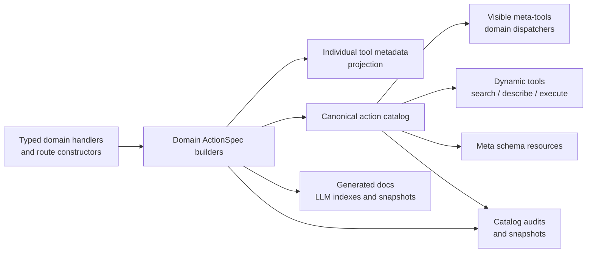
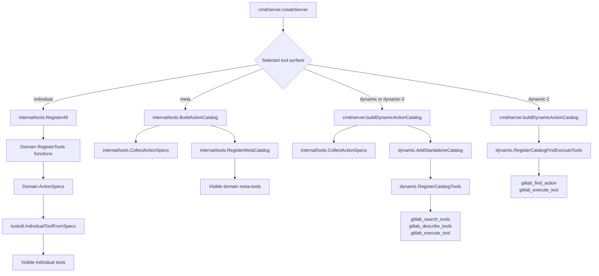

# Tool Surfaces And Canonical Action Core

> **Diátaxis type**: Explanation
> **Audience**: Developers and AI agents changing GitLab tool registration
> **Prerequisites**: Familiarity with MCP tools, Go packages, and the project architecture

gitlab-mcp-server exposes the GitLab API through multiple MCP tool surfaces. The
surfaces differ in packaging and discovery behavior, not in the underlying
GitLab business logic.

## Tool Surfaces

| Surface | Selector | Visible MCP tools | Source of action metadata |
| --- | --- | ---: | --- |
| Individual tools | `TOOL_SURFACE=individual` (`META_TOOLS=false` legacy) | One tool per GitLab operation | Domain `RegisterTools` handlers with tool metadata projected from `ActionSpec` |
| Meta-tools | default, `TOOL_SURFACE=meta` | Domain dispatchers with `action` and `params` | Canonical action catalog |
| Dynamic / dynamic-3 | `TOOL_SURFACE=dynamic` or `TOOL_SURFACE=dynamic-3` | `gitlab_search_tools`, `gitlab_describe_tools`, `gitlab_execute_tool` | Canonical action catalog |
| Dynamic-2 | `TOOL_SURFACE=dynamic-2` | `gitlab_find_action`, `gitlab_execute_tool` | Canonical action catalog |

Individual tools are still registered by their domain packages so handler
ownership and compatibility behavior stay local. The visible MCP tool metadata,
including title, description, icons, schemas, and annotations, is projected from
the same `ActionSpec` records that feed meta-tools and dynamic mode. Meta-tools
and dynamic tools are catalog-backed surfaces over the same action core.

Catalog-first generation for individual tools has moved from deferred design to
metadata parity policy. Domain packages keep explicit handler registration, but
new and existing individual tools must derive their metadata from specs unless
they are documented non-GitLab standalone surfaces. See
[Catalog-First Individual Tools Evaluation](catalog-first-individual-tools.md)
for the parity checklist and current generation policy.

## Canonical Action Core

The canonical action core is the intermediate layer between typed GitLab domain
handlers and catalog-backed MCP surfaces.



The core pieces are:

| File | Responsibility |
| --- | --- |
| `internal/toolutil/action_spec.go` | Canonical per-action metadata model, validation, defensive cloning, and projection back to legacy route maps |
| `internal/toolutil/action_spec_individual.go` | `ActionSpec` projection into individual `mcp.Tool` metadata and schema/annotation policy |
| `internal/toolutil/metatool.go` | Route primitives such as `ActionRoute`, `ActionMap`, schema helpers, destructive confirmation dispatch, and `MakeMetaHandler` |
| `internal/tools/actioncatalog/catalog.go` | Canonical action catalog data model, deterministic ordering, filters, and `domain.action` IDs |
| `internal/tools/action_specs.go` | Deterministic collector for domain `ActionSpec` builders, including Enterprise and GitLab.com gating |
| `internal/tools/action_catalog.go` | Captures meta route definitions, prefers matching specs, and fails when a spec targets a missing route |
| `internal/tools/meta_catalog.go` | Registers visible meta-tools from catalog groups |
| `internal/tools/dynamic/register.go` | Builds the dynamic registry, search index, describe output, and execute dispatch from the catalog |
| `internal/tools/dynamic/standalone.go` | Adds dynamic-only catalog actions that do not fit the normal meta route model |
| `cmd/audit_action_spec_coverage` | Generates source-discovered ActionSpec coverage inventory across individual, meta, dynamic, and standalone surfaces |

The catalog stores executable routes with input schemas, output schemas,
destructive flags, read-only status, icons, descriptions, aliases, tags, usage
hints, related actions, schema resource links, individual-tool compatibility
metadata, content policy placeholders, and formatters. Dynamic action IDs use
stable `domain.action` names such as `project.create`, `merge_request.list`,
and `repository.file_get`.

Every normal GitLab API action in the catalog is now backed by an `ActionSpec`.
Every normal individual GitLab API tool derives its MCP metadata from an
`ActionSpec` projection. The only documented source-level exceptions are the
dynamic catalog search/describe/execute surface and the server auto-update
surface, which is wired from `cmd/server` with an updater instead of a GitLab
client.
Standalone dynamic actions such as `discover_project.resolve` and interactive
elicitation flows are added through their own spec builders before dynamic mode
registers visible tools.

## Registration Flow

`cmd/server/main.go` selects one tool surface when the server is created.



## Action Spec Builder Ownership

Action spec builders are the boundary between domain handler packages and the
canonical action catalog. A builder owns route wiring, aliases, tags, usage
hints, related actions, parameter guidance, read-only status, destructive route
classification, individual-tool compatibility metadata, and Enterprise/Premium
route injection for one visible catalog group.

Target builder rules:

- A builder must return `[]toolutil.ActionSpec` or catalog metadata derived from
  specs; it must not require a live MCP server to produce routes.
- Building the catalog must not register MCP tools as a side effect. Visible
  tool registration belongs to `RegisterMetaCatalog` for meta mode and
  `dynamic.RegisterCatalogTools` / `dynamic.RegisterCatalogFindExecuteTools` for
  dynamic modes.
- Builders may stay in `internal/tools` while they depend on many domain
  packages. Domain-local `ActionSpecs` functions are preferred when one package
  owns the action semantics; central aggregation builders remain appropriate for
  visible groups that span many packages, such as `gitlab_admin` or
  `gitlab_group`.
- Domain packages should expose typed handlers and individual `RegisterTools`
  functions. `RegisterTools` should obtain tool metadata through
  `toolutil.MustIndividualToolFromSpecs` or equivalent spec projection, while
  keeping handler registration and compatibility behavior in the domain package.
  Domain packages should expose `ActionSpecs` without importing
  `internal/tools/actioncatalog`; catalog projection belongs to the central
  `internal/tools` layer.
- Delegated meta groups are allowed only for packages explicitly called from
  `registerAllMetaGroups`; otherwise ordinary GitLab API operations should flow
  through the central catalog builders.

Current direction: keep the catalog composition in `internal/tools`, keep
domain-owned spec builders close to their handlers, and use central aggregation
only when a visible meta group intentionally spans multiple packages.

## Standalone Dynamic Actions

Most dynamic actions come from the canonical catalog built from specs that match
captured meta route definitions. A small set of actions are added only for
dynamic mode because they are standalone tools or interactive flows rather than
normal meta-tool actions.

Current standalone dynamic additions live in `internal/tools/dynamic/standalone.go`:

- `discover_project.resolve` from `gitlab_discover_project`.
- `interactive.issue_create`, `interactive.mr_create`, `interactive.project_create`, and `interactive.release_create` when read-only mode and exclusions allow them.

Do not add dynamic-only copies of ordinary GitLab API operations. Add ordinary
operations through the owning domain's `ActionSpecs` and the route definitions
that feed the canonical catalog.

## Filtering And Policy Order

Filtering must happen before a catalog-backed surface exposes actions to a
client. The relevant policies are:

- Enterprise/Premium and GitLab.com-only catalog selection.
- `ExcludeTools` configuration.
- Token-scope filtering.
- `GITLAB_READ_ONLY` / `--read-only` filtering.
- `GITLAB_SAFE_MODE` / `--safe-mode` previews.
- Capability surface selection for resources and prompts.

Dynamic mode builds a filtered catalog before constructing the dynamic registry,
so search and execute cannot see hidden actions. Meta mode registers visible
meta-tools from the filtered catalog and then exposes schema resources for the
visible route set.

## Schema Resources

Meta and dynamic modes can register meta-schema resources when the capability
surface is full. The URI format remains:

```text
gitlab://schema/meta/{tool}/{action}
```

Individual mode does not need these resources for action-specific schemas
because every individual tool already advertises its own tool input schema.

## Historical Duplication

ADR-0005 consolidated many standalone meta-tools into broader domain meta-tools.
The visible taxonomy changed, but many package-level `RegisterMeta` functions
were intentionally left in place during the migration.

Current baseline for delegated meta ownership:

| Metric | Count |
| --- | ---: |
| Package-level `RegisterMeta` definitions under `internal/tools/*` | 4 |
| Delegated `RegisterMeta` calls referenced from `internal/tools/register_meta.go` | 4 |
| Apparent legacy `RegisterMeta` definitions requiring verification | 0 |

Historical names still handled as compatibility aliases:

| Historical name | Current visible surface |
| --- | --- |
| `gitlab_feature_flag` | `gitlab_feature_flags` |
| `gitlab_ff_user_list` | `gitlab_feature_flags` |
| `gitlab_registry` | `gitlab_package` |
| `gitlab_registry_protection` | `gitlab_package` |
| `gitlab_access_request` | `gitlab_access` |
| `gitlab_project_snippet` | `gitlab_snippet` |

Package-level `RegisterMeta` functions are currently limited to the approved
delegated groups above. They are still captured by `registerAllMetaGroups`, and
their actions must also be backed by collected specs.

## Import Layering Rules

- Domain packages under `internal/tools/{domain}` may import `internal/toolutil`.
- `internal/toolutil` must not import domain packages.
- `internal/tools` may import domain packages to wire registration.
- `internal/tools/actioncatalog` may import `internal/toolutil` for route metadata.
- `internal/tools/dynamic` may import `internal/tools/actioncatalog` and `internal/toolutil`, but must not depend on visible individual MCP tools.
- `cmd/server` is the composition root for selecting and filtering the active surface.

## Catalog Metadata Guidance

The canonical catalog should stay compact and executable first. Specs must carry
the stable action ID, typed input/output schemas, read-only and destructive
flags, schema resource links, icons, markdown formatter metadata, individual
tool compatibility metadata, aliases, tags, usage hints, related actions, and
parameter guidance. Dynamic search derives most discovery signals from that
source: canonical ID words, domain and action names, required params, schema
properties, enum values, aliases, tags, usage hints, and related actions.

Add hand-authored dynamic aliases, tags, usage hints, or related actions only when there is evidence of model confusion. Evidence can come from the deterministic dynamic search corpus, provider traces, targeted model-backed evaluations, or a real user prompt that mapped to the wrong action. Keep additions narrow to the confused family and prefer terms that disambiguate competing routes instead of generic keywords that would match many actions.

Use the alias and discovery audits in `internal/tools/dynamic` after metadata changes. If a registry is already built, call `AuditRegistryDiscoveryTerms`; use `AuditCatalogDiscoveryTerms` when only a catalog is available. A dense action family should either be discoverable from schemas and route names or have compact targeted guidance.

## ActionSpec Authoring Pattern

Domain-local specs should wrap the same typed route constructors used by the
catalog and individual metadata projections. The constructor call site stays
familiar, and optional catalog metadata is added with `ActionRoute` copy helpers
before the route is passed to `toolutil.NewActionSpec`.

```go
func ProjectSpecs(client *gitlabclient.Client, _ bool) []toolutil.ActionSpec {
  listRoute := toolutil.RouteAction(client, projects.List).
    WithAliases("project search").
    WithTags("project").
    WithUsage("Use to list or search projects; use project.get when one project is known.").
    WithRelatedActions("project.get").
    WithParameterGuidance(map[string]toolutil.ParameterGuidance{
      "search": {SemanticRole: "project_search_query"},
    })

  return []toolutil.ActionSpec{
    toolutil.NewActionSpec("list", listRoute, toolutil.ActionSpecOptions{
      ReadOnly:       true,
      Idempotent:     true,
      OpenWorld:      true,
      OwnerPackage:   "projects",
      IndividualTool: toolutil.IndividualToolSpec{Name: "gitlab_list_projects"},
      ContentKind:    "list",
    }),
  }
}
```

The helpers return copies, so callers can safely reuse base routes without
sharing mutable schema, guidance, alias, tag, or related-action slices. When a
spec wraps a route, route-local aliases, tags, usage, related actions, and
parameter guidance become defaults; explicit `ActionSpecOptions` values may add
or override the metadata for that spec.

## When Adding A GitLab Action

1. Add or update the typed handler in the appropriate domain package.
2. Register the individual tool through that package's `RegisterTools` when the individual surface should expose it, using `ActionSpec` projection for MCP tool metadata.
3. Add an `ActionSpec` in the owning domain package or central aggregation builder with the exact individual tool name and title.
4. Add the catalog-backed route to the central route definitions or an approved delegated meta group using typed `ActionRoute` constructors.
5. Keep destructive classification on the route metadata, not in dynamic-only code.
6. Add dynamic search tags or aliases only when natural language discovery is weak and there is evidence from tests, traces, evaluations, or user prompts.
7. Update tests, generated docs, and schema resources as required.

## ActionSpec Guardrails

The migration is enforced by source-level tests and audits:

- `TestActionSpecCoverage_AllCatalogRoutesClassified` builds the GitLab.com
  Enterprise dynamic catalog and fails if any catalog action is not spec-backed.
- `TestCollectedActionSpecs_MigratedMetaToolParity` captures all meta route
  groups for CE, self-managed Enterprise, and GitLab.com Enterprise, then checks
  spec action counts, destructive flags, schemas, read-only projection, and
  individual-tool metadata.
- `TestCollectedActionSpecs_KnownGuidancePreserved` locks the parameter guidance
  for historically ambiguous actions such as merge request creation, issue
  links, epic issue assignment, CI job token scope removal, and deploy token
  deletion.
- `TestIndividualToolProjection_RepresentativeDomainParity` pilots the
  `ActionSpec`-to-`mcp.Tool` projection adapter against registered individual
  tools for project, issue, merge request, job, and group domains.
- `TestIndividualToolProjection_GoldenSnapshotParity` compares projected
  individual metadata against `internal/tools/testdata/tools_individual.json`
  and fails on unexpected schema or annotation drift.
- `TestIndividualToolMetadata_SourceRegistrationUsesActionSpecProjection` scans
  `internal/tools/*/register.go` and fails if manual `&mcp.Tool{...}` metadata
  returns outside documented standalone surfaces.
- `TestIndividualToolMetadata_CatalogBackedCoverage` verifies every
  catalog-backed spec points to a registered individual tool and every
  registered individual tool without ActionSpec metadata is an explicit
  standalone exception.
- `cmd/audit_action_spec_coverage` writes `dist/action-spec-coverage.json` with
  source-discovered surface classifications for domain coverage sweeps.
- `TestActionCatalog_BaselineCountsDoNotRegress` keeps CE, Enterprise, and
  GitLab.com Enterprise catalog action counts stable.
- `make audit-dynamic-aliases`, `go run ./cmd/audit_output/`,
  `go run ./cmd/audit_tools/`, `go run ./cmd/audit_meta_schema/`, and
  `go run ./cmd/audit_tokens/` are the post-metadata-change surface audits.

## Useful Checks

```bash
rg -n "func RegisterMeta\(" internal/tools --glob '*.go'
rg -n "RegisterMeta\(server, client\)|RegisterMeta\(server, .*client" internal/tools/register_meta.go
rg -n "\*gitlab\.Client" internal/tools -g 'register.go'
rg -n "BuildActionCatalog\(|RegisterMetaCatalog\(|actioncatalog\.|internal/tools/actioncatalog|internal/tools/dynamic" --glob '*.go' cmd internal
```

Use these checks before removing legacy registration functions or moving the
catalog package.
