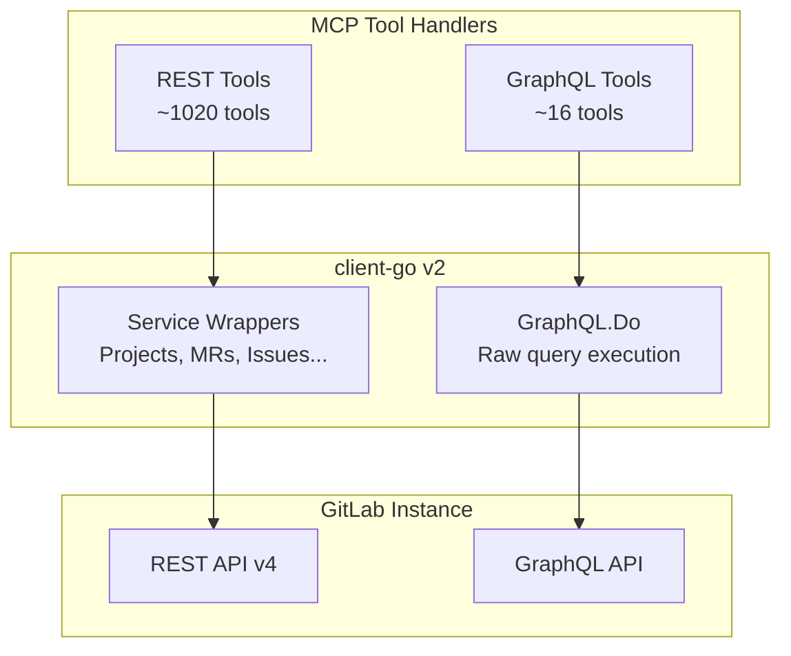

# GraphQL Integration

> **Diátaxis type**: Explanation
> **Audience**: 🔧 Developers, contributors
> **Prerequisites**: Familiarity with Go, GraphQL basics, and the project architecture

---

## Overview

gitlab-mcp-server uses two API strategies to communicate with GitLab:

1. **REST API v4** — the primary approach, used by the majority of tools via the [client-go](https://pkg.go.dev/gitlab.com/gitlab-org/api/client-go/v2) service wrappers
2. **GraphQL API** — used for domains where REST endpoints are deprecated, unavailable, or significantly less efficient

This document explains when and how the GraphQL integration is used, the patterns involved, and the architectural rationale behind the design.

## When REST vs GraphQL

| Use REST when | Use GraphQL when |
| ------------- | ---------------- |
| client-go has a typed service wrapper | No REST endpoint exists (e.g. CI/CD Catalog, Branch Rules) |
| The domain is well-served by REST | The REST endpoint is deprecated (e.g. vulnerability findings) |
| Single-resource CRUD operations | Multiple related resources need to be fetched in one request |
| The feature is available on all GitLab tiers | The feature is GraphQL-only (e.g. CI/CD Catalog) |

### Domains using GraphQL

| Domain | Package | Reason |
| ------ | ------- | ------ |
| Vulnerabilities | `internal/tools/vulnerabilities/` | GraphQL provides richer query/mutation capabilities than REST |
| Security Findings | `internal/tools/securityfindings/` | REST endpoint deprecated; GraphQL `Pipeline.securityReportFindings` is the replacement |
| CI/CD Catalog | `internal/tools/cicatalog/` | GraphQL-only feature — no REST API exists |
| Branch Rules | `internal/tools/branchrules/` | GraphQL-only aggregated view of branch protections, approval rules, and status checks |
| Custom Emoji | `internal/tools/customemoji/` | GraphQL-only — no REST API for custom emoji management |
| Sampling Tools | `internal/tools/samplingtools/` | GraphQL aggregation replaces 3-6 sequential REST calls with a single request |

## Architecture



## The Two GraphQL Patterns

### Pattern 1: Raw `GraphQL.Do()` for tool handlers

Used by domain sub-packages (`vulnerabilities`, `securityfindings`, `cicatalog`, `branchrules`, `customemoji`) that implement complete tool handlers with GraphQL queries.

```go
// Define the query as a Go constant
const queryListVulnerabilities = `
query($projectPath: ID!, $first: Int!, $after: String) {
  project(fullPath: $projectPath) {
    vulnerabilities(first: $first, after: $after) {
      nodes { id title severity state }
      pageInfo { hasNextPage endCursor }
    }
  }
}
`

// Response struct must include Data envelope wrapper
var resp struct {
    Data struct {
        Project struct {
            Vulnerabilities struct {
                Nodes    []gqlVulnerabilityNode     `json:"nodes"`
                PageInfo toolutil.GraphQLRawPageInfo `json:"pageInfo"`
            } `json:"vulnerabilities"`
        } `json:"project"`
    } `json:"data"`
}

// Execute — note the two return values (response pointer, error)
_, err := client.GL().GraphQL.Do(gl.GraphQLQuery{
    Query:     queryListVulnerabilities,
    Variables: vars,
}, &resp, gl.WithContext(ctx))
```

### Pattern 2: GraphQL aggregation for sampling tools

Used by `samplingtools` to fetch rich context in a single request, replacing multiple sequential REST calls. The aggregated data is passed to LLM sampling prompts.

```go
// Single query replaces 3+ REST calls
const queryMRContext = `
query($projectPath: ID!, $mrIID: String!) {
  project(fullPath: $projectPath) {
    mergeRequest(iid: $mrIID) {
      title description state
      diffStatsSummary { additions deletions fileCount }
      approvedBy { nodes { username } }
      discussions(first: 100) { nodes { ... } }
    }
  }
}
`

// Build context — falls back to REST if GraphQL fails
mrCtx, err := BuildMRContext(ctx, client, projectPath, mrIID)
if err != nil {
    // Fall back to REST calls
}
```

## Key Design Decisions

### Data envelope wrapper

The client-go `GraphQL.Do()` method decodes the full JSON response (including the `{"data": ...}` wrapper) into the provided struct. Response structs **must** include a `Data` field:

```go
// CORRECT — includes Data wrapper
var resp struct {
    Data struct {
        Project struct { ... } `json:"project"`
    } `json:"data"`
}

// WRONG — client-go does NOT strip the data envelope
var resp struct {
    Project struct { ... } `json:"project"`
}
```

### Two return values from `GraphQL.Do()`

The method returns `(*Response, error)`. When you only need the error:

```go
_, err := client.GL().GraphQL.Do(query, &resp, gl.WithContext(ctx))
```

### GitLab Global IDs (GIDs)

GraphQL uses GIDs in the format `gid://gitlab/Type/NumericID`. The `toolutil` package provides helpers:

```go
gid := toolutil.FormatGID("Vulnerability", 42)
// → "gid://gitlab/Vulnerability/42"

typeName, id, err := toolutil.ParseGID("gid://gitlab/Vulnerability/42")
// → "Vulnerability", 42, nil
```

### Cursor-based pagination

GraphQL uses cursor-based pagination instead of REST's page/per_page model. The `toolutil.GraphQLPaginationInput` struct provides a consistent interface:

| Parameter | Description |
| --------- | ----------- |
| `first` | Number of items to return (default 20, max 100) |
| `after` | Forward pagination cursor |
| `last` | Number of items from the end (backward pagination) |
| `before` | Backward pagination cursor |

The `Variables()` method converts these to a GraphQL variables map, and `PageInfoToOutput()` normalizes the camelCase API response to snake\_case output.

### GraphQL mutation error handling

GraphQL mutations return both transport-level errors and application-level errors in the response body:

```go
var resp struct {
    Data struct {
        VulnerabilityDismiss struct {
            Vulnerability gqlVulnerabilityNode `json:"vulnerability"`
            Errors        []string             `json:"errors"`
        } `json:"vulnerabilityDismiss"`
    } `json:"data"`
}

_, err := client.GL().GraphQL.Do(query, &resp, gl.WithContext(ctx))
if err != nil {
    return ..., toolutil.WrapErr("dismiss_vulnerability", err)
}
if len(resp.Data.VulnerabilityDismiss.Errors) > 0 {
    return ..., fmt.Errorf("dismiss_vulnerability: %s",
        resp.Data.VulnerabilityDismiss.Errors[0])
}
```

## Shared Utilities

The `internal/toolutil/graphql.go` module provides shared GraphQL infrastructure:

| Type/Function | Purpose |
| ------------- | ------- |
| `GraphQLPaginationInput` | Cursor-based pagination input struct with `Variables()` method |
| `GraphQLPaginationOutput` | Normalized pagination output for tool responses |
| `GraphQLRawPageInfo` | Raw camelCase page info from API responses |
| `PageInfoToOutput()` | Converts raw page info to output format |
| `FormatGraphQLPagination()` | Renders pagination as Markdown summary |
| `FormatGID()` | Builds a GitLab GID string |
| `ParseGID()` | Extracts type and ID from a GID string |
| `MergeVariables()` | Merges multiple variable maps |

## Testing GraphQL Tools

GraphQL tools are tested using `httptest` mocking at the `/api/graphql` endpoint. The `testutil` package provides:

- `testutil.GraphQLHandler(map[string]http.HandlerFunc)` — routes GraphQL requests by matching query strings
- `testutil.RespondGraphQL(w, status, dataJSON)` — wraps response in `{"data": ...}` envelope

```go
client, mux := testutil.NewTestClient(t, testutil.GraphQLHandler(
    map[string]http.HandlerFunc{
        "vulnerabilities": func(w http.ResponseWriter, r *http.Request) {
            testutil.RespondGraphQL(w, http.StatusOK, `{
                "project": {
                    "vulnerabilities": {
                        "nodes": [...],
                        "pageInfo": {"hasNextPage": false}
                    }
                }
            }`)
        },
    },
))
```

## References

- [GitLab GraphQL API Reference](https://docs.gitlab.com/ee/api/graphql/reference/)
- [GitLab GraphQL Explorer](https://docs.gitlab.com/ee/api/graphql/#interactive-graphql-explorer)
- [client-go GraphQL.Do()](https://pkg.go.dev/gitlab.com/gitlab-org/api/client-go/v2#GraphQLService.Do)
- [ADR-0006: Raw GraphQL.Do() for Uncovered Domains](adr/adr-0006-raw-graphql-for-uncovered-domains.md)
