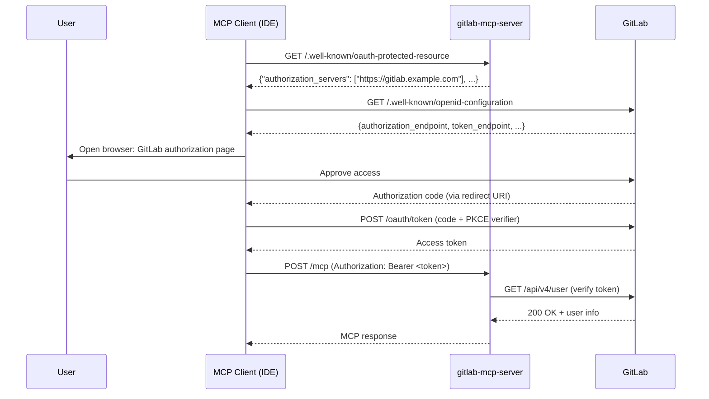

# OAuth App Setup

How to create a GitLab OAuth Application for use with gitlab-mcp-server in OAuth mode.

> **Diátaxis type**: How-to
> **Audience**: 🔧 Server administrators, team leads
> **Prerequisites**: GitLab admin or group owner access; server running with `--auth-mode=oauth` over an **https** GitLab URL (bearer tokens are forwarded upstream on every call, so cleartext is refused; `http` is allowed only for loopback development)
>
> **Arrived here from `https://mcp.jmrp.io/gitlab`?** You do not need any of this. That endpoint's RFC 9728 metadata names this page as its documentation, but its GitLab OAuth Application is already registered — the [server card](https://mcp.jmrp.io/servers/gitlab/) publishes the client ID and a ready-made snippet per client, and [IDE Configuration](ide-configuration.md#public-hosted-endpoint-mcpjmrpio) carries the same snippets. Everything below is for a deployment you run yourself.

---

## Overview

When the server runs with `--auth-mode=oauth`, MCP clients that support OAuth 2.1 (such as VS Code, Claude Code, or other spec-compliant clients) can discover the GitLab authorization server automatically via the RFC 9728 metadata endpoint and handle the full OAuth flow without manual token management.

For this to work, you need to create a **GitLab OAuth Application** that the MCP client will use to request tokens from GitLab on behalf of the user.

> **Important**: gitlab-mcp-server is a **resource server** (it validates tokens), not an OAuth client. The MCP client (VS Code, Claude Code, etc.) is the OAuth client that obtains tokens directly from GitLab using the OAuth Application credentials.

---

## How the OAuth Flow Works



1. The MCP client discovers the GitLab authorization server from the server's `/.well-known/oauth-protected-resource` endpoint
2. The client initiates the OAuth 2.1 Authorization Code flow with PKCE against GitLab
3. The user authorizes the application in their browser
4. The client receives an access token and sends it as `Authorization: Bearer` with every MCP request
5. The server verifies the token against GitLab's `/api/v4/user` endpoint (with caching)

---

## Step 1: Create the GitLab OAuth Application

> For detailed guidance on OAuth application settings, see [GitLab: Configure GitLab as an OAuth 2.0 provider](https://docs.gitlab.com/ee/integration/oauth_provider.html).

### Instance-level (GitLab Admin)

1. Go to **Admin Area → Applications** (`/admin/applications`)
2. Click **New application**
3. Fill in:
   - **Name**: `MCP Server` (or any descriptive name)
   - **Redirect URI**: See [Redirect URIs per IDE](#redirect-uris-per-ide) below
   - **Confidential**: **Unchecked** (MCP clients are public OAuth clients)
   - **Scopes**: Check **`api`** — or **`read_api`** if the deployment runs `--read-only` or `--safe-mode`, which is all such a server asks for (see [Scopes](#scopes-pick-api-avoid-mcp))
4. Click **Save application**
5. Copy the **Application ID** — this is the `clientId` you will configure in MCP clients

### Group-level (Group Owner)

1. Go to your group → **Settings → Applications**
2. Follow the same steps as above

### User-level (Personal)

1. Go to **User Settings → Applications** (`/-/user_settings/applications`)
2. Follow the same steps as above

### Which one to create

The three types differ only in who owns and can revoke the application — the OAuth flow is identical:

| Type     | Create it when                                                                  | Notes                                        |
| -------- | ------------------------------------------------------------------------------- | -------------------------------------------- |
| Instance | You administer a self-managed GitLab and the endpoint serves the whole instance | Not available to regular users on GitLab.com |
| Group    | A team shares the endpoint and should keep owning the app                       | Survives any single member leaving           |
| User     | You run the endpoint yourself, or you are on GitLab.com without group ownership | Tied to your account; revoked with it        |

### Scopes: pick `api`, avoid `mcp`

- **`api`** — what this server needs. Every action it exposes is a REST v4 or GraphQL call made with the user's token.
- **`read_api`** — the right choice for any client that should not be able to change anything: a browser-based inspector, a dashboard, a read-only integration. **A `read_api` token is accepted by every deployment, including one that serves writes**, and is served a read-only tool surface — the same catalog `--read-only` projects, with the mutating actions absent. The write check is per action, not per deployment.

  A deployment that can never write (`--read-only` or `--safe-mode`) asks for `read_api` in its challenge and advertises only that scope, so no user is made to grant more than the server can use. One that can write advertises `api` first and lists both in the RFC 9728 `scopes_supported` field, so a client chooses how much authority to hand over.

  A token granted `api` is accepted everywhere `read_api` is, since `api` is a superset. The only credential refused at the door is one carrying **no** GitLab API scope at all — a `read_user` token, say — which gets `403 insufficient_scope`.
- **`mcp`** — do **not** pick this one. Despite the name it is scoped to *GitLab's own built-in MCP server*, and a credential minted for it grants no general REST or GraphQL access, so every action here would fail. See [Dynamic Client Registration and the `mcp` scope](#dynamic-client-registration-and-the-mcp-scope).

> **Device authorization grant**: leave the checkbox unchecked. No MCP client uses RFC 8628 — the MCP authorization flow is authorization code + PKCE with a browser redirect — and enabling an unused grant only adds device-code phishing surface. It can be enabled later without recreating the app.

---

## Step 2: Configure Redirect URIs

Each MCP client has its own redirect URI scheme. Configure **all** redirect URIs that your users' IDEs will need.

### Redirect URIs per IDE

| IDE / Client                  | Redirect URI                                       | Notes                                                                                |
| ----------------------------- | -------------------------------------------------- | ------------------------------------------------------------------------------------ |
| VS Code / GitHub Copilot      | `http://127.0.0.1:33418`                           | Loopback IP literals match on host only, so the port is not significant              |
| VS Code (Remote / vscode.dev) | `https://vscode.dev/redirect`                      | For remote development environments                                                  |
| Cursor (desktop)              | `http://localhost:8787/callback`                   | Fixed callback — the exact path is required                                          |
| Cursor (web / Cloud Agents)   | `https://www.cursor.com/agents/mcp/oauth/callback` | Only needed for Cursor's hosted surfaces                                             |
| Claude Code (CLI)             | `http://localhost:8090/callback`                   | Pin the port with `--callback-port` and register that exact URI — see the note below |
| Claude Desktop / claude.ai    | `https://claude.ai/api/mcp/auth_callback`          | All hosted Claude surfaces share this callback                                       |
| OpenAI Codex CLI              | `http://localhost:1455/auth/callback`              | Only when using `--oauth-client-id`; the bearer-token path needs no redirect URI     |
| Gemini CLI                    | Pinned in `settings.json` (`oauth.redirectUri`)    | Register whatever you pin                                                            |
| LM Studio                     | `http://localhost:33389/callback`                  | Fixed callback                                                                       |

> **`localhost` vs `127.0.0.1`**: GitLab (Doorkeeper) ignores the port only for **loopback IP literals** — `IPAddr.new("localhost")` raises, so a `http://localhost` entry is matched exactly, port and path included. Claude Code's callback is `http://localhost:<port>/callback`, so a bare `http://localhost` registration can never match it: `--callback-port` is required, not optional, and the registered URI must carry that port and the `/callback` path.
>
> **Multiple URIs**: GitLab allows multiple redirect URIs separated by newlines in the application form. Add all URIs your team needs.

### Example: Combined Redirect URIs

In the GitLab OAuth Application "Redirect URI" field, enter:

```text
https://insiders.vscode.dev/redirect
http://localhost:8090/callback
http://localhost:8787/callback
```

> **Note**: every entry must match a client's callback exactly. `http://localhost:8090/callback` is Claude Code run with `--callback-port 8090`; `http://localhost:8787/callback` is Cursor's fixed desktop callback. Omitting `--callback-port` leaves Claude Code on a random port, which no registered entry can match — pin it.

---

## Step 3: Start the Server in OAuth Mode

```bash
gitlab-mcp-server --http \
  --gitlab-url=https://gitlab.example.com \
  --auth-mode=oauth \
  --public-url=https://mcp.example.com \
  --oauth-cache-ttl=15m
```

Verify the metadata endpoint:

```bash
curl -s http://localhost:8080/.well-known/oauth-protected-resource | jq .
```

Expected output:

```json
{
  "resource": "http://localhost:8080/mcp",
  "authorization_servers": ["https://gitlab.example.com"],
  "bearer_methods_supported": ["header"],
  "scopes_supported": ["api", "read_api"]
}
```

---

## Behind a reverse proxy

The metadata URL follows RFC 9728 §3: the well-known segment is inserted **between the host and the resource path**, not appended to it. With `--public-url=https://mcp.example.com/gitlab`, clients look for:

```text
https://mcp.example.com/.well-known/oauth-protected-resource/gitlab
```

That path lives at the **root of the host**, so a proxy that only forwards `/gitlab/` will not serve it. Add a route without rewriting:

```nginx
location /.well-known/oauth-protected-resource {
    proxy_pass http://gitlab-mcp:8080;   # no path rewrite
}
```

The server answers both the bare and the path-suffixed form, so no rewriting is needed — and the suffix keeps multiple MCP servers on one host distinguishable.

Two more things the deployment must get right:

- **`--public-url` is published verbatim, and clients compare it exactly.**
  Whatever string you pass becomes the RFC 9728 `resource` field as written,
  and [RFC 9728 §3.3](https://datatracker.ietf.org/doc/html/rfc9728#section-3.3)
  has a client compare it code point by code point against the URL it was
  configured with. Configure clients with that exact string — not an alias, not
  the same host with a trailing slash added or removed, not `www.` prepended.
  `--public-url=https://mcp.example.com/gitlab` means clients use
  `https://mcp.example.com/gitlab`, and a client pointed at
  `https://mcp.example.com/gitlab/` will reject the metadata it fetches.
- **`Host` must reach the server as the public host.** The cross-origin check compares a browser's `Origin` against the request `Host` when `Sec-Fetch-Site` is absent, so forwarding an internal host name breaks legitimate same-origin browser calls. `proxy_set_header Host $host;` is the correct form.
- **Browser clients need `--trusted-origins`.** Cross-origin browser `POST`s are refused before authentication; list the origins that should be allowed (the `--public-url` origin is trusted automatically). See [Security — Cross-Origin Protection](../concepts/security.md#cross-origin-protection).

### The 401 challenge

An unauthenticated request receives the challenge that starts client discovery:

```text
HTTP/1.1 401 Unauthorized
WWW-Authenticate: Bearer resource_metadata="https://mcp.example.com/.well-known/oauth-protected-resource/gitlab", scope="api"
```

The `scope` hint tells well-behaved clients which scope to request — clients that instead ask for every scope the authorization server advertises get rejected by GitLab with `invalid_scope`. It is a recommendation, not the admission bar: it names the scope that buys the deployment's **full** surface, while a client that deliberately asks for `read_api` is admitted and served the read-only surface.

Every challenge carries it, not only the `insufficient_scope` one, so a client that reads the header and never fetches the metadata document still knows what to ask for.

---

## Step 4: Configure MCP Clients

Configure your MCP client with the **Application ID** (`clientId`) from Step 1. See [IDE Configuration](ide-configuration.md) for the full per-client reference.

### VS Code / GitHub Copilot (`.vscode/mcp.json`)

```json
{
  "servers": {
    "gitlab": {
      "type": "http",
      "url": "http://your-server:8080/mcp",
      "oauth": {
        "clientId": "YOUR_GITLAB_APPLICATION_ID",
        "scopes": ["api"]
      }
    }
  }
}
```

### Claude Code (CLI)

```bash
claude mcp add gitlab \
  --transport http \
  --client-id YOUR_GITLAB_APPLICATION_ID \
  --callback-port 8090 \
  http://your-server:8080/mcp
```

> **Important**: always configure the client ID explicitly. Without it these clients fall back to Dynamic Client Registration, which on GitLab yields a token this server cannot use — see the next section.

### Other clients

| Client                    | OAuth against GitLab  | How                                                                                                                      |
| ------------------------- | --------------------- | ------------------------------------------------------------------------------------------------------------------------ |
| OpenAI Codex CLI          | Yes, since 2026-05-22 | `codex mcp add --oauth-client-id <APP_ID>`, or skip OAuth entirely with `bearer_token_env_var` in `~/.codex/config.toml` |
| Gemini CLI                | Yes                   | `mcpServers.<name>.oauth`: `clientId` plus a pinned `redirectUri`                                                        |
| LM Studio                 | Yes, since 0.4.10     | `auth` block with `CLIENT_ID`                                                                                            |
| mcp-remote (stdio proxy)  | Yes                   | `--static-oauth-client-info`                                                                                             |
| MCP Inspector             | Yes                   | Static credentials in the auth panel                                                                                     |
| GitLab Duo Agent Platform | Header only           | `headers: { "Authorization": "Bearer glpat-..." }` in the shared `mcp.json`                                              |
| Zed                       | **No**                | Supports only CIMD/DCR, neither of which yields an `api`-scoped GitLab token — use a personal access token as Bearer     |
| JetBrains AI Assistant    | **No**                | Runs no OAuth flow — use a personal access token as Bearer                                                               |

Every client in the "No" rows still works: OAuth mode accepts a personal access token sent as `Authorization: Bearer <glpat-...>`, verified against GitLab exactly like an OAuth access token.

---

## Dynamic Client Registration and the `mcp` scope

GitLab.com's authorization server does advertise an RFC 7591 registration endpoint (`/oauth/register`), so a client that supports Dynamic Client Registration will happily register itself without you creating anything. That path does not work here, and the reason is worth understanding rather than memorizing:

**GitLab built DCR for its own built-in MCP server.** Dynamically registered clients are forced to the `mcp` scope regardless of what they request. A token with that scope can call GitLab's built-in MCP endpoint — and nothing else. This server is a proxy over the full REST v4 and GraphQL API, so with an `mcp`-scoped token even the initial identity check fails, and every action after it would too.

The consequence is simple: **a pre-registered application with the `api` scope is mandatory**, and its Application ID must be configured in each client. A client that cannot be given a static client ID (Zed, JetBrains today) cannot use the OAuth path against GitLab at all — it uses a personal access token as Bearer instead.

GitLab does not implement Client ID Metadata Documents (CIMD) either, which is the mechanism the 2026-07-28 MCP specification now prefers over DCR; it is [tracked upstream](https://gitlab.com/gitlab-org/gitlab/-/issues/585069) but not shipped.

---

## Token Lifecycle

Two different lifetimes are in play — the GitLab token's, and this server's verification cache.

### GitLab access tokens

GitLab.com issues OAuth access tokens that **expire after 2 hours** and returns a refresh token alongside them (self-managed instances can configure the lifetime since 19.1). What happens at expiry is entirely up to the MCP client:

- Clients that implement refresh (Claude Code, VS Code) renew silently and the user notices nothing.
- Clients that do not will show an authentication error roughly every two hours and require re-authorization.
- The server plays no part in this: it verifies whatever token arrives and returns `401` when GitLab rejects it.

A personal access token used as Bearer has none of this: it lives until its own expiry date, which is why it remains the pragmatic choice for headless and CI use.

### Server-side identity cache

| Event                            | Behavior                                                    |
| -------------------------------- | ----------------------------------------------------------- |
| First request                    | Token verified against GitLab `/api/v4/user`, result cached |
| Subsequent requests (within TTL) | Token served from SHA-256 hashed cache — no GitLab API call |
| Cache TTL expires                | Token re-verified on next request                           |
| Token revoked on GitLab          | Next request after cache expiry returns 401                 |
| Background cleanup               | Expired cache entries evicted periodically                  |

The cache stores only successful verifications, keyed by a SHA-256 hash — raw tokens are never stored. `--oauth-cache-ttl` (default 15m, range 1m–2h) bounds how long a revoked token keeps working.

---

## Security Considerations

- **Public client**: MCP clients running on user devices are public OAuth clients (no client secret). This is correct per OAuth 2.1 for native applications
- **PKCE required**: MCP clients should use PKCE (Proof Key for Code Exchange) to prevent authorization code interception. GitLab supports PKCE
- **Token storage**: Token security depends on the MCP client's storage mechanism. VS Code stores tokens in the OS credential store
- **No client secret in config**: Never put a client secret in MCP client configuration files — use the Application ID only
- **Scope limitation**: Request only the `api` scope needed. Avoid requesting broader scopes

---

## Troubleshooting

| Issue                                  | Solution                                                                                                                         |
| -------------------------------------- | -------------------------------------------------------------------------------------------------------------------------------- |
| "redirect_uri_mismatch" from GitLab    | Add the exact redirect URI used by your IDE to the GitLab OAuth Application. See [Redirect URIs per IDE](#redirect-uris-per-ide) |
| OAuth flow does not start              | Verify `--auth-mode=oauth` is set and `/.well-known/oauth-protected-resource` returns metadata                                   |
| "invalid_client" error                 | The `clientId` in MCP client config does not match the GitLab Application ID. Copy the exact value                               |
| Token works with curl but not from IDE | The IDE may not be sending the token as `Authorization: Bearer`. Check IDE MCP logs                                              |
| "access_denied" after authorization    | The GitLab OAuth Application may not have the `api` scope. Recreate with correct scopes                                          |

---

## See Also

### Internal

- [IDE Configuration](ide-configuration.md) — per-IDE MCP JSON configuration with OAuth
- [HTTP Server Mode — OAuth Mode](http-server-mode.md#oauth-mode) — server architecture and flow
- [Security](../concepts/security.md) — token management and threat model
- [Troubleshooting](troubleshooting.md#oauth-mode---auth-modeoauth) — OAuth-specific troubleshooting

### External

- [GitLab: Configure GitLab as an OAuth 2.0 provider](https://docs.gitlab.com/ee/integration/oauth_provider.html) — official GitLab OAuth Application docs
- [RFC 9728: OAuth 2.0 Protected Resource Metadata](https://datatracker.ietf.org/doc/html/rfc9728) — the specification implemented by `--auth-mode=oauth`
- [OAuth 2.1 Authorization Framework (draft)](https://datatracker.ietf.org/doc/html/draft-ietf-oauth-v2-1-12) — the latest OAuth specification (mandates PKCE)
- [MCP Specification: Authorization](https://modelcontextprotocol.io/specification/2025-06-18/basic/authorization) — MCP protocol authorization requirements
