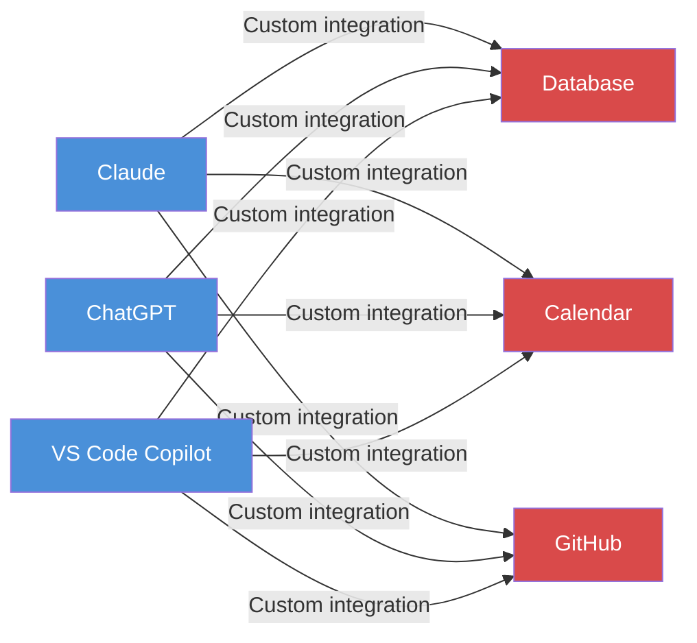
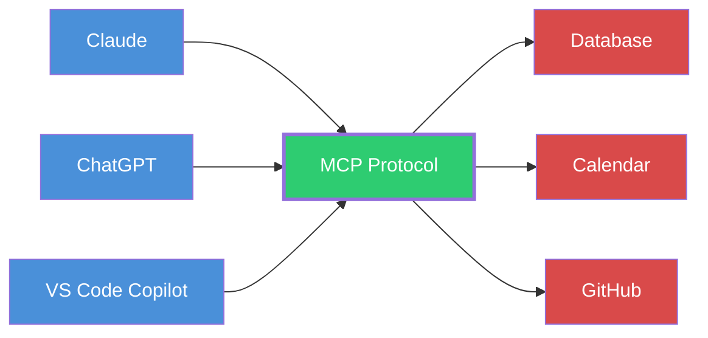
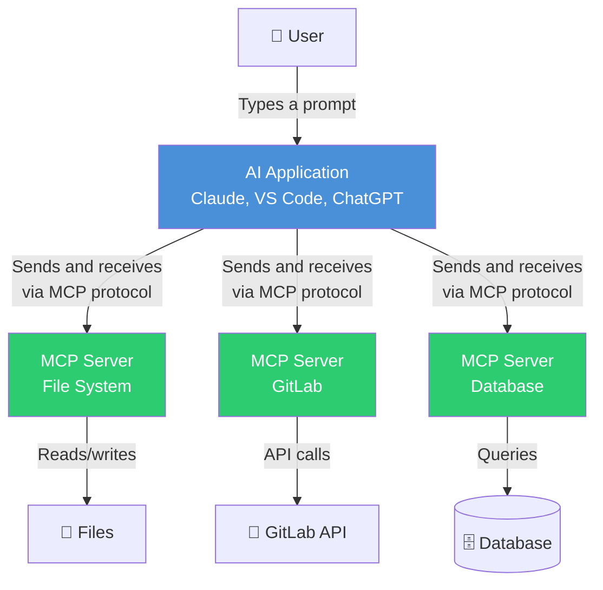

# What is MCP?

> **Level**: 🟢 Beginner
>
> **What You'll Learn**:
>
> - What problem MCP solves for AI applications
> - How MCP works as a universal standard (the USB-C analogy)
> - What MCP is — and what it is not

## The Problem: AI Applications Live in a Silo

Imagine you have a brilliant assistant who can write emails, analyze data, and answer complex questions — but they sit in a sealed room with no phone, no internet, and no access to your files. That's the reality of most AI applications today.

Large Language Models (LLMs) like Claude, ChatGPT, or Copilot are incredibly capable, but on their own they can't:

- Read your files or documents
- Query your database
- Search your company's issue tracker
- Execute code on your computer
- Call external APIs on your behalf

Every time an AI application needs to connect to something new — a database, a calendar, a project management tool — developers must build and maintain a custom integration. If you have **M** AI applications and **N** external tools, you need up to **M × N** separate integrations.

*3 AI apps × 3 tools = 9 custom integrations. Add one more tool? That's 3 more integrations.*

## The Solution: One Standard Protocol

**MCP (Model Context Protocol)** solves this by defining a **universal standard** for connecting AI applications to external systems.

### The USB-C Analogy

Think of MCP like **USB-C** for AI applications:

| | Before USB-C | After USB-C |
|---|---|---|
| **The problem** | Every phone brand had its own charger plug | One universal plug works with everything |
| **The cost** | Buy a new cable for every device | One cable, every device |
| **For developers** | Build a custom connector for each pair | Build once, connect to everything |

| | Before MCP | After MCP |
|---|---|---|
| **The problem** | Every AI app needed custom integrations for each tool | One protocol connects any AI app to any tool |
| **The cost** | M apps × N tools = M×N integrations | M apps + N tools = M+N implementations |
| **For developers** | Write custom code for each combination | Implement MCP once on each side |

*With MCP: 3 AI apps + 3 tools = 6 implementations (not 9). Add one more tool? Just 1 more implementation.*

## What is MCP, Exactly?

**MCP (Model Context Protocol)** is an open-source standard that defines how AI applications communicate with external programs that provide tools, data, and interaction templates.

In plain English:

> MCP is a set of rules that allows AI applications to discover what tools and data are available, and then use them in a structured, safe way.

The word **protocol** simply means "a set of agreed-upon rules for communication." Just like HTTP is the protocol for web browsers talking to websites, MCP is the protocol for AI applications talking to tool providers.

### What MCP Enables

With MCP, AI applications can:

- **Access your Google Calendar** to act as a personalized assistant
- **Read and modify files** on your computer
- **Query databases** across an organization
- **Search code repositories** on GitLab or GitHub
- **Create 3D designs** in Blender
- **Send messages** through Slack or email

All through a single, standardized interface.

## What MCP Is NOT

To avoid confusion, let's clarify what MCP is **not**:

| MCP is NOT... | Because... |
|---|---|
| An AI model | MCP doesn't generate text or make decisions — it connects AI models to tools |
| An API | APIs are specific interfaces for specific services; MCP is a protocol that standardizes how ALL tool interfaces work |
| A framework or library | MCP is a specification (rules on paper); SDKs in various languages implement those rules |
| A replacement for APIs | MCP sits on top of existing APIs, making them accessible to AI in a standard way |
| Tied to one company | MCP is open-source under [LF Projects](https://lfprojects.org/), supported by many companies |

## A Brief History

| Year | Event |
|------|-------|
| 2024 | Anthropic creates MCP to solve the integration problem for Claude |
| 2024 | MCP released as an open-source specification |
| 2025 | Major AI companies adopt MCP: OpenAI (ChatGPT), Microsoft (VS Code/Copilot), Cursor, and others |
| 2025 | MCP transitions to [LF Projects, LLC](https://lfprojects.org/) for open governance |
| 2025 | Protocol version 2025-06-18 released with Streamable HTTP transport, elicitation, and tasks |
| 2025 | Protocol version 2025-11-25 released with sampling tools, icons/metadata, and expanded elicitation |

Today, MCP is supported by a wide ecosystem of AI hosts, tool servers, and SDKs across multiple programming languages.

## The Big Picture

Here's a simplified view of how MCP fits into the AI landscape:

The user talks to the AI application. The AI application talks to MCP servers. Each MCP server talks to the actual tools and data sources. Everyone speaks the same protocol.

## Key Takeaways

- AI applications are powerful but isolated — they can't access external tools and data on their own
- MCP is a **universal, open standard** that connects AI applications to external systems
- Like USB-C for devices, MCP eliminates the need for custom integrations per AI-tool pair
- MCP is a **protocol** (a set of rules), not a model, API, or framework
- MCP is **open-source** under LF Projects, supported across the AI industry

## Next Steps

- [Key Concepts: Host, Client, Server](02-key-concepts.md) — Meet the three participants in every MCP interaction
- [The MCP Ecosystem](18-ecosystem.md) — See which AI apps and tools support MCP today

## References

- [What is MCP? — Official Introduction](https://modelcontextprotocol.io/introduction)
- [MCP Specification (latest)](https://modelcontextprotocol.io/specification/latest)
- [MCP GitHub Repository](https://github.com/modelcontextprotocol/modelcontextprotocol)
