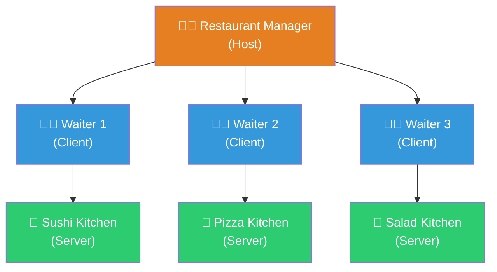
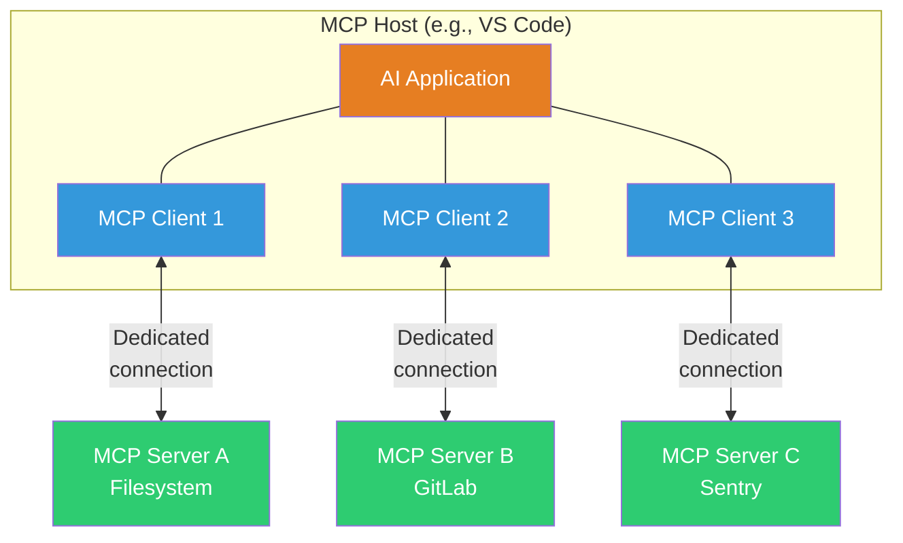
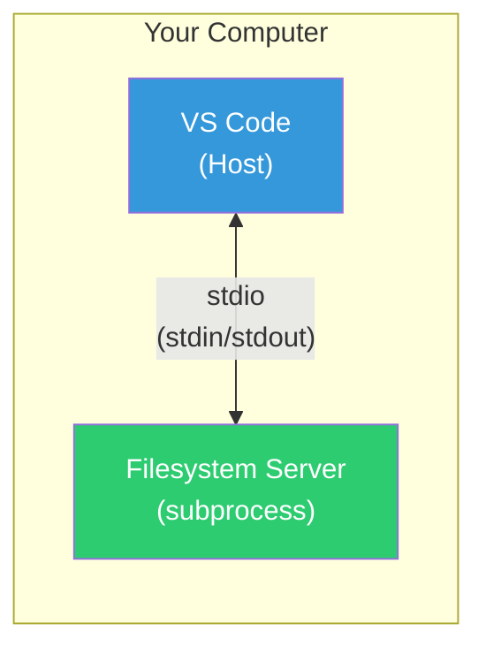
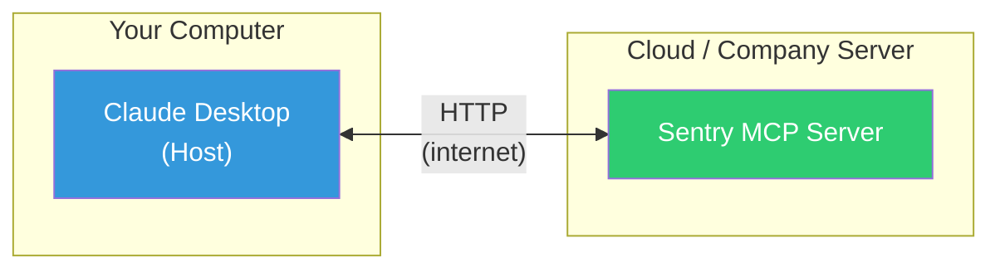

# Key Concepts: Host, Client, Server

> **Level**: 🟢 Beginner
>
> **What You'll Learn**:
>
> - The three participants in every MCP interaction: Host, Client, and Server
> - How they relate to each other using a real-world analogy
> - The difference between local and remote MCP servers

## The Restaurant Analogy

To understand MCP's architecture, imagine a restaurant:

| MCP Concept | Restaurant Role | What It Does |
|-------------|----------------|-------------|
| **Host** | Restaurant Manager | Coordinates everything, talks to the customer, manages all staff |
| **Client** | Waiter | Takes orders from the manager, communicates with a specific kitchen station |
| **Server** | Kitchen Station | Prepares specific dishes (tools) and has access to specific ingredients (data) |

A restaurant manager (Host) coordinates multiple waiters (Clients). Each waiter has a dedicated relationship with one kitchen station (Server). The sushi waiter goes to the sushi kitchen. The pizza waiter goes to the pizza kitchen.

Now let's translate this to MCP.

## The Three Participants

### MCP Host — The AI Application

The **Host** is the AI application that the user interacts with directly. It's the "brain" that coordinates everything.

**Examples of MCP Hosts:**

- **Claude Desktop** — Anthropic's desktop application
- **Claude Code** — Anthropic's terminal-based coding assistant
- **Visual Studio Code** — With GitHub Copilot
- **Cursor** — AI-powered code editor
- **ChatGPT** — OpenAI's chat application

The Host is responsible for:

- Presenting the user interface (chat window, editor, etc.)
- Running the LLM that processes user prompts
- Creating and managing one or more MCP Clients
- Deciding which MCP Server to use based on the user's request

### MCP Client — The Connector

The **Client** is a component created by the Host to maintain a connection to a specific MCP Server. Users never see or interact with Clients directly — they work behind the scenes.

Key characteristics:

- Each Client connects to **exactly one** Server
- A Host can create **multiple** Clients (one per Server)
- The Client handles the protocol-level communication (sending requests, receiving responses)
- Clients are created automatically when the Host connects to a configured MCP Server

### MCP Server — The Tool Provider

The **Server** is a program that provides tools, data, and interaction templates to the AI application. Each Server specializes in a specific domain.

**Examples of MCP Servers:**

| Server | What it provides |
|--------|-----------------|
| Filesystem server | Read/write files on your computer |
| GitLab server | Create issues, list merge requests, manage projects |
| Sentry server | Query error reports and performance data |
| Database server | Run queries, read table schemas |
| Slack server | Send messages, read channels |
| Calendar server | Check availability, create events |

The Server is responsible for:

- Declaring what tools, resources, and prompts it offers
- Executing tool calls and returning results
- Providing data when requested
- Communicating exclusively through the MCP protocol

## How They Connect

When you configure an AI application to use MCP servers, this is what happens behind the scenes:

**Key rules:**

1. **One Host, many Clients**: An AI application (Host) creates one Client for each Server it connects to
2. **One Client, one Server**: Each Client maintains a dedicated connection to exactly one Server
3. **Servers are independent**: Servers don't talk to each other — they only talk to their connected Client

## A Real-World Example

Let's walk through a concrete scenario with **Visual Studio Code** as the Host:

1. You open VS Code and it's configured to use two MCP servers:
   - A **filesystem server** (for reading/writing local files)
   - A **GitLab server** (for managing GitLab projects)

2. VS Code (Host) creates **two MCP Clients**:
   - Client 1 connects to the filesystem server
   - Client 2 connects to the GitLab server

3. You type in the chat: *"Create a new issue in GitLab for the bug I found in main.go"*

4. VS Code's AI determines it needs to:
   - Read `main.go` → routes to Client 1 → filesystem server
   - Create a GitLab issue → routes to Client 2 → GitLab server

5. Both servers respond through their respective Clients, and VS Code combines the results into a single answer

## Local vs Remote Servers

MCP servers can run in two locations:

### Local Servers (on your machine)

Local servers run as a **subprocess** on the same machine as the Host. They communicate through **standard input/output** (stdio) — the same mechanism programs use to read and write text in a terminal.

**Characteristics:**

- Fast — no network latency
- Secure — data stays on your machine
- Started automatically by the Host
- Typical for file system, database, and development tools

### Remote Servers (on the internet)

Remote servers run on a **separate machine** (cloud, company server, etc.) and communicate via **HTTP**. Multiple users can connect to the same remote server.

**Characteristics:**

- Accessible from anywhere
- Can serve multiple users simultaneously
- Requires authentication (API keys, OAuth, etc.)
- Typical for cloud services (Sentry, Slack, Jira, etc.)

### Comparison Table

| Aspect | Local Server (stdio) | Remote Server (HTTP) |
|--------|---------------------|---------------------|
| **Location** | Same machine as Host | Separate machine (cloud/network) |
| **Communication** | stdin/stdout | HTTP + Server-Sent Events |
| **Speed** | Very fast (no network) | Depends on network |
| **Users** | Single user | Multiple users |
| **Security** | Data stays local | Requires authentication |
| **Examples** | Filesystem, local database | Sentry, Slack, GitLab Cloud |

## Key Takeaways

- MCP has three participants: **Host** (AI app), **Client** (connector), **Server** (tool provider)
- The Host creates one Client for each Server connection — think of it as the restaurant manager assigning a waiter to each kitchen
- Users interact with the Host; Clients work invisibly in the background
- Each Server specializes in a domain (files, GitLab, databases, etc.)
- Servers can be **local** (on your machine, via stdio) or **remote** (on the internet, via HTTP)

## Next Steps

- [How Prompts Reach MCP](03-how-prompts-reach-mcp.md) — Follow the step-by-step journey from typing a prompt to MCP tool execution
- [Transport](10-transport.md) — Technical details on stdio and HTTP communication

## References

- [MCP Architecture Overview](https://modelcontextprotocol.io/docs/learn/architecture)
- [MCP Server Concepts](https://modelcontextprotocol.io/docs/learn/server-concepts)
- [MCP Client Concepts](https://modelcontextprotocol.io/docs/learn/client-concepts)
- [MCP Transports Specification](https://modelcontextprotocol.io/specification/latest/basic/transports)
