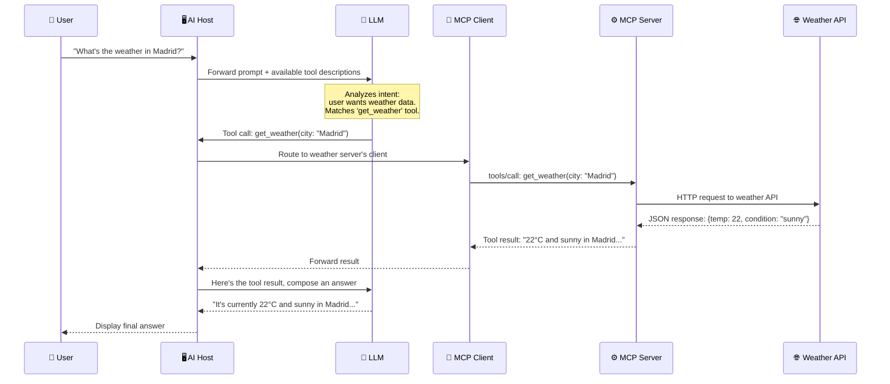
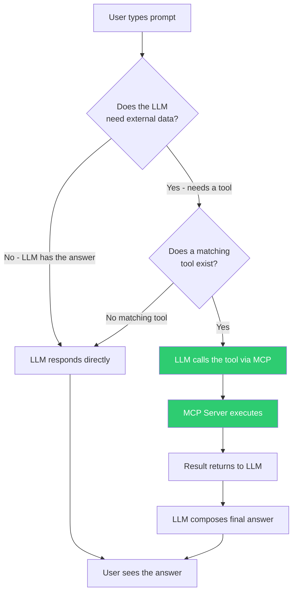

# The Invisible Journey: From Prompt to MCP

> **Level**: 🟢 Beginner
>
> **What You'll Learn**:
>
> - What happens step-by-step when your prompt triggers an MCP tool
> - How the LLM decides which tool to use (and how it knows what's available)
> - Why you get a natural language answer even though the tool returns structured data

## The Question Everyone Asks

You open your AI assistant and type:

> *"What's the weather in Madrid?"*

A few seconds later you get a natural, conversational answer:

> *"It's currently 22°C and sunny in Madrid, with a light breeze from the southwest."*

But how did that happen? The AI model doesn't have real-time weather data. The answer came from a **weather MCP server** — a program running in the background. Let's follow the invisible journey, step by step.

## The Seven Steps



Let's break this down:

### Step 1 — You Type Your Prompt

You type *"What's the weather in Madrid?"* into your AI application (the Host). This is just text — the AI application doesn't do anything special with it yet.

### Step 2 — The Host Sends the Prompt to the LLM (with context)

The Host sends your prompt to the LLM. But here's the crucial part: it also sends the **list of available tools**. This list was gathered during initialization when the Host connected to its MCP servers.

The LLM receives something like this:

> **User prompt**: "What's the weather in Madrid?"
>
> **Available tools**:
>
> - `get_weather` — Get current weather for a city. Parameters: `city` (string, required)
> - `search_files` — Search for files by name. Parameters: `query` (string, required)
> - `create_issue` — Create a GitLab issue. Parameters: `project` (string), `title` (string)

### Step 3 — The LLM Decides Which Tool to Use

This is where the magic happens. The LLM reads your prompt and the tool descriptions, and determines:

1. **Intent**: The user wants weather information
2. **Match**: The `get_weather` tool matches this intent (its description says "Get current weather for a city")
3. **Arguments**: The city parameter should be "Madrid" (extracted from the prompt)

The LLM responds with a structured **tool call request**:

```json
{
  "tool": "get_weather",
  "arguments": {
    "city": "Madrid"
  }
}
```

> **How does the LLM "know" which tool to use?**
>
> The LLM doesn't have special knowledge — it reads the tool **name** and **description** that the MCP server declared, just like you would read a menu at a restaurant. Good tool names and descriptions are critical. A tool called `gwt` with no description would be much harder for the LLM to match than `get_weather` with "Get current weather for a city."

### Step 4 — The Host Routes the Call

The Host receives the tool call from the LLM and needs to figure out which MCP Server provides the `get_weather` tool. During initialization, the Host discovered all tools from all connected servers, so it maintains a registry:

| Tool Name | MCP Server | Client |
|-----------|------------|--------|
| `get_weather` | Weather Server | Client 1 |
| `search_files` | Filesystem Server | Client 2 |
| `create_issue` | GitLab Server | Client 3 |

The Host routes the call to **Client 1** (the weather server's client).

### Step 5 — The MCP Server Executes the Tool

Client 1 sends the tool call to the Weather MCP Server using the MCP protocol. The server:

1. Receives the `tools/call` request with `name: "get_weather"` and `arguments: { city: "Madrid" }`
2. Validates the input against the tool's schema
3. Calls the actual weather API (e.g., OpenWeatherMap)
4. Formats the result

### Step 6 — The Result Travels Back

The weather API returns raw data. The MCP server formats it into a structured response and sends it back through the Client to the Host.

### Step 7 — The LLM Composes the Final Answer

The Host gives the tool result to the LLM and says: "Here's the data from the weather tool. Please compose a natural answer for the user."

The LLM takes the structured data (`22°C, sunny, light breeze from southwest`) and creates a conversational response:

> *"It's currently 22°C and sunny in Madrid, with a light breeze from the southwest."*

The Host displays this to you. End of journey.

## What If No Tool Matches?

If you ask something that doesn't match any available tool — like *"Tell me a joke"* — the LLM simply answers from its own knowledge without calling any MCP tools. The tool list is optional context, not a requirement.



## What If Multiple Tools Are Needed?

For complex requests, the LLM can call **multiple tools** in sequence or from different servers:

> *"Read the README.md file and create a GitLab issue summarizing it"*

The LLM would:

1. Call `read_file(path: "README.md")` → Filesystem Server
2. Use the file content to compose an issue summary
3. Call `create_issue(project: "my-project", title: "README Summary", ...)` → GitLab Server

The Host routes each call to the appropriate server, and the LLM weaves all results into a coherent answer.

## The Key Insight: Tool Descriptions Are the Menu

The entire system depends on one critical piece: **tool descriptions**. When an MCP server starts up and connects to a Host, it declares its tools with names, descriptions, and input schemas. These descriptions are what the LLM uses to decide when and how to use each tool.

| Component | Role in Decision-Making |
|-----------|------------------------|
| **Tool name** | Quick identifier — should be descriptive (e.g., `get_weather` not `gw`) |
| **Tool description** | The LLM reads this to understand when to use the tool |
| **Input schema** | Tells the LLM what parameters are needed and their types |
| **Tool annotations** | Hints about behavior: read-only? destructive? idempotent? |

The better these descriptions are, the more accurately the LLM matches user intent to the right tool.

## Key Takeaways

- When you type a prompt, the Host sends it to the LLM **along with descriptions of all available tools**
- The LLM reads tool descriptions like a menu and **decides** which tool matches your intent
- The LLM extracts the necessary parameters from your natural language prompt
- The Host routes the tool call to the correct MCP Server through its dedicated Client
- The MCP Server executes the tool, returns structured data, and the LLM turns it into a conversational answer
- If no tool is needed (or no tool matches), the LLM answers from its own knowledge
- **Good tool descriptions are essential** — they are how the LLM discovers and selects tools

## Next Steps

- [Tools](04-tools.md) — Deep dive into how tools are defined, discovered, and executed
- [Resources](05-resources.md) — How MCP provides read-only context data to the AI
- [Prompts](06-prompts.md) — Reusable interaction templates that combine tools and resources

## References

- [MCP Architecture Overview](https://modelcontextprotocol.io/docs/learn/architecture)
- [MCP Server Concepts — Tools](https://modelcontextprotocol.io/docs/learn/server-concepts)
- [MCP Specification — Tools](https://modelcontextprotocol.io/specification/latest/server/tools)
