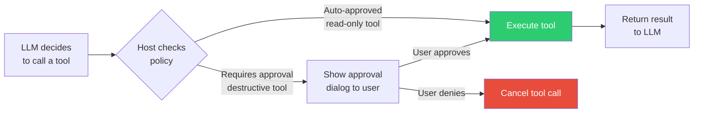
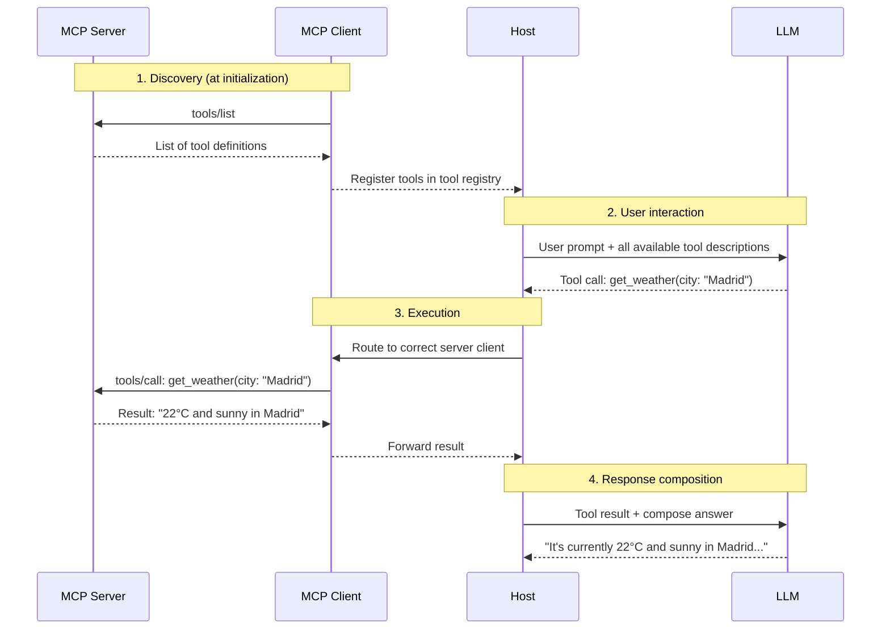

# Tools: The Actions AI Can Perform

> **Level**: 🟡 Intermediate
>
> **What You'll Learn**:
>
> - How tools are defined with names, descriptions, and JSON Schema inputs
> - How the LLM discovers tools (`tools/list`) and executes them (`tools/call`)
> - How tool annotations describe behavior (read-only, destructive, etc.)
> - How human oversight keeps tool execution safe

## What is a Tool?

A **tool** is an executable function that an MCP server exposes to AI applications. Tools are the "verbs" of MCP — they perform actions.

When you ask an AI to *"create an issue in GitLab"* or *"search for flights to Barcelona"*, the AI uses a tool to make it happen. Tools can:

- Query databases
- Call external APIs
- Read or write files
- Send emails or messages
- Execute any server-side logic

Each tool has a clearly defined **name**, **description**, and **input schema** that tells the LLM what the tool does and what parameters it needs.

## How Tools Are Defined

Every tool in MCP is described by a structured definition:

```json
{
  "name": "get_weather",
  "title": "Get Current Weather",
  "description": "Get the current weather conditions for a specified city, including temperature, humidity, and wind speed.",
  "inputSchema": {
    "type": "object",
    "properties": {
      "city": {
        "type": "string",
        "description": "City name (e.g., 'Madrid', 'New York')"
      },
      "units": {
        "type": "string",
        "enum": ["metric", "imperial"],
        "description": "Temperature units: metric (°C) or imperial (°F)"
      }
    },
    "required": ["city"]
  }
}
```

| Field | Purpose | Importance |
|-------|---------|------------|
| `name` | Unique identifier for the tool | The LLM uses this to call the tool |
| `title` | Human-readable display name | Shown in UI to users |
| `description` | Explains what the tool does and when to use it | **Critical** — this is how the LLM decides to use the tool |
| `inputSchema` | JSON Schema defining expected parameters | Enables type validation and guides the LLM on what arguments to provide |

> **Design tip**: A well-written `description` is the single most important factor in whether the LLM correctly chooses and uses your tool. Be specific about **what** the tool does, **when** to use it, and any **constraints**.

## Tool Discovery: `tools/list`

Before the LLM can use any tool, it needs to know what's available. The Host's MCP Client sends a `tools/list` request to discover all tools offered by a server.

**Request:**

```json
{
  "jsonrpc": "2.0",
  "id": 1,
  "method": "tools/list"
}
```

**Response:**

```json
{
  "jsonrpc": "2.0",
  "id": 1,
  "result": {
    "tools": [
      {
        "name": "get_weather",
        "title": "Get Current Weather",
        "description": "Get the current weather conditions for a specified city",
        "inputSchema": {
          "type": "object",
          "properties": {
            "city": { "type": "string", "description": "City name" }
          },
          "required": ["city"]
        }
      },
      {
        "name": "get_forecast",
        "title": "Get Weather Forecast",
        "description": "Get a 5-day weather forecast for a specified city",
        "inputSchema": {
          "type": "object",
          "properties": {
            "city": { "type": "string", "description": "City name" },
            "days": { "type": "integer", "description": "Number of days (1-5)" }
          },
          "required": ["city"]
        }
      }
    ]
  }
}
```

The Host collects tools from **all** connected MCP servers and presents the complete list to the LLM. This is how the LLM builds its "menu" of available actions.

### Pagination

When a server has many tools, the response may be paginated using a `cursor`:

```json
{
  "jsonrpc": "2.0",
  "id": 1,
  "method": "tools/list",
  "params": {
    "cursor": "eyJwYWdlIjogMn0="
  }
}
```

The response includes a `nextCursor` field if more tools are available. The Client follows the cursor to fetch all pages.

## Tool Execution: `tools/call`

When the LLM decides to use a tool, the Host sends a `tools/call` request through the appropriate Client:

**Request:**

```json
{
  "jsonrpc": "2.0",
  "id": 2,
  "method": "tools/call",
  "params": {
    "name": "get_weather",
    "arguments": {
      "city": "Madrid",
      "units": "metric"
    }
  }
}
```

**Response (success):**

```json
{
  "jsonrpc": "2.0",
  "id": 2,
  "result": {
    "content": [
      {
        "type": "text",
        "text": "Current weather in Madrid:\nTemperature: 22°C\nCondition: Sunny\nHumidity: 45%\nWind: 12 km/h SW"
      }
    ]
  }
}
```

### Response Content Types

Tool responses return a `content` array that can contain different types:

| Content Type | Description | Example |
|-------------|-------------|---------|
| `text` | Plain text or Markdown | Weather data, search results, status messages |
| `image` | Base64-encoded image | Charts, screenshots, generated graphics |
| `resource` | Embedded MCP resource | File contents, database records linked by URI |

A single tool response can contain **multiple** content items of different types, enabling rich, multi-format responses.

### Error Responses

When a tool execution fails, the response includes `isError: true`:

```json
{
  "jsonrpc": "2.0",
  "id": 2,
  "result": {
    "content": [
      {
        "type": "text",
        "text": "Error: City 'Madridd' not found. Did you mean 'Madrid'?"
      }
    ],
    "isError": true
  }
}
```

Note that tool errors are returned **inside** the result (not as JSON-RPC errors) because the protocol distinguishes between:

- **Protocol errors** (invalid request, server crash) → JSON-RPC error response
- **Tool execution errors** (city not found, permission denied) → `isError: true` in the result

## Tool Annotations

MCP allows servers to attach **annotations** to tools that describe their behavior. These help the Host and LLM make better decisions about when and how to use tools.

| Annotation | Type | Description |
|-----------|------|-------------|
| `readOnlyHint` | boolean | Tool only reads data, doesn't modify anything |
| `destructiveHint` | boolean | Tool may perform destructive operations (delete, overwrite) |
| `idempotentHint` | boolean | Calling the tool multiple times with the same arguments has the same effect |
| `openWorldHint` | boolean | Tool interacts with external entities outside the server's control |

```json
{
  "name": "delete_file",
  "description": "Permanently delete a file from the filesystem",
  "annotations": {
    "readOnlyHint": false,
    "destructiveHint": true,
    "idempotentHint": true,
    "openWorldHint": false
  }
}
```

These are **hints**, not enforcement mechanisms. But they enable smart behavior:

- A Host might **auto-approve** tools marked `readOnlyHint: true`
- A Host might **require explicit confirmation** for tools marked `destructiveHint: true`
- A Host might **retry safely** tools marked `idempotentHint: true`

## Human Oversight

Tools are **model-controlled** — the LLM decides when to use them based on context. However, MCP emphasizes **human oversight** to prevent unintended actions.



Hosts can implement user control through:

| Mechanism | Description |
|-----------|-------------|
| **Approval dialogs** | Ask the user before executing each tool call |
| **Permission settings** | Pre-approve certain "safe" tools (read-only operations) |
| **Activity logs** | Show all tool executions with parameters and results |
| **Tool visibility** | Let users choose which tools are available in a conversation |

## The Complete Tool Flow

Putting it all together, here's the full lifecycle of tool usage in MCP:



## Key Takeaways

- Tools are **executable functions** that MCP servers expose to AI applications
- Each tool is defined by a `name`, `description`, and `inputSchema` (JSON Schema)
- Discovery happens via `tools/list`; execution via `tools/call`
- Tool responses use a flexible `content` array supporting text, images, and embedded resources
- **Annotations** (readOnlyHint, destructiveHint, etc.) describe tool behavior and guide safety decisions
- **Human oversight** mechanisms let users approve, deny, or monitor tool execution
- Good tool descriptions are essential — they are how the LLM decides which tool to use

## Next Steps

- [Resources](05-resources.md) — Read-only data sources that provide context to the AI
- [Prompts](06-prompts.md) — Reusable templates that combine tools and resources into workflows
- [Completions](14-completions.md) — Autocomplete for tool and prompt arguments

## References

- [MCP Specification — Tools](https://modelcontextprotocol.io/specification/latest/server/tools)
- [MCP Server Concepts — Tools](https://modelcontextprotocol.io/docs/learn/server-concepts)
- [JSON Schema Specification](https://json-schema.org/)
