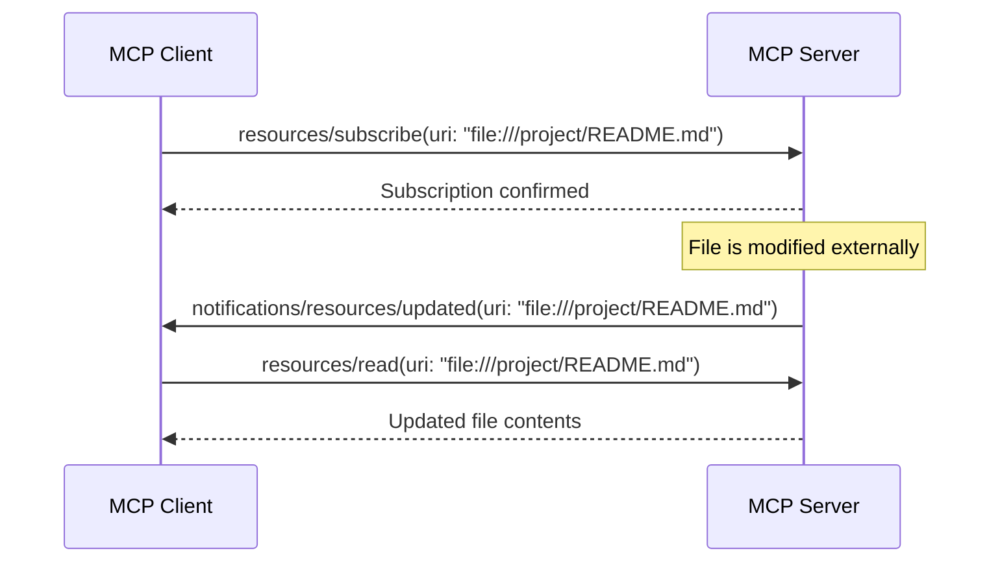

# Resources: Providing Context to AI

> **Level**: 🟡 Intermediate
>
> **What You'll Learn**:
>
> - What resources are and how they differ from tools
> - How resources use URIs and MIME types to identify data
> - The difference between direct resources and resource templates
> - How resources are discovered, read, and subscribed to

## What is a Resource?

A **resource** is a read-only data source that an MCP server exposes to AI applications. Resources are the "nouns" of MCP — they provide context and information.

While [tools](04-tools.md) perform actions (create, update, delete), resources provide **data** that helps the AI understand context. Think of it this way:

| Primitive | Analogy | Direction | Example |
|-----------|---------|-----------|---------|
| **Tool** | A verb — "do something" | AI → Server → external action | `create_issue()`, `send_email()` |
| **Resource** | A noun — "read something" | Server → AI (data flows in) | `file:///README.md`, `db://schema/users` |

Resources can provide:

- File contents (source code, documents, configurations)
- Database schemas or query results
- API responses (user profiles, project metadata)
- Calendar availability
- Any structured or unstructured data the AI needs as context

## URIs and MIME Types

Every resource is identified by a **URI** (Uniform Resource Identifier) and declares a **MIME type** for content handling:

```json
{
  "uri": "file:///Documents/Travel/passport.pdf",
  "name": "passport",
  "title": "Passport Document",
  "description": "User's passport document for travel verification",
  "mimeType": "application/pdf"
}
```

| Field | Purpose | Example |
|-------|---------|---------|
| `uri` | Unique identifier for the resource | `file:///path/to/file`, `db://schema/users` |
| `name` | Machine-readable identifier | `passport`, `user-schema` |
| `title` | Human-readable display name | `"Passport Document"` |
| `description` | Explains what data the resource provides | Used by the AI to understand context |
| `mimeType` | Content format | `text/plain`, `application/json`, `text/markdown` |

URIs follow standard schemes like `file://`, but servers can define custom schemes for their domain (e.g., `calendar://`, `db://`, `travel://`).

## Direct Resources vs Resource Templates

MCP supports two kinds of resources:

### Direct Resources

Direct resources have **fixed URIs** that point to specific, known data:

```json
{
  "uri": "calendar://events/2024",
  "name": "calendar-2024",
  "title": "Calendar Events 2024",
  "description": "All calendar events for 2024",
  "mimeType": "application/json"
}
```

These are discovered through `resources/list` and their URIs don't change.

### Resource Templates

Resource templates have **parameterized URIs** that enable flexible queries:

```json
{
  "uriTemplate": "weather://forecast/{city}/{date}",
  "name": "weather-forecast",
  "title": "Weather Forecast",
  "description": "Get weather forecast for any city and date",
  "mimeType": "application/json"
}
```

Templates use `{parameter}` placeholders in the URI. To read the resource, the Client fills in the parameters:

- `weather://forecast/Madrid/2024-06-15` → forecast for Madrid on June 15
- `weather://forecast/Barcelona/2024-07-01` → forecast for Barcelona on July 1

| Aspect | Direct Resource | Resource Template |
|--------|----------------|-------------------|
| **URI** | Fixed (`calendar://events/2024`) | Parameterized (`weather://forecast/{city}/{date}`) |
| **Discovery** | `resources/list` | `resources/templates/list` |
| **Flexibility** | One specific data point | Dynamic queries with parameters |
| **Use case** | Known, static data | Search, filter, and query patterns |

## Resource Discovery

### Listing Direct Resources

```json
{
  "jsonrpc": "2.0",
  "id": 1,
  "method": "resources/list"
}
```

**Response:**

```json
{
  "jsonrpc": "2.0",
  "id": 1,
  "result": {
    "resources": [
      {
        "uri": "file:///project/README.md",
        "name": "readme",
        "title": "Project README",
        "mimeType": "text/markdown"
      },
      {
        "uri": "db://schema/users",
        "name": "user-schema",
        "title": "Users Table Schema",
        "mimeType": "application/json"
      }
    ]
  }
}
```

### Listing Resource Templates

```json
{
  "jsonrpc": "2.0",
  "id": 2,
  "method": "resources/templates/list"
}
```

**Response:**

```json
{
  "jsonrpc": "2.0",
  "id": 2,
  "result": {
    "resourceTemplates": [
      {
        "uriTemplate": "file:///project/{path}",
        "name": "project-file",
        "title": "Project File",
        "description": "Read any file in the project directory",
        "mimeType": "text/plain"
      },
      {
        "uriTemplate": "db://query/{table}",
        "name": "table-query",
        "title": "Database Table Query",
        "description": "Query records from a database table",
        "mimeType": "application/json"
      }
    ]
  }
}
```

## Reading Resources

To retrieve the actual data, the Client sends a `resources/read` request:

**Request:**

```json
{
  "jsonrpc": "2.0",
  "id": 3,
  "method": "resources/read",
  "params": {
    "uri": "file:///project/README.md"
  }
}
```

**Response:**

```json
{
  "jsonrpc": "2.0",
  "id": 3,
  "result": {
    "contents": [
      {
        "uri": "file:///project/README.md",
        "mimeType": "text/markdown",
        "text": "# My Project\n\nThis project implements a weather API..."
      }
    ]
  }
}
```

Resource contents can be:

- **Text** (`text` field) — for text-based content (code, documents, JSON)
- **Binary** (`blob` field) — for binary data (images, PDFs) encoded as base64

## Subscribing to Resource Changes

Some resources change over time — a file being edited, a database table being updated, a calendar entry being added. MCP supports **subscriptions** so the Client can be notified when a resource changes.



**Subscribe request:**

```json
{
  "jsonrpc": "2.0",
  "id": 4,
  "method": "resources/subscribe",
  "params": {
    "uri": "file:///project/README.md"
  }
}
```

When the resource changes, the server sends a notification, and the Client can fetch the updated content.

## Protocol Operations Summary

| Method | Direction | Purpose |
|--------|-----------|---------|
| `resources/list` | Client → Server | Discover available direct resources |
| `resources/templates/list` | Client → Server | Discover available resource templates |
| `resources/read` | Client → Server | Retrieve resource contents |
| `resources/subscribe` | Client → Server | Subscribe to resource change notifications |
| `resources/unsubscribe` | Client → Server | Remove a subscription |
| `notifications/resources/updated` | Server → Client | Notify that a resource has changed |
| `notifications/resources/list_changed` | Server → Client | Notify that the resource list itself has changed |

## User Interaction Model

Resources are **application-driven** — the Host application decides how and when to retrieve them. Unlike tools (which the LLM initiates), resources are typically selected or included by the application based on context.

Common UI patterns for resources:

| Pattern | Description |
|---------|-------------|
| **Tree/list views** | Browse resources in folder-like structures |
| **Search and filter** | Find specific resources by name or content |
| **Auto-inclusion** | Application automatically includes relevant resources based on conversation context |
| **Manual selection** | User explicitly selects resources to include in the conversation |

## Key Takeaways

- Resources are **read-only data sources** that provide context to AI applications
- Each resource has a **URI** (unique identifier) and a **MIME type** (content format)
- **Direct resources** have fixed URIs; **resource templates** have parameterized URIs for flexible queries
- Discovery happens via `resources/list` and `resources/templates/list`
- Data retrieval uses `resources/read` with the resource URI
- **Subscriptions** enable real-time notifications when resources change
- Resources are **application-driven** — the Host decides when to include them, unlike tools which are LLM-initiated

## Next Steps

- [Prompts](06-prompts.md) — Reusable templates that combine tools and resources into workflows
- [Completions](14-completions.md) — Autocomplete for resource template parameters
- [Tools](04-tools.md) — Compare resources with executable tool functions

## References

- [MCP Specification — Resources](https://modelcontextprotocol.io/specification/latest/server/resources)
- [MCP Server Concepts — Resources](https://modelcontextprotocol.io/docs/learn/server-concepts)
