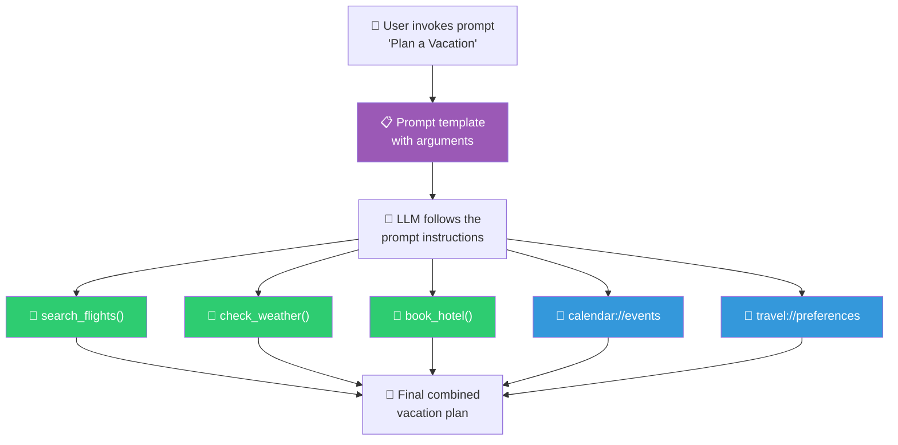
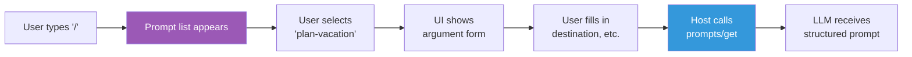

# Prompts: Reusable Interaction Templates

> **Level**: 🟡 Intermediate
>
> **What You'll Learn**:
>
> - What prompts are and how they differ from tools and resources
> - How prompts define structured arguments with validation
> - How prompts combine tools and resources into guided workflows
> - UI patterns for invoking prompts (slash commands, palettes, buttons)

## What is a Prompt?

A **prompt** is a reusable template that an MCP server exposes to guide interactions with the AI. Prompts are pre-built instructions that tell the model how to approach a specific task, often referencing available tools and resources.

Think of prompts as **recipes**: a tool is a single cooking technique (chopping, frying), a resource is an ingredient (tomatoes, flour), and a prompt is a complete recipe that orchestrates techniques and ingredients into a finished dish.

### The Three Primitives Compared

| Primitive | Controlled by | Analogy | Example |
|-----------|--------------|---------|---------|
| **Tool** | Model (LLM decides when to use it) | A cooking technique | `search_flights()`, `create_issue()` |
| **Resource** | Application (Host decides when to include it) | An ingredient | `file:///README.md`, `db://schema/users` |
| **Prompt** | User (explicitly invoked) | A recipe | "Plan a vacation", "Review this code" |

The key distinction: **prompts require explicit user invocation**. The LLM doesn't automatically trigger prompts — the user selects them, typically through a UI element like a slash command or button.

## How Prompts Are Defined

A prompt definition includes a name, description, and a list of arguments:

```json
{
  "name": "plan-vacation",
  "title": "Plan a Vacation",
  "description": "Guide through the vacation planning process, including flight search, hotel booking, and itinerary creation",
  "arguments": [
    {
      "name": "destination",
      "description": "Target city or region",
      "required": true
    },
    {
      "name": "duration",
      "description": "Number of days for the trip",
      "required": true
    },
    {
      "name": "budget",
      "description": "Total budget in USD",
      "required": false
    },
    {
      "name": "interests",
      "description": "Comma-separated list of interests (e.g., beaches, architecture, food)",
      "required": false
    }
  ]
}
```

| Field | Purpose |
|-------|---------|
| `name` | Unique identifier for the prompt |
| `title` | Human-readable display name |
| `description` | Explains what the prompt does — shown to users in the UI |
| `arguments` | List of parameters the user provides when invoking the prompt |

## Prompt Discovery: `prompts/list`

The Host discovers available prompts from each connected server:

**Request:**

```json
{
  "jsonrpc": "2.0",
  "id": 1,
  "method": "prompts/list"
}
```

**Response:**

```json
{
  "jsonrpc": "2.0",
  "id": 1,
  "result": {
    "prompts": [
      {
        "name": "plan-vacation",
        "title": "Plan a Vacation",
        "description": "Guide through the vacation planning process"
      },
      {
        "name": "code-review",
        "title": "Review Code",
        "description": "Perform a thorough code review with security and quality checks"
      },
      {
        "name": "summarize-meeting",
        "title": "Summarize Meeting Notes",
        "description": "Create a structured summary from meeting notes with action items"
      }
    ]
  }
}
```

## Prompt Retrieval: `prompts/get`

When the user selects a prompt and provides arguments, the Host retrieves the full prompt template:

**Request:**

```json
{
  "jsonrpc": "2.0",
  "id": 2,
  "method": "prompts/get",
  "params": {
    "name": "plan-vacation",
    "arguments": {
      "destination": "Barcelona",
      "duration": "7",
      "budget": "3000",
      "interests": "beaches, architecture, food"
    }
  }
}
```

**Response:**

```json
{
  "jsonrpc": "2.0",
  "id": 2,
  "result": {
    "description": "Vacation planning for Barcelona",
    "messages": [
      {
        "role": "user",
        "content": {
          "type": "text",
          "text": "I want to plan a 7-day vacation to Barcelona with a budget of $3000. My interests include beaches, architecture, and food.\n\nPlease help me:\n1. Search for available flights\n2. Find hotels within my budget\n3. Create a daily itinerary based on my interests\n4. Check the weather forecast for my travel dates\n\nUse the available travel tools and resources to provide personalized recommendations."
        }
      }
    ]
  }
}
```

The response contains **messages** — pre-built prompts that the Host injects into the conversation. These messages guide the LLM on how to approach the task, which tools to use, and what resources to consult.

## How Prompts Orchestrate Tools and Resources

The real power of prompts emerges when they combine tools and resources into a **guided workflow**. A prompt can reference:

- **Tools** the LLM should use (e.g., "use `search_flights` to find flights")
- **Resources** to include as context (e.g., "check `calendar://events/June` for availability")
- **Step-by-step instructions** that guide the LLM through a complex task



Without the prompt, the user would need to manually instruct the LLM on each step. The prompt encapsulates domain expertise: *"When planning a vacation, always check calendar first, then search flights, compare prices, check weather, and create a day-by-day itinerary."*

## UI Patterns for Prompts

Since prompts are user-controlled, the Host application exposes them through various UI patterns:

| Pattern | How it works | Example |
|---------|-------------|---------|
| **Slash commands** | Type `/` to see available prompts | `/plan-vacation Barcelona 7 days` |
| **Command palette** | Searchable list of all prompts | Ctrl+Shift+P → "Plan a Vacation" |
| **Buttons** | Dedicated UI buttons for common prompts | A "Code Review" button in the editor |
| **Context menus** | Right-click to see relevant prompts | Right-click on a file → "Summarize this document" |



## Parameter Completion

Prompts support **parameter completion** — as the user types an argument value, the server can suggest completions:

- Typing "Bar" for the `destination` argument might suggest "Barcelona", "Barbados", "Bari"
- Typing "be" for the `interests` argument might suggest "beaches", "beer tasting", "beluga watching"

This is covered in detail in the [Completions](14-completions.md) document.

## Protocol Operations Summary

| Method | Direction | Purpose |
|--------|-----------|---------|
| `prompts/list` | Client → Server | Discover available prompts |
| `prompts/get` | Client → Server | Retrieve full prompt template with arguments |
| `notifications/prompts/list_changed` | Server → Client | Notify that available prompts have changed |

## Key Takeaways

- Prompts are **reusable interaction templates** that guide the LLM through complex tasks
- Unlike tools (model-controlled) and resources (application-controlled), prompts are **user-controlled** — they require explicit invocation
- Prompts define **arguments** that users fill in, providing structured input
- Prompts orchestrate **tools and resources** into guided workflows — think of them as recipes
- Discovery uses `prompts/list`; retrieval uses `prompts/get` with filled arguments
- Hosts expose prompts through UI patterns like **slash commands**, **command palettes**, and **buttons**
- **Parameter completion** helps users discover valid argument values

## Next Steps

- [Sampling](07-sampling.md) — Servers asking the AI for help (client primitive)
- [Elicitation](08-elicitation.md) — Servers asking the user for structured input
- [Completions](14-completions.md) — How autocomplete works for prompt arguments

## References

- [MCP Specification — Prompts](https://modelcontextprotocol.io/specification/latest/server/prompts)
- [MCP Server Concepts — Prompts](https://modelcontextprotocol.io/docs/learn/server-concepts)
