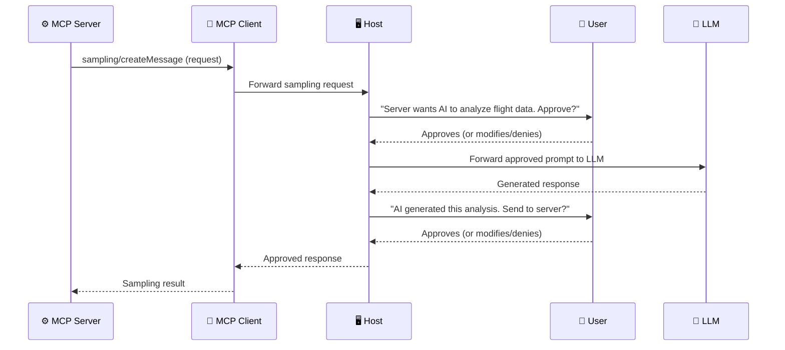
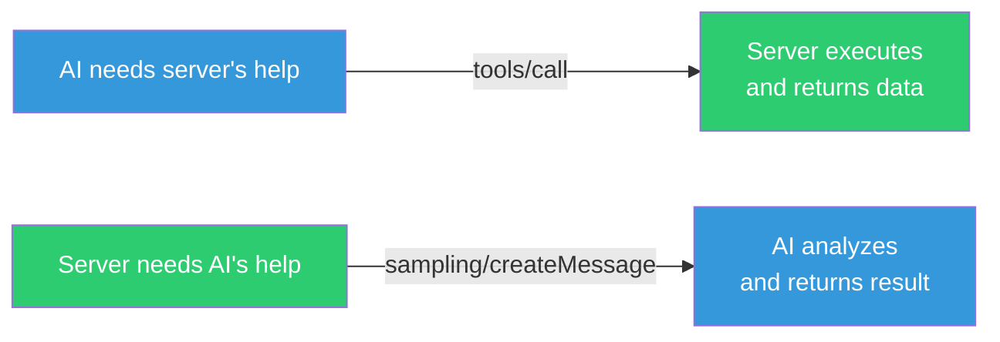

# Sampling: Servers Asking the AI for Help

> **Level**: 🟡 Intermediate
>
> **What You'll Learn**:
>
> - What sampling is and why servers need to request LLM completions
> - How the sampling flow works with human-in-the-loop checkpoints
> - How model preferences guide model selection without hard dependencies
> - Security considerations for server-initiated AI interactions

## What is Sampling?

**Sampling** is a mechanism that allows MCP servers to request language model completions through the client. In simple terms: the server asks the AI for help.

This might seem backwards — isn't the server supposed to *help* the AI? Yes, but sometimes a server needs AI capabilities to do its job:

| Scenario | Why the server needs AI |
|----------|----------------------|
| Analyzing 50 flight options to find the best one | The server has the data but needs AI reasoning to evaluate trade-offs |
| Summarizing a 100-page document | The server can read the file but needs AI to generate a summary |
| Translating an error message for the user | The server has the error but needs AI for natural language translation |
| Classifying incoming support tickets | The server has the tickets but needs AI for categorization |

### Why Not Include an AI SDK in the Server?

Server authors *could* integrate an AI model directly (e.g., call OpenAI's API from within the server). But sampling is better because:

1. **Model independence**: The server doesn't need to know or care which AI model the user has. It works with Claude, ChatGPT, Copilot — whatever the Host provides.
2. **No API keys needed**: The server doesn't need its own AI API key — it uses the client's existing model access.
3. **Cost efficiency**: No double billing. The Host's existing model subscription handles everything.
4. **User control**: The user (through the Host) controls what the AI does, not the server.

## The Sampling Flow

Sampling involves multiple parties and includes **human-in-the-loop** checkpoints for security:



**Two approval checkpoints:**

1. **Before sending to the LLM**: The user can review what the server wants the AI to analyze
2. **Before returning to the server**: The user can review what the AI generated before it's sent back

These checkpoints are not strictly required by the protocol, but the design supports them to enable maximum user control.

## The `sampling/createMessage` Request

When a server needs AI assistance, it sends this request:

```json
{
  "jsonrpc": "2.0",
  "id": 5,
  "method": "sampling/createMessage",
  "params": {
    "messages": [
      {
        "role": "user",
        "content": {
          "type": "text",
          "text": "Analyze these flight options and recommend the best choice:\n\nFlight 1: NYC-BCN, $450, 8h direct, morning departure\nFlight 2: NYC-BCN, $320, 14h 1-stop, red-eye\nFlight 3: NYC-BCN, $380, 10h 1-stop, afternoon\n\nUser preferences: morning departure, max 1 layover, budget-conscious"
        }
      }
    ],
    "modelPreferences": {
      "hints": [
        { "name": "claude-sonnet-4-20250514" }
      ],
      "costPriority": 0.3,
      "speedPriority": 0.2,
      "intelligencePriority": 0.9
    },
    "systemPrompt": "You are a travel expert. Analyze flights based on price, duration, convenience, and user preferences. Provide a clear recommendation.",
    "maxTokens": 1500
  }
}
```

### Request Fields

| Field | Purpose |
|-------|---------|
| `messages` | The conversation to send to the LLM (can include multiple messages) |
| `modelPreferences` | Hints about what kind of model to use (not a hard requirement) |
| `systemPrompt` | Instructions for the LLM's behavior |
| `maxTokens` | Maximum length of the AI-generated response |

### Model Preferences

The `modelPreferences` field lets the server *suggest* what kind of model would work best, without demanding a specific one:

| Preference | Range | Meaning |
|-----------|-------|---------|
| `hints` | Array of model names | Suggested models (the client picks the closest available) |
| `costPriority` | 0.0 – 1.0 | How much to prioritize low cost (1.0 = cheapest possible) |
| `speedPriority` | 0.0 – 1.0 | How much to prioritize fast response (1.0 = fastest possible) |
| `intelligencePriority` | 0.0 – 1.0 | How much to prioritize reasoning quality (1.0 = most capable model) |

The client resolves these preferences against its available models. For a complex analysis, `intelligencePriority: 0.9` might select a large model; for simple formatting, `speedPriority: 0.9` might select a smaller, faster model.

## The Sampling Response

```json
{
  "jsonrpc": "2.0",
  "id": 5,
  "result": {
    "role": "assistant",
    "content": {
      "type": "text",
      "text": "Based on your preferences, I recommend Flight 1 (NYC-BCN, $450, 8h direct, morning departure).\n\nReasoning:\n- Morning departure matches your preference\n- Direct flight means no layover risk\n- Only $70 more than the cheapest option for significantly better convenience\n- 8h vs 14h saves nearly a full day of travel"
    },
    "model": "claude-sonnet-4-20250514"
  }
}
```

The response includes which `model` was actually used, so the server knows what generated the analysis.

## Security Considerations

Sampling gives servers the ability to trigger AI interactions, which raises important security questions:

| Concern | Mitigation |
|---------|------------|
| Server sends sensitive data to the LLM | User reviews the request before it goes to the LLM |
| Server floods with sampling requests | Client implements rate limiting |
| Server uses AI to generate harmful content | User reviews the AI output before it returns to the server |
| Server tries to extract private information | Client validates message content and can redact sensitive data |

The **human-in-the-loop** design ensures that server-initiated AI interactions can't happen without the user's knowledge and consent.

## When to Use Sampling vs Tools

| Approach | Use when... |
|----------|------------|
| **Tool** (server provides functionality to AI) | The AI needs to perform an action or get data from the server |
| **Sampling** (server requests AI from client) | The server has data but needs AI reasoning, analysis, or generation |



## Key Takeaways

- **Sampling** allows MCP servers to request LLM completions through the client, enabling AI-powered server logic
- It keeps servers **model-independent** — no need for AI API keys or SDK integration
- The flow includes **human-in-the-loop** checkpoints: users can review and approve both the request and the response
- **Model preferences** let servers suggest model characteristics (cost, speed, intelligence) without hard-coding model names
- **Rate limiting** and **content review** protect against abuse
- Use tools when the AI needs the server; use sampling when the server needs the AI

## Next Steps

- [Elicitation](08-elicitation.md) — Servers asking the user (not the AI) for input
- [Capabilities](12-capabilities.md) — How sampling is declared during initialization
- [Security](16-security.md) — Broader security model for MCP

## References

- [MCP Specification — Sampling](https://modelcontextprotocol.io/specification/latest/client/sampling)
- [MCP Client Concepts — Sampling](https://modelcontextprotocol.io/docs/learn/client-concepts)
