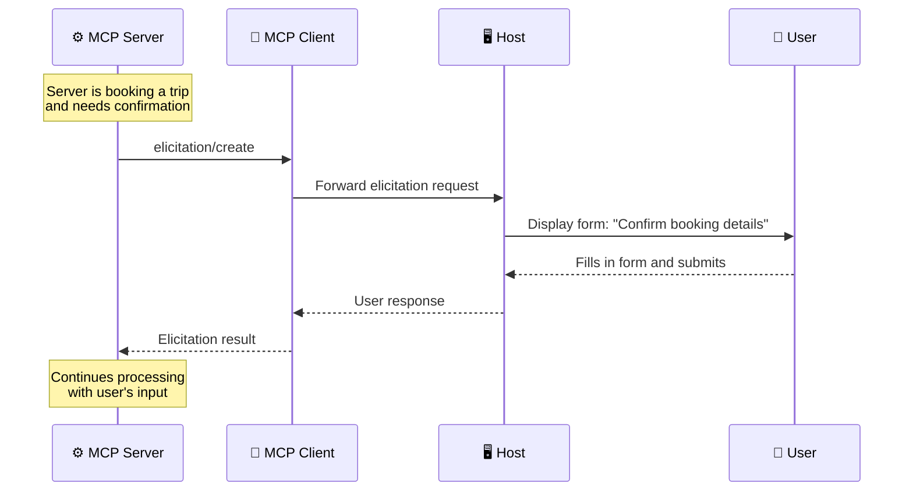
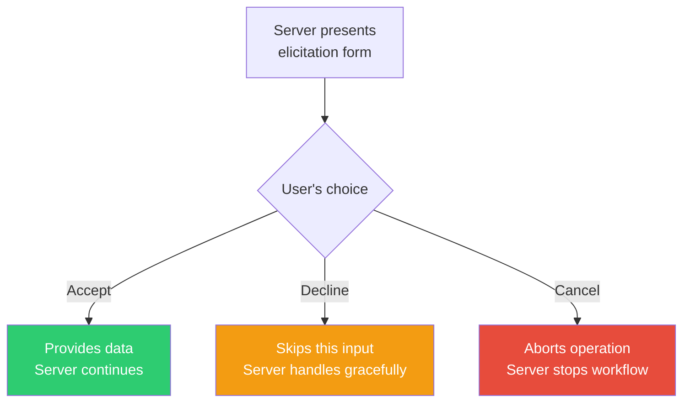

# Elicitation: Servers Asking the User for Input

> **Level**: 🟡 Intermediate
>
> **What You'll Learn**:
>
> - What elicitation is and how it differs from sampling
> - How servers request structured input from users with form schemas
> - What response options users have (provide, decline, cancel)
> - Privacy protections built into the elicitation design

## What is Elicitation?

**Elicitation** is a mechanism that allows MCP servers to request specific information directly from the user. While [sampling](07-sampling.md) asks the AI for help, elicitation asks the **human** for help.

This is essential when a server needs information that only the user can provide — confirmations, preferences, personal details, or decisions that shouldn't be automated.

### Sampling vs Elicitation

| Aspect | Sampling | Elicitation |
|--------|----------|-------------|
| **Who answers** | The AI (LLM) | The user (human) |
| **Purpose** | Server needs AI reasoning/analysis | Server needs user input/decisions |
| **UI** | Invisible to user (with approval checkpoints) | Visible form or dialog presented to the user |
| **Example** | "Analyze these 50 flights and pick the best" | "Please confirm: book Flight 1 for $450?" |

## When Servers Need User Input

Without elicitation, a server would need all information up front or would fail when data is missing. Elicitation creates a more natural workflow:



**Typical scenarios:**

- **Booking confirmation**: "Confirm your Barcelona trip: flights + hotel = $3,000?"
- **Missing information**: "What's your preferred seat type? (window/aisle/no preference)"
- **Decision point**: "Two hotels match your criteria. Which do you prefer?"
- **Contact details**: "Please provide your phone number for the hotel reservation"

## The `elicitation/create` Request

When a server needs user input, it sends a request with a message and a JSON Schema that defines the form fields:

```json
{
  "jsonrpc": "2.0",
  "id": 6,
  "method": "elicitation/create",
  "params": {
    "message": "Please confirm your Barcelona vacation booking details:",
    "requestedSchema": {
      "type": "object",
      "properties": {
        "confirmBooking": {
          "type": "boolean",
          "description": "Confirm the booking (Flights + Hotel = $3,000)"
        },
        "seatPreference": {
          "type": "string",
          "enum": ["window", "aisle", "no preference"],
          "description": "Preferred seat type for flights"
        },
        "roomType": {
          "type": "string",
          "enum": ["sea view", "city view", "garden view"],
          "description": "Preferred room type at hotel"
        },
        "specialRequests": {
          "type": "string",
          "description": "Any special requests for the hotel (optional)"
        }
      },
      "required": ["confirmBooking"]
    }
  }
}
```

### Schema Field Types

The JSON Schema supports various field types that the Host renders as appropriate UI controls:

| Schema Type | UI Control | Example |
|------------|-----------|---------|
| `boolean` | Checkbox or toggle | "Confirm booking?" ✅ |
| `string` | Text input | "Special requests: ____" |
| `string` with `enum` | Dropdown or radio buttons | "Seat: ○ window ○ aisle ○ no preference" |
| `number` | Number input | "Number of travelers: [2]" |

## User Response Options

When an elicitation form is presented, the user has three choices:

### 1. Provide the Information

The user fills in the form and submits:

```json
{
  "jsonrpc": "2.0",
  "id": 6,
  "result": {
    "action": "accept",
    "content": {
      "confirmBooking": true,
      "seatPreference": "window",
      "roomType": "sea view",
      "specialRequests": "Late check-in, please"
    }
  }
}
```

### 2. Decline to Provide Information

The user can decline without cancelling the overall operation:

```json
{
  "jsonrpc": "2.0",
  "id": 6,
  "result": {
    "action": "decline"
  }
}
```

The server receives the decline and must handle it gracefully — perhaps using default values or skipping optional steps.

### 3. Cancel the Operation

The user can cancel the entire operation:

```json
{
  "jsonrpc": "2.0",
  "id": 6,
  "result": {
    "action": "cancel"
  }
}
```

The server should abort the current workflow.



## Privacy Protections

Elicitation includes important privacy safeguards:

| Protection | Description |
|-----------|-------------|
| **No password requests** | Elicitation must never be used to request passwords or API keys |
| **Suspicious request warnings** | Clients warn users about requests that seem inappropriate |
| **Data review** | Users can review all data before it's sent to the server |
| **Server identification** | The UI clearly shows which server is making the request |
| **Context explanation** | The `message` field explains why the information is needed |

The Host application acts as a **trust barrier** — it shows the user exactly what the server is asking for, why, and lets the user decide whether to share the information.

## Key Takeaways

- **Elicitation** allows servers to request structured input directly from users
- It differs from sampling: elicitation asks the **user**, sampling asks the **AI**
- Requests use **JSON Schema** to define form fields with types, options, and validation
- Users can **accept** (provide data), **decline** (skip), or **cancel** (abort the operation)
- **Privacy protections** prevent password collection and warn about suspicious requests
- Elicitation enables dynamic, interactive workflows where servers gather information on demand

## Next Steps

- [Roots](09-roots.md) — How clients define filesystem boundaries for servers
- [Sampling](07-sampling.md) — Compare with server-initiated AI requests
- [Capabilities](12-capabilities.md) — How elicitation support is declared

## References

- [MCP Specification — Elicitation](https://modelcontextprotocol.io/specification/latest/client/elicitation)
- [MCP Client Concepts — Elicitation](https://modelcontextprotocol.io/docs/learn/client-concepts)
