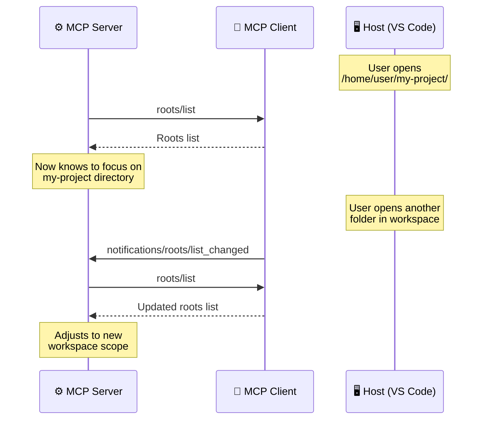

# Roots: Filesystem Boundaries

> **Level**: 🟡 Intermediate
>
> **What You'll Learn**:
>
> - What roots are and why they exist
> - How clients define workspace boundaries for servers
> - The difference between advisory boundaries and security enforcement
> - How roots change dynamically during a session

## What are Roots?

**Roots** are URIs that clients provide to servers to define which parts of the filesystem (or other resources) are relevant to the current context. Think of roots as telling a server: "Here is where I'm working — focus on this area."

### The Problem Roots Solve

Imagine you open VS Code with a project folder `/home/user/my-project/`. You have an MCP server that manages files. Without roots, the server has no way to know which directory matters — it might try to operate on the entire filesystem.

Roots solve this by telling the server:

> "The user is working in `/home/user/my-project/`. Focus your operations there."

## How Roots Work

Clients expose roots through a simple list mechanism:



### The `roots/list` Response

When a server requests the list of roots, the client responds:

```json
{
  "jsonrpc": "2.0",
  "id": 3,
  "result": {
    "roots": [
      {
        "uri": "file:///home/user/my-project",
        "name": "My Project"
      },
      {
        "uri": "file:///home/user/shared-libs",
        "name": "Shared Libraries"
      }
    ]
  }
}
```

Each root has:

| Field | Type | Description |
|-------|------|-------------|
| `uri` | string | The URI identifying the root (typically `file://`) |
| `name` | string | Optional human-readable label for display |

### Dynamic Root Changes

When the user changes their workspace (opens a new folder, closes a project), the client sends a notification:

```json
{
  "jsonrpc": "2.0",
  "method": "notifications/roots/list_changed"
}
```

The server should then call `roots/list` again to get the updated set of roots and adjust its behavior accordingly.

## Advisory, Not Security

An important design principle: **roots are advisory, not security boundaries.**

| Aspect | What Roots Do | What Roots Don't Do |
|--------|---------------|---------------------|
| **Guidance** | Tell the server where to focus operations | Prevent the server from accessing other paths |
| **Context** | Help the server understand the workspace layout | Act as a sandbox or jail |
| **Coordination** | Enable intelligent file searching and filtering | Enforce filesystem permissions |
| **Scope** | Suggest relevant directories for operations | Block reads/writes outside the roots |

This means a server should **respect** roots and use them to scope its operations, but the protocol doesn't enforce this at the transport level. Security enforcement happens at the OS and application layers.

### Why Advisory?

MCP is designed for **coordination**, not enforcement. The philosophy is:

1. Trust between components is established during configuration
2. The Host application verifies server behavior through user oversight
3. OS-level permissions handle actual security
4. Roots help servers be more useful by understanding context

## Practical Examples

### Single Project

A user opens one project folder:

```json
{
  "roots": [
    {
      "uri": "file:///home/user/webapp",
      "name": "Web Application"
    }
  ]
}
```

The file management server knows to list files, search, and operate within `webapp/`.

### Multi-Root Workspace

A user has multiple related projects open (common in monorepo setups):

```json
{
  "roots": [
    {
      "uri": "file:///home/user/monorepo/frontend",
      "name": "Frontend"
    },
    {
      "uri": "file:///home/user/monorepo/backend",
      "name": "Backend API"
    },
    {
      "uri": "file:///home/user/monorepo/shared",
      "name": "Shared Types"
    }
  ]
}
```

The server can now understand project structure and provide context-aware assistance.

### Remote Roots

Roots can use any URI scheme, not just `file://`:

```json
{
  "roots": [
    {
      "uri": "https://gitlab.example.com/team/project",
      "name": "GitLab Repository"
    }
  ]
}
```

## Key Takeaways

- **Roots** are URIs that define the workspace boundaries for a server's operations
- Clients provide roots through `roots/list` and notify changes via `notifications/roots/list_changed`
- Roots are **advisory** — they guide server behavior but don't enforce security boundaries
- Roots can change dynamically as the user opens or closes workspace folders
- Multiple roots support multi-project and monorepo workflows
- Any URI scheme can be used, not just `file://`

## Next Steps

- [Transport](10-transport.md) — How clients and servers communicate physically
- [Lifecycle](11-lifecycle.md) — How connections are established, including capability negotiation
- [Capabilities](12-capabilities.md) — How roots support is declared

## References

- [MCP Specification — Roots](https://modelcontextprotocol.io/specification/latest/client/roots)
- [MCP Client Concepts](https://modelcontextprotocol.io/docs/learn/client-concepts)
