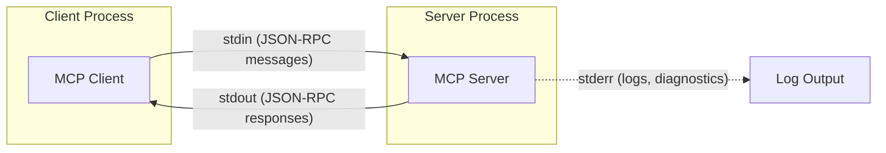
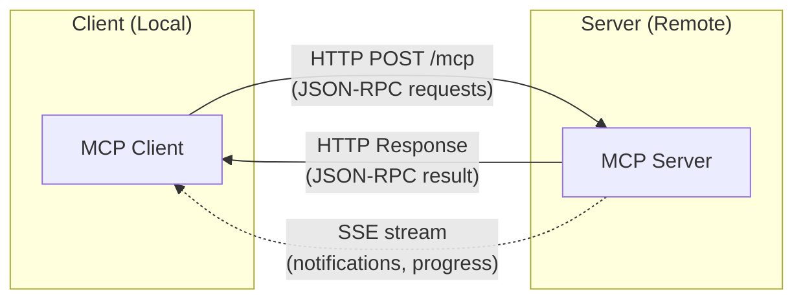
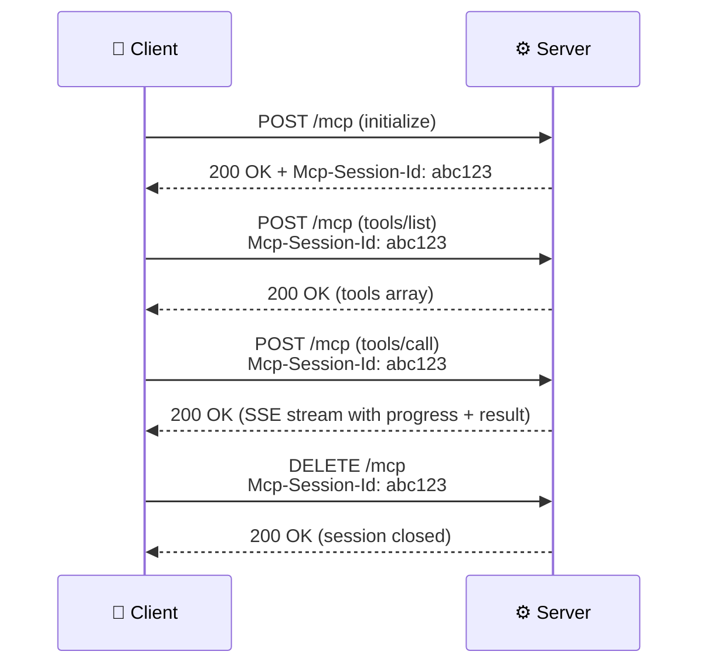
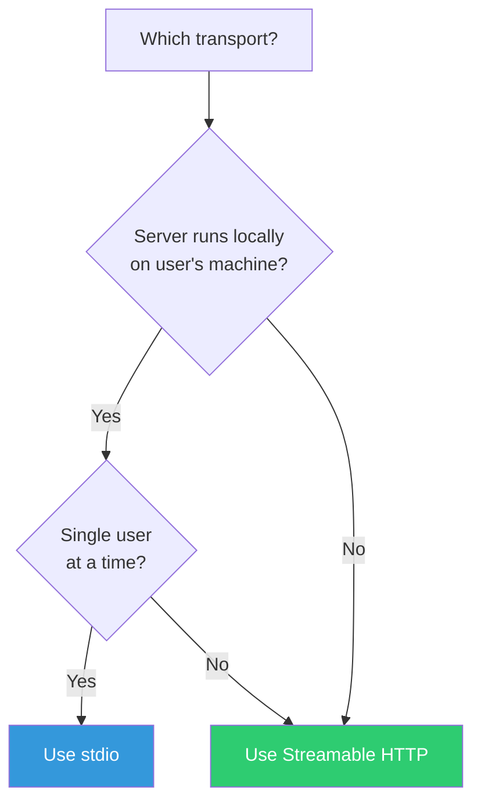

# Transport: How Clients and Servers Communicate

> **Level**: 🟡 Intermediate
>
> **What You'll Learn**:
>
> - What transport means in the MCP context
> - How **stdio** transport works (local processes)
> - How **Streamable HTTP** transport works (remote servers)
> - How to choose the right transport for your use case

## What is Transport?

**Transport** is the communication channel between a client and a server. While all MCP messages use [JSON-RPC 2.0](https://www.jsonrpc.org/specification) format, the way those messages travel between processes varies.

Think of it this way:

- **JSON-RPC** = the language (what they say)
- **Transport** = the phone line (how they talk)

MCP defines two official transports:

| Transport | Communication | Best For |
|-----------|--------------|----------|
| **stdio** | Standard input/output of a local process | Local tools, desktop IDEs, CLI integrations |
| **Streamable HTTP** | HTTP requests with Server-Sent Events (SSE) | Remote servers, cloud deployments, multi-client |

## stdio Transport

**stdio** (standard input/output) is the simplest and most common transport. The client launches the server as a child process and communicates by writing to its stdin and reading from its stdout.



### How It Works

1. The client **spawns** the server as a child process
2. Client writes JSON-RPC messages to the server's **stdin** (one message per line)
3. Server writes JSON-RPC responses to **stdout** (one message per line)
4. Server can write diagnostic information to **stderr** (never parsed as protocol messages)
5. When the client closes stdin, the server should exit

### Example Message Flow

```text
Client → stdin:  {"jsonrpc":"2.0","id":1,"method":"initialize","params":{...}}
Server → stdout: {"jsonrpc":"2.0","id":1,"result":{...}}
Client → stdin:  {"jsonrpc":"2.0","method":"initialized"}
Client → stdin:  {"jsonrpc":"2.0","id":2,"method":"tools/list"}
Server → stdout: {"jsonrpc":"2.0","id":2,"result":{"tools":[...]}}
```

### Advantages

- **Simple**: No network configuration, ports, or authentication needed
- **Secure**: Communication stays within the local machine
- **Reliable**: No network failures, firewalls, or TLS issues
- **Fast**: Direct inter-process communication with minimal overhead
- **Natural lifecycle**: Server starts and stops with the client

### Configuration Example

Most MCP hosts configure stdio servers in a JSON file:

```json
{
  "mcpServers": {
    "gitlab": {
      "command": "gitlab-mcp-server",
      "args": [],
      "env": {
        "GITLAB_URL": "https://gitlab.example.com",
        "GITLAB_TOKEN": "glpat-..."
      }
    }
  }
}
```

## Streamable HTTP Transport

**Streamable HTTP** is designed for remote or shared servers. It uses standard HTTP requests with optional **Server-Sent Events (SSE)** for server-to-client streaming.



### How It Works

1. The server listens on an HTTP endpoint (e.g., `http://localhost:8080/mcp`)
2. Client sends JSON-RPC messages via **HTTP POST** requests
3. Server responds with JSON-RPC results in the HTTP response body
4. For long-running operations, the server can use **SSE** to stream progress notifications
5. Sessions are managed via a `Mcp-Session-Id` header

### Key Features

| Feature | Description |
|---------|-------------|
| **Session management** | `Mcp-Session-Id` header tracks client sessions |
| **SSE streaming** | Server can push notifications and progress updates asynchronously |
| **Standard HTTP** | Works with load balancers, proxies, and existing HTTP infrastructure |
| **Multi-client** | A single server can handle multiple client sessions simultaneously |
| **Authentication** | Standard HTTP authentication (Bearer tokens, API keys) |

### Session Lifecycle



## Choosing the Right Transport

| Criteria | stdio | Streamable HTTP |
|----------|-------|-----------------|
| **Deployment** | Local binary on user's machine | Remote server or cloud service |
| **Clients** | Single client per server instance | Multiple simultaneous clients |
| **Security** | Process-level isolation | Requires HTTP auth + TLS |
| **Setup** | Zero configuration | Requires network configuration |
| **Scalability** | One instance per user | Shared across users/teams |
| **Network** | No network needed | Requires network connectivity |
| **Use case** | Desktop IDE plugins, CLI tools | Team tools, cloud integrations, SaaS |

### Decision Flowchart



## Key Takeaways

- **Transport** is the physical communication channel between MCP clients and servers
- **stdio** launches servers as local processes — simple, secure, and zero-config
- **Streamable HTTP** uses standard HTTP with optional SSE — network-ready and multi-client
- All messages use **JSON-RPC 2.0** regardless of transport
- **stdio** is best for local IDE integrations; **Streamable HTTP** is best for remote/shared servers
- Server diagnostic output goes to **stderr** (stdio) to avoid interfering with protocol messages

## Next Steps

- [Lifecycle](11-lifecycle.md) — How connections initialize and shut down
- [Capabilities](12-capabilities.md) — How clients and servers declare their supported features
- [Security](16-security.md) — Security considerations for both transports

## References

- [MCP Specification — Transports](https://modelcontextprotocol.io/specification/latest/basic/transports)
- [JSON-RPC 2.0 Specification](https://www.jsonrpc.org/specification)
- [Server-Sent Events (SSE) — MDN](https://developer.mozilla.org/en-US/docs/Web/API/Server-sent_events)
