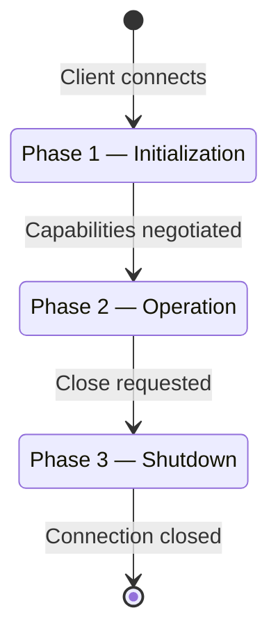
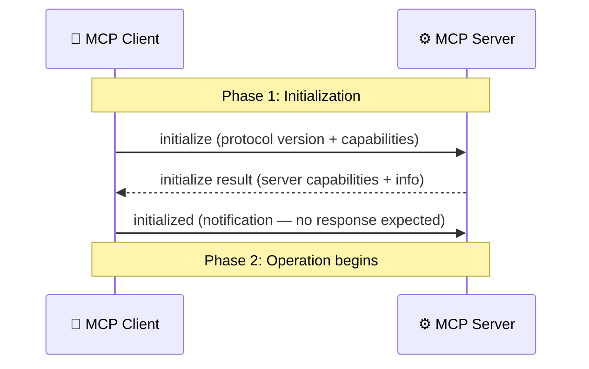
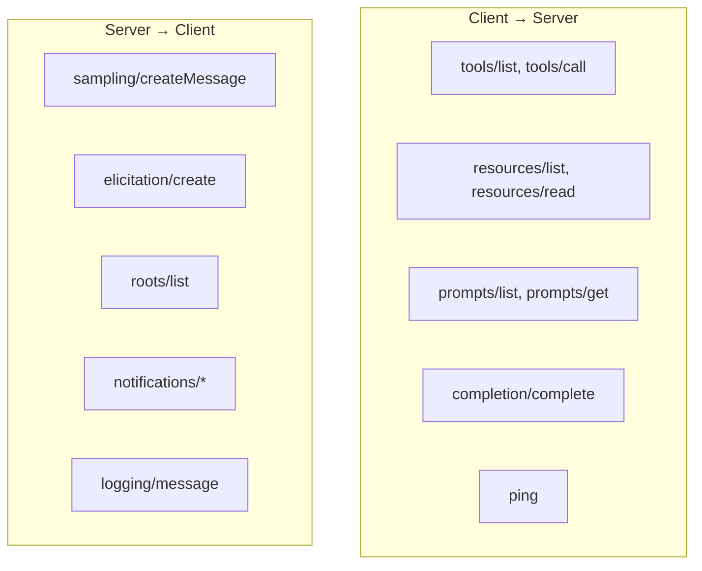
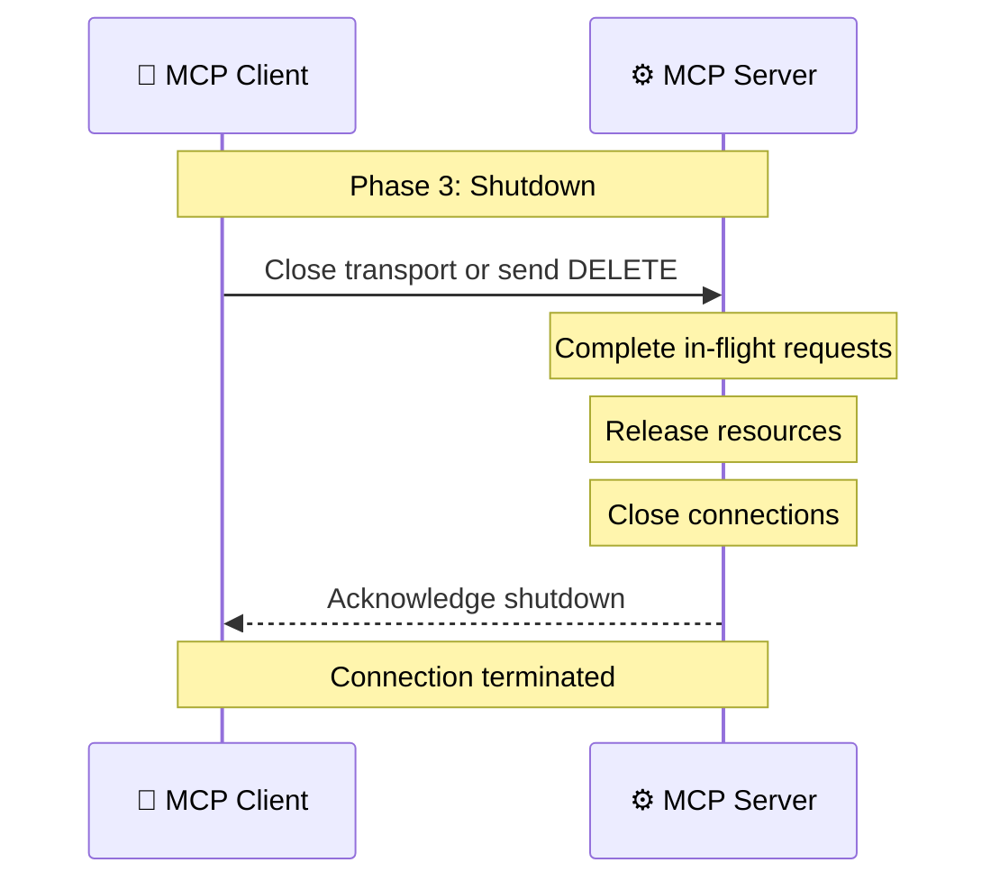
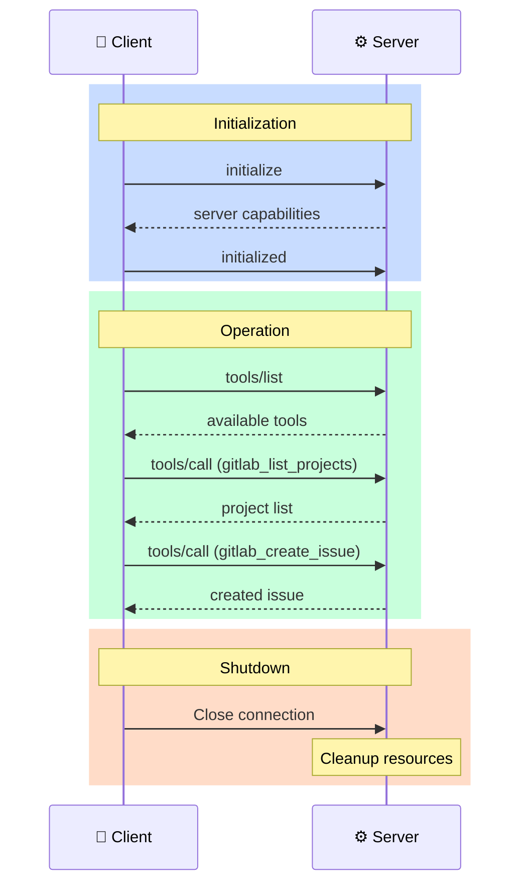

# Lifecycle: From Connection to Shutdown

> **Level**: 🟡 Intermediate
>
> **What You'll Learn**:
>
> - The three phases of an MCP connection lifecycle
> - How initialization and capability negotiation works
> - What happens during active operation
> - How connections shut down gracefully

## Overview

Every MCP connection follows a predictable lifecycle with three phases:



## Phase 1: Initialization

Initialization is a strict handshake where the client and server agree on which protocol version and features to use.

### Step-by-Step



### The `initialize` Request

The client sends its supported protocol version and declared capabilities:

```json
{
  "jsonrpc": "2.0",
  "id": 1,
  "method": "initialize",
  "params": {
    "protocolVersion": "2025-11-25",
    "capabilities": {
      "roots": {
        "listChanged": true
      },
      "sampling": {},
      "elicitation": {}
    },
    "clientInfo": {
      "name": "VS Code",
      "version": "1.95.0"
    }
  }
}
```

### The `initialize` Response

The server responds with its own capabilities and information:

```json
{
  "jsonrpc": "2.0",
  "id": 1,
  "result": {
    "protocolVersion": "2025-11-25",
    "capabilities": {
      "tools": {
        "listChanged": true
      },
      "resources": {
        "subscribe": true,
        "listChanged": true
      },
      "prompts": {
        "listChanged": true
      },
      "logging": {},
      "completions": {}
    },
    "serverInfo": {
      "name": "gitlab-mcp-server",
      "version": "1.0.0"
    }
  }
}
```

### The `initialized` Notification

After receiving the server's response, the client sends a notification confirming the handshake is complete:

```json
{
  "jsonrpc": "2.0",
  "method": "initialized"
}
```

This is a **notification** (no `id` field) — the server doesn't respond to it.

### Version Negotiation

| Scenario | Behavior |
|----------|----------|
| Client and server support the same version | Use that version |
| Server supports a lower version | Server responds with the highest version it supports |
| Versions are incompatible | Server returns an error and the connection fails |

### Rules During Initialization

- The client **must not** send any requests other than `initialize` before the handshake completes
- The server **must not** send any requests before receiving `initialized`
- Both sides should respect the negotiated capabilities throughout the session

## Phase 2: Operation

Once initialization is complete, the connection enters the **operation** phase. Normal message exchange happens here.

### What Happens During Operation

Both sides can now freely exchange messages according to their declared capabilities:



### Key Operation Rules

| Rule | Description |
|------|-------------|
| **Respect capabilities** | Only use features declared during initialization |
| **Request-response** | Every request (has `id`) expects a response |
| **Notifications** | Fire-and-forget messages (no `id`), no response expected |
| **Cancellation** | Either side can cancel in-flight requests via `notifications/cancelled` |
| **Ping** | Either side can send `ping` to check if the other is alive |

### Cancellation

If a request takes too long or is no longer needed, the requester can cancel it:

```json
{
  "jsonrpc": "2.0",
  "method": "notifications/cancelled",
  "params": {
    "requestId": 42,
    "reason": "User navigated away"
  }
}
```

The cancellation is a **notification** — the sender should still be prepared to receive a response for the cancelled request.

## Phase 3: Shutdown

Clean shutdown ensures both sides release resources properly.

### Shutdown Methods

| Method | Trigger | Behavior |
|--------|---------|----------|
| **Close transport** | Client closes connection | Server detects and cleans up |
| **stdio: close stdin** | Client closes stdin pipe | Server should exit gracefully |
| **HTTP: DELETE session** | Client sends `DELETE /mcp` | Server removes session state |
| **Process termination** | Client terminates server process | For stdio — last resort |

### Graceful Shutdown Sequence



### Best Practices for Shutdown

- Complete in-flight requests before closing
- Release file handles, database connections, and other resources
- For stdio: exit the process with code 0 on clean shutdown
- For HTTP: return 200 OK on DELETE to confirm session termination
- Handle abrupt disconnections gracefully (client may crash)

## Complete Lifecycle Example

Here's a complete session from start to finish:



## Key Takeaways

- MCP connections have three phases: **Initialization**, **Operation**, and **Shutdown**
- **Initialization** is a strict handshake: `initialize` → response → `initialized` notification
- Both sides declare **capabilities** during initialization — this determines available features
- **Protocol version** is negotiated during initialization for compatibility
- During **operation**, both sides exchange requests, responses, and notifications freely
- **Shutdown** should be graceful: complete in-flight work, release resources, close cleanly
- Either side can **cancel** pending requests or **ping** the other to check liveness

## Next Steps

- [Capabilities](12-capabilities.md) — Deep dive into what capabilities mean and how they work
- [Transport](10-transport.md) — How the physical communication channel works
- [Notifications and Progress](13-notifications-and-progress.md) — Real-time updates during operation

## References

- [MCP Specification — Lifecycle](https://modelcontextprotocol.io/specification/latest/basic/lifecycle)
- [MCP Specification — Cancellation](https://modelcontextprotocol.io/specification/latest/basic/lifecycle#cancellation)
- [JSON-RPC 2.0 Specification](https://www.jsonrpc.org/specification)
