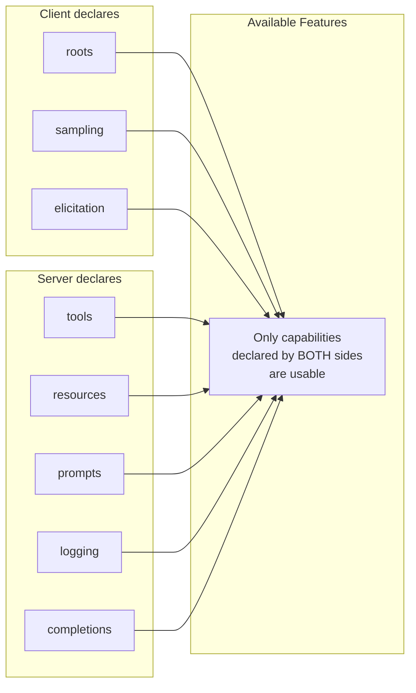
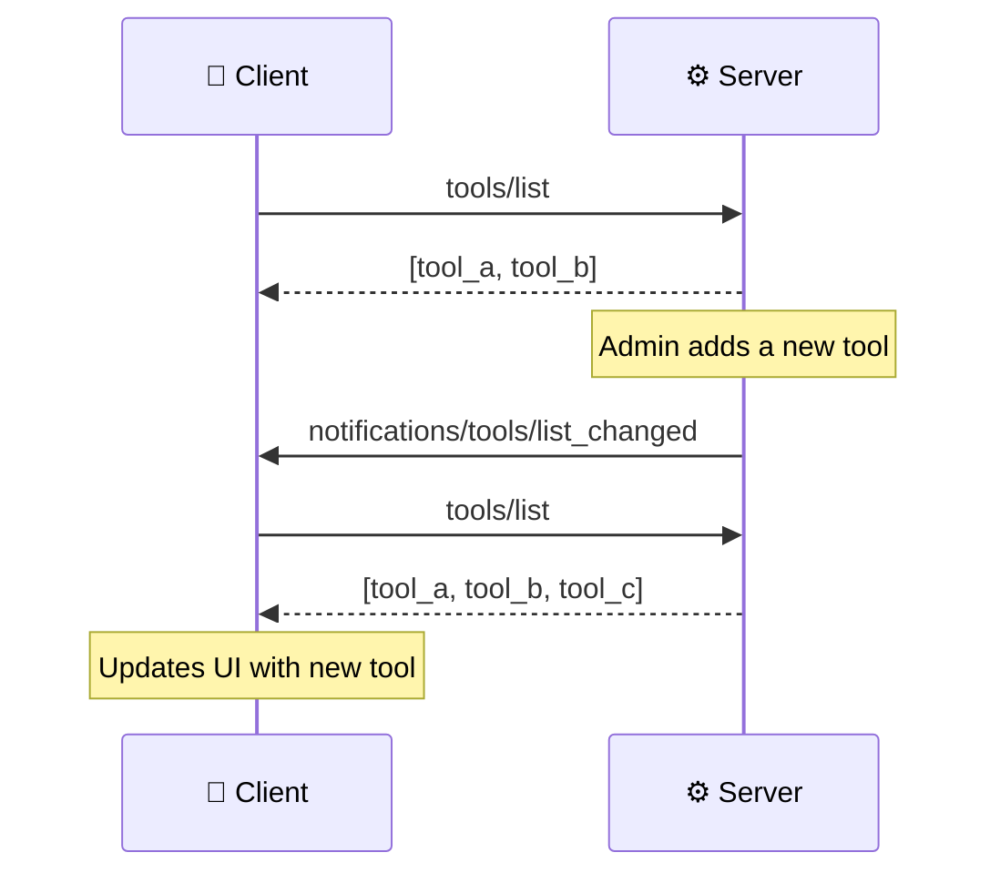
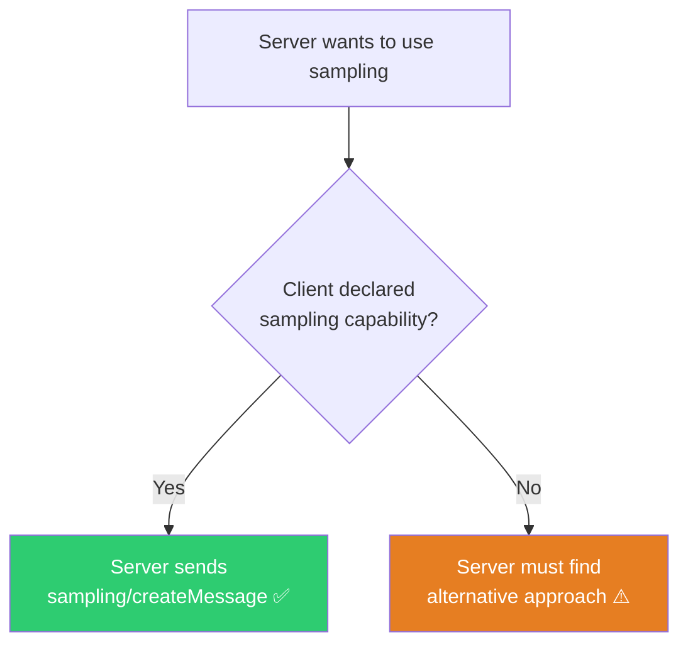

# Capabilities: What Clients and Servers Can Do

> **Level**: 🟡 Intermediate
>
> **What You'll Learn**:
>
> - What capabilities are and why they matter
> - Which capabilities clients and servers can declare
> - How capability negotiation determines the available feature set
> - What `listChanged` means for dynamic updates

## What are Capabilities?

**Capabilities** are feature declarations exchanged during [initialization](11-lifecycle.md). They tell the other side: "Here's what I support — only use these features."

This design makes MCP extensible without breaking compatibility. A simple server can declare minimal capabilities, while a full-featured server can declare everything. The client adapts to whatever the server supports.



## Server Capabilities

Servers declare which primitives and features they support:

| Capability | Description | Sub-options |
|-----------|-------------|-------------|
| `tools` | Server provides [tools](04-tools.md) for the AI to call | `listChanged` |
| `resources` | Server provides [resources](05-resources.md) for data access | `subscribe`, `listChanged` |
| `prompts` | Server provides [prompts](06-prompts.md) as templates | `listChanged` |
| `logging` | Server can send log messages to the client | — |
| `completions` | Server supports argument auto-completion | — |

### Example: Full-Featured Server

```json
{
  "capabilities": {
    "tools": {
      "listChanged": true
    },
    "resources": {
      "subscribe": true,
      "listChanged": true
    },
    "prompts": {
      "listChanged": true
    },
    "logging": {},
    "completions": {}
  }
}
```

### Example: Minimal Server (Tools Only)

```json
{
  "capabilities": {
    "tools": {}
  }
}
```

This server only provides tools — no resources, prompts, logging, or completions.

## Client Capabilities

Clients declare which server-initiated features they support:

| Capability | Description | Sub-options |
|-----------|-------------|-------------|
| `roots` | Client can provide [roots](09-roots.md) (workspace boundaries) | `listChanged` |
| `sampling` | Client supports [sampling](07-sampling.md) (server-initiated LLM calls) | — |
| `elicitation` | Client supports [elicitation](08-elicitation.md) (server-initiated user input) | — |

### Example: Full Client

```json
{
  "capabilities": {
    "roots": {
      "listChanged": true
    },
    "sampling": {},
    "elicitation": {}
  }
}
```

### Example: Basic Client

```json
{
  "capabilities": {
    "roots": {}
  }
}
```

This client provides roots but doesn't support sampling or elicitation. The server must not send `sampling/createMessage` or `elicitation/create` requests to this client.

## The `listChanged` Sub-Option

Many capabilities include a `listChanged` boolean. This tells the other side whether it supports **dynamic list update notifications**.

| With `listChanged: true` | Without `listChanged` |
|--------------------------|----------------------|
| Server can notify when its tool list changes | Client must assume the tool list is static |
| Client receives `notifications/tools/list_changed` | Client only sees tools from initial `tools/list` call |
| Enables adding/removing tools at runtime | Tools are fixed for the session duration |

### How Dynamic Updates Work



This pattern applies to all three server primitives:

| Primitive | Notification |
|-----------|-------------|
| Tools | `notifications/tools/list_changed` |
| Resources | `notifications/resources/list_changed` |
| Prompts | `notifications/prompts/list_changed` |

## Capability Negotiation in Practice

The key principle: **if a capability is not declared, its features must not be used.**

### Scenario: Server Uses Sampling



### What Happens When Capabilities Don't Match

| Server Wants | Client Supports | Result |
|-------------|----------------|--------|
| sampling | ✅ sampling declared | Server can use sampling normally |
| sampling | ❌ sampling not declared | Server must handle without sampling |
| elicitation | ✅ elicitation declared | Server can ask user for input |
| elicitation | ❌ elicitation not declared | Server must use defaults or fail gracefully |

Well-designed servers handle missing capabilities gracefully — they degrade functionality rather than failing completely.

## Key Takeaways

- **Capabilities** are feature declarations exchanged during initialization
- **Server** capabilities: `tools`, `resources`, `prompts`, `logging`, `completions`
- **Client** capabilities: `roots`, `sampling`, `elicitation`
- Features **must not be used** if the corresponding capability wasn't declared
- The `listChanged` sub-option enables **dynamic updates** — items can be added/removed at runtime
- Good implementations **degrade gracefully** when a desired capability isn't available

## Next Steps

- [Notifications and Progress](13-notifications-and-progress.md) — How real-time updates flow between client and server
- [Completions](14-completions.md) — Auto-completion for tool arguments
- [Logging](15-logging.md) — Structured logging from server to client

## References

- [MCP Specification — Capabilities](https://modelcontextprotocol.io/specification/latest/basic/lifecycle#capability-negotiation)
- [MCP Specification — Lifecycle](https://modelcontextprotocol.io/specification/latest/basic/lifecycle)
