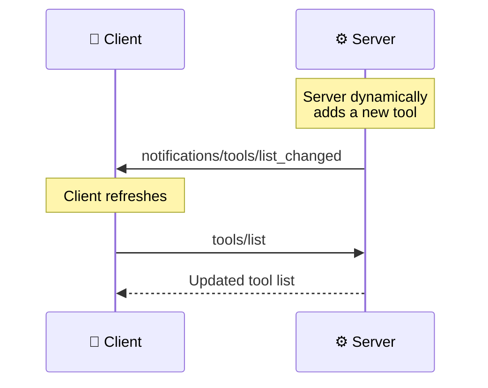
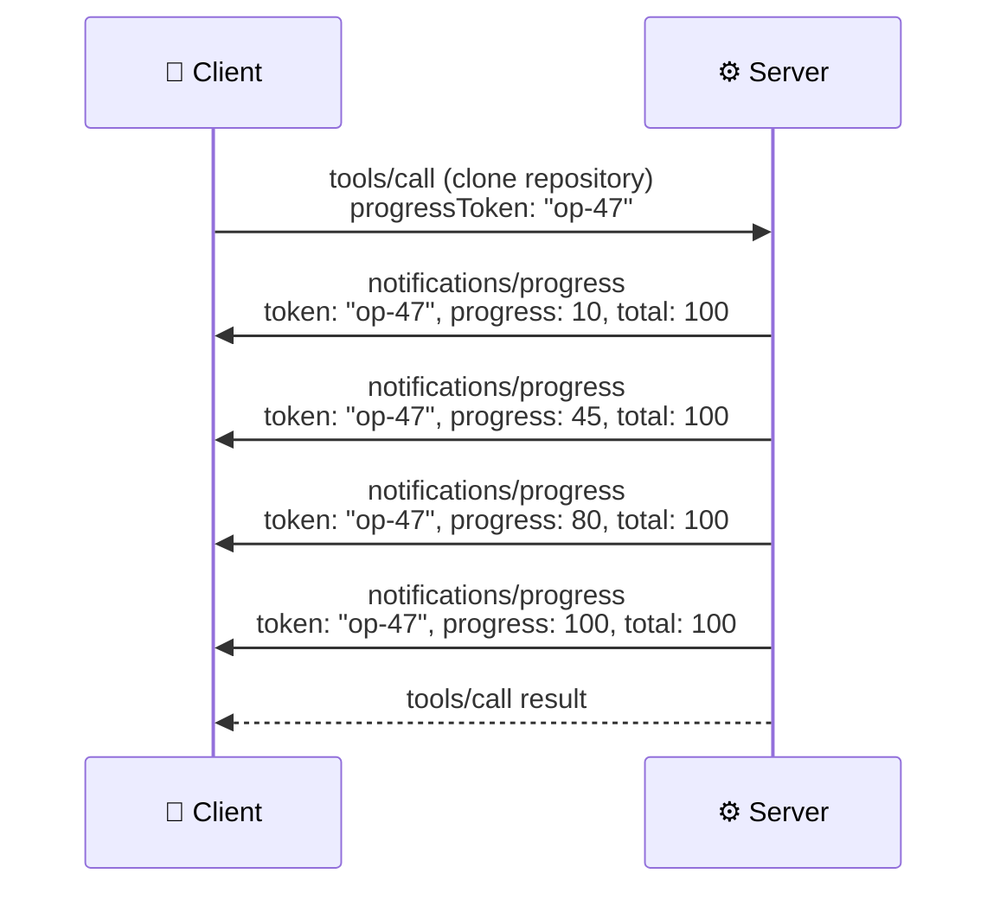
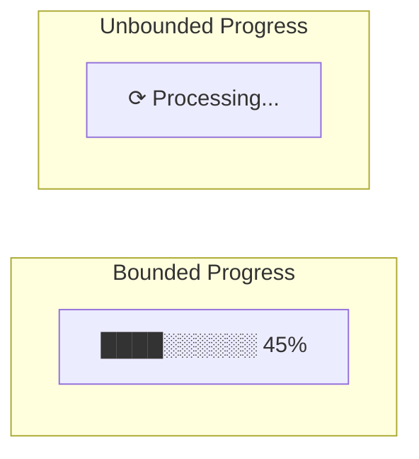

# Notifications and Progress

> **Level**: 🟡 Intermediate
>
> **What You'll Learn**:
>
> - How notifications differ from requests in MCP
> - Types of notifications: list changes, cancellation, and progress
> - How progress tokens enable real-time operation tracking
> - The difference between bounded and unbounded progress

## Notifications vs Requests

In MCP, there are two kinds of messages:

| Message Type | Has `id`? | Expects Response? | Example |
|-------------|-----------|-------------------|---------|
| **Request** | Yes | Yes | `tools/list`, `tools/call` |
| **Notification** | No | No | `notifications/tools/list_changed` |

Notifications are **fire-and-forget** — the sender doesn't wait for a response. They're used for events, status updates, and progress reporting.

```json
{
  "jsonrpc": "2.0",
  "method": "notifications/tools/list_changed"
}
```

Notice: no `id` field. The receiver processes it but doesn't reply.

## Types of Notifications

### List Changed Notifications

When a server's available tools, resources, or prompts change, it sends a notification so the client can refresh:

| Notification | Triggered When |
|-------------|----------------|
| `notifications/tools/list_changed` | Tools added, removed, or modified |
| `notifications/resources/list_changed` | Resources added, removed, or modified |
| `notifications/prompts/list_changed` | Prompts added, removed, or modified |

These require the corresponding `listChanged: true` capability.



### Resource Subscription Notifications

When a client subscribes to a resource, the server sends updates when that resource changes:

```json
{
  "jsonrpc": "2.0",
  "method": "notifications/resources/updated",
  "params": {
    "uri": "gitlab://project/42/info"
  }
}
```

### Roots Changed Notification

When the client's workspace changes (user opens/closes folders):

```json
{
  "jsonrpc": "2.0",
  "method": "notifications/roots/list_changed"
}
```

### Cancellation Notification

Either side can cancel a pending request:

```json
{
  "jsonrpc": "2.0",
  "method": "notifications/cancelled",
  "params": {
    "requestId": 42,
    "reason": "Operation no longer needed"
  }
}
```

## Progress Reporting

For long-running operations, MCP supports **progress reporting** so users see real-time status updates.

### How Progress Works

1. The requester includes a `_meta.progressToken` in the request
2. The handler sends `notifications/progress` messages referencing that token
3. Progress updates include current value and optional total



### Request with Progress Token

```json
{
  "jsonrpc": "2.0",
  "id": 5,
  "method": "tools/call",
  "params": {
    "name": "gitlab_clone_repository",
    "arguments": {
      "project_id": "42"
    },
    "_meta": {
      "progressToken": "op-47"
    }
  }
}
```

### Progress Notification

```json
{
  "jsonrpc": "2.0",
  "method": "notifications/progress",
  "params": {
    "progressToken": "op-47",
    "progress": 45,
    "total": 100,
    "message": "Cloning: 45% complete"
  }
}
```

### Progress Fields

| Field | Type | Required | Description |
|-------|------|----------|-------------|
| `progressToken` | string or number | Yes | Matches the token from the original request |
| `progress` | number | Yes | Current progress value |
| `total` | number | No | Total expected value (enables percentage calculation) |
| `message` | string | No | Human-readable status description |

### Bounded vs Unbounded Progress

| Type | Has `total`? | UI Display | Example |
|------|-------------|-----------|---------|
| **Bounded** | Yes | Progress bar (45/100 = 45%) | File upload, batch processing |
| **Unbounded** | No | Spinner or pulse animation | Searching, waiting for API |



## Notification Summary

| Notification | Direction | Purpose |
|-------------|-----------|---------|
| `notifications/tools/list_changed` | Server → Client | Tools list was modified |
| `notifications/resources/list_changed` | Server → Client | Resources list was modified |
| `notifications/resources/updated` | Server → Client | Subscribed resource content changed |
| `notifications/prompts/list_changed` | Server → Client | Prompts list was modified |
| `notifications/roots/list_changed` | Client → Server | Workspace roots changed |
| `notifications/cancelled` | Either direction | Cancel a pending request |
| `notifications/progress` | Either direction | Report progress on an operation |

## Key Takeaways

- **Notifications** are fire-and-forget messages with no `id` and no response expected
- **List changed** notifications trigger when tools, resources, or prompts are dynamically modified
- **Progress reporting** uses `progressToken` to correlate updates with specific operations
- Progress can be **bounded** (with total — shows percentage) or **unbounded** (no total — shows spinner)
- **Cancellation** lets either side abort pending requests that are no longer needed
- All notifications are **optional** and tied to declared [capabilities](12-capabilities.md)

## Next Steps

- [Completions](14-completions.md) — Auto-completion for tool and prompt arguments
- [Logging](15-logging.md) — Structured server-to-client log messages
- [Capabilities](12-capabilities.md) — How notification support is declared

## References

- [MCP Specification — Notifications](https://modelcontextprotocol.io/specification/latest/basic/lifecycle#notifications)
- [MCP Specification — Progress](https://modelcontextprotocol.io/specification/latest/basic/utilities/progress)
- [MCP Specification — Cancellation](https://modelcontextprotocol.io/specification/latest/basic/lifecycle#cancellation)
