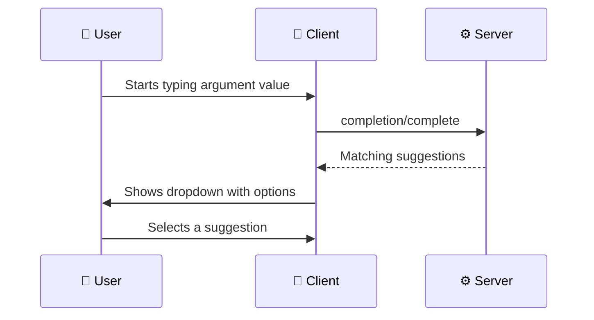
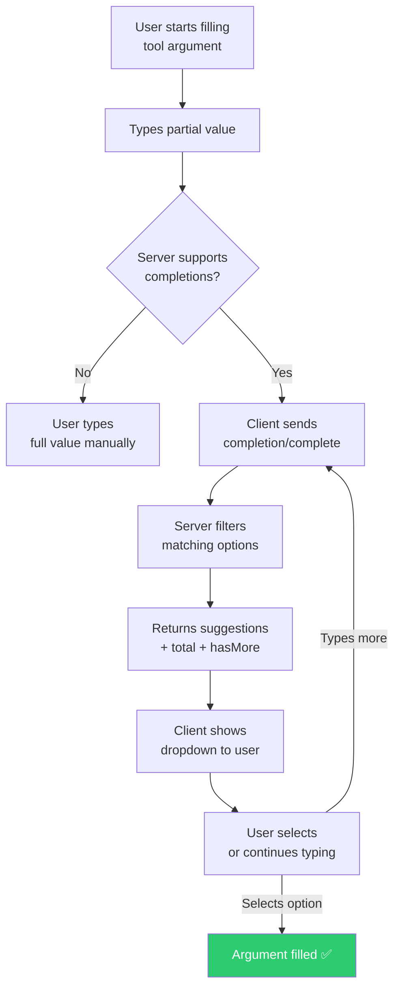

# Completions: Auto-Completing Arguments

> **Level**: 🟡 Intermediate
>
> **What You'll Learn**:
>
> - What completions are and when they're useful
> - How clients request argument completions from servers
> - The difference between tool and prompt argument completions
> - How servers provide filtered, paginated suggestions

## What are Completions?

**Completions** provide auto-complete suggestions for tool and prompt arguments. When a user starts typing an argument value, the client can ask the server for matching options.

This is similar to how your code editor suggests function names as you type — MCP completions do the same for tool parameters.

### Without Completions

The user must know and type the exact project ID:

```text
User: Create an issue in project... uh, what's the ID?
```

### With Completions

The client queries the server as the user types:

```text
User types: "my-pro"
Server suggests: ["my-project", "my-prototype", "my-production-app"]
User selects: "my-project" → resolves to project ID 42
```

## How Completions Work



## The `completion/complete` Request

### For Tool Arguments

When the user is filling in a tool argument:

```json
{
  "jsonrpc": "2.0",
  "id": 10,
  "method": "completion/complete",
  "params": {
    "ref": {
      "type": "ref/tool",
      "name": "gitlab_create_issue"
    },
    "argument": {
      "name": "project_id",
      "value": "my-pro"
    }
  }
}
```

### For Prompt Arguments

When the user is filling in a prompt argument:

```json
{
  "jsonrpc": "2.0",
  "id": 11,
  "method": "completion/complete",
  "params": {
    "ref": {
      "type": "ref/prompt",
      "name": "analyze_merge_request"
    },
    "argument": {
      "name": "project_id",
      "value": "web"
    }
  }
}
```

### The Response

The server returns matching values:

```json
{
  "jsonrpc": "2.0",
  "id": 10,
  "result": {
    "completion": {
      "values": [
        "my-project",
        "my-prototype",
        "my-production-app"
      ],
      "total": 3,
      "hasMore": false
    }
  }
}
```

### Response Fields

| Field | Type | Description |
|-------|------|-------------|
| `values` | string[] | List of completion suggestions |
| `total` | number | Total number of matching options (may be larger than `values` array) |
| `hasMore` | boolean | Whether more results are available beyond this page |

## Reference Types

The `ref` field identifies what the argument belongs to:

| Type | Description | Example |
|------|-------------|---------|
| `ref/tool` | Argument for a tool | Auto-complete `project_id` for `gitlab_create_issue` |
| `ref/prompt` | Argument for a prompt | Auto-complete `project_id` for `analyze_merge_request` |
| `ref/resource` | Argument for a resource template | Auto-complete `{project_id}` in `gitlab://project/{project_id}/info` |

## Practical Examples

### Project Name Completion

User is selecting a project for an issue:

```text
Argument: project_id
User types: "web"
Server returns: ["web-app", "web-api", "web-frontend", "website"]
```

### Branch Name Completion

User is selecting a branch for a merge request:

```text
Argument: source_branch
User types: "feat"
Server returns: ["feature/login", "feature/dashboard", "feat/api-v2"]
```

### Username Completion

User is assigning an issue:

```text
Argument: assignee
User types: "joh"
Server returns: ["john.smith", "johanna.dev", "john.admin"]
```

## Completions Flow



## Key Takeaways

- **Completions** provide auto-complete suggestions for tool, prompt, and resource arguments
- The server must declare the `completions` [capability](12-capabilities.md) during initialization
- Clients send partial values via `completion/complete` and receive filtered suggestions
- Results include `total` count and `hasMore` flag for pagination
- Three reference types: `ref/tool`, `ref/prompt`, and `ref/resource`
- Completions improve the user experience by reducing typing errors and discovery friction

## Next Steps

- [Logging](15-logging.md) — Structured log messages from server to client
- [Security](16-security.md) — Security considerations for the MCP protocol
- [Tools](04-tools.md) — Revisit tools with completions context

## References

- [MCP Specification — Completions](https://modelcontextprotocol.io/specification/latest/server/utilities/completion)
