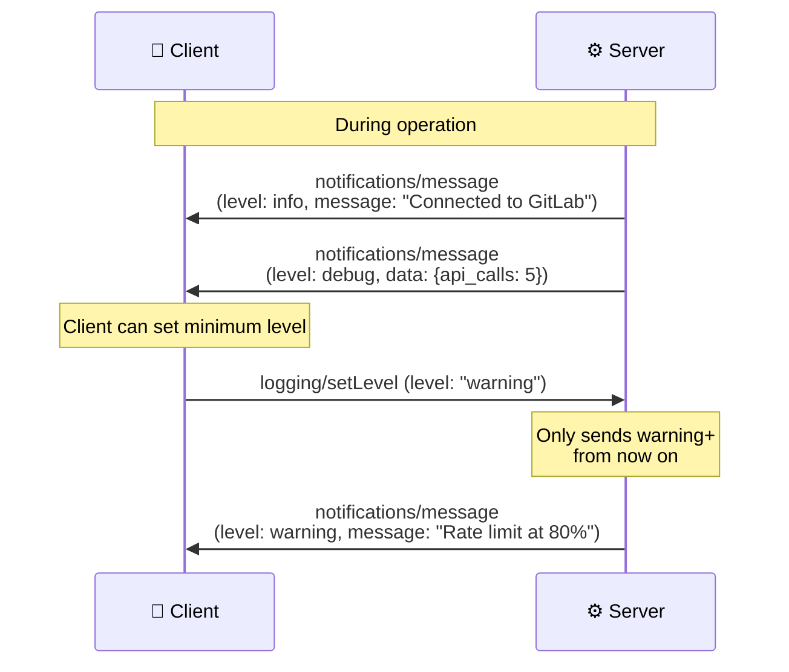
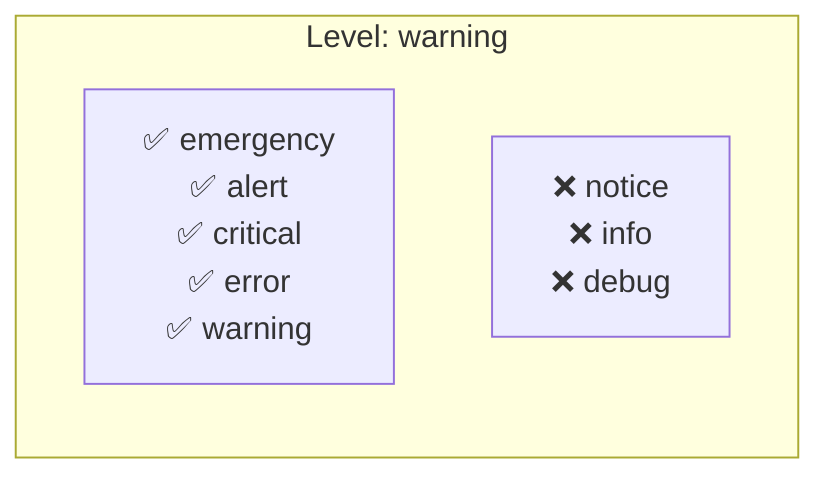

# Logging: Structured Server Messages

> **Level**: 🟡 Intermediate
>
> **What You'll Learn**:
>
> - How MCP logging works between server and client
> - Available log levels and when to use each
> - How clients control the logging verbosity
> - The difference between MCP logging and stderr output

## What is MCP Logging?

MCP includes a structured **logging** mechanism that allows servers to send diagnostic messages to the client. Unlike writing to stderr (which is only available in stdio transport), MCP logging works across all transports and is part of the protocol itself.

## How Logging Works



## Log Levels

MCP follows the standard [syslog severity levels](https://datatracker.ietf.org/doc/html/rfc5424) (RFC 5424):

| Level | Severity | When to Use |
|-------|----------|-------------|
| `emergency` | System unusable | Server cannot function at all |
| `alert` | Immediate action needed | Critical failure requiring intervention |
| `critical` | Critical conditions | Component failure, data corruption risk |
| `error` | Error conditions | Operation failed, but server continues |
| `warning` | Warning conditions | Potential issue, degraded operation |
| `notice` | Normal but significant | Important state changes |
| `info` | Informational | General operational messages |
| `debug` | Debug-level | Detailed diagnostic information |

Levels are ordered from most severe (`emergency`) to least severe (`debug`).

## Sending Log Messages

Servers send log messages via notifications:

```json
{
  "jsonrpc": "2.0",
  "method": "notifications/message",
  "params": {
    "level": "info",
    "logger": "gitlab-api",
    "data": "Successfully connected to GitLab instance"
  }
}
```

### Log Message Fields

| Field | Type | Required | Description |
|-------|------|----------|-------------|
| `level` | string | Yes | Severity level (see table above) |
| `logger` | string | No | Logger name — identifies the source component |
| `data` | any | Yes | Log content — can be a string or structured JSON object |

### Structured Data Example

```json
{
  "jsonrpc": "2.0",
  "method": "notifications/message",
  "params": {
    "level": "warning",
    "logger": "rate-limiter",
    "data": {
      "message": "Approaching GitLab API rate limit",
      "current_usage": 4200,
      "limit": 5000,
      "reset_at": "2025-01-15T10:30:00Z"
    }
  }
}
```

## Controlling Log Level

Clients can dynamically change the minimum log level:

```json
{
  "jsonrpc": "2.0",
  "id": 20,
  "method": "logging/setLevel",
  "params": {
    "level": "warning"
  }
}
```

After this request, the server should only send messages at `warning` level or higher (warning, error, critical, alert, emergency).



## MCP Logging vs stderr

| Aspect | MCP Logging | stderr |
|--------|------------|--------|
| **Transport** | Works on all transports (stdio + HTTP) | Only stdio transport |
| **Structure** | Structured JSON with levels | Free-form text |
| **Control** | Client can filter by level | No filtering |
| **Visibility** | Client can display in UI | Typically goes to a log file |
| **Protocol** | Part of MCP specification | OS-level output stream |

For stdio transport, servers should use **stderr** for low-level diagnostics (startup messages, crash info) and **MCP logging** for operational messages that the client should see.

## Key Takeaways

- MCP **logging** allows servers to send structured diagnostic messages to clients
- Eight severity levels from `emergency` (most severe) to `debug` (least severe)
- Clients can dynamically control verbosity with `logging/setLevel`
- Log messages use the `notifications/message` notification (fire-and-forget)
- The optional `logger` field identifies which component generated the message
- The `data` field can contain strings or structured JSON objects
- MCP logging works across **all transports**, unlike stderr which is stdio-only
- The server must declare the `logging` [capability](12-capabilities.md) during initialization

## Next Steps

- [Security](16-security.md) — Security considerations across the protocol
- [Putting It All Together](17-putting-it-all-together.md) — See how all pieces work in a real scenario
- [Capabilities](12-capabilities.md) — How logging capability is declared

## References

- [MCP Specification — Logging](https://modelcontextprotocol.io/specification/latest/server/utilities/logging)
- [RFC 5424 — The Syslog Protocol](https://datatracker.ietf.org/doc/html/rfc5424)
