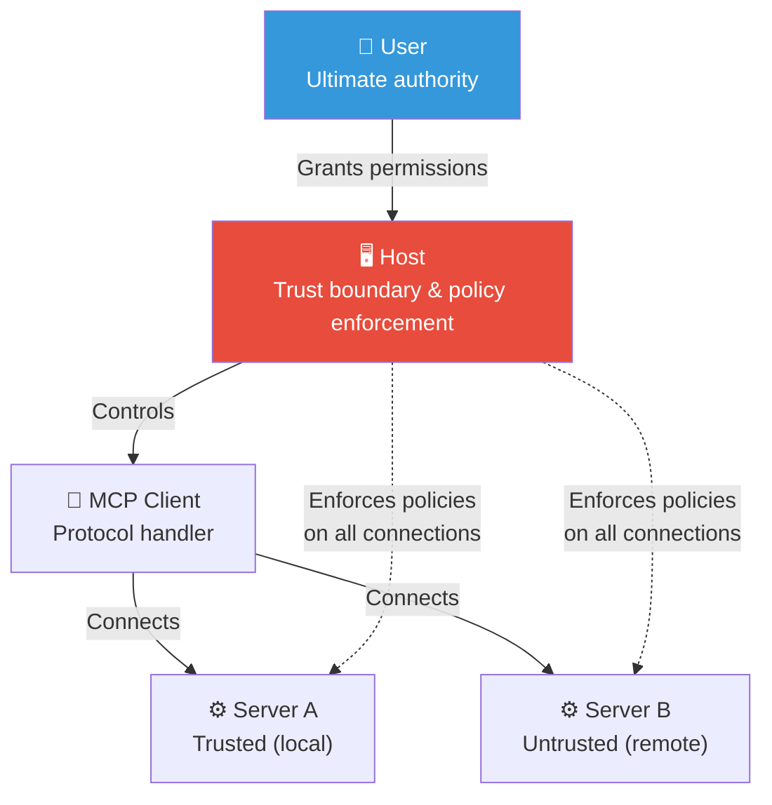
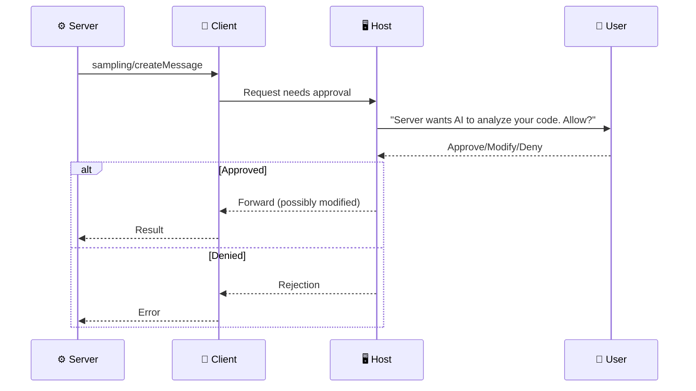

# Security: Trust, Consent, and Safety

> **Level**: 🔴 Advanced
>
> **What You'll Learn**:
>
> - The MCP trust model and its core security principles
> - How the Host acts as the trust boundary between users and servers
> - User consent requirements and human-in-the-loop patterns
> - Security considerations for transport, data, and tool execution
> - Common threats and mitigations

## The MCP Trust Model

MCP operates on a layered trust model where the **user** is always the ultimate authority, and the **Host** application enforces trust decisions.

### Core Principles

| Principle | Description |
|-----------|-------------|
| **User consent** | Users must explicitly approve sensitive operations before they execute |
| **Minimal authority** | Servers should request only the minimum permissions they need |
| **Transparency** | Users must be able to see what servers are doing on their behalf |
| **Defense in depth** | Multiple layers of protection — no single point of failure |
| **Trust boundaries** | The Host enforces boundaries between the user, AI, and servers |

## User Consent Requirements

MCP requires explicit user consent for several categories of operations:

### Before Connection

- Which MCP servers to connect to
- Which environment variables and credentials to expose
- What trust level to assign to each server

### During Operation

| Operation | Consent Required |
|-----------|-----------------|
| **Tool execution** | User should approve tool calls, especially those with side effects |
| **Sampling** | User must review and approve AI-generated content before it reaches the server |
| **Elicitation** | User explicitly fills in or declines the form — consent is built in |
| **Data sharing** | User controls what data reaches which servers |
| **Resource access** | Users may review resource subscriptions |

### Human-in-the-Loop

## Transport Security

### stdio Transport

| Aspect | Security Posture |
|--------|-----------------|
| **Network exposure** | None — communication is local only |
| **Authentication** | Implicit — process-level access control |
| **Encryption** | Not needed — no network transit |
| **Risk** | Minimal — relies on OS process isolation |
| **Key concern** | Trust in the binary itself (supply chain) |

### Streamable HTTP Transport

| Aspect | Security Posture |
|--------|-----------------|
| **Network exposure** | Full — accessible over network |
| **Authentication** | Required — use Bearer tokens, API keys, or OAuth |
| **Encryption** | TLS required for production deployments |
| **Risk** | Higher — network attack surface |
| **Key concern** | Session hijacking, unauthorized access, SSRF |

### HTTP Security Checklist

- Use HTTPS (TLS) for all connections
- Implement authentication (Bearer tokens, OAuth 2.0)
- Validate `Origin` and `Referer` headers for CSRF protection
- Set appropriate CORS policies
- Use session timeouts and rotation
- Rate limit API requests
- Validate `Mcp-Session-Id` to prevent session hijacking

## Data Protection

### Sensitive Data in Tool Arguments

Tool arguments may contain sensitive information. Servers must:

| Concern | Mitigation |
|---------|------------|
| **Logging** | Never log full argument values in production |
| **Storage** | Don't persist tool arguments beyond the request lifecycle |
| **Transmission** | Use encrypted transport (TLS) for remote connections |
| **Errors** | Don't expose argument values in error messages |

### Sensitive Data in Responses

Tool results may contain sensitive data (API tokens, personal information). The Host should:

- Warn users before sending sensitive tool results back to an LLM
- Allow users to review and redact tool results
- Not cache sensitive results unnecessarily

## Tool Execution Safety

### Tool Annotations

[Tool annotations](04-tools.md) help the Host make informed decisions about user approval:

| Annotation | Purpose |
|-----------|---------|
| `readOnlyHint` | Indicates if the tool modifies data |
| `destructiveHint` | Indicates if the tool performs destructive operations |
| `idempotentHint` | Indicates if repeated calls produce the same result |
| `openWorldHint` | Indicates if the tool interacts with external systems |

The Host can use these annotations to:

- Auto-approve read-only, non-destructive tools
- Require explicit approval for destructive operations
- Show visual indicators for the risk level of each action

### Command Injection Prevention

Servers that execute commands or construct queries must:

- **Validate all inputs** — check types, ranges, and format
- **Use parameterized queries** — never string concatenation for SQL or API calls
- **Sanitize paths** — prevent directory traversal attacks
- **Limit scope** — restrict operations to declared [roots](09-roots.md)
- **Escape shell arguments** — prevent command injection

## Server Trust Levels

Not all servers deserve the same level of trust:

| Trust Level | Example | User Approval |
|-------------|---------|---------------|
| **High** | Local file server on user's machine | Auto-approve most operations |
| **Medium** | Organization's internal GitLab MCP server | Approve write operations |
| **Low** | Third-party remote server | Approve every operation |
| **Untrusted** | Unknown server from community | Block by default |

The Host application determines how to translate trust levels into approval policies.

## Common Threats and Mitigations

| Threat | Description | Mitigation |
|--------|-------------|------------|
| **Prompt injection** | Malicious content in tool results that manipulates the AI | Host reviews and sanitizes tool outputs |
| **Data exfiltration** | Server sending sensitive data to external endpoints | Network monitoring, restrict server network access |
| **Privilege escalation** | Server requesting more permissions than needed | Minimal authority principle, capability restrictions |
| **Denial of service** | Server consuming excessive resources | Timeouts, rate limiting, resource quotas |
| **Session hijacking** | Attacker reusing a valid session | Session rotation, secure session IDs, TLS |
| **Supply chain** | Compromised server binary or dependency | Verify checksums, use signed releases, audit dependencies |

## Key Takeaways

- The **user** is the ultimate authority — all sensitive operations require user consent
- The **Host** is the trust boundary — it enforces policies between users and servers
- **stdio** transport is secure by default (local, no network); **HTTP** requires TLS + authentication
- **Tool annotations** help the Host make informed approval decisions
- **Input validation** and **parameterized queries** prevent injection attacks
- **Minimal authority**: servers should request only what they need
- **Defense in depth**: multiple layers of protection complement each other
- **Transparency**: users must always be able to see what's happening

## Next Steps

- [Putting It All Together](17-putting-it-all-together.md) — See security principles in action in a complete scenario
- [Ecosystem](18-ecosystem.md) — How to find and evaluate MCP servers
- [Tools](04-tools.md) — Tool annotations and execution safety

## References

- [MCP Specification — Security](https://modelcontextprotocol.io/specification/latest/basic/security)
- [OWASP Top 10](https://owasp.org/www-project-top-ten/)
- [OWASP LLM Top 10](https://genai.owasp.org/)
- [Zero Trust Architecture — NIST SP 800-207](https://csrc.nist.gov/publications/detail/sp/800-207/final)
