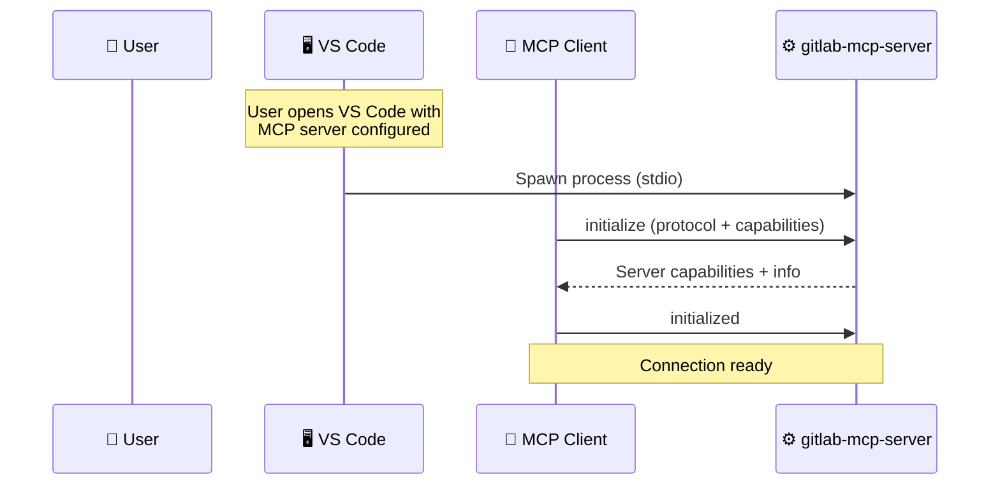
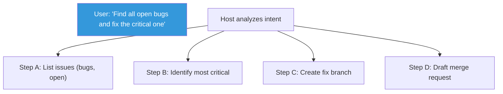
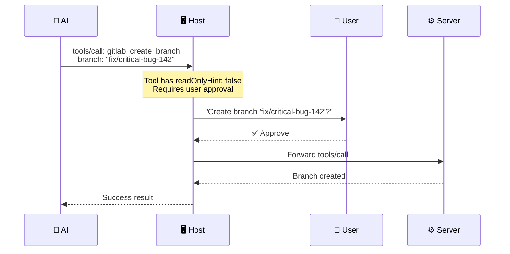
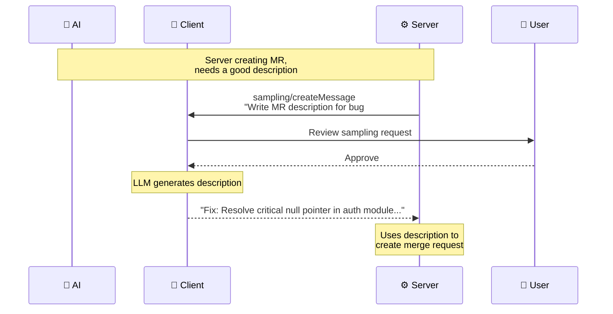
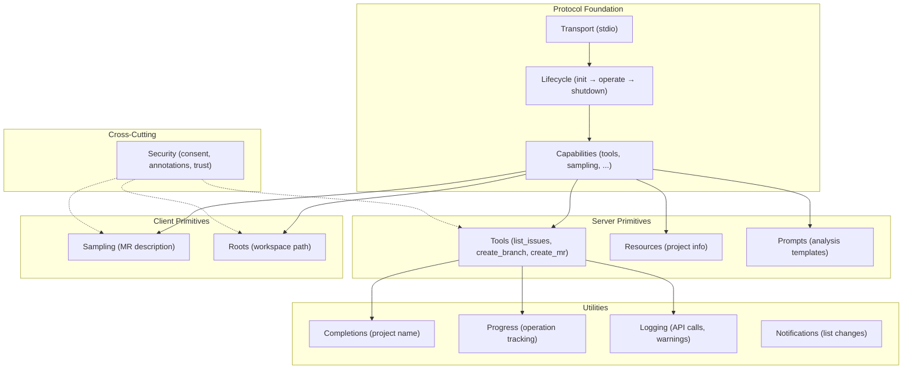

# Putting It All Together

> **Level**: 🔴 Advanced
>
> **What You'll Learn**:
>
> - How all MCP concepts work together in a real-world scenario
> - A complete end-to-end GitLab workflow traced through the protocol
> - How the protocol handles errors and edge cases
> - Architecture patterns for production MCP servers

## A Complete Scenario

Let's trace a realistic workflow through every protocol layer: **"Find open bugs in my project, create a fix branch, and draft a merge request."**

This scenario touches: initialization, capabilities, tools, resources, prompts, sampling, progress, completions, logging, and security — all working together.

### The Setup

- **Host**: VS Code with GitHub Copilot
- **MCP Server**: gitlab-mcp-server (this project)
- **Transport**: stdio (local binary)
- **User workspace**: A GitLab project

## Step 1: Connection and Initialization



**What happens behind the scenes:**

1. VS Code reads the MCP server configuration
2. Spawns `gitlab-mcp-server` as a child process
3. The MCP client sends `initialize` with client capabilities (roots, sampling, elicitation)
4. The server responds with its capabilities (tools, resources, prompts, logging, completions)
5. The client confirms with `initialized`

## Step 2: User Makes a Request

The user types in the chat:

> "Find all open bugs in my project and create a fix branch for the most critical one."



## Step 3: Tool Discovery

The AI first needs to know what tools are available:

```json
{
  "jsonrpc": "2.0",
  "id": 2,
  "method": "tools/list"
}
```

The server returns hundreds of tools. The AI identifies the relevant ones:

- `gitlab_list_issues` — find bugs
- `gitlab_create_branch` — create fix branch
- `gitlab_create_merge_request` — draft the MR

## Step 4: Finding Bugs (Tools + Completions)

The AI calls the list issues tool with filters:

```json
{
  "jsonrpc": "2.0",
  "id": 3,
  "method": "tools/call",
  "params": {
    "name": "gitlab_list_issues",
    "arguments": {
      "project_id": "my-project",
      "labels": "bug",
      "state": "opened",
      "order_by": "priority"
    },
    "_meta": {
      "progressToken": "find-bugs"
    }
  }
}
```

The server:

1. Sends a **log message**: `info` — "Querying GitLab API for open bugs"
2. Sends **progress** updates as it fetches paginated results
3. Returns the list of matching issues

```json
{
  "jsonrpc": "2.0",
  "method": "notifications/progress",
  "params": {
    "progressToken": "find-bugs",
    "progress": 1,
    "total": 1,
    "message": "Fetching issues from GitLab..."
  }
}
```

## Step 5: Creating the Fix Branch (Security + Consent)

The AI identifies bug #142 as the most critical and wants to create a branch:



The Host checks tool annotations:

- `readOnlyHint: false` — this modifies data
- `destructiveHint: false` — not destructive
- `idempotentHint: false` — creates a new resource

Based on the security policy, it asks the user for approval before executing.

## Step 6: Drafting the Merge Request (Sampling)

Now the AI wants to write a good MR description. The server uses **sampling** to ask the AI for help composing it:



## Step 7: The Complete Result

After all operations complete, the AI presents the result to the user:

> **Done. Here's what I did:**
>
> 1. Found **8 open bugs** in your project
> 2. Bug #142 (Critical): "Null pointer exception in authentication module"
> 3. Created branch `fix/critical-bug-142` from `main`
> 4. Created Merge Request !89: "Fix: Resolve critical null pointer in auth module"

## How Protocol Layers Interact

Here's how all the pieces connected in this scenario:



## Error Handling Patterns

In a real scenario, things can go wrong. Here's how MCP handles common errors:

| Error | Protocol Response | Recovery |
|-------|------------------|----------|
| GitLab API timeout | `tools/call` returns `isError: true` with timeout message | AI retries or informs user |
| Branch name exists | Server returns descriptive error | AI suggests different name |
| Permission denied | Server returns 403 with explanation | AI explains required permissions |
| Rate limit hit | Server sends `warning` log, delays, retries | Transparent to user with progress updates |
| Network failure | Transport-level error | Client reconnects or reports |

### Error Response Example

```json
{
  "jsonrpc": "2.0",
  "id": 5,
  "result": {
    "content": [
      {
        "type": "text",
        "text": "Error: Branch 'fix/critical-bug-142' already exists"
      }
    ],
    "isError": true
  }
}
```

## Architecture Pattern Summary

| Pattern | How It's Used |
|---------|---------------|
| **Capability negotiation** | Server and client agree on features at startup |
| **Progressive disclosure** | AI discovers tools via `tools/list`, uses only what's needed |
| **Human-in-the-loop** | Host requires approval for write operations |
| **Structured errors** | `isError: true` with descriptive messages |
| **Progress tracking** | Long operations report progress with tokens |
| **Layered security** | Transport security + capability restrictions + user consent |
| **Graceful degradation** | Missing capabilities handled with fallbacks |

## Key Takeaways

- MCP is a **layered protocol** — transport, lifecycle, capabilities, primitives, and utilities each play a role
- A single user request can involve **multiple tools**, **sampling**, **completions**, **progress**, and **logging**
- **Security** is a cross-cutting concern — consent checks happen at every write operation
- **Error handling** uses `isError: true` with descriptive messages — not exceptions
- The **Host** orchestrates everything: spawning servers, enforcing policies, presenting results
- Real workflows are **multi-step** — the AI plans and executes a sequence of tool calls

## Next Steps

- [Ecosystem](18-ecosystem.md) — Explore the MCP ecosystem: servers, clients, and community
- [Glossary](19-glossary.md) — Quick reference for all MCP terminology
- [What is MCP?](01-what-is-mcp.md) — Revisit the fundamentals with your new understanding

## References

- [MCP Specification (Complete)](https://modelcontextprotocol.io/specification/latest)
- [MCP Architecture](https://modelcontextprotocol.io/docs/concepts/architecture)
- [MCP Server Concepts](https://modelcontextprotocol.io/docs/concepts/servers)
