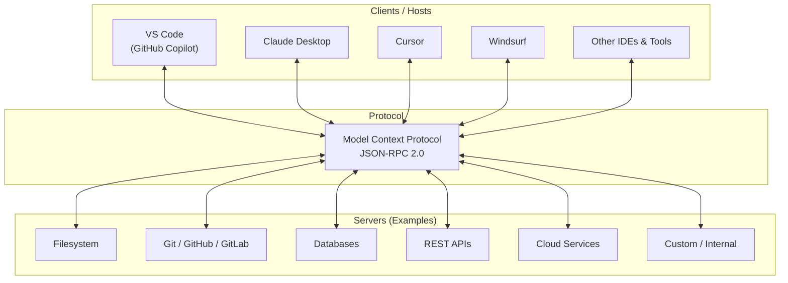

# Ecosystem: Servers, Clients, and Community

> **Level**: 🔴 Advanced
>
> **What You'll Learn**:
>
> - The current state of the MCP ecosystem
> - Types of MCP servers available today
> - Which clients (Hosts) support MCP
> - How to evaluate and choose MCP servers
> - Community resources and how to get involved

## The MCP Ecosystem Today

Since its introduction by Anthropic in late 2024, MCP has grown into a vibrant ecosystem with hundreds of servers and multiple client implementations.

## Types of MCP Servers

### By Domain

| Category | Examples | What They Do |
|----------|---------|-------------|
| **Version Control** | GitHub, GitLab, Bitbucket | Manage repos, issues, MRs, CI/CD |
| **Databases** | PostgreSQL, SQLite, MongoDB | Query, schema management, migrations |
| **Cloud** | AWS, GCP, Azure | Manage cloud resources, deployments |
| **Communication** | Slack, Discord, Email | Send messages, manage channels |
| **Productivity** | Jira, Linear, Notion | Project management, documentation |
| **Filesystem** | Local files, S3, Google Drive | Read, write, search files |
| **Observability** | Sentry, Datadog, PagerDuty | Monitor errors, alerts, metrics |
| **Custom/Internal** | Company-specific | Internal APIs, proprietary systems |

### By Deployment Model

| Model | Description | Example |
|-------|-------------|---------|
| **Local binary** | Runs on user's machine via stdio | gitlab-mcp-server, filesystem server |
| **Container** | Runs in Docker, accessed via stdio or HTTP | Database servers with pre-configured connections |
| **Remote service** | Hosted server accessed via Streamable HTTP | Cloud-hosted MCP gateways |
| **Embedded** | Built into the application itself | IDE-native servers |

## MCP Clients and Hosts

### Current Support

| Host | MCP Support | Transport | Notes |
|------|-------------|-----------|-------|
| **Claude Desktop** | Full | stdio | First MCP client, reference implementation |
| **VS Code (Copilot)** | Full | stdio, HTTP | Broad extension ecosystem |
| **Cursor** | Full | stdio | AI-first code editor |
| **Windsurf** | Full | stdio | AI developer experience |
| **Continue** | Full | stdio | Open-source AI coding assistant |
| **Zed** | Partial | stdio | Extensible editor |

### What Clients Provide

Each client implements MCP capabilities differently:

| Feature | Varies By Client |
|---------|-----------------|
| **Tool approval UI** | Some auto-approve, some require confirmation for each call |
| **Sampling support** | Not all clients implement sampling |
| **Elicitation UI** | Form rendering depends on client capabilities |
| **Progress display** | Progress bars, spinners, or log output |
| **Multi-server** | Support for connecting to multiple servers simultaneously |

## Evaluating MCP Servers

When choosing an MCP server, consider:

### Trust and Security

| Question | Why It Matters |
|----------|---------------|
| Who maintains the server? | Determines trust level and update frequency |
| Is the source code available? | Allows auditing for security issues |
| What permissions does it need? | Minimal authority principle |
| How are credentials handled? | Should use environment variables, not hardcoded |
| Is it digitally signed? | Verifies authenticity and integrity |

### Quality Indicators

| Indicator | Good Sign |
|-----------|-----------|
| **Documentation** | Clear setup instructions, API reference, examples |
| **Testing** | Comprehensive test suite with good coverage |
| **Error handling** | Descriptive error messages, graceful degradation |
| **Tool annotations** | Proper `readOnlyHint`, `destructiveHint` on all tools |
| **Versioning** | Semantic versioning, changelog maintained |
| **Activity** | Regular updates, responsive to issues |

### Compatibility

| Check | Description |
|-------|-------------|
| **Protocol version** | Supports current MCP specification |
| **Transport** | Supports your client's preferred transport |
| **Platform** | Runs on your operating system (Windows, macOS, Linux) |
| **Dependencies** | Minimal external dependencies |

## Building Your Own MCP Server

If the ecosystem doesn't have what you need, you can build your own:

### Official SDKs

| Language | SDK | Maturity |
|----------|-----|----------|
| **TypeScript** | `@modelcontextprotocol/sdk` | Reference implementation |
| **Python** | `mcp` (PyPI) | Production-ready |
| **Go** | `github.com/modelcontextprotocol/go-sdk` | Production-ready |
| **Java/Kotlin** | `io.modelcontextprotocol:sdk` | Production-ready |
| **C#** | `ModelContextProtocol` (NuGet) | Production-ready |
| **Rust** | `mcp-sdk` | Community-maintained |

### Getting Started

1. Choose the SDK for your preferred language
2. Define your tools with clear names, descriptions, and JSON schemas
3. Implement handlers that call your target API
4. Add error handling with descriptive messages
5. Write tests using mock HTTP servers
6. Document your tools and setup instructions

## Community Resources

| Resource | URL | Description |
|----------|-----|-------------|
| **MCP Specification** | [modelcontextprotocol.io](https://modelcontextprotocol.io) | Official protocol specification |
| **MCP GitHub** | [github.com/modelcontextprotocol](https://github.com/modelcontextprotocol) | SDKs, reference servers, specification |
| **MCP Servers Directory** | [github.com/modelcontextprotocol/servers](https://github.com/modelcontextprotocol/servers) | Community server directory |
| **MCP Discord** | Community Discord | Discussion, support, showcases |
| **Awesome MCP** | Community collections | Curated lists of MCP resources |

## Key Takeaways

- The MCP ecosystem includes **hundreds of servers** across many domains
- Major **AI coding tools** (VS Code, Claude, Cursor, Windsurf) support MCP
- Server quality varies — evaluate trust, documentation, testing, and annotations
- **Official SDKs** exist for TypeScript, Python, Go, Java, C#, and Rust
- The ecosystem is growing rapidly — new servers and clients appear regularly
- When no existing server fits, **building your own** is straightforward with the official SDKs
- Community resources like the spec site and GitHub repositories are the best starting points

## Next Steps

- [Glossary](19-glossary.md) — Quick reference for all MCP terminology
- [What is MCP?](01-what-is-mcp.md) — Start from the beginning with fresh perspective
- [README](README.md) — Return to the guide index

## References

- [Model Context Protocol — Official Site](https://modelcontextprotocol.io)
- [MCP Specification (Latest)](https://modelcontextprotocol.io/specification/latest)
- [MCP GitHub Organization](https://github.com/modelcontextprotocol)
- [MCP Go SDK](https://pkg.go.dev/github.com/modelcontextprotocol/go-sdk)
- [MCP TypeScript SDK](https://www.npmjs.com/package/@modelcontextprotocol/sdk)
- [MCP Python SDK](https://pypi.org/project/mcp/)
