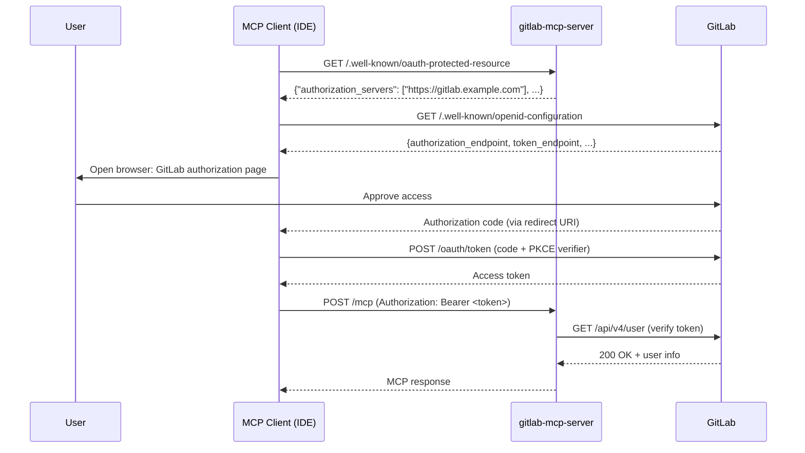

# OAuth App Setup

How to create a GitLab OAuth Application for use with gitlab-mcp-server in OAuth mode.

> **Diátaxis type**: How-to
> **Audience**: 🔧 Server administrators, team leads
> **Prerequisites**: GitLab admin or group owner access; server running with `--auth-mode=oauth`

---

## Overview

When the server runs with `--auth-mode=oauth`, MCP clients that support OAuth 2.1 (such as VS Code, Claude Code, or other spec-compliant clients) can discover the GitLab authorization server automatically via the RFC 9728 metadata endpoint and handle the full OAuth flow without manual token management.

For this to work, you need to create a **GitLab OAuth Application** that the MCP client will use to request tokens from GitLab on behalf of the user.

> **Important**: gitlab-mcp-server is a **resource server** (it validates tokens), not an OAuth client. The MCP client (VS Code, Claude Code, etc.) is the OAuth client that obtains tokens directly from GitLab using the OAuth Application credentials.

---

## How the OAuth Flow Works



1. The MCP client discovers the GitLab authorization server from the server's `/.well-known/oauth-protected-resource` endpoint
2. The client initiates the OAuth 2.1 Authorization Code flow with PKCE against GitLab
3. The user authorizes the application in their browser
4. The client receives an access token and sends it as `Authorization: Bearer` with every MCP request
5. The server verifies the token against GitLab's `/api/v4/user` endpoint (with caching)

---

## Step 1: Create the GitLab OAuth Application

> For detailed guidance on OAuth application settings, see [GitLab: Configure GitLab as an OAuth 2.0 provider](https://docs.gitlab.com/ee/integration/oauth_provider.html).

### Instance-level (GitLab Admin)

1. Go to **Admin Area → Applications** (`/admin/applications`)
2. Click **New application**
3. Fill in:
   - **Name**: `MCP Server` (or any descriptive name)
   - **Redirect URI**: See [Redirect URIs per IDE](#redirect-uris-per-ide) below
   - **Confidential**: **Unchecked** (MCP clients are public OAuth clients)
   - **Scopes**: Check **`api`**
4. Click **Save application**
5. Copy the **Application ID** — this is the `clientId` you will configure in MCP clients

### Group-level (Group Owner)

1. Go to your group → **Settings → Applications**
2. Follow the same steps as above

### User-level (Personal)

1. Go to **User Settings → Applications** (`/-/user_settings/applications`)
2. Follow the same steps as above

> **Scope recommendation**: The `api` scope is required for full tool functionality. If you only need read operations, `read_api` is sufficient but many tools will fail.

---

## Step 2: Configure Redirect URIs

Each MCP client has its own redirect URI scheme. Configure **all** redirect URIs that your users' IDEs will need.

### Redirect URIs per IDE

| IDE / Client | Redirect URI | Notes |
| --- | --- | --- |
| VS Code / GitHub Copilot | `http://localhost` | VS Code opens a local HTTP server on a random port; GitLab matches the host only |
| VS Code (Codespaces / Remote) | `https://insiders.vscode.dev/redirect` | For remote development environments |
| Cursor | `http://localhost` | VS Code fork — same redirect URI scheme |
| Claude Code (CLI) | `http://localhost` | CLI-based OAuth callback (default port configurable via `--callback-port`) |

> **Multiple URIs**: GitLab allows multiple redirect URIs separated by newlines in the application form. Add all URIs your team needs.

### Example: Combined Redirect URIs

In the GitLab OAuth Application "Redirect URI" field, enter:

```text
http://localhost
https://insiders.vscode.dev/redirect
http://localhost:8090/callback
```

> **Note**: Claude Code with `--callback-port 8090` requires the exact redirect URI `http://localhost:8090/callback`. If you omit `--callback-port`, Claude Code defaults to `http://localhost`.

---

## Step 3: Start the Server in OAuth Mode

```bash
gitlab-mcp-server --http \
  --gitlab-url=https://gitlab.example.com \
  --auth-mode=oauth \
  --oauth-cache-ttl=15m
```

Verify the metadata endpoint:

```bash
curl -s http://localhost:8080/.well-known/oauth-protected-resource | jq .
```

Expected output:

```json
{
  "resource": "http://localhost:8080/mcp",
  "authorization_servers": ["https://gitlab.example.com"],
  "bearer_methods_supported": ["header"],
  "scopes_supported": ["api"]
}
```

---

## Step 4: Configure MCP Clients

Configure your MCP client with the **Application ID** (`clientId`) from Step 1. See [IDE Configuration](ide-configuration.md) for the full per-client reference.

### VS Code / GitHub Copilot (`.vscode/mcp.json`)

```json
{
  "servers": {
    "gitlab": {
      "type": "http",
      "url": "http://your-server:8080/mcp",
      "oauth": {
        "clientId": "YOUR_GITLAB_APPLICATION_ID",
        "scopes": ["api"]
      }
    }
  }
}
```

### Claude Code (CLI)

```bash
claude mcp add gitlab \
  --transport http \
  --client-id YOUR_GITLAB_APPLICATION_ID \
  --callback-port 8090 \
  http://your-server:8080/mcp
```

> **Important**: Without `clientId`, these clients fall back to OAuth Dynamic Client Registration (DCR). GitLab's DCR assigns the `mcp` scope instead of `api`, which causes most server operations to fail. Always configure `clientId` explicitly.

---

## Token Lifecycle

| Event | Behavior |
| --- | --- |
| First request | Token verified against GitLab `/api/v4/user`, result cached |
| Subsequent requests (within TTL) | Token served from SHA-256 hashed cache — no GitLab API call |
| Cache TTL expires | Token re-verified on next request |
| Token revoked on GitLab | Next request after cache expiry returns 401 |
| Background cleanup | Expired cache entries evicted every 30 seconds |

---

## Security Considerations

- **Public client**: MCP clients running on user devices are public OAuth clients (no client secret). This is correct per OAuth 2.1 for native applications
- **PKCE required**: MCP clients should use PKCE (Proof Key for Code Exchange) to prevent authorization code interception. GitLab supports PKCE
- **Token storage**: Token security depends on the MCP client's storage mechanism. VS Code stores tokens in the OS credential store
- **No client secret in config**: Never put a client secret in MCP client configuration files — use the Application ID only
- **Scope limitation**: Request only the `api` scope needed. Avoid requesting broader scopes

---

## Troubleshooting

| Issue | Solution |
| --- | --- |
| "redirect_uri_mismatch" from GitLab | Add the exact redirect URI used by your IDE to the GitLab OAuth Application. See [Redirect URIs per IDE](#redirect-uris-per-ide) |
| OAuth flow does not start | Verify `--auth-mode=oauth` is set and `/.well-known/oauth-protected-resource` returns metadata |
| "invalid_client" error | The `clientId` in MCP client config does not match the GitLab Application ID. Copy the exact value |
| Token works with curl but not from IDE | The IDE may not be sending the token as `Authorization: Bearer`. Check IDE MCP logs |
| "access_denied" after authorization | The GitLab OAuth Application may not have the `api` scope. Recreate with correct scopes |

---

## See Also

### Internal

- [IDE Configuration](ide-configuration.md) — per-IDE MCP JSON configuration with OAuth
- [HTTP Server Mode — OAuth Mode](http-server-mode.md#oauth-mode) — server architecture and flow
- [Security](security.md) — token management and threat model
- [Troubleshooting](troubleshooting.md#oauth-mode---auth-modeoauth) — OAuth-specific troubleshooting

### External

- [GitLab: Configure GitLab as an OAuth 2.0 provider](https://docs.gitlab.com/ee/integration/oauth_provider.html) — official GitLab OAuth Application docs
- [RFC 9728: OAuth 2.0 Protected Resource Metadata](https://datatracker.ietf.org/doc/html/rfc9728) — the specification implemented by `--auth-mode=oauth`
- [OAuth 2.1 Authorization Framework (draft)](https://datatracker.ietf.org/doc/html/draft-ietf-oauth-v2-1-12) — the latest OAuth specification (mandates PKCE)
- [MCP Specification: Authorization](https://modelcontextprotocol.io/specification/2025-06-18/basic/authorization) — MCP protocol authorization requirements
