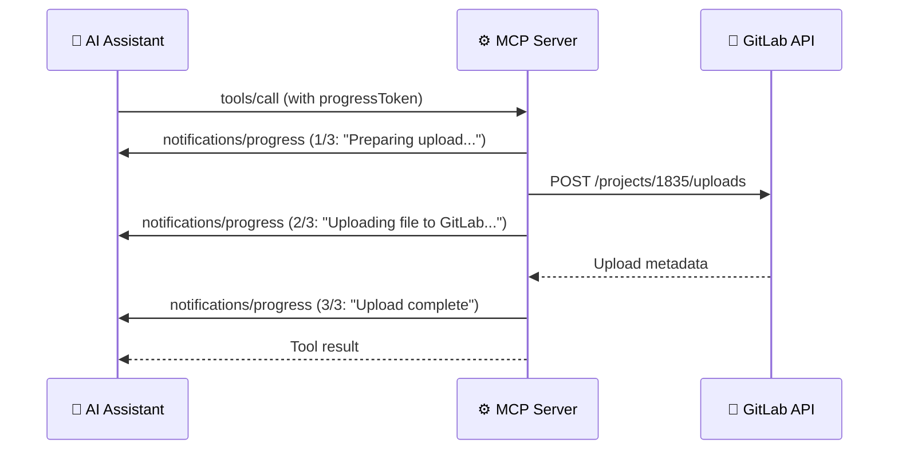

# Progress Notifications

> **Diátaxis type**: Reference
> **Package**: [`internal/progress/`](../../../internal/progress/progress.go)
> **Direction**: Server → Client
> **MCP notification**: `notifications/progress`
> **Audience**: 👤🔧 All users

<!-- -->

> 💡 **In plain terms:** When an operation takes a few seconds (like analyzing a merge request), you see step-by-step progress updates so you know it is working and not frozen.

## Table of Contents

- [What Problem Does Progress Solve?](#what-problem-does-progress-solve)
- [How It Works](#how-it-works)
- [API](#api)
  - [Creating a Tracker](#creating-a-tracker)
  - [Methods](#methods)
  - [Step-Based Progress](#step-based-progress)
- [Configuration](#configuration)
- [Security](#security)
- [Tools Using Progress](#tools-using-progress)
- [Real-World Examples](#real-world-examples)
- [Design Principles](#design-principles)
- [Frequently Asked Questions](#frequently-asked-questions)
- [References](#references)

## What Problem Does Progress Solve?

Some MCP tools take several seconds to complete — file uploads stream large payloads, and elicitation tools collect multi-step user input. During this time, the user sees nothing. Are they still running? Did they hang?

Progress notifications solve this by sending **real-time step-by-step status updates** to the client. Instead of silence, the user sees:

```text
Step 1/3: Preparing upload...
Step 2/3: Uploading file to GitLab...
Step 3/3: Upload complete
```

This transforms a "is it frozen?" experience into transparent, predictable behavior.

## How It Works



The client provides a **progress token** in the tool call request. The server uses this token to send progress notifications back to the correct request. If no token is provided, the `Tracker` becomes inactive and all progress calls are silently skipped — no errors, no overhead.

## API

### Creating a Tracker

```go
tracker := progress.FromRequest(req)
```

Returns a `Tracker` bound to the request's session and progress token. If the request has no token, the tracker is inactive — all method calls become harmless no-ops.

### Methods

| Method                                  | Signature                                     | Purpose                                                                                  |
| --------------------------------------- | --------------------------------------------- | ---------------------------------------------------------------------------------------- |
| `IsActive()`                            | `() bool`                                     | Check if tracker can send notifications                                                  |
| `Update(ctx, progress, total, message)` | `(context.Context, float64, float64, string)` | Send progress with explicit float values. Drops non-monotonic updates (logged at debug). |
| `Step(ctx, step, total, message)`       | `(context.Context, int, int, string)`         | Convenience: report 1-based step of N                                                    |
| `Done(ctx, total, message)`             | `(context.Context, float64, string)`          | Send a final notification with `progress == total` to signal completion                  |

#### Strictly-monotonic progress

The MCP spec requires the `progress` value of every notification within a request to strictly increase. The `Tracker` enforces this internally: any `Update` whose new `progress` value is less than or equal to the last one is dropped silently and logged at debug level.

The guard is per-`Tracker`, and the invariant is per-**token**. A tool call has one progress token, so it must have one `Tracker`: two built from the same request each get their own counter, neither can see the other, and their notifications interleave on the wire into a sequence that goes backwards. That is not hypothetical — `publish_directory` counted files while the `Publish` it called counted bytes, and a client watching one token saw `200000` followed by `1`, with `total` alternating between the two meanings.

So a handler that delegates to another must pass its `Tracker` down rather than let the callee build one, and the two levels must share a scale. [`Tracker.OnScale`](../../../internal/progress/progress.go) does that: it returns a `Tracker` sharing this one's state that places a sub-step's own numbers inside the outer measure. With one `Tracker` per call, handlers can then call `Step`/`Update` defensively without risking protocol violations.

### Step-Based Progress

The most common pattern in tool handlers:

```go
tracker := progress.FromRequest(req)
tracker.Step(ctx, 1, 3, "Preparing upload...")
// ... work ...
tracker.Step(ctx, 2, 3, "Uploading file to GitLab...")
// ... work ...
tracker.Step(ctx, 3, 3, "Upload complete")
```

`Step(ctx, 1, 3, msg)` sends `progress=0, total=3` to the client. Starting at zero is this project's convention, not a protocol rule: the specification constrains only that `progress` increase, and it may be a floating-point value. `Step` translates from 1-based step numbers, which are more natural to write, into that convention.

## Configuration

| Setting           | Value                                       | Notes                                      |
| ----------------- | ------------------------------------------- | ------------------------------------------ |
| Token source      | `CallToolRequest.Params.GetProgressToken()` | Provided by the MCP client                 |
| Error handling    | Silent                                      | Failed notifications logged at debug level |
| Context awareness | Yes                                         | Returns early if context is canceled       |

## Security

- **Opaque token handling** — progress tokens are forwarded as-is to the MCP protocol layer. They are never logged above debug level and never included in error messages.
- **No-op on inactive** — an inactive tracker (no token or no session) makes all method calls no-ops. Tool handlers never need conditional logic.
- **Error isolation** — a failed progress notification never aborts the tool operation. The tool continues and returns its result regardless of notification failures.

## Tools Using Progress

| Tool                                | Steps | What Each Step Reports                               |
| ----------------------------------- | ----: | ---------------------------------------------------- |
| `gitlab_interactive_issue_create`   |     4 | Collect details → Optional fields → Confirm → Create |
| `gitlab_interactive_mr_create`      |     4 | Collect details → Options → Confirm → Create         |
| `gitlab_interactive_release_create` |     3 | Collect details → Confirm → Create                   |
| `gitlab_interactive_project_create` |     4 | Collect details → Options → Confirm → Create         |

Progress is most valuable for **file uploads** (which stream large payloads) and **elicitation tools** (which require multiple rounds of user interaction).

## Real-World Examples

### File Upload with Progress

When you upload a file to a project:

```text
You:  "Upload build-artifact.zip to gitlab-mcp-server"
```

The client shows:

```text
[1/3] Preparing upload...
[2/3] Uploading file to GitLab...          ← This step can take several seconds for large files
[3/3] Upload complete
```

Without progress, you would see nothing while the server streams the file.  With progress, each step provides feedback.

### Elicitation Tool with Progress

When creating an issue interactively:

```text
You:  "Create an issue in onboarding-tasks interactively"
```

The client shows:

```text
[1/4] Collecting issue details...          ← User sees title/description prompts
[2/4] Gathering optional fields...         ← Labels, confidentiality
[3/4] Confirming creation...               ← User approves
[4/4] Creating issue in GitLab...          ← API call
```

## Design Principles

The `Tracker` type follows three design principles that make it safe and easy to use in every tool handler:

### Zero-Value Safety

The `Tracker` is a value type whose zero value is a valid inactive tracker. You never need to check for nil — calling `Step` on an inactive tracker is a no-op.

```go
tracker := progress.FromRequest(req) // May be inactive — that's fine
tracker.Step(ctx, 1, 3, "Working...")  // No-op if inactive
```

### No-Impact on Tool Execution

A failed progress notification never affects the tool's result. If the client disconnects or the notification fails, the error is logged at debug level and the tool continues normally.

### Minimal API Surface

Four methods: `IsActive()`, `Update()`, `Step()`, and `Done()`. The `Step` convenience method handles the 1-based to 0-based conversion, which is the pattern used in all tool handlers. `Done` sends a final `progress == total` notification when an operation completes.

## Frequently Asked Questions

### Does every tool show progress?

No. Only tools with multi-step or streaming operations use progress: file uploads and the 4 elicitation tools. Simple tools (e.g., `gitlab_branch_list`) complete too quickly within a single API call to benefit from progress.

### What if my MCP client doesn't send a progress token?

The `Tracker` becomes inactive and all `Step` calls are no-ops. The tool works identically — just without progress feedback. No errors are produced.

### Can I use progress in my own tools?

Yes. Call `progress.FromRequest(req)` at the start of your handler and use `tracker.Step()` between significant operations. The infrastructure handles everything else.

## References

- [MCP Specification — Progress](https://modelcontextprotocol.io/specification/2025-11-25/server/utilities/progress)
- [MCP Go SDK — NotifyProgress](https://pkg.go.dev/github.com/modelcontextprotocol/go-sdk/mcp#ServerSession.NotifyProgress)
