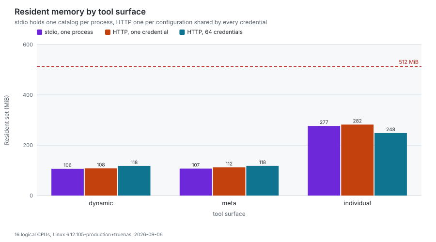
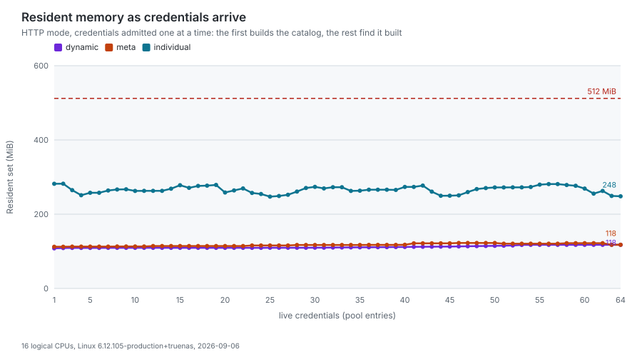
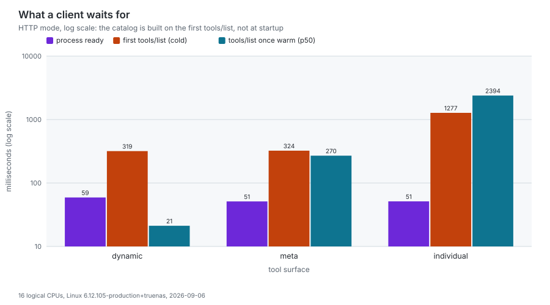
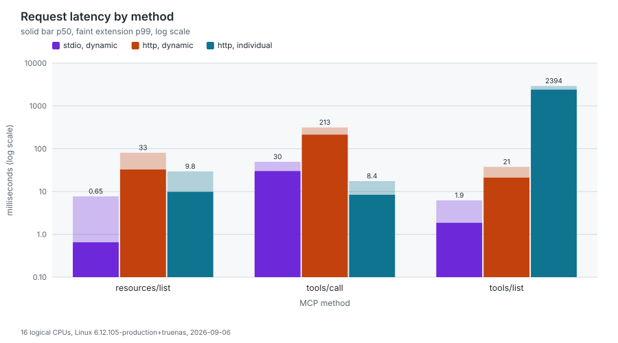

# Resource benchmark

What this server costs to run, measured rather than estimated: resident
memory, processor time, goroutine count and request latency, on both
transports, across the settings that actually move them.

Everything below the "Measurements" heading is generated by
`make bench-resources`, which runs the benchmark and redraws the charts from
the record it writes. The numbers therefore belong to one machine and one
build, both named in the generated text, and a reader who wants their own
numbers can run the same target rather than trusting these.

## Why this page exists

Every other number published about this project is about tokens and tool
counts. None of them tells an operator how much memory to give a container,
how long a client waits before its first tool call answers, or what a second
credential adds to a shared deployment. Those are the questions that get asked
when the server stops being a local process and becomes something with a
memory limit.

## What is measured

Five axes, chosen because they are the ones that move the numbers:

| Axis               | Values                                      | Why it matters                                                                                             |
| ------------------ | ------------------------------------------- | ---------------------------------------------------------------------------------------------------------- |
| Transport          | stdio, HTTP                                 | stdio gives every client its own process; HTTP serves everyone from one and pools a catalog per credential |
| Tool surface       | `dynamic`, `meta`, `individual`             | the dynamic surface registers two tools and the individual one roughly a thousand                          |
| Concurrent clients | 4 processes on stdio, 8 credentials on HTTP | on HTTP the pool holds one entry per token, so this is the axis a shared deployment grows along            |
| Parallel requests  | 2 to 4 in flight per client                 | separates the cost of having clients from the cost of them all calling at once                             |
| Telemetry          | off, on                                     | exporting is work the server would not otherwise do                                                        |

Four metrics, taken from the operating system and from the wire rather than
from inside the program:

- **Resident set**, in mebibytes, at four moments: idle, with one client, with
  every client, and at its peak under load. The resident set is what a
  container limit is measured against, which is why it is read from the kernel
  rather than from Go's own heap accounting: those two numbers differ by more
  than a factor of two, and only one of them gets a process killed.
- **Processor time**, split into what building the surfaces cost and what
  serving the requests cost. The load figure is a percentage of one core, so
  above 100% means several cores were busy.
- **Goroutine count**, at rest, with every client attached.
- **Latency percentiles**, per MCP method, from the client's side of the wire.

## How it is measured

The measured process is **the real binary**, built from `cmd/server` at the
current checkout and started the way a client starts it. A harness that
reassembled the server from the same packages would be reporting on its own
copy: it would miss the readiness gate, the authentication chain, the pool and
the flag parsing, which is most of what an operator is sizing for.

**No GitLab instance is needed, and none is used.** The instance is stood in
by an HTTP server inside the harness, answering the version and user endpoints
the server probes while it builds a pool entry, and 404 for the scope and tier
probes, which every caller reads as "this instance will not say". A run
against a real instance would fold that instance's latency and rate limits
into every figure, and two people re-measuring would be comparing their GitLab
installations rather than this server. The OTLP collector is stood in the same
way, so the telemetry scenarios measure what exporting costs rather than what
a collector does with the payload.

**The tool surface is passed explicitly and never read from the environment.**
This is the rule the manifest generators follow for the same reason: a
developer machine exporting `GITLAB_MCP_TOOL_SURFACE` would otherwise publish
different numbers than a clean one. The whole environment a measured process
inherits is stripped of every variable this server reads.

A few details that change what the numbers mean:

- **The rate limiter is off** (`--rate-limit-rps=0`). HTTP mode defaults to ten
  requests per second, which a benchmark firing parallel requests would spend
  its time being refused by. Refusals are a different measurement, and
  `test/e2e/http` already makes it.
- **The harness speaks JSON-RPC directly, not through the Go SDK.** From
  protocol 2026-07-28 a client may serve `tools/list` from its own cache, and
  the SDK client does: measured through it, a `tools/list` that costs the
  server hundreds of milliseconds returns in microseconds without a request
  ever leaving the process. What is published here is the work the server
  does. A caching client pays it less often than these figures suggest, and
  never less than once per session.
- **Protocol 2026-07-28 has no handshake.** It removed `initialize` and `ping`,
  so there is no connection ceremony to time and the first thing a client
  waits for is its first real request. That is why the startup figures are
  anchored on the first `tools/list` rather than on a handshake.
- **The goroutine count comes from a traceback signal.** The binary exposes no
  debug endpoint, so the only way to ask is `SIGQUIT` with `GOTRACEBACK=all`,
  which prints every goroutine's stack and ends the process. It is therefore
  the last thing each scenario does.
- **Percentiles are nearest-rank**, so every published percentile is a value
  that was actually observed rather than one interpolated between two that
  were.

## Measurements

<!-- START BENCHMARK -->

Measured on AMD Ryzen 5 3550H with Radeon Vega Mobile Gfx, 8 logical CPUs, 61 GiB RAM, linux/amd64, kernel 6.1.0-52-amd64, go1.27.1, build 2.7.6-0.20260903234347-3ee720d09ea7 (3ee720d0), 2026-09-03T23:43:59Z. 3 rounds per method, resident set sampled every 100 ms.

<picture>
  <source media="(prefers-color-scheme: dark)" srcset="benchmarks/memory.dark.svg">
  
</picture>

<picture>
  <source media="(prefers-color-scheme: dark)" srcset="benchmarks/memory-ramp.dark.svg">
  
</picture>

<picture>
  <source media="(prefers-color-scheme: dark)" srcset="benchmarks/startup.dark.svg">
  
</picture>

<picture>
  <source media="(prefers-color-scheme: dark)" srcset="benchmarks/latency.dark.svg">
  
</picture>

### Memory, goroutines and processor time per scenario

| Scenario                  | Clients | Idle | One client | All clients | Per extra client | Peak | Goroutines | CPU, % of one core |
| ------------------------- | ------: | ---: | ---------: | ----------: | ---------------: | ---: | ---------: | -----------------: |
| stdio, dynamic            |       4 |  n/a |        211 |         863 |              217 |  929 |         26 |               508% |
| stdio, meta               |       4 |  n/a |        193 |         783 |              196 |  814 |         28 |               431% |
| stdio, individual         |       4 |  n/a |        331 |        1218 |              296 | 1218 |         28 |               561% |
| stdio, dynamic, telemetry |       4 |  n/a |        248 |         928 |              227 |  973 |         35 |               427% |
| http, dynamic             |       8 |   40 |        219 |         717 |               71 |  863 |         66 |               447% |
| http, meta                |       8 |   39 |        197 |         445 |               35 |  599 |         68 |               417% |
| http, individual          |       8 |   39 |        334 |         589 |               36 | 1164 |         52 |               434% |
| http, dynamic, telemetry  |       8 |   43 |        242 |         719 |               68 |  840 |         75 |               464% |

### What a client waits for, per scenario

| Scenario                  | Process ready | First tools/list | Warm tools/list (p50) | tools/list payload |
| ------------------------- | ------------: | ---------------: | --------------------: | -----------------: |
| stdio, dynamic            |          0.27 |             1729 |                   4.6 |              12 KB |
| stdio, meta               |          0.36 |             1771 |                   105 |             584 KB |
| stdio, individual         |           5.4 |             4301 |                   907 |             3.1 MB |
| stdio, dynamic, telemetry |          0.30 |             1807 |                   7.0 |              12 KB |
| http, dynamic             |            52 |             1950 |                    14 |              12 KB |
| http, meta                |           102 |             2025 |                   222 |             584 KB |
| http, individual          |            52 |             4625 |                  2391 |             3.1 MB |
| http, dynamic, telemetry  |           103 |             2139 |                    24 |              12 KB |

### Latency percentiles per method

| Scenario                  | Method           | Call                   |  p50 |  p90 |  p99 |  Max |
| ------------------------- | ---------------- | ---------------------- | ---: | ---: | ---: | ---: |
| stdio, dynamic            | `resources/list` | smallest listing       |  1.6 |  2.2 |  2.5 |  2.5 |
| stdio, dynamic            | `tools/call`     | gitlab_find_action     |   70 |   93 |   96 |   96 |
| stdio, dynamic            | `tools/list`     | whole surface          |  4.6 |  5.4 |   11 |   11 |
| stdio, meta               | `resources/list` | smallest listing       |  3.1 |  9.1 |   14 |   14 |
| stdio, meta               | `tools/call`     | gitlab_server (status) |  4.4 |  7.8 |  9.8 |  9.8 |
| stdio, meta               | `tools/list`     | whole surface          |  105 |  137 |  142 |  142 |
| stdio, individual         | `resources/list` | smallest listing       |  1.1 |  1.7 |  1.9 |  1.9 |
| stdio, individual         | `tools/call`     | gitlab_server_status   |  2.1 |  2.7 |  3.0 |  3.0 |
| stdio, individual         | `tools/list`     | whole surface          |  907 |  998 | 1030 | 1030 |
| stdio, dynamic, telemetry | `resources/list` | smallest listing       |  2.0 |  2.5 |  2.7 |  2.7 |
| stdio, dynamic, telemetry | `tools/call`     | gitlab_find_action     |   77 |  126 |  133 |  133 |
| stdio, dynamic, telemetry | `tools/list`     | whole surface          |  7.0 |   13 |   30 |   30 |
| http, dynamic             | `resources/list` | smallest listing       |  9.8 |   15 |   16 |   16 |
| http, dynamic             | `tools/call`     | gitlab_find_action     |  174 |  356 |  375 |  375 |
| http, dynamic             | `tools/list`     | whole surface          |   14 |   15 |   17 |   17 |
| http, meta                | `resources/list` | smallest listing       |  5.4 |  8.3 |   10 |   10 |
| http, meta                | `tools/call`     | gitlab_server (status) |   14 |   18 |   19 |   19 |
| http, meta                | `tools/list`     | whole surface          |  222 |  330 |  361 |  361 |
| http, individual          | `resources/list` | smallest listing       |  3.4 |  5.7 |  6.7 |  6.7 |
| http, individual          | `tools/call`     | gitlab_server_status   |  7.7 |  9.9 |   11 |   11 |
| http, individual          | `tools/list`     | whole surface          | 2391 | 2879 | 2897 | 2897 |
| http, dynamic, telemetry  | `resources/list` | smallest listing       |  6.1 |  9.1 |   11 |   11 |
| http, dynamic, telemetry  | `tools/call`     | gitlab_find_action     |  159 |  330 |  340 |  340 |
| http, dynamic, telemetry  | `tools/list`     | whole surface          |   24 |   39 |   49 |   49 |

<!-- END BENCHMARK -->

## Reading the numbers

Four things the measurements say, in the order an operator meets them.

**An HTTP process is cheap until a credential arrives, and then it is not.**
Idle it holds about 40 MiB and no tool catalog at all. The first request from
each distinct token builds one, and the resident set grows with every live
credential: 35 MiB each on `meta`, 36 MiB on `individual` and 71 MiB on
`dynamic`. Eight credentials landed between 445 and 719 MiB, peaking between
599 MiB and 1.14 GiB while all eight were calling at once. Sizing follows
directly: budget roughly 100 MiB per credential expected to be live at once on
top of 128 MiB for the process, and read `--max-http-clients` as a memory
setting rather than a concurrency one. Its default of 100 entries describes a
pool no small instance can hold.

**stdio has no idle state, and one process per client.** The process starts
building its catalog on a background goroutine as soon as it is executed, so
between 190 and 330 MiB per client is the figure, with the surface deciding
where in that range. Four processes reached 783 MiB to 1.2 GiB together, which
is what running four stdio clients on one host costs.

**The wait is registration, and it lands on the first tool call.** The process
itself is ready in a few milliseconds on stdio and in 50 to 100 ms on HTTP,
where `/health` answers while the pool is still empty. The first `tools/list`
of a credential then takes about 2 seconds on `dynamic` and `meta` and 4 to 5
seconds on `individual`. Warm, the same call is 5 to 24 ms, 100 to 220 ms and
0.9 to 2.4 seconds respectively. Two consequences: a client that gives up
before its first call answers has not hit a hung server, and an HTTP
deployment pays that wait again every time the pool reclaims an entry.

**The tool surface changes responses far more than memory.** A `tools/list` is
12 KB on `dynamic`, 584 KB on `meta` and 3.1 MB on `individual`, and the warm
response times follow. Memory per credential goes the other way from what the
tool counts suggest: `dynamic` costs the most, because it builds a search
index the other two do not, while `individual` shares its tool schemas across
pooled entries and so costs the least per additional credential despite
registering about a thousand tools.

### Where this contradicts what was published before

The sizing section of the
[HTTP server mode page](https://jmrp.io/docs/gitlab-mcp-server/operations/http-server/)
was written before registration moved behind the readiness gate, and two of
its numbers no longer describe this build. Both are corrected there; they are
recorded here because a number that moved is worth saying out loud rather than
quietly replacing.

- **"The server idles near 181 MB."** It does not: an HTTP process idles near
  40 MiB, because it now holds no catalog until a credential asks for one. The
  181 MB figure matches a process that had already built one, which is what an
  idle process used to be.
- **"512 MB is the floor."** True for a single-user deployment and optimistic
  for a shared one. Eight concurrent credentials exceeded it on every surface
  measured, peaking at over a gigabyte. The floor is not wrong so much as it
  is not a floor: memory follows the number of live credentials, and any fixed
  figure has a client count hidden inside it.

The earlier claim that the surface "barely affects memory" survives with a
caveat: the per-credential difference is real, and at 71 MiB against 35 MiB it
is a factor of two, but it stays small beside the difference the surface makes
to the response sizes.

## What this does not measure

- **A real GitLab.** Every tool call answered here is answered on loopback, so
  the latency figures are the server's own overhead with the instance's
  contribution removed. Add your own instance's round trip to them.
- **A client's cache.** The published `tools/list` latency is what the server
  spends, not what a 2026-07-28 client waits for on a repeated call.
- **Anything but this machine.** One host, one operating system, one Go
  toolchain, all named in the generated text above. The shape of the numbers
  should carry to other machines; the absolute values will not.
- **Disk and network.** Nothing here writes to disk in the hot path, and the
  only network is loopback.

## Reproducing

```bash
make bench-resources          # measure, then redraw everything
make bench-resources-render   # redraw from the committed record, no measuring
make check-bench-resources    # verify the charts and tables match the record
```

The full matrix takes several minutes, most of it spent building one tool
catalog per client, which is the cost being measured rather than overhead of
the harness. For a faster check while changing the harness itself, run a
smoke matrix somewhere harmless:

```bash
go run ./cmd/bench_resources/ -quick -json /tmp/bench.json \
  -doc-page /tmp/doc.md -site-page /tmp/en.mdx -site-page-es /tmp/es.mdx
```

A partial matrix refuses to write to the published record: replacing measured
numbers with a two-scenario smoke test would leave the documentation
presenting them as the figures.
