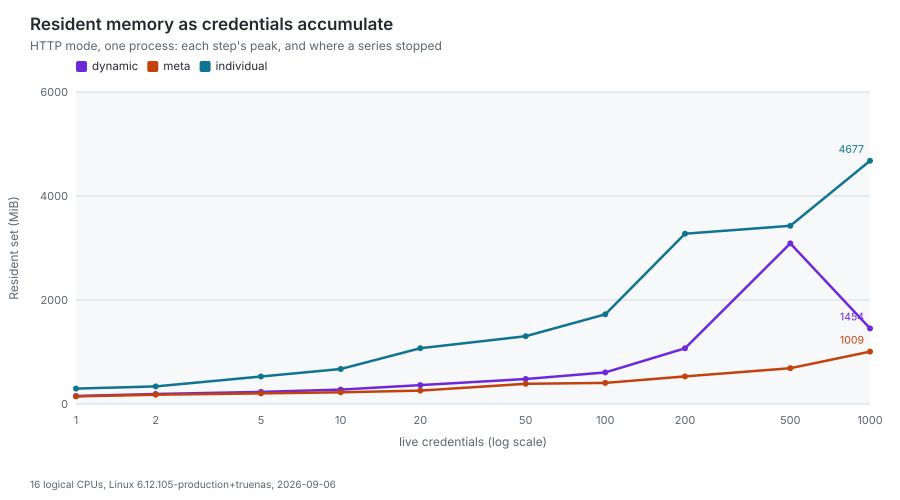
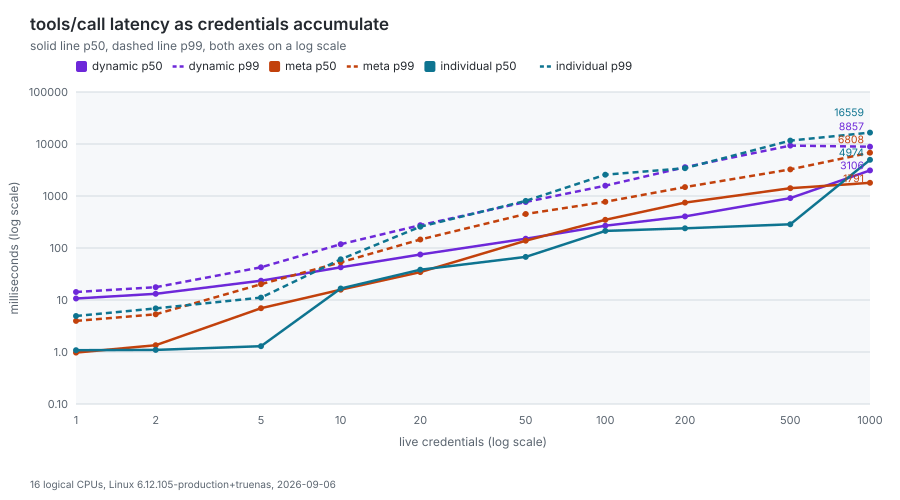
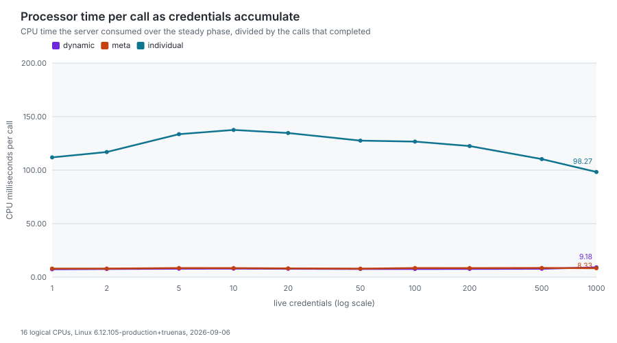

# Resource benchmark

What this server costs to run, measured rather than estimated: resident
memory, processor time, goroutine count and request latency, on both
transports, across the settings that actually move them.

Everything below the "Measurements" heading is generated by
`make bench-resources`, which runs the benchmark and redraws the charts from
the record it writes. The numbers therefore belong to one machine and one
build, both named in the generated text, and a reader who wants their own
numbers can run the same target rather than trusting these.

## Why this page exists

Every other number published about this project is about tokens and tool
counts. None of them tells an operator how much memory to give a container,
how long a client waits before its first tool call answers, or what a second
credential adds to a shared deployment. Those are the questions that get asked
when the server stops being a local process and becomes something with a
memory limit.

## What is measured

Six axes, chosen because they are the ones that move the numbers:

| Axis                 | Values                                      | Why it matters                                                                                                                                        |
| -------------------- | ------------------------------------------- | ----------------------------------------------------------------------------------------------------------------------------------------------------- |
| Transport            | stdio, HTTP                                 | stdio gives every client its own process; HTTP serves everyone from one, pooling credential state per token and one built catalog per configuration   |
| Tool surface         | `dynamic`, `meta`, `individual`             | the dynamic surface registers two tools and the individual one roughly a thousand                                                                     |
| Concurrent clients   | 4 processes on stdio, 8 credentials on HTTP | on HTTP the pool holds one entry per token, so this is the axis a shared deployment grows along                                                       |
| Parallel requests    | 2 to 4 in flight per client                 | separates the cost of having clients from the cost of them all calling at once                                                                        |
| Telemetry            | off, on                                     | exporting is work the server would not otherwise do                                                                                                   |
| Credentials at scale | 1 to 1000 on HTTP, one series per surface   | a shared deployment meets hundreds of tokens, not eight; the series measures the slope and the latency knee instead of multiplying a per-token figure |

Four metrics, taken from the operating system and from the wire rather than
from inside the program:

- **Resident set**, in mebibytes, at four moments: idle, with one client, with
  every client, and at its peak under load. The resident set is what a
  container limit is measured against, which is why it is read from the kernel
  rather than from Go's own heap accounting: those two numbers differ by more
  than a factor of two, and only one of them gets a process killed.
- **Processor time**, split into what building the surfaces cost and what
  serving the requests cost. The load figure is a percentage of one core, so
  above 100% means several cores were busy.
- **Goroutine count**, at rest, with every client attached.
- **Latency percentiles**, per MCP method, from the client's side of the wire.

The concurrency series records, at each credential count: the resident set
over the steady phase, as a mean and a peak; processor time per completed
call; the p50 and p99 of `tools/call` and of `tools/list`; the goroutine
count; the pool counters the driver knows (entries admitted and the capacity
it sized the pool to); and a CPU profile and a heap profile of the server,
kept beside the record for the analysis rather than committed.

## How it is measured

The measured process is **the real binary**, built from `cmd/server` at the
current checkout and started the way a client starts it. A harness that
reassembled the server from the same packages would be reporting on its own
copy: it would miss the readiness gate, the authentication chain, the pool and
the flag parsing, which is most of what an operator is sizing for.

**No GitLab instance is needed, and none is used.** The instance is stood in
by an HTTP server inside the harness, answering the version and user endpoints
the server probes while it builds a pool entry, and 404 for the scope and tier
probes, which every caller reads as "this instance will not say". A run
against a real instance would fold that instance's latency and rate limits
into every figure, and two people re-measuring would be comparing their GitLab
installations rather than this server. The OTLP collector is stood in the same
way, so the telemetry scenarios measure what exporting costs rather than what
a collector does with the payload.

**The tool surface is passed explicitly and never read from the environment.**
This is the rule the manifest generators follow for the same reason: a
developer machine exporting `GITLAB_MCP_TOOL_SURFACE` would otherwise publish
different numbers than a clean one. The whole environment a measured process
inherits is stripped of every variable this server reads.

A few details that change what the numbers mean:

- **The rate limiter is off** (`--rate-limit-rps=0`). HTTP mode defaults to ten
  requests per second, which a benchmark firing parallel requests would spend
  its time being refused by. Refusals are a different measurement, and
  `test/e2e/http` already makes it.
- **The harness speaks JSON-RPC directly, not through the Go SDK.** From
  protocol 2026-07-28 a client may serve `tools/list` from its own cache, and
  the SDK client does: measured through it, a `tools/list` that costs the
  server hundreds of milliseconds returns in microseconds without a request
  ever leaving the process. What is published here is the work the server
  does. A caching client pays it less often than these figures suggest, and
  never less than once per session.
- **Protocol 2026-07-28 has no handshake.** It removed `initialize` and `ping`,
  so there is no connection ceremony to time and the first thing a client
  waits for is its first real request. That is why the startup figures are
  anchored on the first `tools/list` rather than on a handshake.
- **The point scenarios take the goroutine count from a traceback signal.**
  They start the server without its profile listener, so the process is the
  one an operator runs, and the only way to ask is `SIGQUIT` with
  `GOTRACEBACK=all`, which prints every goroutine's stack and ends the
  process. It is therefore the last thing each scenario does. The series
  reads the count off `--pprof-addr` instead, which leaves the process alive
  for the next step.
- **Percentiles are nearest-rank**, so every published percentile is a value
  that was actually observed rather than one interpolated between two that
  were.

### The concurrency series

One HTTP process per surface, started with `--pprof-addr` on a loopback port
the driver picks and `--max-http-clients` set to the largest count, so nothing
a step admitted is evicted before the next step measures it. The driver then
steps through the credential counts, 1, 2, 5, 10, 20, 50, 100, 200, 500 and
1000 by default (`-clients` overrides the list; `-quick` uses 1, 2, 5), and at
each count:

1. **Admits the new credentials**, eight at a time, each warmed with one cold
   `tools/list` so the pool holds a built entry for it. Serial admission is
   what the ramp scenario measures; here the question is the steady state at
   N, and warming a thousand credentials one at a time at two seconds each
   would spend more of the hour after which the pool rebuilds a credential on
   the warm-up than on the measurement.
2. **Runs a steady phase** of ten seconds (`-step-duration`) in which every
   credential keeps the scenario's parallelism in flight, each worker
   alternating `tools/call` and `tools/list`. A fixed duration rather than a
   fixed call count, because a CPU profile is taken over wall-clock seconds and
   because a count that took seconds at one credential would take unbounded
   time once latency degrades, which is exactly the region the series exists
   to reach. Every per-call figure divides by the calls that actually
   completed.
3. **Profiles the server while it serves**: a CPU profile over the first 80%
   of the phase, from the listener's `/debug/pprof/profile`, and as the phase
   ends a heap profile and the goroutine total from
   `/debug/pprof/goroutine?debug=1`, which unlike the traceback signal leaves
   the process alive for the next step. Profiles land under
   `bench/profiles/<scenario>/<clients>.cpu.pb.gz` and `<clients>.heap.pb.gz`
   (`-profiles`), ignored by git.

Two guards keep the series from taking the host down, and both are recorded
so the page says where a series stopped and why rather than presenting a
shorter series as the whole:

- **A memory budget.** Before each step the resident set it would reach is
  estimated from the steps so far, a straight line fitted through their peaks
  (MiB per credential times the count, plus the process's own share; with a
  single step to go on, the extrapolation is proportional, which errs toward
  stopping early). When the estimate exceeds the budget, the step and every
  step after it are skipped. The budget is `-memory-budget`, in MiB, or 80% of
  the host's available memory (`MemAvailable` in `/proc/meminfo`) read when
  the run starts; a host that does not report it runs with no budget and the
  series says so.
- **A latency ceiling.** A step whose `tools/call` p99 exceeds 30 seconds is
  the last one run: past that a client has given up, and the next step would
  measure timeouts rather than the server.

Telemetry stays off for the series, so it measures the same server the point
scenarios do. The pool's own counters are therefore not read off the OTLP
sink; what the record carries is what the driver knows, which is exact: it
created one entry per credential, and it sized the pool so that none was
evicted between steps.

## Measurements

<!-- START BENCHMARK -->

Measured on Intel(R) Core(TM) i5-14400, 16 logical CPUs, 62 GiB RAM, linux/amd64, kernel 6.12.105-production+truenas, go1.27.1, build 2.7.6-0.20260905150558-afecf6ce9d13 (afecf6ce), 2026-09-05T15:08:26Z. 3 rounds per method, resident set sampled every 100 ms.

<picture>
  <source media="(prefers-color-scheme: dark)" srcset="benchmarks/memory.dark.svg">
  
</picture>

<picture>
  <source media="(prefers-color-scheme: dark)" srcset="benchmarks/memory-ramp.dark.svg">
  
</picture>

<picture>
  <source media="(prefers-color-scheme: dark)" srcset="benchmarks/startup.dark.svg">
  
</picture>

<picture>
  <source media="(prefers-color-scheme: dark)" srcset="benchmarks/latency.dark.svg">
  
</picture>

<picture>
  <source media="(prefers-color-scheme: dark)" srcset="benchmarks/series-memory.dark.svg">
  
</picture>

<picture>
  <source media="(prefers-color-scheme: dark)" srcset="benchmarks/series-latency.dark.svg">
  
</picture>

<picture>
  <source media="(prefers-color-scheme: dark)" srcset="benchmarks/series-cpu.dark.svg">
  
</picture>

### Memory, goroutines and processor time per scenario

| Scenario                  | Clients | Idle | One client | All clients | Per extra client | Peak | Goroutines | CPU, % of one core |
| ------------------------- | ------: | ---: | ---------: | ----------: | ---------------: | ---: | ---------: | -----------------: |
| stdio, dynamic            |       4 |  n/a |        241 |         883 |              214 |  934 |         34 |               865% |
| stdio, meta               |       4 |  n/a |        192 |         770 |              193 |  894 |         36 |              1004% |
| stdio, individual         |       4 |  n/a |        308 |        1199 |              297 | 1199 |         36 |               874% |
| stdio, dynamic, telemetry |       4 |  n/a |        239 |         868 |              210 |  971 |         43 |              1130% |
| http, dynamic             |       8 |   34 |        236 |         775 |               77 |  873 |         74 |              1120% |
| http, meta                |       8 |   36 |        204 |         436 |               33 |  591 |         76 |               744% |
| http, individual          |       8 |   35 |        284 |         628 |               49 | 1177 |         60 |              1233% |
| http, dynamic, telemetry  |       8 |   39 |        248 |         739 |               70 |  818 |         83 |              1114% |

### What a client waits for, per scenario

| Scenario                  | Process ready | First tools/list | Warm tools/list (p50) | tools/list payload |
| ------------------------- | ------------: | ---------------: | --------------------: | -----------------: |
| stdio, dynamic            |          0.29 |              677 |                  0.96 |              12 KB |
| stdio, meta               |          0.23 |              584 |                    21 |             584 KB |
| stdio, individual         |          0.23 |             1426 |                   209 |             3.1 MB |
| stdio, dynamic, telemetry |          0.22 |              614 |                  0.94 |              12 KB |
| http, dynamic             |            54 |              702 |                   3.0 |              12 KB |
| http, meta                |            52 |              642 |                    45 |             584 KB |
| http, individual          |            51 |             1475 |                   359 |             3.1 MB |
| http, dynamic, telemetry  |            53 |              659 |                   3.9 |              12 KB |

### Latency percentiles per method

| Scenario                  | Method           | Call                   |  p50 |  p90 |  p99 |  Max |
| ------------------------- | ---------------- | ---------------------- | ---: | ---: | ---: | ---: |
| stdio, dynamic            | `resources/list` | smallest listing       | 0.55 | 0.72 |  1.0 |  1.0 |
| stdio, dynamic            | `tools/call`     | gitlab_find_action     |   17 |   21 |   23 |   23 |
| stdio, dynamic            | `tools/list`     | whole surface          | 0.96 |  1.2 |  1.5 |  1.5 |
| stdio, meta               | `resources/list` | smallest listing       | 0.45 | 0.70 | 0.72 | 0.72 |
| stdio, meta               | `tools/call`     | gitlab_server (status) |  1.2 |  1.7 |  1.8 |  1.8 |
| stdio, meta               | `tools/list`     | whole surface          |   21 |   28 |   29 |   29 |
| stdio, individual         | `resources/list` | smallest listing       | 0.36 | 0.74 | 0.83 | 0.83 |
| stdio, individual         | `tools/call`     | gitlab_server_status   | 0.64 | 0.87 | 0.88 | 0.88 |
| stdio, individual         | `tools/list`     | whole surface          |  209 |  238 |  243 |  243 |
| stdio, dynamic, telemetry | `resources/list` | smallest listing       | 0.54 | 0.69 | 0.85 | 0.85 |
| stdio, dynamic, telemetry | `tools/call`     | gitlab_find_action     |   13 |   19 |   22 |   22 |
| stdio, dynamic, telemetry | `tools/list`     | whole surface          | 0.94 |  1.2 |  1.3 |  1.3 |
| http, dynamic             | `resources/list` | smallest listing       |  1.4 |  2.4 |  2.7 |  2.7 |
| http, dynamic             | `tools/call`     | gitlab_find_action     |   27 |   42 |   50 |   50 |
| http, dynamic             | `tools/list`     | whole surface          |  3.0 |  3.4 |  3.7 |  3.7 |
| http, meta                | `resources/list` | smallest listing       |  2.4 |  3.8 |  4.1 |  4.1 |
| http, meta                | `tools/call`     | gitlab_server (status) |  3.6 |   13 |   45 |   45 |
| http, meta                | `tools/list`     | whole surface          |   45 |   73 |   75 |   75 |
| http, individual          | `resources/list` | smallest listing       |  1.7 |  2.7 |  2.8 |  2.8 |
| http, individual          | `tools/call`     | gitlab_server_status   |  4.1 |  5.9 |  6.5 |  6.5 |
| http, individual          | `tools/list`     | whole surface          |  359 |  399 |  405 |  405 |
| http, dynamic, telemetry  | `resources/list` | smallest listing       |  1.0 |  1.3 |  1.6 |  1.6 |
| http, dynamic, telemetry  | `tools/call`     | gitlab_find_action     |   27 |   48 |   60 |   60 |
| http, dynamic, telemetry  | `tools/list`     | whole surface          |  3.9 |  9.3 |   11 |   11 |

### Concurrency series

#### http, dynamic surface: 4 in flight per credential, 10 s per step, memory budget 16172 MiB

| Credentials | Resident, mean | Resident, peak | CPU per call | Calls | tools/call p50 | tools/call p99 | tools/list p50 | tools/list p99 | Goroutines |
| ----------: | -------------: | -------------: | -----------: | ----: | -------------: | -------------: | -------------: | -------------: | ---------: |
|           1 |            194 |            249 |        7.459 |  7252 |            9.7 |             16 |           0.87 |            3.8 |         18 |
|           2 |            311 |            329 |        7.435 | 12150 |             12 |             18 |           0.99 |            6.4 |         23 |
|           5 |            787 |            847 |        7.929 | 15749 |             19 |             42 |            3.1 |             20 |         40 |
|          10 |           1450 |           1487 |        7.922 | 15687 |             31 |             97 |             11 |             61 |         65 |
|          20 |           2711 |           2804 |        7.996 | 16472 |             48 |            257 |             24 |            176 |        115 |
|          50 |           6414 |           6808 |        8.085 | 15771 |             85 |            969 |             55 |            837 |        271 |
|         100 |          12382 |          13192 |        8.112 | 16358 |            239 |            815 |            217 |            775 |        515 |

Stopped at 100 credentials: the next step (200) was estimated at 26345 MiB against a budget of 16172 MiB.

#### http, meta surface: 4 in flight per credential, 10 s per step, memory budget 16172 MiB

| Credentials | Resident, mean | Resident, peak | CPU per call | Calls | tools/call p50 | tools/call p99 | tools/list p50 | tools/list p99 | Goroutines |
| ----------: | -------------: | -------------: | -----------: | ----: | -------------: | -------------: | -------------: | -------------: | ---------: |
|           1 |            153 |            199 |        8.305 |  6377 |           0.99 |            3.8 |             11 |             16 |         20 |
|           2 |            240 |            284 |        7.425 | 10745 |            1.0 |            5.5 |             13 |             18 |         25 |
|           5 |            474 |            520 |        8.174 | 11806 |            6.0 |             25 |             25 |             52 |         40 |
|          10 |            834 |           1075 |        8.065 | 14055 |             19 |             58 |             33 |             77 |         65 |
|          20 |           1459 |           1512 |        8.064 | 14299 |             48 |            154 |             50 |            161 |        115 |
|          50 |           3394 |           3473 |        7.974 | 14549 |            139 |            431 |            102 |            359 |        267 |
|         100 |           6540 |           6645 |        7.995 | 14582 |            256 |            977 |            201 |            933 |        515 |
|         200 |          12642 |          12907 |        7.893 | 14740 |            465 |           1599 |            532 |           1543 |       1014 |

Stopped at 200 credentials: the next step (500) was estimated at 32007 MiB against a budget of 16172 MiB.

#### http, individual surface: 2 in flight per credential, 10 s per step, memory budget 16172 MiB

| Credentials | Resident, mean | Resident, peak | CPU per call | Calls | tools/call p50 | tools/call p99 | tools/list p50 | tools/list p99 | Goroutines |
| ----------: | -------------: | -------------: | -----------: | ----: | -------------: | -------------: | -------------: | -------------: | ---------: |
|           1 |            280 |            321 |      106.214 |   280 |           0.94 |            4.5 |            141 |            158 |         18 |
|           2 |            355 |            398 |      115.510 |   490 |            1.1 |            5.3 |            162 |            184 |         21 |
|           5 |            712 |            838 |      128.333 |   870 |            1.2 |             14 |            229 |            266 |         30 |
|          10 |           1218 |           1301 |      142.300 |   948 |             22 |             79 |            394 |            577 |         45 |
|          20 |           2038 |           2155 |      145.466 |   944 |             53 |            280 |            790 |           1312 |         75 |
|          50 |           4518 |           4682 |      147.885 |  1007 |            108 |           1064 |           1806 |           4074 |        165 |
|         100 |           8513 |           9432 |      152.311 |  1060 |            299 |           2069 |           3716 |           7631 |        314 |

Stopped at 100 credentials: the next step (200) was estimated at 18461 MiB against a budget of 16172 MiB.

<!-- END BENCHMARK -->

## Reading the numbers

Five things the measurements say, in the order an operator meets them.

**An HTTP process is cheap until a credential arrives, and then it is not.**
Idle it holds about 35 MiB and no tool catalog at all. The first request from
each distinct token builds one, and the resident set grows with every live
credential. The eight-credential scenarios put the increment at 33 MiB on
`meta`, 49 MiB on `individual` and 77 MiB on `dynamic`, and landed between
436 and 775 MiB, peaking between 591 MiB and 1.15 GiB while all eight were
calling at once. The concurrency series is the sizing tool, because it
measures the slope where a shared deployment lives: with every credential
calling, the peak resident set grew by about 63 MiB per credential on `meta`,
90 MiB on `individual` and 130 MiB on `dynamic`, which is 6.6 GB, 9.4 GB and
13.2 GB at a hundred credentials. Read `--max-http-clients` as a memory
setting rather than a concurrency one: its default of 100 entries describes a
pool of six to thirteen gigabytes, which no small instance can hold.

**stdio has no idle state, and one process per client.** The process starts
building its catalog on a background goroutine as soon as it is executed, so
between 190 and 310 MiB per client is the figure, with the surface deciding
where in that range. Four processes reached 770 MiB to 1.2 GiB together, which
is what running four stdio clients on one host costs.

**The wait is registration, and it lands on the first tool call.** The process
itself is ready in well under a millisecond on stdio and in about 50 ms on
HTTP, where `/health` answers while the pool is still empty. The first
`tools/list` of a credential then takes 0.6 to 0.7 seconds on `dynamic` and
`meta` and 1.4 to 1.5 seconds on `individual` on this host. Warm, the same
call is 1 to 3 ms, 20 to 45 ms and 0.2 to 0.36 seconds respectively. Two
consequences: a client that gives up before its first call answers has not hit
a hung server, and an HTTP deployment pays that wait again every time the pool
reclaims an entry.

**The tool surface changes responses far more than memory.** A `tools/list` is
12 KB on `dynamic`, 584 KB on `meta` and 3.1 MB on `individual`, and the warm
response times follow. Memory per credential does not follow the tool counts:
`dynamic` costs the most, because every entry builds a search index the other
two do not, `individual` sits in between, and `meta` costs the least despite
carrying the same catalog, because its few tools hold their action schemas
behind an opaque parameter object.

**Throughput is bounded by processor time per call, and latency past that
point is queueing.** In the series, calls completed per ten-second step stop
growing at about five credentials on `dynamic` and `meta` (around 15,000 per
step, with 8 ms of processor time each on a sixteen-thread host) and stay
there to the last step, while the p50 of `tools/call` climbs from 10 ms at one
credential to 240 ms at a hundred and the p99 nears a second from fifty. The
server is not getting slower per request; the host is saturated and requests
wait. On `individual` the same ceiling is reached at one credential, because a
`tools/call` there costs 8 ms but a `tools/list` costs 150 ms of processor
time, almost all of it spent serialising three megabytes of schemas.

### Where this contradicts what was published before

The sizing section of the
[HTTP server mode page](https://jmrp.io/docs/gitlab-mcp-server/operations/http-server/)
was written before registration moved behind the readiness gate, and two of
its numbers no longer describe this build. Both are corrected there; they are
recorded here because a number that moved is worth saying out loud rather than
quietly replacing.

- **"The server idles near 181 MB."** It does not: an HTTP process idles near
  40 MiB, because it now holds no catalog until a credential asks for one. The
  181 MB figure matches a process that had already built one, which is what an
  idle process used to be.
- **"512 MB is the floor."** True for a single-user deployment and optimistic
  for a shared one. Eight concurrent credentials exceeded it on every surface
  measured, peaking at over a gigabyte. The floor is not wrong so much as it
  is not a floor: memory follows the number of live credentials, and any fixed
  figure has a client count hidden inside it.

The earlier claim that the surface "barely affects memory" survives with a
caveat: the per-credential difference is real, and at 130 MiB against 63 MiB
in the series it is a factor of two, but it stays small beside the difference
the surface makes to the response sizes.

Where the per-credential memory went, and what was changed so that most of it
is now shared between credentials, is worked through in
[Resource Hot Spots](../development/resource-hot-spots.md), from the heap and
CPU profiles the concurrency series writes.

## What this does not measure

- **A real GitLab.** Every tool call answered here is answered on loopback, so
  the latency figures are the server's own overhead with the instance's
  contribution removed. Add your own instance's round trip to them.
- **A client's cache.** The published `tools/list` latency is what the server
  spends, not what a 2026-07-28 client waits for on a repeated call.
- **Anything but this machine.** One host, one operating system, one Go
  toolchain, all named in the generated text above. The shape of the numbers
  should carry to other machines; the absolute values will not.
- **Disk and network.** Nothing here writes to disk in the hot path, and the
  only network is loopback.
- **Pool evictions.** The series sizes the pool to its largest step, so none
  happen, and the counters it records say so by construction. What an evicted
  and rebuilt entry costs is the cold `tools/list` the ramp measures.
- **The driver's own load.** The driver and the server share the host, and at
  a thousand credentials the driver is reading thousands of responses a
  second. The server's figures are its own (resident set and processor time
  are read per process), but the latencies include whatever the driver added
  by being busy.

## Reproducing

```bash
make bench-resources          # measure, then redraw everything
make bench-resources-render   # redraw from the committed record, no measuring
make check-bench-resources    # verify the charts and tables match the record
```

The full matrix takes several minutes for the point scenarios, most of it
spent building one tool catalog per client, which is the cost being measured
rather than overhead of the harness, and then as long as the series take: up
to a quarter of an hour per surface on a host that can hold a thousand
credentials, less where the budget stops them earlier. For a faster check
while changing the harness itself, run a smoke matrix somewhere harmless:

```bash
go run ./cmd/bench_resources/ -quick -json /tmp/bench.json \
  -profiles /tmp/bench-profiles \
  -doc-page /tmp/doc.md -site-page /tmp/en.mdx -site-page-es /tmp/es.mdx
```

A partial matrix refuses to write to the published record: replacing measured
numbers with a two-scenario smoke test would leave the documentation
presenting them as the figures. A `-clients` list of your own is partial for
the same reason.

### Measuring on one host, rendering on another

The series at 500 and 1000 credentials needs tens of gigabytes, which is not
the machine the documentation is written on. The driver therefore has a
measure-only mode that reads nothing from the repository: not `VERSION`, not
the docs, not the stylesheet. Build both binaries here, copy them to the host
that has the memory, and run:

```bash
go build -o dist/bench_resources ./cmd/bench_resources
go build -o dist/gitlab-mcp-server ./cmd/server

# On the measuring host, with no Go toolchain and no checkout:
./bench_resources -binary ./gitlab-mcp-server \
  -json /var/tmp/bench/resource-benchmark.json \
  -profiles /var/tmp/bench/profiles \
  -no-render
```

Then copy the record back over `site/src/data/resource-benchmark.json` and
redraw from it with `make bench-resources-render`; the profiles stay on the
measuring host, or beside the record under `bench/profiles/`, which git
ignores. Two things about the measuring host: the driver and the server each
hold one socket per request in flight, so at a thousand credentials with four
in flight each the open-file limit has to allow several thousand descriptors
(Go raises the soft limit to the hard one on its own, so `ulimit -Hn` is the
figure to check); and the budget is read from the host's available memory
when the run starts, so stop whatever else is using it first, or pass
`-memory-budget` explicitly.
