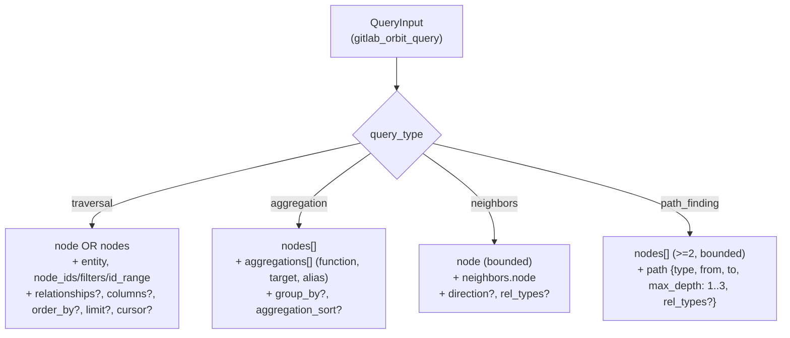
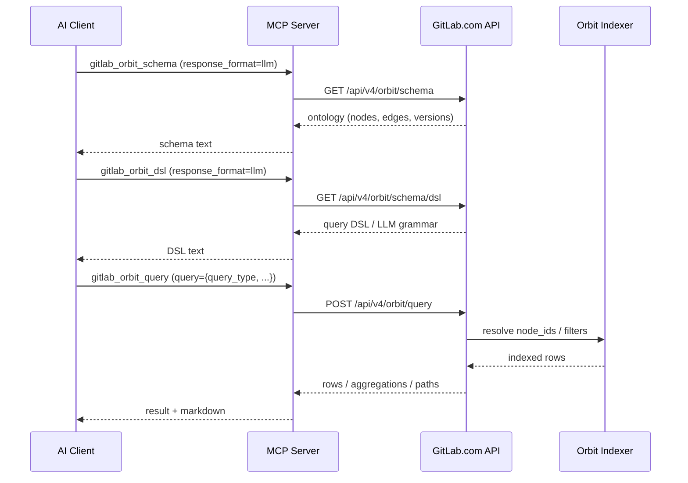

# Orbit — Tool Reference

> **Diátaxis type**: Reference
> **Domain**: Orbit Knowledge Graph
> **Individual tools**: 6
> **Meta-tool**: `gitlab_orbit` (`TOOL_SURFACE=meta` catalog)
> **Dynamic IDs**: `orbit.*` (default surface, via `gitlab_execute_action`)
> **GitLab API**: [Orbit API](https://docs.gitlab.com/api/orbit/)
> **Availability**: GitLab.com only; Enterprise/Premium catalog; experimental `knowledge_graph` feature
> **Audience**: 👤 End users, AI assistant users

---

## Overview

The Orbit domain exposes GitLab's experimental Knowledge Graph API for GitLab.com. It is registered only when the MCP server is connected to `https://gitlab.com` and the Enterprise/Premium catalog is enabled; self-managed GitLab instances and non-enterprise catalogs do not advertise these tools. GitLab may still return `404 Not Found` when the `knowledge_graph` feature flag is disabled, `403 Forbidden` when the token cannot access a Knowledge Graph-enabled namespace or project, or `503 Service Unavailable` when the Orbit backend is unavailable.

The upstream Orbit API is moving quickly. This MCP surface follows the latest GitLab client and CLI coverage, including `graph_status`; GitLab's public API reference may lag behind that endpoint. For schema formatting, the live API currently uses the `format` query parameter, while this server also accepts `response_format` as an input alias for compatibility with public documentation wording.

On the default dynamic surface, these operations are the `orbit.*` entries of the canonical action catalog: find them with `gitlab_find_action` and run them with `gitlab_execute_action` by `domain.action` ID. With `TOOL_SURFACE=individual`, each is the tool named in the tables below.

With `TOOL_SURFACE=meta`, all six individual tools below are consolidated into the `gitlab_orbit` meta-tool with an `action` parameter.

| Canonical ID         | Meta-tool action | Individual tool             | Purpose                                                           |
| -------------------- | ---------------- | --------------------------- | ----------------------------------------------------------------- |
| `orbit.status`       | `status`         | `gitlab_orbit_status`       | Check Orbit service health and backend components                 |
| `orbit.schema`       | `schema`         | `gitlab_orbit_schema`       | Inspect the graph ontology and optionally expand node definitions |
| `orbit.tools`        | `tools`          | `gitlab_orbit_tools`        | Discover the live Orbit query manifest                            |
| `orbit.dsl`          | `dsl`            | `gitlab_orbit_dsl`          | Retrieve the Orbit query DSL schema or LLM grammar                |
| `orbit.query`        | `query`          | `gitlab_orbit_query`        | Run a read-only Knowledge Graph query object                      |
| `orbit.graph_status` | `graph_status`   | `gitlab_orbit_graph_status` | Inspect indexing status for one namespace, project, or full path  |

### Common Questions

> "Is Orbit available for this GitLab.com token?"
> "Show the Knowledge Graph schema"
> "Check indexing status for gitlab-org/gitlab"

### Annotation Legend

| Annotation | ReadOnly | Destructive | Idempotent | Description              |
| ---------- | :------: | :---------: | :--------: | ------------------------ |
| **Read**   |   Yes    |     No      |    Yes     | Safe read-only operation |

All Orbit tools are read-only.

---

## Status

### `gitlab_orbit_status`

Get Orbit cluster health and component status. Optional `response_format` accepts `raw` or `llm`; omitting it defaults to `raw`.

| Annotation | **Read** |
| ---------- | -------- |

---

## Schema

### `gitlab_orbit_schema`

Get the Orbit graph ontology, including schema version, domains, node summaries, and edges. Optional `expand` requests expanded node definitions for named node types, and optional `format` accepts `raw` or `llm`. The input also accepts `response_format` as an alias; if both are set, they must match.

| Annotation | **Read** |
| ---------- | -------- |

---

## Tool Manifest

### `gitlab_orbit_tools`

Get the Orbit MCP tool manifest served by GitLab.com. Use this before `gitlab_orbit_query` to discover the live query shapes and parameter schemas supported by the Orbit backend.

| Annotation | **Read** |
| ---------- | -------- |

---

## Query DSL

### `gitlab_orbit_dsl`

Get the Orbit query DSL from `GET /api/v4/orbit/schema/dsl`. Optional `response_format` accepts `raw` for a JSON Schema document or `llm` for the Orbit LLM grammar returned verbatim.

| Annotation | **Read** |
| ---------- | -------- |

---

## Query

### `gitlab_orbit_query`

Execute a read-only Orbit Knowledge Graph query. The `query` parameter must be a JSON object matching the schema returned by `gitlab_orbit_tools`. Optional `response_format` accepts `raw` or `llm`; `llm` responses are returned as verbatim raw Orbit backend text (GOON/TOON, a low-level format used by Orbit).

| Annotation | **Read** |
| ---------- | -------- |

### How the 4 query types work

`gitlab_orbit_query` accepts a single `query` object whose `query_type` selects one of four variants. The full JSON Schema is served live by `/api/v4/orbit/dsl`; the table below shows the smallest accepted shape for each variant, which the live tests at `test/e2e/orbit/live_test.go` exercise against the `plens1` namespace.

| Variant        | Required shape                                                                                                                         | Purpose                                              |
| -------------- | -------------------------------------------------------------------------------------------------------------------------------------- | ---------------------------------------------------- |
| `traversal`    | `node` (or `nodes`) with `entity`, `node_ids`/`filters`/`id_range`, optional `relationships`, `columns`, `order_by`, `limit`, `cursor` | Walk the graph and return rows; default surface      |
| `aggregation`  | `nodes`, `aggregations` (`function`+`target`+`alias`); optional `group_by`, `aggregation_sort`                                         | Bucket rows and return counts/sums/avg/max           |
| `neighbors`    | `node` (bounded), `neighbors: {node: <id>, direction?, rel_types?}`                                                                    | Hydrate a node and its connected entities in one hop |
| `path_finding` | `nodes` (≥2, bounded), `path: {type: shortest\|all_shortest\|any, from: <id>, to: <id>, max_depth: 1..3, rel_types?}`                  | Shortest path between two nodes                      |

The live API rejects traversal and aggregation queries that lack a scoped node (`node_ids`, `filters`, or `id_range` with span ≤ 100,000) to avoid full edge-table scans. The MCP handler surfaces this same check client-side so the LLM gets an actionable error before the round trip.

The branching below summarizes the four variants and the smallest accepted shape under each. A Mermaid graph is the right tool here because the four variants share a single `query_type` discriminator and only diverge on the sibling keys — a tree makes the discriminants and required fields legible at a glance, whereas a table requires the eye to map rows to the same parent.



#### Discover → query workflow

The LLM-driven flow below is a recommended pattern: discover the live schema with `gitlab_orbit_schema` and `gitlab_orbit_dsl`, then execute a typed query through `gitlab_orbit_query`. A sequence diagram is the right tool because the steps involve four distinct actors (LLM, MCP server, GitLab.com, indexed rows) and the response boundaries matter — the LLM should not assume the schema returned by `dsl` is valid forever; the live API may evolve.



Minimal runnable examples (against a developer namespace provisioned by `scripts/setup-orbit-fixtures.sh`):

```json
// traversal — list one project by full_path
{
  "query_type": "traversal",
  "node": {
    "id": "p",
    "entity": "Project",
    "filters": {"full_path": {"op": "starts_with", "value": "plens1/"}},
    "columns": ["id", "full_path"]
  }
}
```

```json
// aggregation — count vulnerabilities by severity
{
  "query_type": "aggregation",
  "nodes": [
    {"id": "v", "entity": "Vulnerability",
     "filters": {"state": {"op": "eq", "value": "detected"}}}
  ],
  "group_by": [{"kind": "property", "node": "v", "property": "severity", "alias": "sev"}],
  "aggregations": [{"function": "count", "target": "v", "alias": "vuln_count"}],
  "aggregation_sort": {"column": "vuln_count", "direction": "DESC"}
}
```

```json
// neighbors — what is connected to a project
{
  "query_type": "neighbors",
  "node": {"id": "p", "entity": "Project", "node_ids": [83009763]},
  "neighbors": {"node": "p"}
}
```

```json
// path_finding — shortest path from a user to a project (max 3 hops)
{
  "query_type": "path_finding",
  "nodes": [
    {"id": "u", "entity": "User",    "node_ids": [15767218]},
    {"id": "p", "entity": "Project", "node_ids": [83009763]}
  ],
  "path": {"type": "shortest", "from": "u", "to": "p", "max_depth": 3}
}
```

---

## Graph Status

### `gitlab_orbit_graph_status`

Get graph indexing status for exactly one scope: `namespace_id`, `project_id`, or `full_path`. Optional `response_format` accepts `raw` or `llm`.

| Annotation | **Read** |
| ---------- | -------- |

---

## Tool Summary

| # | Tool Name | Category | Annotation |
| --: | --------- | -------- | :--------: |
| 1 | `gitlab_orbit_status` | Status | Read |
| 2 | `gitlab_orbit_schema` | Schema | Read |
| 3 | `gitlab_orbit_tools` | Tool Manifest | Read |
| 4 | `gitlab_orbit_dsl` | Query DSL | Read |
| 5 | `gitlab_orbit_query` | Query | Read |
| 6 | `gitlab_orbit_graph_status` | Graph Status | Read |

### Destructive Tools (Require Confirmation)

None — all Orbit tools are read-only.

---

## Related

- [GitLab Orbit API](https://docs.gitlab.com/api/orbit/)
- [Orbit Live Test Fixtures](../../development/orbit-fixtures.md) — `kg-fixtures` and `security-fixtures` projects, the `scripts/setup-orbit-fixtures.sh` reproducer, and the `make test-e2e-gitlab-com` orchestration
- [GraphQL Integration](../../concepts/graphql.md)
- [Search Tools](search.md)
