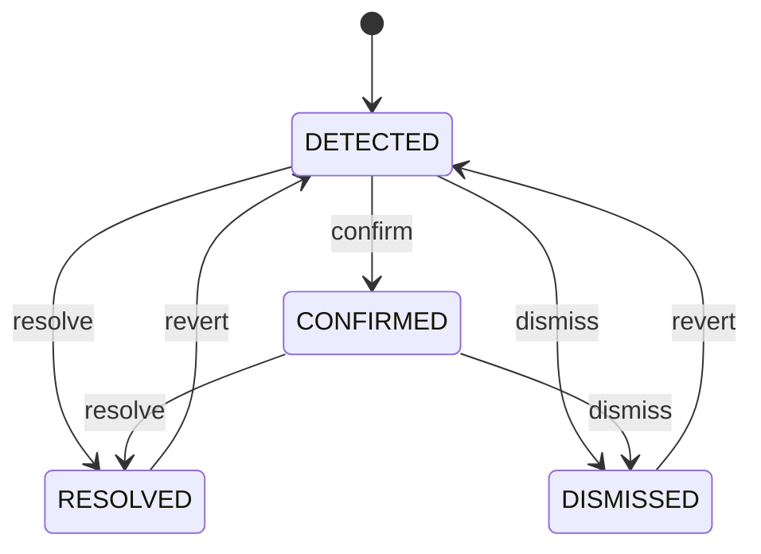

# Vulnerabilities — Tool Reference

> **Diátaxis type**: Reference
> **Domain**: Vulnerabilities
> **Individual tools**: 8
> **Meta-tool**: `gitlab_vulnerability` (`GITLAB_MCP_TOOL_SURFACE=meta` catalog)
> **Dynamic IDs**: `vulnerability.*` (default surface, via `gitlab_execute_action`)
> **GitLab API**: [Vulnerabilities GraphQL API](https://docs.gitlab.com/ee/api/graphql/reference/#queryvulnerabilities)
> **Audience**: 👤 End users, AI assistant users
> **Requires**: GitLab Ultimate or Premium

---

## Overview

The vulnerabilities domain provides full lifecycle management for security vulnerabilities detected by GitLab security scanners. All operations use the GitLab GraphQL API (no REST equivalent for these queries/mutations). This domain covers listing, inspecting, and triaging vulnerabilities, as well as retrieving severity counts and per-pipeline security report summaries.

On the default dynamic surface, these operations are the `vulnerability.*` entries of the canonical action catalog: find them with `gitlab_find_action` and run them with `gitlab_execute_action` by `domain.action` ID. With `GITLAB_MCP_TOOL_SURFACE=individual`, each is the tool named in the tables below.

With `GITLAB_MCP_TOOL_SURFACE=meta`, all 8 individual tools below are consolidated into a single `gitlab_vulnerability` meta-tool that dispatches by `action` parameter.

### Common Questions

> "List all critical vulnerabilities in my project"
> "Show me the details of vulnerability gid://gitlab/Vulnerability/42"
> "Dismiss vulnerability 42 as a false positive"
> "How many vulnerabilities does my project have by severity?"
> "What security scanners ran in pipeline 123?"

### Annotation Legend

| Annotation | ReadOnly | Destructive | Idempotent | Description                   |
| ---------- | :------: | :---------: | :--------: | ----------------------------- |
| **Read**   |   Yes    |     No      |    Yes     | Safe read-only operation      |
| **Update** |    —     |     No      |    Yes     | Modifies an existing resource |

---

## Vulnerability Operations

### `gitlab_list_vulnerabilities`

List project vulnerabilities with extensive filtering support. Returns a paginated list of vulnerabilities, each the object described under [Output fields](#output-fields) below.

| Annotation | **Read** |
| ---------- | -------- |

| Parameter        | Type     | Required | Description                                                                                                                                                         |
| ---------------- | -------- | :------: | ------------------------------------------------------------------------------------------------------------------------------------------------------------------- |
| `project_path`   | string   |   Yes    | Full path of the project (e.g. `my-group/my-project`)                                                                                                               |
| `severity`       | string[] |    No    | Filter by severity: `CRITICAL`, `HIGH`, `MEDIUM`, `LOW`, `INFO`, `UNKNOWN`                                                                                          |
| `state`          | string[] |    No    | Filter by state: `DETECTED`, `CONFIRMED`, `DISMISSED`, `RESOLVED`                                                                                                   |
| `scanner`        | string[] |    No    | Filter by scanner external IDs                                                                                                                                      |
| `report_type`    | string[] |    No    | Filter by report type: `SAST`, `DAST`, `DEPENDENCY_SCANNING`, `CONTAINER_SCANNING`, `SECRET_DETECTION`, `COVERAGE_FUZZING`, `API_FUZZING`, `CLUSTER_IMAGE_SCANNING` |
| `has_issues`     | bool     |    No    | Filter by whether a linked issue exists                                                                                                                             |
| `has_resolution` | bool     |    No    | Filter by whether a resolution exists                                                                                                                               |
| `sort`           | string   |    No    | Sort order: `severity_desc`, `severity_asc`, `detected_desc`, `detected_asc`                                                                                        |
| `first`          | int      |    No    | Number of items per page (default: 20)                                                                                                                              |
| `after`          | string   |    No    | Cursor for forward pagination                                                                                                                                       |
| `last`           | int      |    No    | Number of items per page when paging backward. Cannot be combined with `first`                                                                                      |
| `before`         | string   |    No    | Cursor for backward pagination, from a previous response's `start_cursor`                                                                                           |

### `gitlab_get_vulnerability`

Get full details of a single vulnerability by its GID. Returns complete vulnerability information including all identifiers, CVSS assessments, EPSS and known-exploit data, scanner details, location, solution, report links, who changed its state and what they wrote, linked issues, and the merge request that fixes it.

| Annotation | **Read** |
| ---------- | -------- |

| Parameter | Type   | Required | Description                                              |
| --------- | ------ | :------: | -------------------------------------------------------- |
| `id`      | string |   Yes    | Vulnerability GID (e.g. `gid://gitlab/Vulnerability/42`) |

### Output fields

The list, the get and the four state changes answer with the same vulnerability object. `id`, `title`, `severity`, `state` and `present_on_default_branch` are always written, as an empty string or `false` where GitLab sent null; any other field GitLab did not send is left out rather than written empty. Inside a nested object the keys that name it are written whenever the object is, so a linked issue or merge request whose `iid` GitLab did not send reads `0`.

| Field                                             | Type   | Description                                                                                                                             |
| ------------------------------------------------- | ------ | --------------------------------------------------------------------------------------------------------------------------------------- |
| `id`, `uuid`                                      | string | The vulnerability's GID, and the uuid of its finding, which is how a pipeline's security finding names it                               |
| `title`, `description`, `solution`                | string | The scanner's own text                                                                                                                  |
| `severity`, `state`, `report_type`                | string | Severity, lifecycle state and the kind of scan that found it                                                                            |
| `state_comment`                                   | string | The comment written with the latest state change, such as the reason for a dismissal                                                    |
| `dismissal_reason`                                | string | Why it was dismissed, for a dismissed vulnerability                                                                                     |
| `scanner`                                         | object | Scanner name, vendor and `scanner_id`, the id the `scanner` filter takes                                                                |
| `primary_identifier`                              | object | The identifier the report ranks first: `name`, `external_type`, `external_id`, `url`                                                    |
| `identifiers`                                     | array  | Every CVE, CWE and similar identifier, each with the same keys as `primary_identifier`                                                  |
| `cvss`                                            | array  | Each vendor's CVSS assessment: `version`, `vector`, `base_score`, `overall_score`, `severity`                                           |
| `cve_enrichment`                                  | object | `cve`, `epss_score` (the probability of exploitation) and `is_known_exploit` (listed in CISA KEV)                                       |
| `location`                                        | object | Where it was found, in the terms of its scan type (see Notes)                                                                           |
| `links`                                           | array  | References the security report attached: `name` and `url`                                                                               |
| `token_status`                                    | object | For a leaked secret, whether it still works: `status` (`ACTIVE`, `INACTIVE`, `UNKNOWN`), `last_verified_at`, `created_at`, `updated_at` |
| `detected_at`, `updated_at`                       | string | When it was first detected and last updated                                                                                             |
| `confirmed_at`, `dismissed_at`, `resolved_at`     | string | When its state last changed to each                                                                                                     |
| `confirmed_by`, `dismissed_by`, `resolved_by`     | object | Who made that change: `username`, `name`, `web_url`                                                                                     |
| `present_on_default_branch`                       | bool   | Whether the default branch has it; `false` means it was found only on another ref                                                       |
| `resolved_on_default_branch`, `removed_from_code` | bool   | Whether the default branch no longer has it, and whether the code no longer carries it                                                  |
| `false_positive`                                  | bool   | GitLab's false-positive verdict, where the project has one                                                                              |
| `has_remediations`                                | bool   | Whether a remediation is available                                                                                                      |
| `has_issues`, `issue_links`                       | mixed  | Whether issues are linked, and each link's `link_type` (`CREATED`, `RELATED`) with the issue's `iid`, `title`, `state`, `web_url`       |
| `has_merge_request`, `merge_request`              | mixed  | Whether a merge request fixes it, and that merge request's `iid`, `title`, `state`, `web_url`                                           |
| `user_notes_count`                                | int    | How many notes people wrote on it                                                                                                       |
| `project`, `web_url`                              | mixed  | The project it belongs to and its own page                                                                                              |

GitLab refuses a whole document that names a field it does not have, so two kinds of field are not read. The fields GitLab's GraphQL reference marks Status: Experiment (reachability, malware, the due date, the detected pipelines, tracked refs and others), since GitLab may remove an experiment without notice. And the fields newer than GitLab 18.10 (`unverified`, added in 18.11), since the six actions share one selection and one such field would stop all of them on an older instance.

The list, the get and the four state changes need GitLab 18.10 or later, the release that added the newest field they read (`removed_from_code`), and the security findings list needs 18.5 (`original_severity` and the token status's `last_verified_at`), each read from GitLab's versioned GraphQL reference.

---

## Vulnerability State Mutations

State transitions follow the GitLab vulnerability lifecycle:

### `gitlab_dismiss_vulnerability`

Dismiss a vulnerability with an optional comment and reason. Valid dismissal reasons: `ACCEPTABLE_RISK`, `FALSE_POSITIVE`, `MITIGATING_CONTROL`, `USED_IN_TESTS`, `NOT_APPLICABLE`.

| Annotation | **Update** |
| ---------- | ---------- |

| Parameter          | Type   | Required | Description                                                                                                     |
| ------------------ | ------ | :------: | --------------------------------------------------------------------------------------------------------------- |
| `id`               | string |   Yes    | Vulnerability GID (e.g. `gid://gitlab/Vulnerability/42`)                                                        |
| `comment`          | string |    No    | Reason for dismissal                                                                                            |
| `dismissal_reason` | string |    No    | Structured reason: `ACCEPTABLE_RISK`, `FALSE_POSITIVE`, `MITIGATING_CONTROL`, `USED_IN_TESTS`, `NOT_APPLICABLE` |

### `gitlab_confirm_vulnerability`

Confirm a detected vulnerability. Changes state from `DETECTED` to `CONFIRMED`.

| Annotation | **Update** |
| ---------- | ---------- |

| Parameter | Type   | Required | Description                                              |
| --------- | ------ | :------: | -------------------------------------------------------- |
| `id`      | string |   Yes    | Vulnerability GID (e.g. `gid://gitlab/Vulnerability/42`) |

### `gitlab_resolve_vulnerability`

Resolve a vulnerability. Changes state to `RESOLVED`.

| Annotation | **Update** |
| ---------- | ---------- |

| Parameter | Type   | Required | Description                                              |
| --------- | ------ | :------: | -------------------------------------------------------- |
| `id`      | string |   Yes    | Vulnerability GID (e.g. `gid://gitlab/Vulnerability/42`) |

### `gitlab_revert_vulnerability`

Revert a vulnerability back to `DETECTED` state from any other state.

| Annotation | **Update** |
| ---------- | ---------- |

| Parameter | Type   | Required | Description                                              |
| --------- | ------ | :------: | -------------------------------------------------------- |
| `id`      | string |   Yes    | Vulnerability GID (e.g. `gid://gitlab/Vulnerability/42`) |

---

## Summary & Reporting

### `gitlab_vulnerability_severity_count`

Get vulnerability severity counts for a project. Returns counts per severity level (critical, high, medium, low, info, unknown) and the total.

| Annotation | **Read** |
| ---------- | -------- |

| Parameter      | Type   | Required | Description                                           |
| -------------- | ------ | :------: | ----------------------------------------------------- |
| `project_path` | string |   Yes    | Full path of the project (e.g. `my-group/my-project`) |

### `gitlab_pipeline_security_summary`

Get the security report summary for a specific pipeline. Returns scanner-level breakdown with vulnerability counts and scanned resource counts for each scanner type: SAST, DAST, Dependency Scanning, Container Scanning, Secret Detection, Coverage Fuzzing, API Fuzzing, and Cluster Image Scanning. Each type also lists the `scans` that ran for it with their `status`, `errors` and `warnings`, which is what tells a scan that found nothing from one whose report was refused, and the first twenty `scanned_resources` a DAST or API fuzzing scan requested (`scanned_resources_csv_path` downloads them all).

| Annotation | **Read** |
| ---------- | -------- |

| Parameter      | Type   | Required | Description                                           |
| -------------- | ------ | :------: | ----------------------------------------------------- |
| `project_path` | string |   Yes    | Full path of the project (e.g. `my-group/my-project`) |
| `pipeline_iid` | string |   Yes    | Pipeline IID (internal ID within the project)         |

---

## Tool Summary

| # | Tool Name | Category | Annotation |
| --: | --------- | -------- | :--------: |
| 1 | `gitlab_list_vulnerabilities` | Query | Read |
| 2 | `gitlab_get_vulnerability` | Query | Read |
| 3 | `gitlab_dismiss_vulnerability` | Mutation | Update |
| 4 | `gitlab_confirm_vulnerability` | Mutation | Update |
| 5 | `gitlab_resolve_vulnerability` | Mutation | Update |
| 6 | `gitlab_revert_vulnerability` | Mutation | Update |
| 7 | `gitlab_vulnerability_severity_count` | Summary | Read |
| 8 | `gitlab_pipeline_security_summary` | Summary | Read |

---

## Notes

- All identifiers use GitLab Global IDs (GIDs) in the format `gid://gitlab/Vulnerability/{numeric_id}`
- Vulnerability location depends on the scan type. `file` is always the subject: the file for SAST, secret detection, dependency scanning and coverage fuzzing, the request path for DAST, and the image for container and cluster image scanning. Beside it, SAST, secret detection and coverage fuzzing add `start_line`, `end_line`, `vulnerable_class` and `vulnerable_method`, DAST adds `hostname`, `request_method` and `param`, dependency and container scanning add the `dependency` (`package_name`, `package_path`, `version`), container scanning adds `operating_system` and `container_repository_url`, a cluster image scan adds the `kubernetes_resource` running the image, coverage fuzzing adds `crash_type`, `crash_address` and `stacktrace_snippet`, and a generic scanner writes a `description`
- Severity badges are rendered with emoji indicators: 🔴 CRITICAL, 🟠 HIGH, 🟡 MEDIUM, 🔵 LOW, ℹ️ INFO

## Related

- [GitLab Vulnerability GraphQL API](https://docs.gitlab.com/ee/api/graphql/reference/#queryvulnerabilities)
- [GitLab Vulnerability Management](https://docs.gitlab.com/ee/user/application_security/vulnerability_report/)
- [Security Findings](security-findings.md) — per-pipeline scan findings
