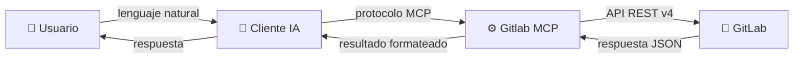
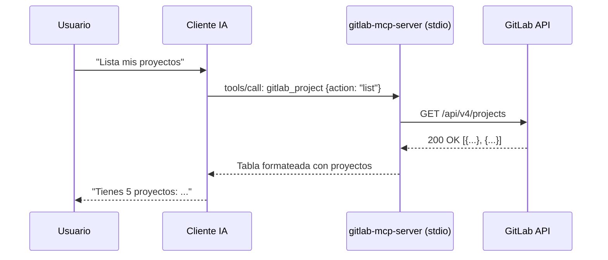
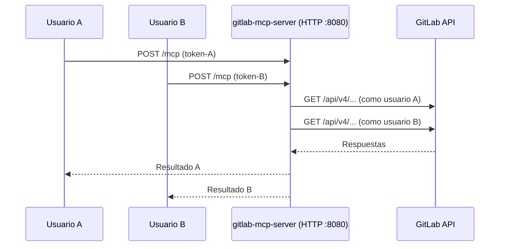
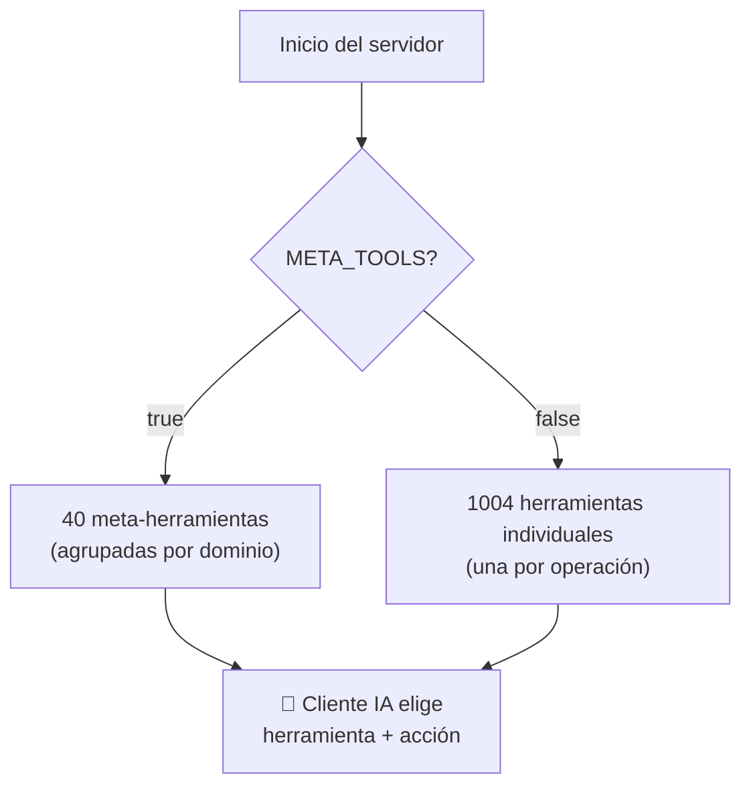
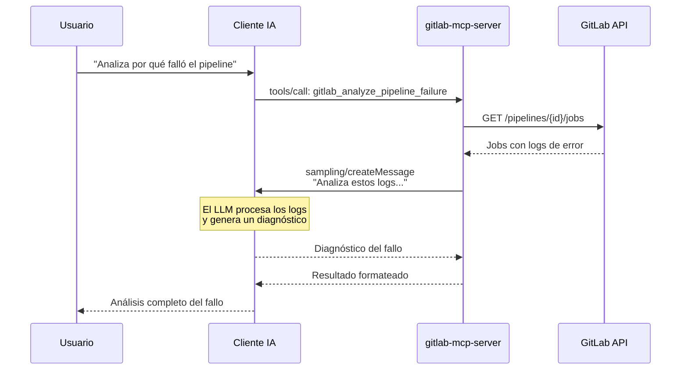
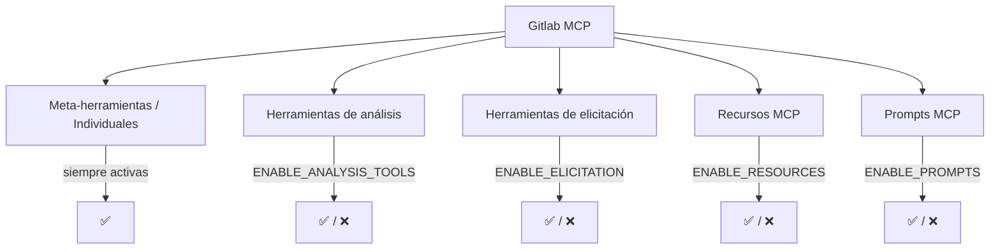

# Arquitectura

Cómo se comunican tus herramientas de IA con GitLab a través de Gitlab MCP.

---

## Visión general

Gitlab MCP actúa como puente entre tu cliente de IA y la API REST de GitLab. Traduce las peticiones en lenguaje natural del asistente a llamadas API estructuradas.

---

## Modos de transporte

Gitlab MCP soporta dos modos de comunicación con el cliente MCP:

### Modo stdio (por defecto)

El cliente MCP lanza el binario como proceso hijo. La comunicación es por entrada/salida estándar (stdin/stdout).

**Ideal para**: uso individual, configuración sencilla, máxima seguridad (el token nunca sale del proceso local).

### Modo HTTP (multi-usuario)

El servidor se ejecuta como servicio web. Cada usuario proporciona su propio token por petición.

**Ideal para**: equipos, despliegues centralizados, entornos donde no se puede instalar binarios localmente.

---

## Registro de herramientas

Al conectarse, el servidor registra sus herramientas en el cliente MCP. Existen dos modos de registro:

### Meta-herramientas vs herramientas individuales

| Aspecto | Meta-herramientas (40) | Individuales (1004) |
|---------|----------------------|---------------------|
| **Consumo de tokens** | :material-arrow-down: Bajo | :material-arrow-up: Alto |
| **Velocidad de selección** | :material-flash: Rápida | :material-clock-outline: Más lenta |
| **Granularidad** | Agrupadas por dominio | Una por operación |
| **Recomendado para** | La mayoría de usuarios | Casos muy específicos |

!!! info "Recomendación"
    Usa siempre meta-herramientas (`META_TOOLS=true`, que es el valor por defecto) salvo que tengas un caso de uso concreto que requiera herramientas individuales.

---

## Flujo de análisis con IA (sampling)

Las herramientas de análisis usan **MCP sampling** — un mecanismo donde el servidor solicita al cliente IA que procese datos con el LLM:

Este flujo permite que las herramientas de análisis aprovechen la inteligencia del LLM para interpretar datos complejos como logs, diffs y métricas.

!!! note "Soporte de sampling"
    El sampling requiere que tu cliente MCP lo soporte. VS Code con GitHub Copilot y Claude Desktop lo soportan nativamente. Consulta la documentación de tu cliente si no estás seguro.

---

## Componentes opcionales

Gitlab MCP tiene una arquitectura modular. Puedes activar o desactivar componentes según tus necesidades:

Consulta la [Guía de configuración](configuration.md) para los detalles de cada variable.
