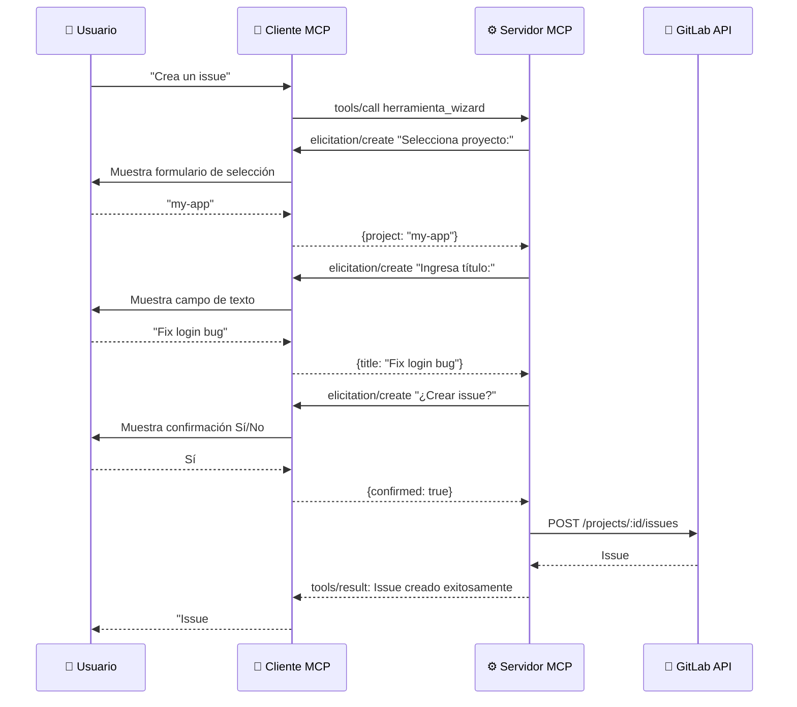

# Elicitation

> **Dirección**: Servidor → Cliente
> **Método MCP**: `elicitation/create`

## ¿Qué problema resuelve?

Las herramientas MCP estándar requieren que la IA proporcione **todos los parámetros de antemano** en una sola llamada. Para operaciones complejas — donde los campos dependen de la configuración del proyecto y los datos faltantes generan errores — la IA debe adivinar valores o hacerle múltiples preguntas al usuario en el chat antes de hacer la llamada.

**Elicitation** introduce un paradigma diferente: el servidor puede pausar la ejecución y **preguntar directamente al usuario** a través de formularios estructurados. Esto permite flujos tipo wizard paso a paso donde cada paso puede depender de la respuesta anterior.

```text
Sin elicitation:
  IA: "¿Qué proyecto?" → Usuario: "my-app"
  IA: "¿Título?" → Usuario: "Fix login bug"
  IA: llama gitlab_issue_create con todos los parámetros

Con elicitation:
  IA: llama la herramienta wizard
  Servidor → Usuario: "Selecciona proyecto:" → Usuario elige "my-app"
  Servidor → Usuario: "Ingresa título:" → Usuario escribe "Fix login bug"
  Servidor → Usuario: "¿Crear issue?" → Usuario confirma
  Servidor crea el issue
```

La diferencia clave: elicitation mueve la conversación de **chat mediado por IA** a **interacción directa servidor-usuario**. El usuario ve formularios estructurados en lugar de mensajes de chat, y el servidor valida cada entrada en tiempo real.

## Cómo funciona



Cada paso del flujo es una petición `elicitation/create` separada. El cliente renderiza el elemento UI apropiado (campo de texto, dropdown, diálogo de confirmación) basado en el tipo de elicitation y JSON Schema.

### Cuatro fases de un flujo de elicitation

1. **Verificación de capacidad** — la herramienta verifica que el cliente soporta elicitation
2. **Recolección de datos** — el servidor envía prompts secuenciales para campos requeridos y opcionales
3. **Confirmación** — el servidor pide al usuario confirmar antes de ejecutar la acción
4. **Ejecución** — al confirmar, el servidor llama a la API de GitLab y devuelve el resultado

El usuario puede **rechazar** en el paso de confirmación o **cancelar** en cualquier paso, abortando el flujo completo de forma limpia.

## Tipos de interacción

| Método | Tipo de entrada | Uso |
| ------ | --------------- | --- |
| `Confirm` | Sí/No booleano | Confirmación antes de ejecutar acciones |
| `PromptText` | Texto libre | Títulos, descripciones, identificadores |
| `SelectOne` | Selección de lista | Proyectos, labels, milestones |

## Seguridad

| Medida | Descripción |
| ------ | ----------- |
| Validación JSON Schema | Todas las respuestas validadas contra el schema antes de procesarlas |
| Validación de opciones | `SelectOne` re-valida que la opción seleccionada está en el conjunto permitido |
| Human-in-the-loop | Toda acción de escritura requiere confirmación explícita del usuario |
| Sin efectos secundarios | Cancelar en cualquier punto no genera llamadas API |

## Tipos de error

| Error | Significado | Acción |
| ----- | ----------- | ------ |
| `ErrNotSupported` | Cliente no soporta elicitation | Devuelve mensaje informativo |
| `ErrDeclined` | Usuario rechazó la petición | Devuelve mensaje de cancelación |
| `ErrCancelled` | Usuario canceló el flujo | Devuelve mensaje de cancelación |

## Degradación elegante

Si el cliente MCP no soporta elicitation:

1. La herramienta comprueba `IsSupported()` y devuelve `ErrNotSupported`
2. El handler devuelve un mensaje informativo: *"Esta herramienta requiere un cliente MCP con soporte de elicitation."*
3. No se hacen llamadas API — la verificación ocurre antes de cualquier recolección de datos

## Preguntas frecuentes

### ¿Qué pasa si el usuario cancela a mitad del flujo?

El handler captura `ErrDeclined` o `ErrCancelled` y devuelve un mensaje de cancelación. No se hacen llamadas a la API de GitLab — la operación se aborta completamente sin efectos secundarios.

### ¿Qué clientes soportan elicitation?

Actualmente Claude Desktop soporta elicitation. VS Code con GitHub Copilot tiene soporte parcial. El soporte está expandiéndose en la comunidad MCP.

## Referencias

- [Especificación MCP — Elicitation](https://modelcontextprotocol.io/specification/2025-11-25/client/elicitation)
- [Capacidades MCP](index.md) — todas las capacidades
