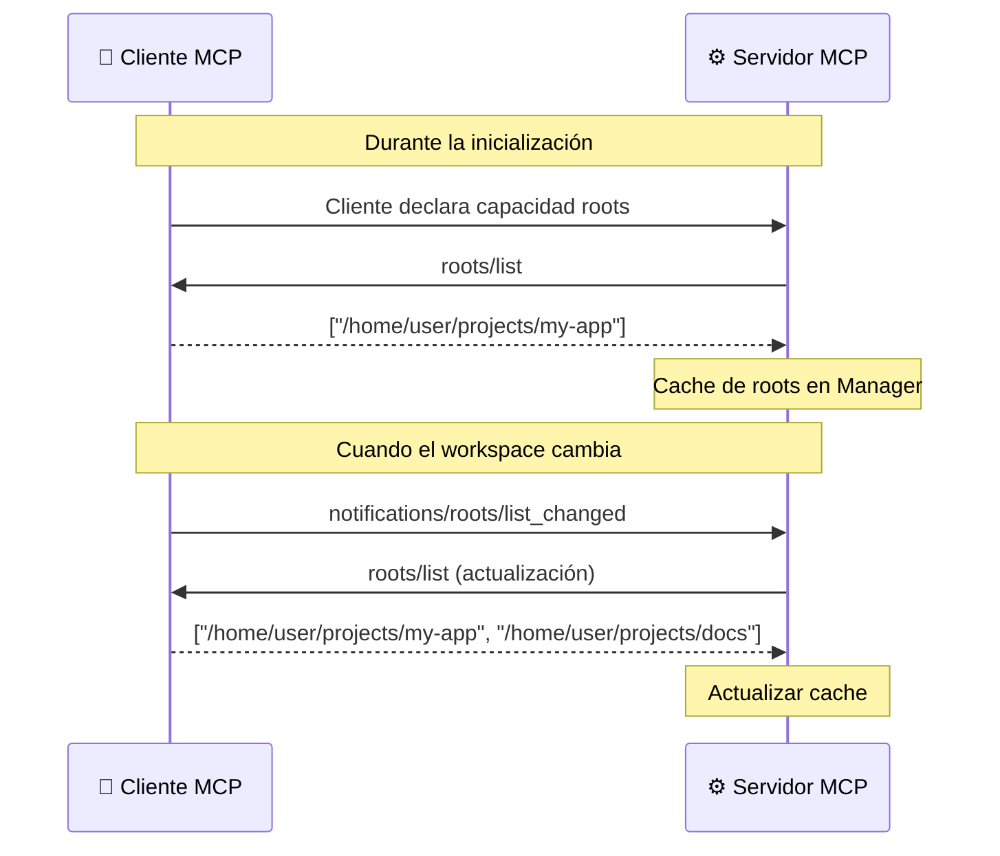

# Roots

> **Dirección**: Cliente → Servidor
> **Método MCP**: `roots/list`

## ¿Qué problema resuelve?

Cuando abres un proyecto en tu editor, el editor sabe en qué directorio estás trabajando. Pero el servidor MCP no — solo ve llamadas a herramientas y argumentos. Sin contexto de workspace, cada llamada debe incluir identificadores de proyecto explícitos.

**Roots** cierra esta brecha. El cliente MCP declara sus directorios de workspace al servidor. El servidor puede usar esta información para descubrir repositorios Git y resolver automáticamente el proyecto de GitLab asociado.

## Cómo funciona



El cliente proporciona los roots del workspace como URIs `file://`. El servidor los cachea por sesión y los re-consulta cuando el cliente envía una notificación `roots/list_changed` (por ejemplo, al abrir otra carpeta en el editor).

## Recurso expuesto

Los roots se exponen como recurso MCP en `gitlab://workspace/roots`:

```json
{
  "roots": [
    {"uri": "file:///home/user/projects/my-app", "name": "my-app"},
    {"uri": "file:///home/user/repos/backend", "name": "backend"}
  ],
  "hint": "To discover GitLab project: Read .git/config and call gitlab_resolve_project_from_remote"
}
```

## Detección de repositorios Git

El servidor identifica roots que contienen repositorios Git buscando:

- Sufijo `/.git` o nombre base `.git`
- Patrones en la ruta: `/repos/`, `/repositories/`, `/git/` (case-insensitive)

Esto permite que herramientas como `gitlab_resolve_project_from_remote` resuelvan automáticamente el `project_id` sin que el usuario lo proporcione.

## Seguridad

| Medida | Descripción |
| ------ | ----------- |
| Thread-safe | Todas las operaciones protegidas por `sync.RWMutex` |
| Degradación elegante | Devuelve `nil` sin error si el cliente no soporta roots |
| Semántica de copia | `GetRoots()` devuelve una copia para evitar mutación del estado interno |
| Validación de URIs | Las URIs se parsean antes de devolverlas a los consumidores |

## Degradación elegante

Si el cliente MCP no soporta roots:

- El cache del Manager permanece vacío
- Los roots se reportan como no disponibles
- Todas las herramientas siguen funcionando — el usuario simplemente debe proporcionar `project_id` manualmente
- La capacidad roots es puramente aditiva

## Preguntas frecuentes

### ¿Mi cliente MCP necesita soportar roots?

No. Si el cliente no soporta roots, el cache simplemente está vacío. Todas las herramientas funcionan normalmente — roots solo añade conveniencia.

### ¿Los roots pueden exponer rutas sensibles?

Los roots contienen rutas de directorios del workspace del editor del usuario (ej. `/home/user/projects/...`). Solo se cachean en memoria, no se envían a GitLab ni se registran en logs por encima del nivel debug.

### ¿Con qué frecuencia se actualiza el cache?

El cache se actualiza cuando el cliente envía una notificación `roots/list_changed` (típicamente al abrir o cerrar una carpeta en el editor). El servidor también puede llamar `Refresh()` en cualquier momento.

## Referencias

- [Especificación MCP — Roots](https://modelcontextprotocol.io/specification/2025-11-25/client/roots)
- [Capacidades MCP](index.md) — todas las capacidades
