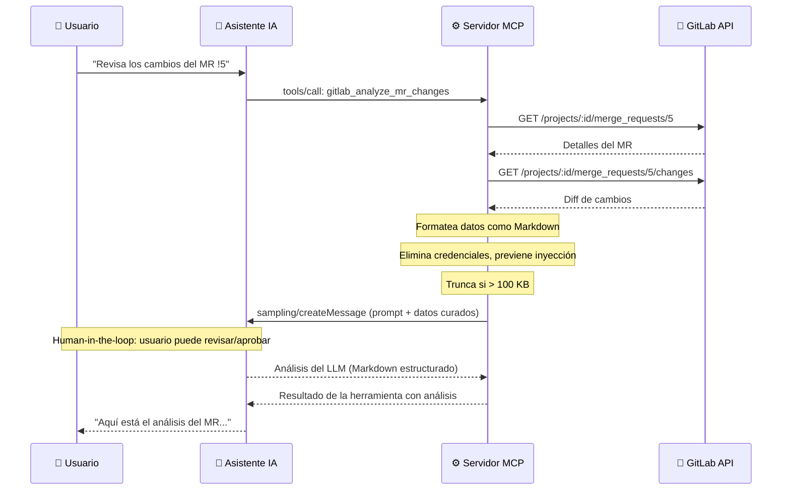

# Sampling

> **Dirección**: Servidor → Cliente (vía `createMessage`)
> **Método MCP**: `sampling/createMessage`

## ¿Qué problema resuelve?

Un servidor MCP como gitlab-mcp-server es excelente obteniendo datos de GitLab: merge requests, pipelines, issues, commits. Pero los datos crudos no siempre son útiles. Lo que a menudo se necesita es **análisis**: "¿Es seguro mergear este MR?", "¿Por qué falla este pipeline?", "¿Cuál es el estado de este milestone?"

Sampling cierra esta brecha. Permite al servidor recopilar datos de GitLab y **pedir a la IA que los analice**, todo dentro de una sola llamada a herramienta. El usuario ve un resultado elaborado — no un muro de JSON, sino un análisis estructurado en lenguaje natural.

```text
Sin sampling:
  Usuario → "Analiza este MR" → IA lee datos crudos (muchas llamadas API) → IA lucha con límites de contexto

Con sampling:
  Usuario → "Analiza este MR" → Servidor obtiene datos → Servidor pide a IA analizar → Resultado enfocado y estructurado
```

El servidor actúa como **curador de datos**: recopila, filtra y formatea la información relevante. La IA actúa como **analista**: lee los datos curados y produce conclusiones. Esta división de trabajo produce mejores resultados que cualquiera de los dos por separado.

## Cómo funciona



### Las cuatro fases

Toda herramienta de sampling sigue el mismo patrón de cuatro fases:

**Fase 1 — Verificación de capacidad**: el servidor comprueba si el cliente MCP soporta sampling. Si no, la herramienta devuelve un mensaje de error claro.

**Fase 2 — Recolección de datos**: el servidor llama a la API de GitLab para obtener los datos necesarios. Dependiendo de la herramienta, puede ser issues, MRs, pipelines o commits, con múltiples llamadas API paginadas.

**Fase 3 — Preparación de datos y seguridad**: antes de enviar datos a la IA, el servidor aplica tres medidas de seguridad:

- **Eliminación de credenciales**: regex que detecta y elimina tokens de GitLab (`glpat-*`), claves AWS, tokens de Slack, JWTs y claves API
- **Prevención de inyección XML**: los datos se envuelven en delimitadores con nonce aleatorio (`<gitlab_data_{nonce}>`) para evitar ataques de prompt injection
- **Límite de tamaño**: los datos se truncan a 100 KB máximo

**Fase 4 — Análisis del LLM**: el servidor envía el mensaje preparado vía `sampling/createMessage`. La IA analiza según el prompt y devuelve una respuesta en Markdown estructurado.

### Human-in-the-loop

Dependiendo del cliente MCP, el usuario puede ver y aprobar/rechazar la petición de sampling antes de que se envíe a la IA. Esto garantiza que el usuario mantiene control sobre qué datos se comparten.

## Análisis con herramientas (tool-calling loop)

Además del análisis simple, sampling soporta un **bucle de llamadas a herramientas** donde la IA puede solicitar datos adicionales durante el análisis:

- Máximo **5 iteraciones** por análisis
- Timeout de **2 minutos** por iteración
- Timeout total de **5 minutos**
- Solo herramientas **explícitamente registradas** pueden invocarse (whitelist)

Esto permite análisis más profundos donde la IA descubre que necesita información adicional y la solicita al servidor.

## Seguridad

| Medida | Descripción |
| ------ | ----------- |
| Eliminación de credenciales | Regex que detecta `glpat-*`, claves AWS, tokens Slack, JWTs |
| Prevención de inyección | Datos envueltos en tags XML con nonce aleatorio |
| Prompt del sistema fijo | No configurable por el usuario, con instrucciones anti-inyección |
| Whitelist de herramientas | Solo herramientas registradas explícitamente en el loop |
| Límite de tamaño | Datos truncados a 100 KB antes del envío |
| Tokens de modelo | Max tokens configurable (por defecto 4096) |

## Degradación elegante

Si el cliente MCP no soporta sampling:

1. La herramienta detecta la ausencia de capacidad vía `IsSupported()`
2. Devuelve un mensaje informativo indicando que se necesita un cliente con soporte de sampling
3. No se hacen llamadas API innecesarias — la verificación ocurre antes de cualquier recolección de datos

## Preguntas frecuentes

### ¿Mi cliente MCP necesita soportar sampling?

Depende. Las herramientas de análisis (las que terminan en `_analyze`) requieren sampling. El resto de herramientas (CRUD, listados, búsquedas) funcionan sin sampling.

### ¿Es seguro enviar datos de GitLab al LLM?

Sí, con las medidas de seguridad implementadas. Los tokens y credenciales se eliminan antes del envío, los datos se limitan en tamaño, y el prompt del sistema está protegido contra inyección.

### ¿Qué clientes soportan sampling actualmente?

Claude Desktop y VS Code con GitHub Copilot soportan sampling. Otros clientes pueden no soportarlo todavía.

## Referencias

- [Especificación MCP — Sampling](https://modelcontextprotocol.io/specification/2025-11-25/client/sampling)
- [Capacidades MCP](index.md) — todas las capacidades
