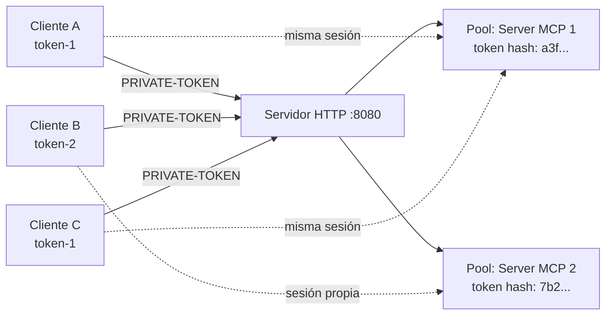

# Servidor HTTP

Gitlab MCP puede ejecutarse como servidor HTTP multi-usuario además del modo stdio por defecto.

---

## Activación

```bash
./gitlab-mcp-server --http --gitlab-url=https://tu-gitlab.ejemplo.com
```

En modo HTTP:

- **No se requiere** `GITLAB_TOKEN` al arrancar — cada cliente envía su propio token
- `--gitlab-url` es **obligatorio** (la URL de la instancia GitLab)
- El servidor escucha en `:8080` por defecto

---

## Configuración

| Parámetro | Variable | Defecto | Descripción |
|-----------|----------|---------|-------------|
| `--http` | — | `false` | Activar modo HTTP |
| `--http-addr` | `HTTP_ADDR` | `:8080` | Dirección de escucha |
| `--gitlab-url` | `GITLAB_URL` | — | URL de GitLab (obligatorio) |
| `--skip-tls-verify` | `GITLAB_SKIP_TLS_VERIFY` | `false` | Omitir verificación TLS |
| `--meta-tools` | `META_TOOLS` | `true` | Activar meta-herramientas |
| `--enterprise` | `GITLAB_ENTERPRISE` | `false` | Meta-herramientas enterprise |
| `--read-only` | `GITLAB_READ_ONLY` | `false` | Modo solo lectura |
| `--max-http-clients` | `MAX_HTTP_CLIENTS` | `100` | Máximo de clientes concurrentes |
| `--session-timeout` | `SESSION_TIMEOUT` | `30m` | Timeout de inactividad |
| `--revalidate-interval` | `REVALIDATE_INTERVAL` | `15m` | Intervalo de revalidación de tokens |

---

## Autenticación por petición

Cada petición debe incluir un token de acceso de GitLab:

```bash
# Cabecera PRIVATE-TOKEN (recomendado)
curl -H "PRIVATE-TOKEN: glpat-xxxxx" http://localhost:8080/mcp/...

# Cabecera Authorization Bearer
curl -H "Authorization: Bearer glpat-xxxxx" http://localhost:8080/mcp/...
```

---

## Pool de sesiones

Cada token único obtiene su propia instancia de servidor MCP con un cliente GitLab aislado:



Comportamiento del pool:

- **Aislamiento**: Cada token tiene su propia instancia con su propio cliente GitLab
- **Hash**: Los tokens se almacenan como hash SHA-256 (nunca en texto plano)
- **Evicción LRU**: Cuando se alcanza `--max-http-clients`, se elimina la sesión menos usada
- **Timeout**: Las sesiones inactivas expiran después de `--session-timeout`

---

## Revalidación de tokens

El servidor verifica periódicamente que los tokens almacenados siguen siendo válidos:

```bash
# Validar tokens cada 15 minutos (defecto)
./gitlab-mcp-server --http --revalidate-interval=15m

# Desactivar revalidación
./gitlab-mcp-server --http --revalidate-interval=0
```

Si un token ha sido revocado, su sesión se elimina automáticamente del pool.

---

## Health check

```bash
curl http://localhost:8080/health
```

```json
{
  "status": "ok",
  "version": "1.5.0",
  "commit": "a1b2c3d"
}
```

---

## Docker

La forma más sencilla de desplegar en modo HTTP es con Docker:

```yaml
services:
  gitlab-mcp-server:
    image: ghcr.io/jmrplens/gitlab-mcp-server:latest
    ports:
      - "8080:8080"
    environment:
      GITLAB_URL: "https://tu-gitlab.ejemplo.com"
      META_TOOLS: "true"
    command:
      - "--http"
      - "--http-addr=0.0.0.0:8080"
    healthcheck:
      test: ["CMD", "wget", "-q", "--spider", "http://localhost:8080/health"]
      interval: 30s
      timeout: 5s
      retries: 3
    restart: unless-stopped
    deploy:
      resources:
        limits:
          cpus: "2.0"
          memory: 512M
```

---

## Timeouts HTTP

| Timeout | Valor |
|---------|-------|
| Lectura de cabeceras | 10s |
| Lectura de body | 30s |
| Escritura de respuesta | 60s |
| Conexión inactiva | 120s |
| Tamaño máximo de body | 10 MB |

---

## Ejemplo: configuración de cliente MCP contra servidor HTTP

=== "VS Code + Copilot"

    ```json
    {
      "mcp": {
        "servers": {
          "gitlab": {
            "type": "http",
            "url": "http://servidor:8080/mcp",
            "headers": {
              "PRIVATE-TOKEN": "tu-token-aquí"
            }
          }
        }
      }
    }
    ```

=== "Claude Desktop"

    ```json
    {
      "mcpServers": {
        "gitlab": {
          "type": "http",
          "url": "http://servidor:8080/mcp",
          "headers": {
            "PRIVATE-TOKEN": "tu-token-aquí"
          }
        }
      }
    }
    ```
