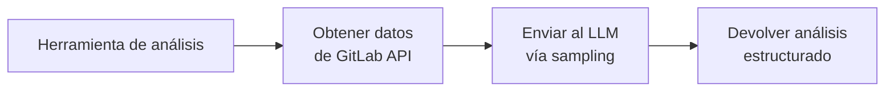

# Herramientas de análisis

11 herramientas que combinan datos de GitLab con la inteligencia del modelo de lenguaje para producir análisis detallados.

---

## ¿Cómo funcionan?

A diferencia de las meta-herramientas que simplemente llaman a la API de GitLab, las herramientas de análisis usan **MCP sampling**:

1. **Recopilan datos** — obtienen información relevante de la API de GitLab (logs, diffs, commits, issues...)
2. **Solicitan análisis** — envían los datos al modelo de lenguaje con instrucciones específicas
3. **Devuelven el resultado** — el análisis procesado por el LLM, formateado y estructurado

Esto permite generar informes, diagnósticos y recomendaciones que requieren comprensión del contexto.

!!! info "Soporte de clientes"
    El sampling requiere que tu cliente MCP lo soporte. VS Code con GitHub Copilot y Claude Desktop lo soportan nativamente. Consulta la documentación de tu cliente si no estás seguro.

---

## Merge Requests

### `gitlab_analyze_mr_changes`

Analiza los cambios de un merge request: calidad del código, posibles bugs, sugerencias de mejora.

**Parámetros**: `project_id`, `mr_iid`

??? example "Ejemplo"
    > *"Analiza los cambios del MR !15 en my-app"*

    El servidor obtiene el diff completo, los commits y el contexto del MR, y genera un análisis que incluye:

    - Resumen de cambios por archivo
    - Problemas potenciales detectados
    - Sugerencias de mejora
    - Evaluación de riesgo

### `gitlab_review_mr_security`

Revisión de seguridad de un merge request: detecta vulnerabilidades, problemas de autenticación, inyecciones, etc.

**Parámetros**: `project_id`, `mr_iid`

??? example "Ejemplo"
    > *"Haz una revisión de seguridad del MR !23"*

    Genera un informe de seguridad con:

    - Vulnerabilidades clasificadas por severidad
    - Problemas de autenticación/autorización
    - Posibles inyecciones (SQL, XSS, command injection)
    - Manejo inseguro de datos sensibles
    - Recomendaciones de mitigación

### `gitlab_summarize_mr_review`

Resume el estado de la revisión de un merge request: comentarios, discusiones, aprobaciones.

**Parámetros**: `project_id`, `mr_iid`

??? example "Ejemplo"
    > *"Resume la revisión del MR !15"*

    Produce un resumen con:

    - Número de comentarios y discusiones
    - Temas principales planteados por los revisores
    - Estado de aprobaciones
    - Discusiones sin resolver

---

## CI/CD

### `gitlab_analyze_pipeline_failure`

Diagnostica por qué falló un pipeline analizando los logs de los jobs fallidos.

**Parámetros**: `project_id`, `pipeline_id`

??? example "Ejemplo"
    > *"¿Por qué falló el último pipeline de my-app?"*

    El servidor:

    1. Identifica los jobs fallidos
    2. Obtiene los logs de error
    3. Analiza las causas raíz
    4. Sugiere soluciones concretas

### `gitlab_analyze_ci_configuration`

Evalúa la configuración CI/CD de un proyecto: eficiencia, buenas prácticas, potencial de optimización.

**Parámetros**: `project_id`

??? example "Ejemplo"
    > *"Analiza la configuración CI del proyecto my-app"*

    Revisa el `.gitlab-ci.yml` y genera recomendaciones sobre:

    - Uso eficiente de caché
    - Paralelización de jobs
    - Reglas de ejecución
    - Buenas prácticas de seguridad en CI

---

## Issues y planificación

### `gitlab_summarize_issue`

Genera un resumen inteligente de un issue incluyendo su historial de comentarios y relaciones.

**Parámetros**: `project_id`, `issue_iid`

??? example "Ejemplo"
    > *"Resume el issue #42"*

    Produce un resumen que incluye:

    - Descripción condensada del issue
    - Puntos clave de la discusión
    - Decisiones tomadas
    - Estado actual y próximos pasos

### `gitlab_analyze_issue_scope`

Evalúa el alcance y complejidad de un issue: estimación de esfuerzo, dependencias, riesgos.

**Parámetros**: `project_id`, `issue_iid`

??? example "Ejemplo"
    > *"Evalúa el scope del issue #18"*

    Genera una evaluación con:

    - Estimación de complejidad
    - Dependencias identificadas
    - Riesgos potenciales
    - Sugerencias de descomposición en subtareas

---

## Releases e informes

### `gitlab_generate_release_notes`

Genera notas de release basadas en los commits y merge requests entre dos referencias.

**Parámetros**: `project_id`, `from` (tag/branch), `to` (tag/branch)

??? example "Ejemplo"
    > *"Genera notas de release de v1.0.0 a v2.0.0 en my-app"*

    Produce un changelog estructurado con:

    - Nuevas funcionalidades
    - Correcciones de bugs
    - Cambios importantes (breaking changes)
    - Lista de contribuidores

### `gitlab_generate_milestone_report`

Genera un informe de progreso de un milestone: issues completados, pendientes, métricas.

**Parámetros**: `project_id`, `milestone_id`

??? example "Ejemplo"
    > *"Genera un informe del milestone 'v2.0'"*

    Incluye:

    - Progreso general (completado vs pendiente)
    - Issues por categoría
    - Bloqueos y riesgos
    - Estimación de finalización

---

## Calidad y deuda técnica

### `gitlab_find_technical_debt`

Detecta deuda técnica en un proyecto analizando patrones en issues, TODOs y métricas.

**Parámetros**: `project_id`

??? example "Ejemplo"
    > *"Busca deuda técnica en el proyecto my-app"*

    Identifica:

    - Patrones de deuda técnica en issues y código
    - Áreas del código con mayor acumulación de deuda
    - Impacto estimado y prioridad
    - Recomendaciones de refactorización

### `gitlab_analyze_deployment_history`

Analiza el historial de despliegues: frecuencia, estabilidad, tendencias.

**Parámetros**: `project_id`, `environment` (opcional)

??? example "Ejemplo"
    > *"Analiza el historial de despliegues en producción"*

    Genera métricas como:

    - Frecuencia de despliegues
    - Tasa de éxito/fallo
    - Tiempo medio entre despliegues
    - Tendencias y recomendaciones

---

## Herramientas de elicitación

Asistentes interactivos que guían paso a paso la creación de recursos complejos. Usan prompts de seguimiento para recopilar toda la información necesaria antes de ejecutar la operación.

| Herramienta | Guía para crear... |
|-------------|--------------------|
| **Crear issue** | Título, descripción, etiquetas, asignados, milestone |
| **Crear merge request** | Rama origen/destino, título, reviewers, descripción |
| **Crear release** | Tag, nombre, notas, assets |
| **Crear proyecto** | Nombre, grupo, visibilidad, descripción, plantillas |

??? example "Ejemplo de elicitación"
    > *"Quiero crear un issue"*

    El asistente preguntará paso a paso:

    1. ¿En qué proyecto?
    2. ¿Qué título le ponemos?
    3. ¿Descripción?
    4. ¿Etiquetas?
    5. ¿Asignado a alguien?

    Y una vez recopilada toda la información, crea el issue.
