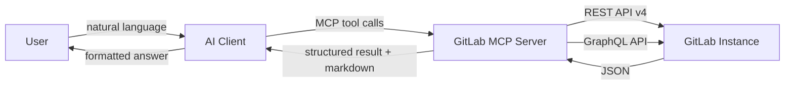
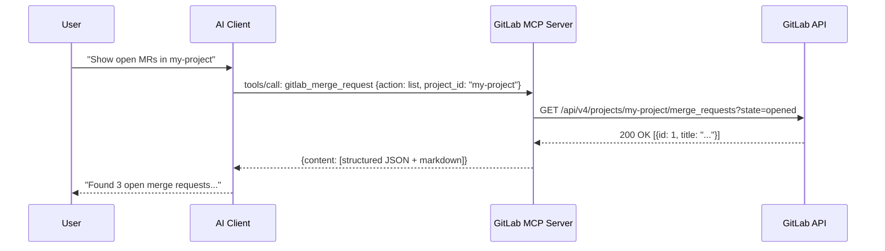
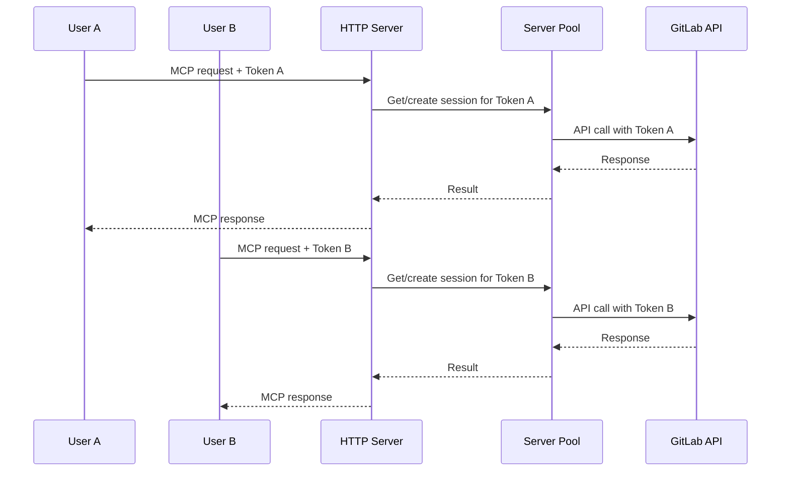
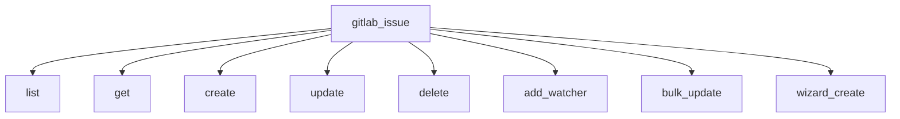

:::note[Developer Documentation]
For the complete technical reference, see [`docs/architecture.md`](https://github.com/jmrplens/gitlab-mcp-server/blob/main/docs/architecture.md) in the repository.
:::

GitLab MCP Server sits between your AI client and your GitLab instance, translating natural language requests into GitLab API calls via the [Model Context Protocol](https://modelcontextprotocol.io/).

## Overview



The server is a single static binary that:

1. **Receives** MCP tool calls from the AI client (e.g., "list open merge requests")
2. **Translates** them into GitLab REST API v4 or GraphQL requests with proper authentication
3. **Executes** the API calls against your GitLab instance
4. **Returns** results in dual format: structured JSON for the AI to reason about, and formatted Markdown for display to the user

## Transport modes

The server supports two transport modes depending on your deployment needs.

### Stdio mode (default)

The standard mode for single-user setups. The AI client spawns the server as a child process and communicates via stdin/stdout using JSON-RPC.



**Characteristics:**

- One server process per AI client session
- Token configured via environment variable
- Maximum security — token never leaves the local machine
- Zero network exposure

### HTTP mode (multi-user)

For team deployments where a single server instance serves multiple users. Each user authenticates with their own GitLab token.



**Characteristics:**

- Single server process handles multiple users
- Per-token session isolation via LRU pool
- Configurable session limits and timeouts
- Suitable for team/organization deployments

Start HTTP mode with:

```bash
./gitlab-mcp-server --http --http-addr=0.0.0.0:8080 --gitlab-url=https://gitlab.example.com
```

See [HTTP Server Mode](/en/guides/http-mode/) for detailed configuration.

## Tool architecture

### Meta-tool mode (default)

With `META_TOOLS=true` (default), the server exposes **42 domain-level meta-tools** instead of 1000+ individual tools. Each meta-tool groups related operations:



The AI sends an `action` parameter to select the operation:

```json
{
	"tool": "gitlab_issue",
	"arguments": {
		"action": "create",
		"project_id": "my-org/backend",
		"title": "Fix N+1 query in /users",
		"labels": "bug,performance"
	}
}
```

This reduces token usage and improves AI tool selection accuracy compared to exposing each operation as a separate tool.

### Individual tool mode

With `META_TOOLS=false`, all 1000+ individual tools are exposed (e.g., `gitlab_list_issues`, `gitlab_create_issue`). This may be useful for testing but is not recommended for production.

## Optional components

The server includes several optional capabilities that can be enabled or disabled:

### Analysis tools (MCP sampling)

11 AI-powered analysis tools that use MCP sampling to invoke the AI model for reasoning:

- **Pipeline failure diagnosis** — analyzes failed jobs and suggests fixes
- **MR security review** — checks merge request changes for security issues
- **Technical debt detection** — identifies code quality concerns
- **Milestone reports** — generates progress summaries
- **Deployment history analysis** — reviews deployment patterns

These require the AI client to support MCP sampling capability.

### Elicitation (interactive wizards)

Interactive creation flows that collect user input step-by-step:

- **Project creation wizard** — guided project setup
- **Issue creation wizard** — structured issue filing
- **Merge request wizard** — assisted MR creation

Requires the AI client to support MCP elicitation capability.

### Resources

24 read-only MCP resources that provide contextual data:

- Server configuration and version
- Current user profile
- Project information templates
- GitLab instance capabilities

### Prompts

38 pre-built prompt templates for common workflows:

- Project health reports
- Cross-project analysis
- Team activity summaries
- Release note generation
- Audit and compliance reports

## Tool output format

Every tool returns a dual-format response:

```json
{
	"structuredContent": {
		"type": "gitlab_issue",
		"data": { "id": 42, "title": "Fix N+1 query", "state": "opened" },
		"next_steps": ["View issue details", "Add labels", "Assign to user"]
	},
	"content": [
		{
			"type": "text",
			"text": "## Issue #42: Fix N+1 query\n\n**State:** opened\n**Author:** @alice\n..."
		}
	]
}
```

- **`structuredContent`** — Typed JSON for the AI to parse and reason about, includes `next_steps` hints
- **`content`** — Formatted Markdown for human display

This dual format ensures the AI can make follow-up decisions while presenting clean output to the user.

## Security model

- **No server-side token storage** — In stdio mode, the token exists only in the process environment
- **Per-session isolation** — In HTTP mode, each user's session is isolated in the server pool
- **Read-only mode** — Disable all writes with `GITLAB_READ_ONLY=true`
- **TLS by default** — All GitLab API calls use HTTPS (with opt-in skip for self-signed certs)
- **No data persistence** — The server is stateless; no data is stored between requests
