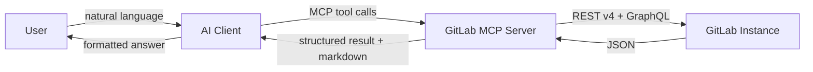
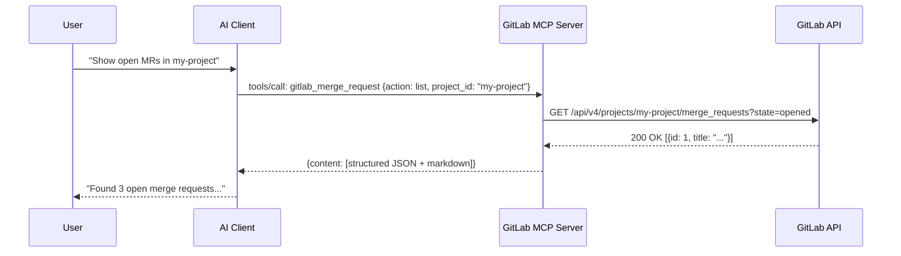
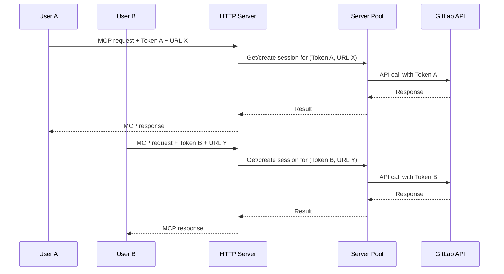
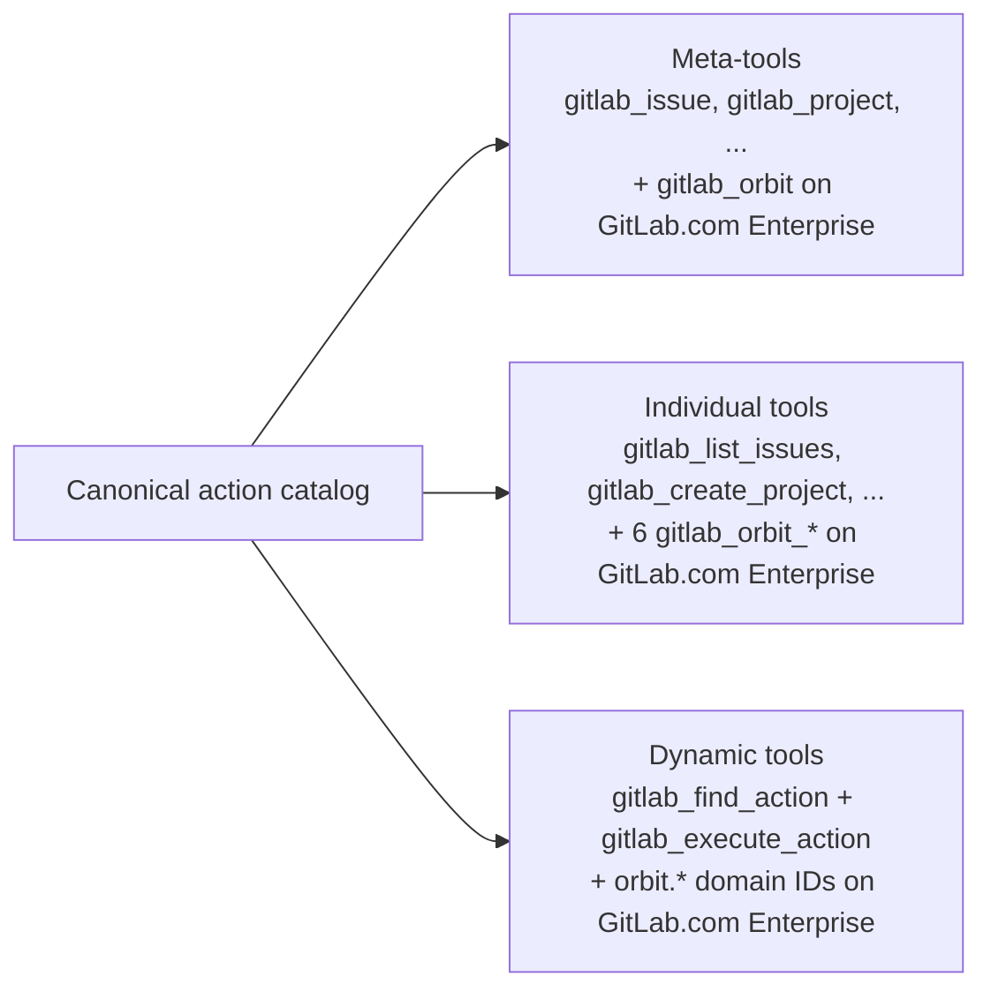
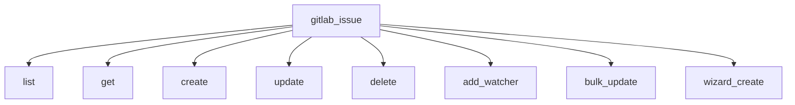
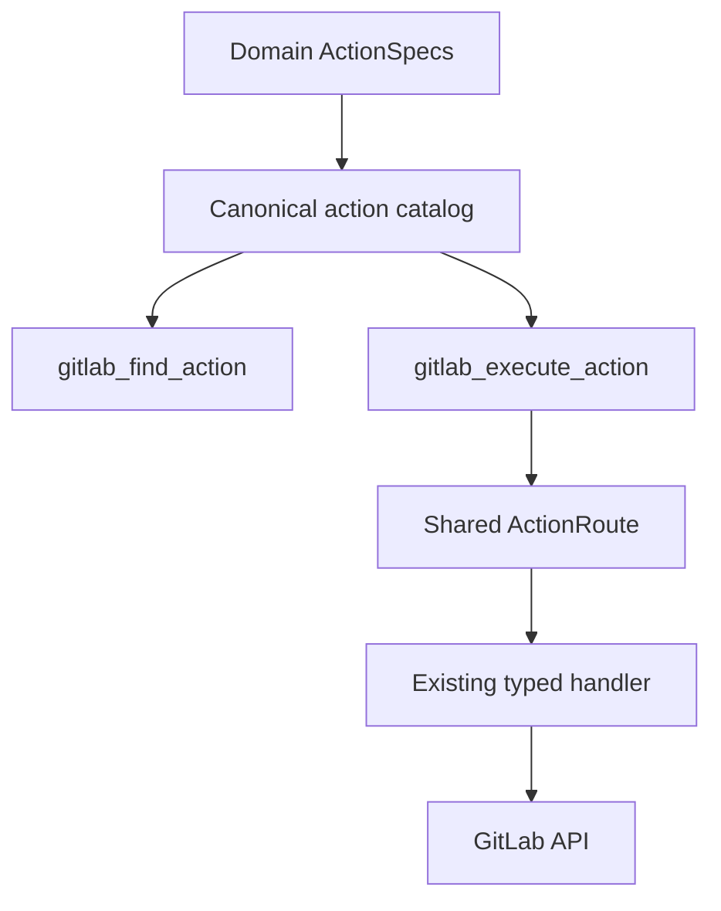

import stats from "../../data/stats.json";

:::note[Developer Documentation]
For the complete technical reference, see [`docs/architecture.md`](https://github.com/jmrplens/gitlab-mcp-server/blob/main/docs/concepts/architecture.md) in the repository.
:::

GitLab MCP Server sits between your AI client and your GitLab instance, translating natural language requests into GitLab API calls via the [Model Context Protocol](https://modelcontextprotocol.io/).

## Overview


```mermaid
graph LR
    U[User] -->|natural language| AI[AI Client]
    AI -->|MCP tool calls| S[GitLab MCP Server]
    S -->|REST v4 + GraphQL| G[GitLab Instance]
    G -->|JSON| S
    S -->|structured result + markdown| AI
    AI -->|formatted answer| U
```

The server is a single static binary that:

1. **Receives** MCP tool calls from the AI client (e.g., "list open merge requests")
2. **Translates** them into GitLab REST API v4 or GraphQL requests with proper authentication
3. **Executes** the API calls against your GitLab instance
4. **Returns** results in dual format: structured JSON for the AI to reason about, and formatted Markdown for display to the user

## Transport modes

GitLab MCP Server supports two transport modes — stdio and HTTP — and you pick between them based on whether one user or many share the server. Stdio is the default for a single user on a local machine; HTTP serves a whole team from one process with per-user session isolation.

### Stdio mode (default)

The standard mode for single-user setups. The AI client spawns the server as a child process and communicates via stdin/stdout using JSON-RPC.


```mermaid
sequenceDiagram
    participant User
    participant AI as AI Client
    participant MCP as GitLab MCP Server
    participant GL as GitLab API

    User->>AI: "Show open MRs in my-project"
    AI->>MCP: tools/call: gitlab_merge_request {action: list, project_id: "my-project"}
    MCP->>GL: GET /api/v4/projects/my-project/merge_requests?state=opened
    GL-->>MCP: 200 OK [{id: 1, title: "..."}]
    MCP-->>AI: {content: [structured JSON + markdown]}
    AI-->>User: "Found 3 open merge requests..."
```

**Characteristics:**

- One server process per AI client session
- Token configured via environment variable
- Maximum security — token never leaves the local machine
- Zero network exposure

### HTTP mode (multi-user)

For team deployments where a single server instance serves multiple users. Each user authenticates with their own GitLab token.


```mermaid
sequenceDiagram
    participant U1 as User A
    participant U2 as User B
    participant S as HTTP Server
    participant P as Server Pool
    participant GL as GitLab API

    U1->>S: MCP request + Token A + URL X
    S->>P: Get/create session for (Token A, URL X)
    P->>GL: API call with Token A
    GL-->>P: Response
    P-->>S: Result
    S-->>U1: MCP response

    U2->>S: MCP request + Token B + URL Y
    S->>P: Get/create session for (Token B, URL Y)
    P->>GL: API call with Token B
    GL-->>P: Response
    P-->>S: Result
    S-->>U2: MCP response
```

**Characteristics:**

- Single server process handles multiple users
- Per-token+URL session isolation via LRU pool
- Configurable session limits and timeouts
- Suitable for team/organization deployments

Start HTTP mode with:

```bash
./gitlab-mcp-server --http --http-addr=0.0.0.0:8080 --gitlab-url=https://gitlab.com
# Or without --gitlab-url (clients send GITLAB-URL header per-request)
./gitlab-mcp-server --http --http-addr=0.0.0.0:8080
```

See [HTTP Server Mode](/gitlab-mcp-server/operations/http-server/) for detailed configuration.

## Tool architecture

GitLab MCP Server defines every GitLab operation once and presents it through three interchangeable tool surfaces. A single canonical action catalog is the source of truth, and meta-tools, individual tools, and the dynamic find/execute tools are all projections of it — so behavior and safety stay identical no matter which surface a client uses.

### Canonical action catalog

Every ordinary GitLab operation is defined once in the canonical action catalog. The visible tool surfaces are projections of that catalog:

- **Meta-tools** group related actions behind domain tools such as `gitlab_issue`.
- **Individual tools** project one visible MCP tool per action for compatibility and testing.
- **Dynamic tools** find and execute the same catalog entries with a much smaller visible tool list.

Because all surfaces share the same catalog entry, schemas, read-only filtering, destructive-action confirmations, safe-mode previews, scope filtering, Markdown formatting, and JSON output stay consistent across modes.

### Tier-gating

Catalog entries are also tier-aware: each action and input/output schema is tagged with the lowest GitLab edition (`free`, `premium`, or `ultimate`) that exposes it. At startup the server resolves the active tier (`GITLAB_TIER` / `--tier`, or auto-detection via `GET /license`) and calls `pruneSchemaFieldsByTier` (in `internal/tools/action_catalog.go`) to drop premium/ultimate-only actions and to prune per-field schema entries that are gated by edition. This keeps meta-tools, individual tools, and the dynamic surface consistent: a Premium-only action is hidden everywhere once the tier resolves to `free`.


```mermaid
graph LR
    catalog[Canonical action catalog] --> meta["Meta-tools<br/>gitlab_issue, gitlab_project, ...<br/>+ gitlab_orbit on GitLab.com Enterprise"]
    catalog --> individual["Individual tools<br/>gitlab_list_issues, gitlab_create_project, ...<br/>+ 6 gitlab_orbit_* on GitLab.com Enterprise"]
    catalog --> dynamic["Dynamic tools<br/>gitlab_find_action + gitlab_execute_action<br/>+ orbit.* domain IDs on GitLab.com Enterprise"]
```

Orbit is projected through the same catalog as every other domain: in meta mode it appears as the `gitlab_orbit` meta-tool with six actions; in individual mode it appears as six `gitlab_orbit_*` tools; in dynamic mode its actions are discoverable as `orbit.status`, `orbit.schema`, `orbit.tools`, `orbit.dsl`, `orbit.query`, and `orbit.graph_status` through `gitlab_find_action`/`gitlab_execute_action`.

### Meta-tool mode

With `TOOL_SURFACE=meta`, the server exposes a baseline of **{stats.meta.base} domain-level meta-tools** instead of the individual catalog. Self-managed Enterprise/Premium environments add Enterprise/Premium tools for {stats.meta.self_managed_enterprise} total, and GitLab.com Enterprise/Premium with Orbit (GitLab.com's Knowledge Graph feature) adds one more tool for {stats.meta.gitlab_com} total. Each meta-tool groups related operations:


```mermaid
graph TD
    A[gitlab_issue] --> B[list]
    A --> C[get]
    A --> D[create]
    A --> E[update]
    A --> F[delete]
    A --> G[add_watcher]
    A --> H[bulk_update]
    A --> I[wizard_create]
```

The AI sends an `action` parameter to select the operation:

```json
{
	"tool": "gitlab_issue",
	"arguments": {
		"action": "create",
		"project_id": "my-org/backend",
		"title": "Fix N+1 query in /users",
		"labels": "bug,performance"
	}
}
```

This reduces token usage and improves AI tool selection accuracy compared to exposing each operation as a separate tool.

### Individual tool mode

With `TOOL_SURFACE=individual`, all individual tools are exposed (e.g., `gitlab_list_issues`, `gitlab_create_issue`): {stats.tools.ultimate_self_managed} on self-managed Enterprise/Premium, or {stats.tools.gitlab_com} on GitLab.com Enterprise/Premium with Orbit. This may be useful for testing but is not recommended for production.

### Dynamic toolset

With `TOOL_SURFACE=dynamic`, the server exposes only `gitlab_find_action` and `gitlab_execute_action`. The same canonical action catalog remains available and is shared with meta-tools, so dynamic mode changes discovery rather than GitLab behavior.


```mermaid
flowchart TD
    specs[Domain ActionSpecs] --> catalog[Canonical action catalog]
    catalog --> find[gitlab_find_action]
    catalog --> execute[gitlab_execute_action]
    execute --> route[Shared ActionRoute]
    route --> handler[Existing typed handler]
    handler --> gitlab[GitLab API]
```

Dynamic mode is the default low-token surface and is documented in [Dynamic toolset](/gitlab-mcp-server/tools/dynamic-tools/). Meta-tools remain available with `TOOL_SURFACE=meta`.

## Optional components

The server includes several optional capabilities that can be enabled or disabled:

### Elicitation (interactive wizards)

Interactive creation flows that collect user input step-by-step:

- **Project creation wizard** — guided project setup
- **Issue creation wizard** — structured issue filing
- **Merge request wizard** — assisted MR creation

Requires the AI client to support MCP elicitation capability.

### Resources

{stats.resources} read-only MCP resources that provide contextual data:

- Server configuration and version
- Current user profile
- Project information templates
- GitLab instance capabilities

### Prompts

{stats.prompts} pre-built prompt templates for common workflows:

- Project health reports
- Cross-project analysis
- Team activity summaries
- Release note generation
- Git workflow quality checks
- Audit and compliance reports

## Tool output format

Successful tool calls return a dual-format response:

```json
{
	"structuredContent": {
		"type": "gitlab_issue",
		"data": { "id": 42, "title": "Fix N+1 query", "state": "opened" },
		"next_steps": ["View issue details", "Add labels", "Assign to user"]
	},
	"content": [
		{
			"type": "text",
			"text": "## Issue #42: Fix N+1 query\n\n**State:** opened\n**Author:** @alice\n..."
		}
	]
}
```

- **`structuredContent`** — Typed JSON for the AI to parse and reason about, includes `next_steps` hints, and conforms to the tool's declared output schema when one is present
- **`content`** — Formatted Markdown for human display

This dual format ensures the AI can make follow-up decisions while presenting clean output to the user. Tool execution errors set `isError: true` and can return only Markdown content so clients do not treat the error as a successful structured result.

## Security model

- **No server-side token storage** — In stdio mode, the token exists only in the process environment
- **Per-session isolation** — In HTTP mode, each user's session is isolated in the server pool
- **Read-only mode** — Disable all writes with `GITLAB_READ_ONLY=true`
- **TLS by default** — All GitLab API calls use HTTPS (with opt-in skip for self-signed certs)
- **No data persistence** — The server is stateless; no data is stored between requests

## Frequently asked questions

### What does GitLab MCP Server do?

GitLab MCP Server is a single static binary that sits between an AI client and a GitLab instance. It receives MCP tool calls, translates them into authenticated GitLab REST API v4 or GraphQL requests, executes them, and returns a dual-format response: structured JSON for the AI to reason about and formatted Markdown for the user. The server adds no GitLab features of its own — it exposes existing GitLab operations as MCP tools through the [Model Context Protocol](https://modelcontextprotocol.io/).

### What is the difference between stdio and HTTP transport modes?

Stdio mode is the default for single-user setups: the AI client spawns the server as a child process and communicates over stdin/stdout using JSON-RPC, with the token supplied as an environment variable that never leaves the local machine. HTTP mode serves multiple users from one process, isolating each user's session by token and URL in an LRU pool with configurable session limits and timeouts. Both modes expose the same tools and call the same GitLab APIs; they differ only in how the AI client connects.

### What is the canonical action catalog?

The canonical action catalog is the single internal definition of every ordinary GitLab operation. All three visible tool surfaces — meta-tools, individual tools, and the dynamic find/execute tools — are projections of this catalog, so they share identical schemas, read-only filtering, destructive-action confirmations, safe-mode previews, scope filtering, and Markdown formatting. Catalog entries are tier-aware: each action is tagged with the lowest GitLab edition (`free`, `premium`, or `ultimate`) that exposes it, and premium or ultimate-only actions are pruned when the resolved tier is lower.

### How does GitLab MCP Server keep my GitLab token secure?

GitLab MCP Server never stores tokens server-side. In stdio mode the token exists only in the process environment and never leaves the local machine. In HTTP mode each user's session is isolated in the server pool by token and URL. All GitLab API calls use HTTPS by default, with opt-in skipping for self-signed certificates, and the server is stateless — no data is persisted between requests. Read-only mode (`GITLAB_READ_ONLY=true`) disables every mutating operation.

## External references

- [Model Context Protocol specification](https://modelcontextprotocol.io/) — the protocol the server speaks to AI clients
- [JSON-RPC 2.0 specification](https://www.jsonrpc.org/specification) — the wire format used over stdio and HTTP
- [GitLab REST API v4](https://docs.gitlab.com/api/rest/) and [GraphQL API](https://docs.gitlab.com/api/graphql/) — the GitLab API surfaces the server translates tool calls into
