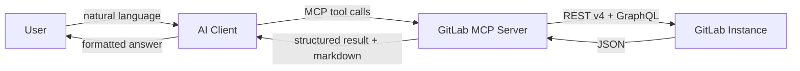
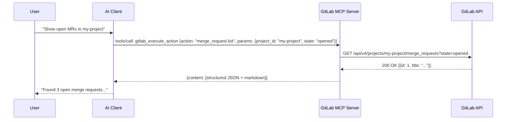
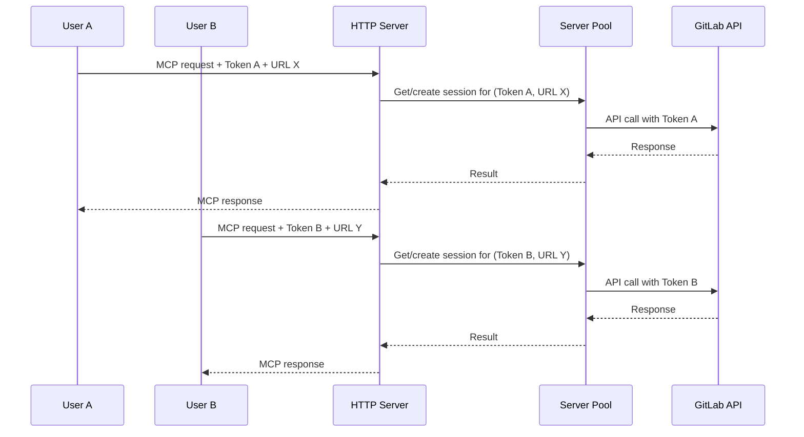
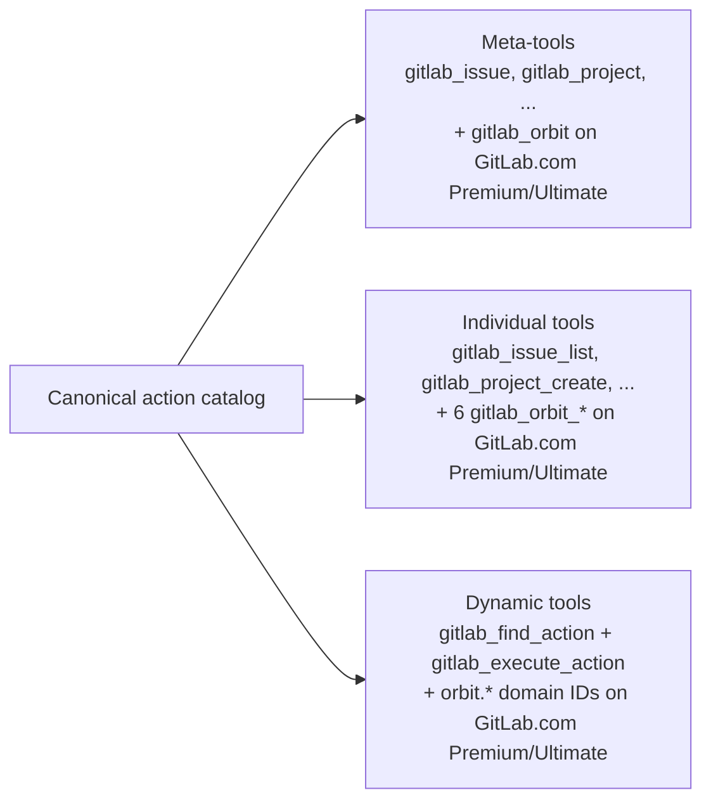
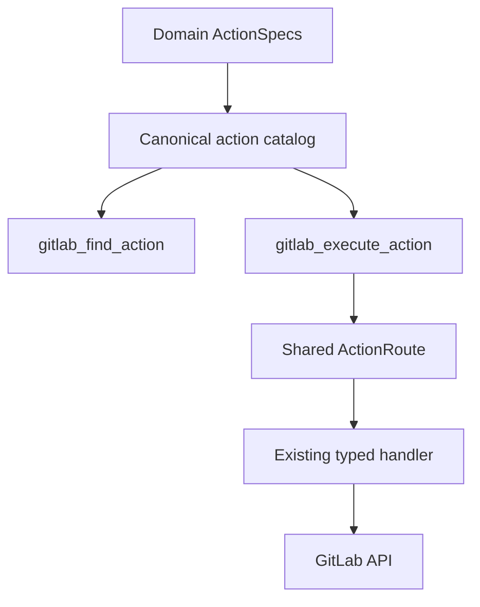
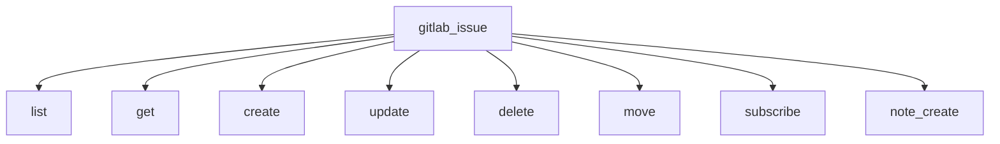

import stats from "../../data/stats.json";
import FAQ from "../../components/FAQ.astro";
import footprint from "../../data/token-footprint.json";

GitLab MCP Server sits between your AI client and your GitLab instance, translating natural language requests into GitLab API calls via the [Model Context Protocol](https://modelcontextprotocol.io/).

## Overview


```mermaid
graph LR
    U[User] -->|natural language| AI[AI Client]
    AI -->|MCP tool calls| S[GitLab MCP Server]
    S -->|REST v4 + GraphQL| G[GitLab Instance]
    G -->|JSON| S
    S -->|structured result + markdown| AI
    AI -->|formatted answer| U
```

The server is a single static binary that:

1. **Receives** MCP tool calls from the AI client (e.g., "list open merge requests")
2. **Translates** them into GitLab REST API v4 or GraphQL requests with proper authentication: REST for most actions, and [GraphQL](#graphql) where GitLab has deprecated the REST API, offers none, or answers the question only there
3. **Executes** the API calls against your GitLab instance
4. **Returns** each result in two forms: structured JSON that matches the tool's output schema, and Markdown written for the model to read and relay to you

## Transport modes

GitLab MCP Server supports two transport modes, stdio and HTTP, and you pick between them based on whether one user or many share the server. Stdio is the default for a single user on a local machine; HTTP serves a whole team from one process, with each credential isolated in its own pool entry. The [CLI reference](/gitlab-mcp-server/reference/cli/) lists which flags each transport reads, and the [environment variable reference](/gitlab-mcp-server/reference/environment/) does the same for the variables.

### Stdio mode (default)

The standard mode for single-user setups. The AI client spawns the server as a child process and communicates via stdin/stdout using JSON-RPC.


```mermaid
sequenceDiagram
    participant User
    participant AI as AI Client
    participant MCP as GitLab MCP Server
    participant GL as GitLab API

    User->>AI: "Show open MRs in my-project"
    AI->>MCP: tools/call: gitlab_execute_action {action: "merge_request.list", params: {project_id: "my-project", state: "opened"}}
    MCP->>GL: GET /api/v4/projects/my-project/merge_requests?state=opened
    GL-->>MCP: 200 OK [{id: 1, title: "..."}]
    MCP-->>AI: {content: [structured JSON + markdown]}
    AI-->>User: "Found 3 open merge requests..."
```

The call above is the default dynamic surface; with `GITLAB_MCP_TOOL_SURFACE=meta` the same request is `gitlab_merge_request` with `{action: "list", params: {...}}`.

**Characteristics:**

- One server process per AI client session
- Token configured via environment variable, carrying `read_api` at least, or `api` to write ([Token scopes](/gitlab-mcp-server/operations/security/#token-scopes))
- Maximum security: the token never leaves the local machine
- Zero network exposure

#### What happens at startup

A stdio client writes `initialize` the moment it has started the process, so the server answers the handshake first and builds its catalog behind it:

1. It loads its configuration and starts reading stdin. `initialize` and `ping` are answered at once, and notifications pass straight through.
2. Meanwhile it asks GitLab for its version, reads what the token is (its scopes, and whether it is a fine-grained token), resolves the user and the tier, and registers the catalog of the active surface.
3. Until registration has finished, every request that needs the catalog (`tools/list`, `tools/call`, the resource and prompt methods, `completion/complete`) waits behind a readiness gate rather than being answered from an empty catalog. A request that ends while it waits is answered with JSON-RPC `-32000` and a message to retry it.

Two starts end differently. A token GitLab accepts that carries neither `read_api` nor `api` reaches no tool: the process keeps answering the handshake and refuses every catalog request with JSON-RPC `-40300`, whose message says to restart the server with a token that has `read_api`, or `api` to write. A GitLab that cannot be reached at startup does not stop the server: it logs a warning, starts in degraded mode and connects again when a call needs GitLab.

### HTTP mode (multi-user)

For team deployments where a single server instance serves multiple users. Each user authenticates with their own GitLab token.


```mermaid
sequenceDiagram
    participant U1 as User A
    participant U2 as User B
    participant S as HTTP Server
    participant P as Server Pool
    participant GL as GitLab API

    U1->>S: MCP request + Token A + URL X
    S->>P: Get/create session for (Token A, URL X)
    P->>GL: API call with Token A
    GL-->>P: Response
    P-->>S: Result
    S-->>U1: MCP response

    U2->>S: MCP request + Token B + URL Y
    S->>P: Get/create session for (Token B, URL Y)
    P->>GL: API call with Token B
    GL-->>P: Response
    P-->>S: Result
    S-->>U2: MCP response
```

**Characteristics:**

- Single server process handles multiple users
- Per-token+URL session isolation via LRU pool
- Configurable session limits and timeouts
- Suitable for team/organization deployments
- The first credential of each configuration builds that configuration's server behind the same readiness gate, so a request arriving meanwhile waits for the catalog ([Session lifecycle](/gitlab-mcp-server/operations/http-server/#session-lifecycle))

Start HTTP mode with:

```bash
./gitlab-mcp-server --http --http-addr=0.0.0.0:8080 --gitlab-url=https://gitlab.com
# Or, for a single-user local deployment only, let each request name its own
# instance in the GITLAB-URL header (the server refuses to start with neither flag)
./gitlab-mcp-server --http --http-addr=127.0.0.1:8080 --allow-any-gitlab-url
```

`--gitlab-url` is required in HTTP mode unless `--allow-any-gitlab-url` is passed. It can be repeated to publish several instances, in which case the `GITLAB-URL` header selects among them and is required.

See [HTTP Server Mode](/gitlab-mcp-server/operations/http-server/) for detailed configuration.

## Tool architecture

GitLab MCP Server defines every GitLab operation once and presents it through three interchangeable tool surfaces. A single canonical action catalog is the source of truth, and meta-tools, individual tools, and the dynamic find/execute tools are all projections of it — so behavior and safety stay identical no matter which surface a client uses.

### Canonical action catalog

Every ordinary GitLab operation is defined once in the canonical action catalog. The visible tool surfaces are projections of that catalog:

- **Dynamic tools** (the default) find and execute the catalog entries by `domain.action` ID through two visible tools.
- **Meta-tools** (`GITLAB_MCP_TOOL_SURFACE=meta`) group related actions behind domain tools such as `gitlab_issue`.
- **Individual tools** (`GITLAB_MCP_TOOL_SURFACE=individual`) project one visible MCP tool per action for compatibility and testing.

Because all surfaces share the same catalog entry, schemas, the destructive classification, read-only and scope filtering, safe mode, Markdown formatting, and JSON output stay consistent across modes. How a destructive call is confirmed is the one thing that differs, as [Destructive actions](#destructive-actions) explains.

### Tier-gating

Catalog entries are also tier-aware: each action and input/output schema is tagged with the lowest GitLab edition (`free`, `premium`, or `ultimate`) that exposes it. When a server is built (at startup in stdio mode, per token+URL pool entry in HTTP mode) the tier is resolved (`GITLAB_MCP_TIER` / `--tier`, or auto-detection via the instance license (`GET /license`) and then the namespace plans (`GET /namespaces`), falling back to `free`), the catalog filter drops premium/ultimate-only actions above it, and the input schema fields above it are removed, while output schemas are pruned leniently so data a response carries still reaches the client. This keeps meta-tools, individual tools, and the dynamic surface consistent: a Premium-only action is hidden everywhere once the tier resolves to `free`.


```mermaid
graph LR
    catalog[Canonical action catalog] --> meta["Meta-tools<br/>gitlab_issue, gitlab_project, ...<br/>+ gitlab_orbit on GitLab.com Premium/Ultimate"]
    catalog --> individual["Individual tools<br/>gitlab_issue_list, gitlab_project_create, ...<br/>+ 6 gitlab_orbit_* on GitLab.com Premium/Ultimate"]
    catalog --> dynamic["Dynamic tools<br/>gitlab_find_action + gitlab_execute_action<br/>+ orbit.* domain IDs on GitLab.com Premium/Ultimate"]
```

Orbit is projected through the same catalog as every other domain, gated to a `https://gitlab.com` connection on the Premium or Ultimate tier: in meta mode it appears as the `gitlab_orbit` meta-tool with six actions; in individual mode it appears as six `gitlab_orbit_*` tools; in dynamic mode its actions are discoverable as `orbit.status`, `orbit.schema`, `orbit.tools`, `orbit.dsl`, `orbit.query`, and `orbit.graph_status` through `gitlab_find_action`/`gitlab_execute_action`.

### Dynamic toolset (default)

By default (`GITLAB_MCP_TOOL_SURFACE` unset, or `GITLAB_MCP_TOOL_SURFACE=dynamic` to make it explicit), the server exposes only `gitlab_find_action` and `gitlab_execute_action`. The same canonical action catalog remains available and is shared with meta-tools, so dynamic mode changes discovery rather than GitLab behavior.


```mermaid
flowchart TD
    specs[Domain ActionSpecs] --> catalog[Canonical action catalog]
    catalog --> find[gitlab_find_action]
    catalog --> execute[gitlab_execute_action]
    execute --> route[Shared ActionRoute]
    route --> handler[Existing typed handler]
    handler --> gitlab[GitLab API]
```

At startup the server builds the catalog and then adds the standalone actions, which belong to no GitLab domain: `discover_project.resolve`, which maps a git remote URL to its GitLab project, and the four guided flows `interactive.issue_create`, `interactive.mr_create`, `interactive.project_create` and `interactive.release_create`. On the meta and individual surfaces the same actions are the standalone tools `gitlab_discover_project` and `gitlab_interactive_*`. Read-only mode leaves the guided flows out, since each of them creates something.

Dynamic mode is the default low-token surface and is documented in [Dynamic toolset](/gitlab-mcp-server/tools/dynamic-tools/). Meta-tools remain available with `GITLAB_MCP_TOOL_SURFACE=meta`.

### Meta-tool mode

With `GITLAB_MCP_TOOL_SURFACE=meta`, the server exposes a baseline of **{stats.meta.base} meta-tools** instead of the individual catalog: 29 catalog-backed tools (28 GitLab domain dispatchers plus `gitlab_server`), `gitlab_discover_project`, and the four interactive creation flows. The Premium tier adds 6 meta-tools for {stats.meta.premium} total, Ultimate 11 more for {stats.meta.self_managed_enterprise} total on a self-managed instance, and GitLab.com adds `gitlab_orbit` (GitLab.com's Knowledge Graph feature) on Premium and Ultimate alike, for {stats.meta.gitlab_com} total on GitLab.com Ultimate. Each meta-tool groups related operations:


```mermaid
graph TD
    A[gitlab_issue] --> B[list]
    A --> C[get]
    A --> D[create]
    A --> E[update]
    A --> F[delete]
    A --> G[move]
    A --> H[subscribe]
    A --> I[note_create]
```

The AI sends an `action` parameter to select the operation and nests the operation's own parameters under `params` (meta-tools accept only those two top-level keys):

```json
{
  "tool": "gitlab_issue",
  "arguments": {
    "action": "create",
    "params": {
      "project_id": "my-org/backend",
      "title": "Fix N+1 query in /users",
      "labels": ["bug", "performance"]
    }
  }
}
```

This reduces token usage and improves AI tool selection accuracy compared to exposing each operation as a separate tool.

### Individual tool mode

With `GITLAB_MCP_TOOL_SURFACE=individual`, all individual tools are exposed (e.g., `gitlab_issue_list`, `gitlab_issue_create`): {stats.tools.ultimate_self_managed} on self-managed Ultimate, or {stats.tools.gitlab_com} on GitLab.com Ultimate with Orbit. This may be useful for testing but is not recommended for production.

## Behavior every surface shares

Because every surface dispatches to the same catalog entry, the rules below hold whichever surface a client uses, with the one difference the first subsection names.

### Destructive actions

Each action in the catalog is classified destructive or not, once, and every surface reads that classification. On the meta and individual surfaces a destructive call is checked in this order:

1. `GITLAB_MCP_YOLO_MODE` is truthy (`1`, `true` or `yes`), or, when it is unset, `AUTOPILOT` is: the call proceeds without asking.
2. The call carries `confirm: true` with the action's parameters (inside `params` on a meta-tool): the call proceeds.
3. The client supports elicitation: the user is asked, and the call proceeds only if they approve.
4. None of these holds: the call fails closed, nothing reaches GitLab, and the answer asks for the call to be sent again with `confirm: true` only after the user approves.

For an action classified destructive, the default dynamic surface asks no question and reads neither variable: `gitlab_execute_action` refuses it unless the call carries top-level `confirm: true`. A user who declines a prompt gets an answer telling the model not to retry and to ask what they want instead. [Destructive actions](/gitlab-mcp-server/operations/security/#destructive-actions) covers which actions are destructive, and the two whose arguments decide, which follow the order above on every surface.

### Pagination

A list action takes `page` (from 1) and `per_page` (20 by default, 100 at most), and its answer carries a `pagination` object:

| Field         | Meaning                                                                          |
| ------------- | -------------------------------------------------------------------------------- |
| `page`        | The page returned                                                                |
| `per_page`    | How many items a page holds                                                      |
| `total_items` | How many items the whole list holds, `0` when GitLab sends no total              |
| `total_pages` | How many pages the whole list has, `0` when GitLab sends no total                |
| `next_page`   | The page to ask for next, `0` on the last page                                   |
| `prev_page`   | The page before this one, `0` on the first page                                  |
| `has_more`    | `true` while a next page exists, so a model can decide without comparing numbers |

Search is the exception: GitLab's search API sends no totals, so there they are inferred from the page that arrived and describe what has arrived, not the whole list ([Output Format](/gitlab-mcp-server/reference/output-format/#the-structured-json)). A list read over GraphQL pages by cursor instead, where it pages at all ([Paging a GraphQL list](#paging-a-graphql-list)).

Collection resources work differently, because MCP gives `resources/read` no way to ask for more. A collection resource such as `gitlab://groups` returns one page of up to 100 items and says whether that is everything in `_meta`, under the key `io.github.jmrplens/pageInfo`: `returned`, `total` (left out when GitLab did not send it) and `complete`. When `complete` is `false`, use the matching list action, which pages.

### Rate limits

HTTP mode limits each credential, one token and GitLab URL pair, to 10 requests a second with 40 in hand by default; stdio leaves the limit off unless `GITLAB_MCP_RATE_LIMIT_RPS` is set. One setting feeds three buckets per credential:

- `tools/call`, `resources/read`, `resources/subscribe`, `subscriptions/listen` and `prompts/get` share the configured bucket, since each is a request to GitLab.
- `completion/complete` has a bucket of its own with ten times the rate and the burst, because an editor asks for completions as you type. A refused completion comes back empty rather than as an error.
- `tools/list` has a bucket of its own, refilled a tenth as fast with the same burst, because a listing reaches no GitLab but spends the processor every caller of the process shares. Before it, a listing is charged to a bucket the whole process shares, counted in tools listed: 3000 a second and 48000 in hand.

`initialize`, `ping`, `resources/list` and `prompts/list` are not limited. [Rate limiting tool invocations](/gitlab-mcp-server/operations/security/#rate-limiting-tool-invocations) describes the refusals and recommended values.

### Logging

The server writes its log as JSON lines to stderr, so on stdio stdout carries nothing but JSON-RPC. `GITLAB_MCP_LOG_LEVEL` (or `--log-level`) sets the level: `debug`, `info` (the default), `warn` or `error`, and a value it does not recognize means `info`. [Debug mode](/gitlab-mcp-server/operations/troubleshooting/#debug-mode) lists what `debug` adds, and [Telemetry](/gitlab-mcp-server/operations/telemetry/) can also export the log to an OpenTelemetry collector. Both settings are in the [CLI reference](/gitlab-mcp-server/reference/cli/) and the [environment variable reference](/gitlab-mcp-server/reference/environment/).

## GraphQL

Most actions call the GitLab REST API v4 through `client-go`, GitLab's own Go client. A group of domains goes through GraphQL instead, for one of three reasons: GitLab has deprecated the REST API, GitLab offers no REST API at all, or the question can only be answered in GraphQL. [ADR-0006](https://github.com/jmrplens/gitlab-mcp-server/blob/main/docs/development/adr/adr-0006-raw-graphql-for-uncovered-domains.md) and [ADR-0009](https://github.com/jmrplens/gitlab-mcp-server/blob/main/docs/development/adr/adr-0009-progressive-graphql-migration.md) record the decision.

### Which domains use GraphQL

| Domain                                            | Actions                                                                                                                                         | Why GraphQL                                                                                                                                                                                                                                                           |
| ------------------------------------------------- | ----------------------------------------------------------------------------------------------------------------------------------------------- | --------------------------------------------------------------------------------------------------------------------------------------------------------------------------------------------------------------------------------------------------------------------- |
| Epics                                             | `group.epic_get`, `group.epic_create`, `group.epic_update`, `group.epic_delete`, and the epic note, discussion and issue actions                | GitLab deprecated the REST epics API in 17.0 and plans to remove it in v5 of the API, since epics are work items now. `group.epic_list` still reads the REST endpoint and moves to work items for a filter only they accept, and `group.epic_get_links` stays on REST |
| Work items                                        | `issue.work_item_list` and the other work item actions                                                                                          | They go through client-go's work item service, which is built on GraphQL                                                                                                                                                                                              |
| Work item saved views                             | `issue.work_item_saved_view_list` and the other saved view actions                                                                              | GraphQL only, and GitLab marks the API experimental                                                                                                                                                                                                                   |
| Achievements                                      | `achievement.list` and the other achievement actions                                                                                            | GraphQL only                                                                                                                                                                                                                                                          |
| Vulnerabilities                                   | `vulnerability.list`, `vulnerability.get`, `vulnerability.severity_count`, `vulnerability.pipeline_security_summary` and the four state changes | GitLab is deprecating the REST vulnerabilities API in favor of GraphQL, which also answers the severity counts and pipeline summaries REST has no route for                                                                                                           |
| Security findings                                 | `security_finding.list`                                                                                                                         | GitLab is deprecating the REST vulnerability findings API, and `Pipeline.securityReportFindings` replaces it                                                                                                                                                          |
| Security attributes, categories and scan profiles | `security_attribute.create`, `security_category.create`, `security_scan_profile.attach` and their siblings                                      | GraphQL only                                                                                                                                                                                                                                                          |
| CI/CD Catalog                                     | `ci_catalog.list`, `ci_catalog.get`                                                                                                             | GraphQL only: REST can publish a catalog release and read nothing                                                                                                                                                                                                     |
| Branch rules                                      | `branch.rule_list`                                                                                                                              | GraphQL only: one view of each rule's protection, approval rules and external status checks                                                                                                                                                                           |
| Target branch rules                               | `project.target_branch_rule_list`, `project.target_branch_rule_create`, `project.target_branch_rule_delete`                                     | GraphQL only                                                                                                                                                                                                                                                          |
| Custom emoji                                      | `custom_emoji.list`, `custom_emoji.create`, `custom_emoji.delete`                                                                               | GraphQL only                                                                                                                                                                                                                                                          |
| Terraform states                                  | `admin.terraform_state_list`, `admin.terraform_state_get`                                                                                       | REST serves a state's file, its lock and its versions, but no list of states and no state's details; the other Terraform state actions stay on REST                                                                                                                   |

### Paging a GraphQL list

A list read over GraphQL pages by cursor rather than by page number, where it pages at all: `admin.terraform_state_list`, `project.target_branch_rule_list` and `security_scan_profile.list_project_statuses` take no paging argument and answer what one request returns, which for the Terraform states is at most 100. A list that pages takes `first` (20 by default, 100 at most) and `after`, which is the `end_cursor` of the previous answer. Most of these lists also walk backwards with `last` and `before`, `before` being the previous answer's `start_cursor`, and their answers carry `has_next_page`, `has_previous_page`, `end_cursor` and `start_cursor`. Naming both `first` and `last` is refused, because GitLab refuses the pair.

Three lists walk forwards only, because GitLab refuses `last` and `before` on their connection: `branch.rule_list`, `group.epic_note_list` and `group.epic_discussion_list`. They take only `first` and `after`, and their answers carry only `has_next_page` and `end_cursor`, so a model is never handed a previous page it has no way to ask for.

### Which GitLab releases the documents fit

The GraphQL documents this server sends are checked against a copy of GitLab's schema taken from GitLab.com, which runs the pre-release of the next minor, so that copy is ahead of every self-managed release:

- GitLab refuses a whole document that names a field it does not have, so an action whose document reads a recent field fails as a whole on an older instance rather than answering with less. The vulnerability list, get and four state changes need GitLab 18.10, `security_finding.list` needs 18.5, and the security scan profile actions need 18.7.
- A field added in the pre-release would pass that check and be refused by every released instance, so a weekly job also checks the documents against the latest released GitLab Enterprise Edition image.
- A field GitLab removes leaves GitLab.com first, so a document can stop passing the check while it still works on a self-managed instance.

### Fine-grained tokens over GraphQL

GraphQL judges each object of an answer on its own, so a fine-grained token meets answers REST never gives. An object the grant does not reach comes back `null`, and a list drops the items it does not reach, with no error either way. Where GitLab declares the denied position non-null, the `null` travels up to the nearest position that may be null, so more of the answer disappears than the part the grant missed. A write the grant does not reach is answered with HTTP `200`, a `null` result and one `errors` entry naming the permissions it needs, which the server passes on as the call's error. [What an empty answer can mean](/gitlab-mcp-server/operations/fine-grained-tokens/#what-an-empty-answer-can-mean) explains how the server marks such answers, and [What no fine-grained token can reach](/gitlab-mcp-server/operations/fine-grained-tokens/#what-no-fine-grained-token-can-reach) lists the actions GitLab refuses or empties for every fine-grained token.

## Optional components

The server includes several optional capabilities that can be enabled or disabled:

### Elicitation (interactive wizards)

Interactive creation flows that collect user input step-by-step:

- **Project creation wizard** — guided project setup
- **Issue creation wizard** — structured issue filing
- **Merge request wizard** — assisted MR creation
- **Release creation wizard**: tag, name and notes, then confirmation

Requires the AI client to support MCP elicitation capability.

### Resources

{stats.resources} read-only MCP resources that provide contextual data:

- Current user profile and accessible groups
- Project, group, issue, merge request, pipeline and repository templates
- The surface-aware `gitlab://tools` manifest and per-action schemas
- Static workflow guides (Git workflow, MR hygiene, code review, conventional commits, pipeline troubleshooting)

### Prompts

{stats.prompts} pre-built prompt templates for common workflows:

- Project health reports
- Cross-project analysis
- Team activity summaries
- Release note generation
- Git workflow quality checks
- Audit and compliance reports

### Capabilities

Four MCP capabilities sit beside tools, resources and prompts. Three are declared when a session starts (completions and subscriptions by the server, elicitation by the client), and progress is asked for on each call with a progress token ([Capabilities overview](/gitlab-mcp-server/capabilities/overview/)). Each travels in one direction:

- **Completions**: a request the client sends (`completion/complete`) to autocomplete {stats.completions} argument names, such as projects, branches and users, from live GitLab data.
- **Progress**: a notification either side may send about a request it is answering. This server sends `notifications/progress` while it answers a long tool call, and only logs one a client sends.
- **Elicitation**: a request the server sends the client (`elicitation/create`) to ask the user something, which the guided flows and destructive confirmations use. On protocol 2026-07-28 the question travels inside the tool result instead, and the client answers it by sending the call again.
- **Subscriptions**: the client subscribes to a resource, and the server notifies it when the resource changes, which it learns by polling GitLab (`GITLAB_MCP_CAPABILITY_SURFACE=full` only).

## Tool output format

A successful tool call returns its result in two forms:

```json
{
  "structuredContent": {
    "iid": 42,
    "title": "Fix N+1 query",
    "state": "opened",
    "web_url": "https://gitlab.example.com/my-org/backend/-/issues/42",
    "next_steps": ["View issue details", "Add labels", "Assign to user"]
  },
  "content": [
    {
      "type": "text",
      "text": "## Issue #42: Fix N+1 query\n\n- **State**: opened\n- **Author**: @alice\n..."
    }
  ]
}
```

- **`structuredContent`**: the handler's typed output as JSON (the fields above are a subset of the issue output), conforming to the tool's output schema when it declares one, and, where the action's output type declares them, `next_steps` hints for a client that reads only the JSON.
- **`content`**: Markdown written for the model, annotated with the audience `assistant` and a priority. The model reads it and relays it in its own words; it is not meant to be shown to the user as it is. An image block is the exception, annotated for the `user`.

A result about **one** object is a card, a heading and `- **Label**: value` rows as above, and a list is a table ([`markdown-card.md`](https://github.com/jmrplens/gitlab-mcp-server/blob/main/docs/development/markdown-card.md)). A failed call sets `isError: true` and may carry only Markdown, so a client does not take the error for a structured result. The [output format reference](/gitlab-mcp-server/reference/output-format/) covers the shapes, the annotations and the hints in full.

## Security model

- **No server-side token storage**: in stdio mode, the token exists only in the process environment
- **Per-credential isolation**: in HTTP mode, each credential's GitLab client, rate-limit bucket and watchers live in its own pool entry, while the catalog is shared by every credential of the same configuration
- **Admission at the least scope**: a token needs `read_api` or `api`. A `read_api` token is served the read-only surface, and a token with neither is refused ([Token scopes](/gitlab-mcp-server/operations/security/#token-scopes))
- **Read-only mode**: disable all writes with `GITLAB_MCP_READ_ONLY=true`
- **TLS by default**: all GitLab API calls use HTTPS (with opt-in skip for self-signed certs)
- **No data persistence**: nothing is written to disk; what the server keeps between requests (the pool entries, the cached OAuth identities, the watchers) lives in memory and ends with the process

<FAQ />

## Design decisions

The architecture above is the result of a handful of decisions, most of them recorded as Architectural Decision Records. Each record states the problem, the alternatives that were rejected, and the consequences accepted in exchange: useful when you want to know _why_ the server is shaped this way rather than just how. The rows after the ADRs are decisions you meet directly when you configure a client or a deployment.

| Decision                                                                                                                                                                   | What it settled                                                                                                                | Trade-off accepted                                                                                                                            |
| -------------------------------------------------------------------------------------------------------------------------------------------------------------------------- | ------------------------------------------------------------------------------------------------------------------------------ | --------------------------------------------------------------------------------------------------------------------------------------------- |
| [ADR-0004](https://github.com/jmrplens/gitlab-mcp-server/blob/main/docs/development/adr/adr-0004-modular-tools-subpackages.md): modular sub-packages                       | One Go package per GitLab domain under `internal/tools/`, rather than one large package                                        | More packages to navigate, in exchange for isolated tests and no import cycles                                                                |
| [ADR-0005](https://github.com/jmrplens/gitlab-mcp-server/blob/main/docs/development/adr/adr-0005-meta-tool-consolidation.md): meta-tool consolidation                      | Grouping operations into domain dispatchers that route on an `action` parameter                                                | An extra indirection in the call shape, in exchange for a tool list clients can actually load                                                 |
| [ADR-0011](https://github.com/jmrplens/gitlab-mcp-server/blob/main/docs/development/adr/adr-0011-low-token-dynamic-toolset.md): dynamic toolset                            | Making find/execute the default surface instead of listing every tool                                                          | One discovery call per task, in exchange for a {footprint.individual.ultimate.reduction_factor_vs_dynamic}× smaller tool schema               |
| [ADR-0014](https://github.com/jmrplens/gitlab-mcp-server/blob/main/docs/development/adr/adr-0014-catalog-first-runtime-architecture.md): catalog-first runtime             | Projecting all three surfaces from one canonical action catalog                                                                | A build-time projection step, in exchange for one classification, one set of filters and one formatting across surfaces                       |
| [ADR-0007](https://github.com/jmrplens/gitlab-mcp-server/blob/main/docs/development/adr/adr-0007-rich-error-semantics.md): rich error semantics                            | Returning actionable, classified errors instead of raw API failures                                                            | More error-handling code per tool, in exchange for errors a model can act on                                                                  |
| [ADR-0018](https://github.com/jmrplens/gitlab-mcp-server/blob/main/docs/development/adr/adr-0018-authorization-admits-per-action-gating.md): admission at the least scope  | Admitting a `read_api` token and serving it the read-only surface, so writes are gated per action rather than at the door      | A token whose scopes cannot be read counts as able to write, so a missing scope shows up as GitLab's own `403` on the one call that needed it |
| [ADR-0020](https://github.com/jmrplens/gitlab-mcp-server/blob/main/docs/development/adr/adr-0020-one-server-per-configuration-shape.md): one server per configuration      | In HTTP mode, one MCP server per configuration, with each request's credential bound to it                                     | A binding on every request and notifications filtered by owner, in exchange for memory that stays flat as credentials are added               |
| [ADR-0024](https://github.com/jmrplens/gitlab-mcp-server/blob/main/docs/development/adr/adr-0024-fine-grained-token-authority-per-action.md): fine-grained token authority | Judging a fine-grained token per action against the permissions GitLab declares                                                | Verdicts recorded from one GitLab release, so an instance on another release is judged by a fallback                                          |
| Tool annotations                                                                                                                                                           | Every tool carries `readOnlyHint` and `destructiveHint`, so a client can approve reads without asking                          | A meta-tool carries the most cautious hints of its actions, so one that holds a delete is marked destructive as a whole                       |
| `next_steps` in JSON                                                                                                                                                       | The next-step hints go into `structuredContent` as well as into the Markdown, for clients that read only the JSON              | The same hints travel twice, in exchange for every client seeing them                                                                         |
| Confirmation skip for automation                                                                                                                                           | `GITLAB_MCP_YOLO_MODE` (or `AUTOPILOT`) skips the confirmation prompt on the meta and individual surfaces, for unattended runs | Whatever the token can delete is deleted without asking; the dynamic surface still needs `confirm: true`                                      |

The [full ADR index](https://github.com/jmrplens/gitlab-mcp-server/blob/main/docs/development/adr/README.md) covers the remaining decisions, including GraphQL migration strategy and the polled resource-subscriptions design (ADR-0015).

## External references

- [Model Context Protocol specification](https://modelcontextprotocol.io/) — the protocol the server speaks to AI clients
- [JSON-RPC 2.0 specification](https://www.jsonrpc.org/specification) — the wire format used over stdio and HTTP
- [GitLab REST API v4](https://docs.gitlab.com/api/rest/) and [GraphQL API](https://docs.gitlab.com/api/graphql/) — the GitLab API surfaces the server translates tool calls into
- [`modelcontextprotocol/go-sdk`](https://pkg.go.dev/github.com/modelcontextprotocol/go-sdk/mcp): the official Go MCP SDK (the server is built on v1.8.0) that implements tool, resource and prompt registration and both transports
- [`gitlab-org/api/client-go`](https://pkg.go.dev/gitlab.com/gitlab-org/api/client-go/v3): GitLab's own Go API client (v3), used for every REST call and for the GraphQL operations it implements, such as work items and achievements; the other [GraphQL domains](#graphql) send their own documents through it
- [`tiktoken-go/tokenizer`](https://pkg.go.dev/github.com/tiktoken-go/tokenizer) — the pure-Go cl100k_base tokenizer behind the published token-footprint measurements
